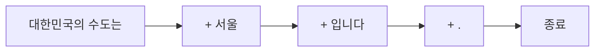
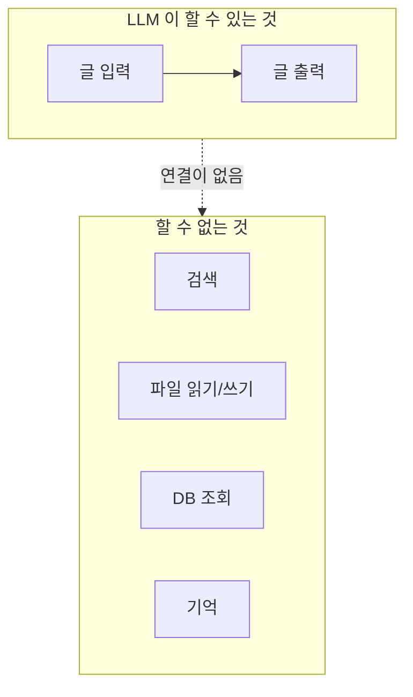

# 1.1 AI 에이전트의 두뇌, 거대 언어 모델의 이해

> **공식 문서** — [OpenAI · Text generation](https://platform.openai.com/docs/guides/text-generation)

우리가 지금까지 짠 프로그램은 **적어 놓은 대로만** 움직입니다. `if`에 적힌 조건, `for`에 적힌 횟수를 벗어나지 않습니다. 그래서 잘 돌아갑니다. 예측할 수 있으니까요.

그런데 이런 요구가 들어왔다고 해 봅시다.

> "고객 문의가 들어오면 알아서 처리해 줘. 환불 문의면 주문 조회하고, 배송 문의면 송장 확인하고, 둘 다 아니면 담당자한테 넘기고."

`if 문의내용 == "환불"` 로 적을 수가 없습니다. 사람은 "환불해주세요"라고도 쓰고 "돈 돌려받고 싶은데요"라고도 쓰고 "이거 마음에 안 들어요"라고도 씁니다. **조건을 코드로 다 적을 수 없는 문제**입니다.

여기서 필요한 것이 **거대 언어 모델(Large Language Model, LLM)** 입니다.

## LLM이 실제로 하는 일은 하나뿐입니다

LLM은 똑똑해 보이지만 하는 일은 단순합니다. **지금까지 주어진 글 다음에 올 조각을 확률로 고르는 것**, 그게 전부입니다.

```
입력:  "대한민국의 수도는"
        ↓
출력:  "서울"   (확률 0.94)
       "부산"   (확률 0.01)
       "인천"   (확률 0.004)
        ...
```

이 조각을 **토큰(Token)** 이라고 합니다. 단어와 비슷하지만 정확히 같지는 않습니다. 영어는 대략 단어 하나가 토큰 하나지만, 한국어는 한 글자가 여러 토큰으로 쪼개지기도 합니다.

그리고 고른 토큰을 입력 뒤에 붙여서 **다시 다음 토큰을 고릅니다.** 이걸 반복하면 문장이 나옵니다.



"다음 단어 맞히기"를 엄청난 양의 글로 반복 학습했더니, 그 부산물로 번역·요약·분류·추론처럼 보이는 능력이 따라 나왔습니다. **의미를 이해해서 답하는 것이 아니라, 그럴듯한 다음 말을 이어 붙이다 보니 답이 되는 것**에 가깝습니다.

> 이 성질을 기억해 두세요. 뒤에서 나오는 **환각(Hallucination)** 도, 같은 질문에 매번 다르게 답하는 것도 전부 여기서 나옵니다.

## 두 가지 한계가 에이전트 설계를 좌우합니다

### 컨텍스트 윈도우 — 한 번에 볼 수 있는 양이 정해져 있습니다

LLM이 한 번에 읽을 수 있는 토큰 수에는 상한이 있습니다. 이걸 **컨텍스트 윈도우(Context Window)** 라고 합니다.

중요한 건 **대화가 누적되면 이 한도를 향해 계속 차오른다**는 점입니다. LLM은 이전 대화를 "기억"하는 게 아니라, 매번 **지금까지의 대화 전체를 다시 입력으로 받습니다.**

| | 사람의 대화 | LLM의 대화 |
| :--- | :--- | :--- |
| 이전 내용 | 머릿속에 남아 있음 | 매번 통째로 다시 건네줘야 함 |
| 10번째 질문 | 질문만 하면 됨 | 1~9번 대화 + 10번 질문을 전부 입력 |
| 길어지면 | 자연스럽게 요약됨 | 한도를 넘으면 잘려 나감 |

그래서 대화가 길어질수록 비용이 오르고, 한도에 닿으면 앞부분이 잘립니다. **8장에서 다루는 메모리는 이 문제를 관리하는 이야기**입니다.

### 지식 컷오프 — 학습 시점 이후를 모릅니다

LLM은 특정 시점까지의 데이터로 학습됩니다. 그 이후에 일어난 일은 모릅니다. 그런데 문제는 **모른다고 말하지 않고 그럴듯하게 지어낸다**는 것입니다. 다음 토큰을 고르는 장치니까요.

이것이 **6장의 웹 검색 에이전트**와 **RAG**가 필요한 이유입니다. 모델 안에 없는 지식을 밖에서 가져다 입력에 넣어 주는 겁니다.

## 온도 — 같은 질문에 같은 답이 안 나오는 이유

확률로 고른다고 했습니다. 그러면 항상 1등만 고르면 되지 않을까요? 그렇게 하면 답이 뻔해지고 반복이 심해집니다. 그래서 **얼마나 과감하게 고를지**를 조절하는 값이 있습니다. **온도(Temperature)** 입니다.

| 온도 | 성향 | 쓰는 곳 |
| :--- | :--- | :--- |
| 낮음 (0에 가까움) | 확률 1등을 거의 그대로 고름 | 분류, 판단, 도구 선택 |
| 높음 (1 이상) | 낮은 확률의 후보도 집어 듦 | 아이디어 발상, 창작 |

> **에이전트에서는 온도를 낮게 둡니다.** 에이전트가 하는 일은 대부분 "다음에 무엇을 할지 고르는 판단"입니다. 판단이 실행할 때마다 달라지면 디버깅이 불가능해집니다. 창의성이 필요한 자리가 아닙니다.

## 그런데 LLM만으로는 에이전트가 아닙니다

여기까지가 "두뇌"입니다. 그런데 두뇌만 있으면 할 수 있는 게 없습니다.

LLM은 **글을 받아서 글을 내놓는 것 말고는 아무것도 못 합니다.**

- 웹을 검색하지 못합니다
- 파일을 읽거나 쓰지 못합니다
- 데이터베이스를 조회하지 못합니다
- 방금 한 대화를 다음 요청 때 기억하지 못합니다



**에이전트는 이 두뇌에 손발과 기억을 붙인 것**입니다. 무엇을 붙여야 하는지가 2장의 세 가지 핵심 요소이고, 그걸 어떤 구조로 조립하는지가 3장입니다.

## 요약 및 비유

**눈과 손이 없는 전문가**를 떠올리면 이 절 전체가 정리됩니다. 지식은 방대한데 방에 갇혀 있고, 종이로 질문을 받아 종이로 답을 써서 내보내는 것밖에 못 하는 사람입니다.

| 개념 | 갇힌 전문가 비유 | 기술적 의미 |
| :--- | :--- | :--- |
| **LLM** | 방 안의 전문가 | 다음 토큰을 확률로 예측하는 모델 |
| **토큰** | 종이에 쓰는 글자 단위 | 모델이 다루는 최소 조각 |
| **컨텍스트 윈도우** | 한 번에 읽을 수 있는 종이 매수 | 한 요청에 넣을 수 있는 토큰 상한 |
| **대화 누적** | 매번 지금까지의 종이를 전부 다시 넣어 줌 | 이전 대화를 매 요청에 재전송 |
| **지식 컷오프** | 갇힌 날 이후의 뉴스를 모름 | 학습 시점 이후 정보 없음 |
| **환각** | 모르는 걸 아는 척 써냄 | 그럴듯한 다음 토큰을 이어 붙인 결과 |
| **온도** | 얼마나 과감하게 답할지 | 확률 분포에서 고르는 방식 조절 |
| **도구·메모리** | 전화기와 수첩을 넣어 줌 | 외부 연동과 상태 저장 (2·6·8장) |

## 결론

* LLM이 하는 일은 **다음 토큰을 확률로 고르는 것 하나**입니다. 추론처럼 보이는 능력은 그 부산물입니다.
* LLM은 이전 대화를 기억하지 않습니다. **매 요청마다 대화 전체를 다시 넣어 줍니다.** 그래서 길어지면 비용이 오르고 컨텍스트 윈도우 한도에 걸립니다(8장).
* **학습 시점 이후를 모르면서 모른다고 말하지 않습니다.** 웹 검색과 RAG가 필요한 이유입니다(6장).
* 에이전트에서는 **온도를 낮게** 둡니다. 판단이 매번 흔들리면 디버깅할 수 없습니다.
* LLM 혼자서는 글을 주고받는 것 말고 아무것도 못 합니다. **여기에 도구·메모리를 붙인 것이 에이전트**입니다.

---

[Chapter 01](README.md) · [1.2 ➡](01-02_LLM%EC%9D%84%20%EA%B8%B0%EB%B0%98%EC%9C%BC%EB%A1%9C%20%EC%9D%98%EC%82%AC%EA%B2%B0%EC%A0%95%ED%95%98%EB%8B%A4.md)
