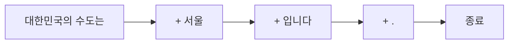
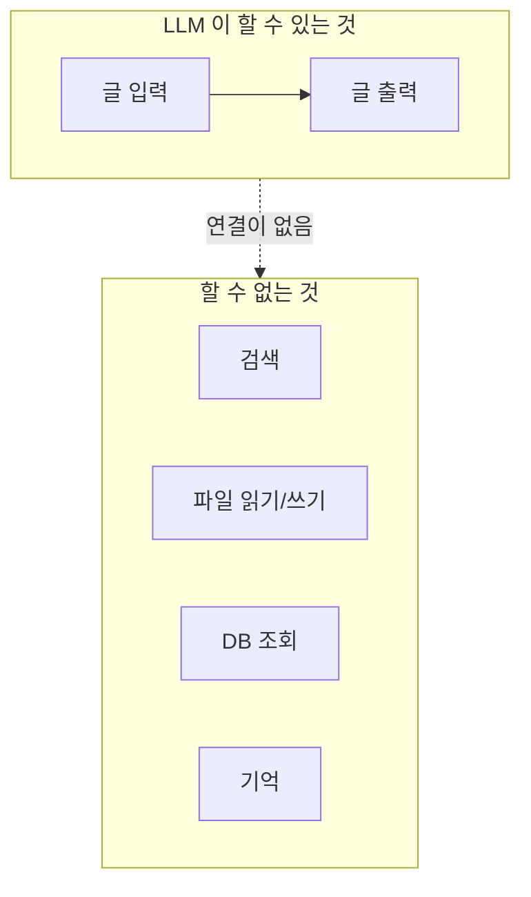

# 1.1 AI 에이전트의 두뇌, 거대 언어 모델의 이해

> **공식 문서** — [OpenAI · Text generation](https://developers.openai.com/api/docs/guides/text-generation)

> **여기까지** — 이 장의 시작입니다.
> **이 절의 질문** — LLM은 도대체 무엇을 하는 물건인가?
> **다 읽으면** — LLM이 잘하는 것과 **절대 못 하는 것**을 구분할 수 있게 됩니다. 이 구분이 이 책 전체의 출발점입니다.

## 시작하기 전에 — 우리가 짜던 프로그램의 한계

지금까지 짠 프로그램은 **적어 놓은 대로만** 움직입니다. `if`에 적은 조건, `for`에 적은 횟수를 벗어나지 않습니다. 그래서 좋습니다. 무슨 일이 일어날지 알 수 있으니까요.

그런데 이런 걸 만들어 달라고 하면 어떨까요.

> "고객 문의가 들어오면 알아서 처리해 줘. 환불 문의면 주문을 조회하고, 배송 문의면 송장을 확인하고, 둘 다 아니면 담당자한테 넘겨."

코드로 옮겨 봅시다.

```python
if 문의내용 == "환불":      # 이렇게 쓸 수 있을까?
    주문조회()
```

**안 됩니다.** 사람은 이렇게 씁니다.

```
"환불해주세요"
"돈 돌려받고 싶은데요"
"이거 마음에 안 들어요"
"주문한 거 취소되나요?"
```

전부 환불 문의인데 글자가 하나도 안 겹칩니다. `if`를 몇 개 써야 할까요? **다 적을 수 없습니다.** 새로운 표현은 계속 나오니까요.

**조건을 코드로 다 적을 수 없는 문제** — 여기서 필요한 것이 **거대 언어 모델(Large Language Model, LLM)** 입니다.

## LLM이 실제로 하는 일은 딱 하나입니다

LLM은 굉장히 똑똑해 보입니다. 그런데 안에서 하는 일은 **한 가지뿐**입니다.

> **지금까지 주어진 글 다음에 올 조각을 확률로 고르는 것.**

말 그대로 이것뿐입니다.

```
입력:  "대한민국의 수도는"
        ↓
        다음에 올 말은?
        ↓
       "서울"   ← 94% 확률
       "부산"   ←  1%
       "인천"   ←  0.4%
        ...
```

여기서 고르는 조각을 **토큰(Token)** 이라고 합니다.

### 토큰이 뭔가요

**모델이 글을 다루는 최소 단위**입니다. 글자도 단어도 아닌 **그 중간**이라고 보면 됩니다.

모델은 글을 통째로 보지 않습니다. 먼저 **토큰 목록으로 바꾸고**, 그다음부터는 토큰만 다룹니다.

```
"안녕하세요"  →  ['안', '녕하세요']  →  숫자 2개
```

**왜 이렇게 어중간하게 나눌까요.** 글자 단위로 하면 목록이 너무 길어지고, 단어 단위로 하면 세상의 모든 단어를 미리 알아야 합니다. **자주 쓰는 덩어리는 통째로, 드문 것은 잘게** 나누는 절충안입니다.

직접 세어 봤습니다.

> **실측 (2026-08-31 · tiktoken 0.14.0 · `o200k_base` 인코딩)** — 인코딩은 모델 계열마다 다릅니다. 숫자 자체보다 **경향**을 보세요.

```
안녕하세요      2토큰  ->  ['안', '녕하세요']
인공지능        3토큰  ->  ['인', '공지', '능']
에이전트        4토큰  ->  ['에', '이', '전', '트']
김             1토큰  ->  ['김']
```

**규칙적이지 않습니다.** `녕하세요`는 네 글자가 한 덩어리인데 `에이전트`는 네 글자가 전부 따로입니다. 자주 등장한 덩어리일수록 통째로 묶여 있습니다.

영어도 마찬가지입니다. **단어 하나가 항상 토큰 하나는 아닙니다.**

```
hello          1토큰  ->  ['hello']
agent          1토큰  ->  ['agent']
artificial     2토큰  ->  ['art', 'ificial']
unbelievable   3토큰  ->  ['un', 'bel', 'ievable']
```

### 한국어가 더 비쌉니다

**같은 뜻**의 문장을 두 언어로 세어 봤습니다.

| 한국어 | 토큰 | 영어 | 토큰 |
| :--- | ---: | :--- | ---: |
| 안녕하세요. 오늘 날씨가 좋네요. | 10 | Hello. The weather is nice today. | 8 |
| 인공지능 에이전트를 만들고 있습니다. | 11 | I am building an AI agent. | 7 |
| 이 문서를 세 문장으로 요약해 주세요. | 12 | Summarize this document in three sentences. | 9 |
| **합계** | **33** | | **24** |

**같은 말을 하는데 한국어가 약 1.4배**입니다.

이게 왜 중요하냐면 — **요금은 토큰 수로 매겨지고, 컨텍스트 윈도우도 토큰 수로 셉니다.** 한국어로 쓰면 같은 창에 들어가는 대화가 그만큼 짧아집니다.

> **정확히 몇 배인지는 외우지 마세요.** 문장에 따라 다르고 모델(인코딩)에 따라서도 달라집니다. **"한국어가 좀 더 먹는다"** 정도만 알면 충분합니다.

> **드문 글자는 더 나빠집니다.** 예를 들어 `랭그래프`는 4토큰인데, `랭`은 사전에 없어서 **글자 하나가 두 조각으로 부서집니다.** 신조어나 특이한 이름이 많은 글은 예상보다 토큰을 많이 씁니다.

### 그래서 문장이 어떻게 만들어지나

고른 토큰을 **입력 뒤에 붙이고, 다시 다음 토큰을 고릅니다.** 이걸 반복합니다.



**한 번에 문장을 만드는 게 아니라 한 조각씩 이어 붙이는 것**입니다. 챗봇에서 글자가 한 자씩 나오는 걸 본 적 있죠? 진짜로 그렇게 만들어지고 있는 겁니다.

### 이게 왜 똑똑해 보이나

"다음 단어 맞히기"를 **어마어마한 양의 글**로 반복해 학습시켰더니, 부산물로 번역·요약·분류 같은 능력이 따라 나왔습니다.

**의미를 이해해서 답하는 게 아닙니다.** 그럴듯한 다음 말을 계속 이어 붙이다 보니 **결과적으로 답이 되는 것**에 가깝습니다.

> **이 성질을 꼭 기억하세요.** 이 절 뒤에 나오는 것들이 전부 여기서 나옵니다.
> 왜 없는 사실을 지어내는지, 왜 같은 질문에 매번 다르게 답하는지 — 전부 "확률로 고르기" 하나로 설명됩니다.

## 그 확률은 어떻게 계산할까

### 트랜스포머와 어텐션

확률을 계산하는 것은 **트랜스포머(Transformer)** 라는 구조입니다.

**인공신경망**의 한 종류인데, 지금은 **"글을 넣으면 다음 토큰의 확률을 뱉는 계산 덩어리"** 정도로 생각해도 충분합니다. 내부 수식을 몰라도 에이전트는 만들 수 있습니다.

다만 핵심 아이디어 하나는 알아 두면 좋습니다. **어텐션(Attention)** 이라고 하는데, **문장 안에서 단어들이 서로 어떤 관계인지를 보는 것**입니다.

```
"그 은행에 가서 돈을 찾았다"    → '은행'이 '돈'과 이어짐  → 금융기관
"강 은행에 앉아 쉬었다"        → '은행'이 '강'과 이어짐  → 물가
```

**같은 '은행'인데 주변 단어에 따라 다르게 처리됩니다.** 이걸 계산하니까 문맥을 파악하는 것처럼 보이는 겁니다.

### 파라미터

이 계산에 쓰이는 숫자들이 모델 안에 **엄청나게 많이** 들어 있습니다. 이 숫자들을 **파라미터(Parameter)** 라고 합니다. 가중치(weight), 편향(bias)이라고도 부릅니다.

"몇 십억 개 파라미터 모델"이라는 말을 들어봤다면, **그 숫자가 이 값들의 개수**입니다.

### 파라미터는 언제 바뀔까 — 여기서 많이 헷갈립니다

"학습하면서 파라미터를 조절해 성능이 좋아진다"는 말은 맞습니다. **그런데 그건 학습할 때 이야기입니다.**

| 시점 | 무슨 일이 | 파라미터 | 누가 |
| :--- | :--- | :--- | :--- |
| **학습(training)** | 모델을 만드는 중 | 계속 바뀜 | 모델 만드는 회사 |
| **추론(inference)** | 우리가 쓰는 중 | **고정** | 우리 |

**우리가 쓰는 시점에는 파라미터가 절대 안 바뀝니다.** 그래서 이런 일이 생깁니다.

> **모델에게 아무리 지적해도 "배우지" 않습니다.**
> "그거 틀렸어"라고 열 번을 말해도, 다음에 새로 물어보면 똑같이 틀립니다. **매번의 요청이 완전히 독립적**이거든요.
>
> 그럼 챗봇은 왜 앞 대화를 기억하는 것처럼 보일까요? **파라미터가 바뀌어서가 아니라, 앞 대화를 매번 다시 넣어 주기 때문**입니다. 바로 아래에서 이어집니다.

## LLM의 두 가지 한계

이 두 가지가 앞으로 나올 거의 모든 설계 결정의 이유가 됩니다.

### 한계 ① 컨텍스트 윈도우 — 한 번에 볼 수 있는 양이 정해져 있다

LLM이 **한 번에 읽을 수 있는 토큰 수에는 상한**이 있습니다. 이걸 **컨텍스트 윈도우(Context Window)** 라고 합니다.

여기서 중요한 사실이 하나 있습니다.

> **LLM은 이전 대화를 기억하지 않습니다.**
> 매번 **지금까지의 대화 전체를 다시 통째로** 입력으로 받습니다.

사람과 비교하면 이렇습니다.

| | 사람끼리 대화 | LLM과 대화 |
| :--- | :--- | :--- |
| 앞에 한 말 | 머릿속에 남아 있음 | **매번 다시 건네줘야 함** |
| 10번째 질문을 할 때 | 질문만 하면 됨 | **1~9번 대화 전부 + 10번 질문**을 넣음 |
| 대화가 길어지면 | 자연스럽게 요약됨 | 한도를 넘으면 **앞부분이 잘려 나감** |

그래서 대화가 길어질수록 **비용이 오르고**, 한도에 닿으면 **앞부분을 잃습니다.**

**8장에서 배우는 "메모리"가 바로 이 문제를 관리하는 방법**입니다.

### 한계 ② 지식 컷오프 — 학습한 날 이후를 모른다

LLM은 **특정 시점까지의 데이터**로 학습됩니다. 그 이후에 일어난 일은 모릅니다.

여기까지는 당연합니다. 진짜 문제는 이겁니다.

> **모른다고 말하지 않고 그럴듯하게 지어냅니다.**

왜 그럴까요? 이 절 처음에 배운 것을 떠올려 보세요. **LLM은 다음 토큰을 고르는 장치**입니다. "모른다"를 판단하는 장치가 아닙니다. 모르는 것에 대해서도 **그럴듯한 다음 말은 만들어집니다.**

이렇게 없는 사실을 지어내는 것을 **환각(Hallucination)** 이라고 합니다.

**6장의 웹 검색 에이전트와 RAG**가 이 문제를 푸는 방법입니다. 모델 안에 없는 지식을 **밖에서 찾아다가 입력에 넣어 주는** 것입니다.

## "언어" 모델인데 텍스트만 다룰까

이름이 거대 **"언어"** 모델이라 글만 다룰 것 같습니다. 예전에는 그랬지만 지금은 아닙니다.

OpenAI 모델 문서에 이렇게 적혀 있습니다.

> *"All latest OpenAI models support text and image input, text output, multilingual capabilities, and vision."*
> (최신 모델은 전부 **텍스트와 이미지 입력**, 텍스트 출력, 다국어, 시각 인식을 지원한다) — [모델 문서](https://developers.openai.com/api/docs/models)

| 넣을 수 있는 것 | 지금 |
| :--- | :--- |
| 텍스트 | ✓ |
| **이미지** | ✓ — 사진 주소·파일 등으로 넣습니다 ([이미지 입력 가이드](https://developers.openai.com/api/docs/guides/images-vision)) |
| 음성 | 전용 모델이 따로 있음 |
| 나오는 것 | 대부분 텍스트 |

**다만 이 책의 실습은 전부 텍스트만 씁니다.** 6.5절에서 PDF를 다룰 때도 그림으로 주는 게 아니라 **글자만 뽑아서** 넣습니다.

그러니 당분간은 **"글을 받아서 글을 내놓는다"** 로 생각해도 괜찮습니다.

> **다만 뒤에 이런 게 나오면 "아 그거였구나" 하시면 됩니다.**
>
> | 어디 | 무엇 | 왜 있나 |
> | :--- | :--- | :--- |
> | 10장 | `input_modes=['text']` | **모드를 적는 칸이 있다는 것 자체**가 텍스트 말고도 있다는 뜻 |
> | 11장 | `TextPart` · `DataPart` · `FilePart` | 주고받는 조각이 세 종류 |

## 온도 — 같은 질문에 답이 매번 다른 이유

확률로 고른다고 했습니다. 그럼 **항상 1등만 고르면** 되지 않을까요?

그렇게 하면 답이 뻔해지고 같은 표현이 계속 반복됩니다. 그래서 **얼마나 과감하게 고를지**를 조절하는 값이 있습니다. **온도(Temperature)** 라고 합니다.

| 온도 | 어떻게 고르나 | 어울리는 일 |
| :--- | :--- | :--- |
| **낮음** (0에 가까움) | 확률 1등을 거의 그대로 | 분류, 판단, 도구 고르기 |
| **높음** (1 이상) | 확률 낮은 후보도 집어 듦 | 아이디어 내기, 창작 |

> **에이전트에서는 온도를 낮게 둡니다.**
> 에이전트가 하는 일은 대부분 **"다음에 무엇을 할지 고르는 판단"** 입니다. 판단이 실행할 때마다 달라지면 **버그를 찾을 수가 없습니다.** 어제는 되던 게 오늘은 안 되는데 코드는 그대로니까요.
>
> 창의성이 필요한 자리가 아닙니다.

## 여기까지가 "두뇌"입니다 — 그런데 두뇌만으로는 안 됩니다

LLM이 대단하긴 한데, 할 수 있는 게 **글을 받아서 글을 내놓는 것뿐**입니다.

- 웹을 검색하지 **못합니다**
- 파일을 읽거나 쓰지 **못합니다**
- 데이터베이스를 조회하지 **못합니다**
- 방금 한 대화를 다음번에 기억하지 **못합니다**



**에이전트는 이 두뇌에 손발과 기억을 붙인 것**입니다.

- 무엇을 붙여야 하는가 → **2장**
- 어떤 구조로 조립하는가 → **3장**

## 요약 및 비유

**눈과 손이 없는 전문가**를 떠올리면 이 절이 한 번에 정리됩니다.

아는 것은 엄청나게 많은데 **방에 갇혀 있습니다.** 창문 틈으로 종이에 적은 질문을 받고, 종이에 답을 적어 내보내는 것밖에 못 합니다.

| 개념 | 갇힌 전문가 비유 | 기술적 의미 |
| :--- | :--- | :--- |
| **LLM** | 방 안의 전문가 | 다음 토큰을 확률로 고르는 모델 |
| **토큰** | 종이에 적는 글자 단위 | 모델이 글을 다루는 최소 단위 — 글자와 단어의 중간 |
| **어텐션** | 앞뒤를 보고 단어 뜻을 정함 | 단어 사이 관계 계산 |
| **파라미터** | 갇히기 전까지 쌓은 지식 | 계산에 쓰이는 숫자들 |
| **학습 vs 추론** | 갇힌 뒤로는 새로 안 배움 | 쓸 때는 파라미터 고정 |
| **이미지 입력** | 사진도 넣어 줄 수 있음 | 최신 모델은 이미지도 받음 |
| **컨텍스트 윈도우** | 한 번에 읽을 수 있는 종이 매수 | 한 요청의 토큰 상한 |
| **대화 누적** | 매번 지금까지 종이를 전부 다시 넣음 | 이전 대화를 매번 재전송 |
| **지식 컷오프** | 갇힌 날 이후 뉴스를 모름 | 학습 시점 이후 정보 없음 |
| **환각** | 모르는 걸 아는 척 써냄 | 그럴듯한 다음 토큰을 이은 결과 |
| **온도** | 얼마나 과감하게 답할지 | 확률에서 고르는 방식 조절 |
| **도구·메모리** | 전화기와 수첩을 넣어 줌 | 외부 연동과 기억 (2·6·8장) |

## 결론

* LLM이 하는 일은 **다음 토큰을 확률로 고르는 것 하나**입니다. 똑똑해 보이는 능력은 전부 그 부산물입니다.
* 확률을 계산하는 것이 **트랜스포머**이고, 핵심 아이디어는 단어 사이 관계를 보는 **어텐션**입니다. 계산에 쓰이는 숫자가 **파라미터**입니다.
* **파라미터는 학습할 때만 바뀌고 우리가 쓸 때는 고정**입니다. 그래서 **아무리 지적해도 모델은 배우지 않습니다.**
* 이름은 "언어" 모델이지만 **최신 모델은 이미지도 받습니다.** 다만 **이 책 실습은 전부 텍스트**입니다.
* **토큰은 글자와 단어의 중간 단위**입니다. 자주 쓰는 덩어리는 통째로, 드문 것은 잘게 나뉩니다. **같은 뜻이면 한국어가 영어보다 토큰을 조금 더 씁니다**(실측 약 1.4배).
* LLM은 이전 대화를 기억하지 않고 **매번 전부 다시 넣어 줍니다.** 길어지면 비용이 오르고 한도에 걸립니다(8장).
* **모르는 것도 모른다고 안 하고 지어냅니다(환각).** 웹 검색과 RAG가 필요한 이유입니다(6장).
* 에이전트에서는 **온도를 낮게** 둡니다. 판단이 매번 흔들리면 버그를 못 찾습니다.
* LLM 혼자서는 **글을 주고받는 것 말고 아무것도 못 합니다.** 여기에 **도구와 기억을 붙인 것이 에이전트**입니다.

---

## 다음 절로

LLM은 "환불 / 배송 / 기타"를 구분할 줄 압니다. 이 장 처음의 문제가 풀렸습니다.

**그런데 답이 이렇게 옵니다.**

```
이 문의는 상품에 대한 불만족을 표현하고 있으므로 환불 문의로 보입니다.
```

이걸 `if`에 어떻게 넣죠? → **[1.2절](01-02_LLM%EC%9D%84%20%EA%B8%B0%EB%B0%98%EC%9C%BC%EB%A1%9C%20%EC%9D%98%EC%82%AC%EA%B2%B0%EC%A0%95%ED%95%98%EB%8B%A4.md)**

---

[Chapter 01](README.md) · [1.2 ➡](01-02_LLM%EC%9D%84%20%EA%B8%B0%EB%B0%98%EC%9C%BC%EB%A1%9C%20%EC%9D%98%EC%82%AC%EA%B2%B0%EC%A0%95%ED%95%98%EB%8B%A4.md)
