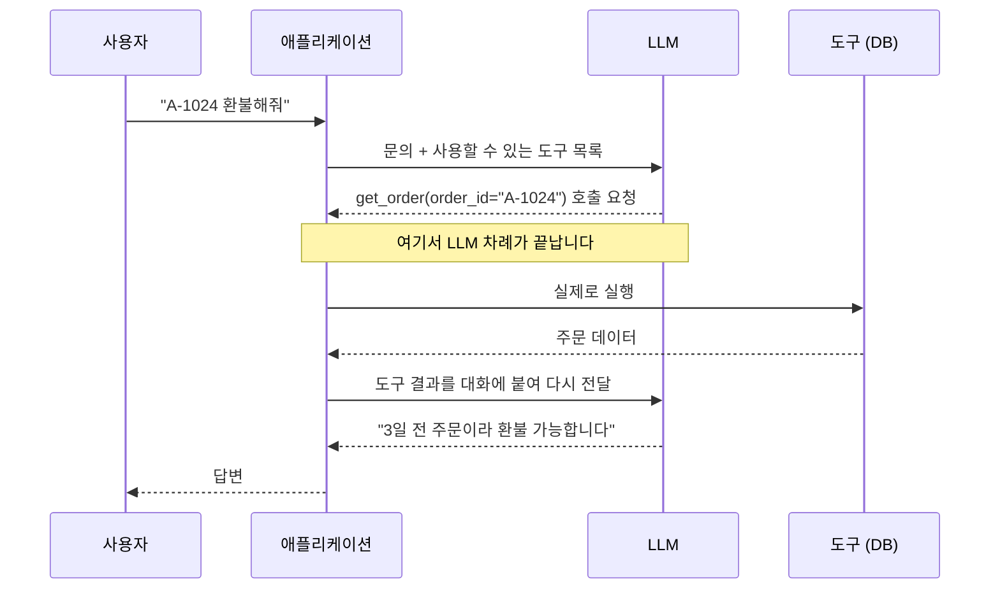
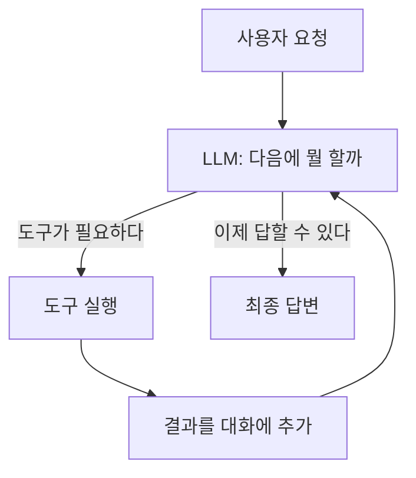

# 1.3 LLM이 다음 행동을 결정하다

> **공식 문서** — [OpenAI · Function calling](https://platform.openai.com/docs/guides/function-calling) · [LangChain · Agents](https://docs.langchain.com/oss/python/langchain/agents)

[1.2절](01-02_LLM%EC%9D%84%20%EA%B8%B0%EB%B0%98%EC%9C%BC%EB%A1%9C%20%EC%9D%98%EC%82%AC%EA%B2%B0%EC%A0%95%ED%95%98%EB%8B%A4.md)에서 LLM에게 **판단**을 넘겼습니다. "이 문의는 환불이다"까지 왔습니다.

그런데 분류만으로는 아무 일도 일어나지 않습니다. 환불 문의라고 판단했으면 **주문을 조회해야** 합니다. 그리고 주문 조회는 LLM이 못 합니다. [1.1절](01-01_AI%20%EC%97%90%EC%9D%B4%EC%A0%84%ED%8A%B8%EC%9D%98%20%EB%91%90%EB%87%8C%2C%20%EA%B1%B0%EB%8C%80%20%EC%96%B8%EC%96%B4%20%EB%AA%A8%EB%8D%B8%EC%9D%98%20%EC%9D%B4%ED%95%B4.md)에서 본 대로 글밖에 못 내놓으니까요.

판단에서 **행동**으로 넘어가는 다리가 필요합니다. 그 다리가 **도구 호출(Tool Calling)** 입니다.

## 가장 많이 오해하는 지점부터

**LLM은 도구를 실행하지 않습니다.**

이건 비유가 아니라 사실 그대로입니다. LLM이 내놓는 건 여전히 글입니다. 다만 그 글이 이런 모양일 뿐입니다.

```json
{
  "tool": "get_order",
  "args": { "order_id": "A-1024" }
}
```

이건 **"이 함수를 이 인자로 불러 줘"라는 요청**이지 실행 결과가 아닙니다. 실제로 `get_order("A-1024")`를 실행하는 건 **우리가 짠 애플리케이션**입니다.



이 그림에서 **LLM은 두 번 불립니다.** 한 번은 "무엇을 할지 정하려고", 또 한 번은 "결과를 보고 답을 만들려고". 그 사이의 실제 작업은 전부 애플리케이션이 합니다.

> **왜 이렇게 나눠 놨을까요?** LLM에게 DB 접근 권한을 직접 주는 순간 통제가 사라지기 때문입니다. 실행을 애플리케이션이 쥐고 있어야 권한을 검사하고, 인자를 검증하고, 위험한 호출을 막을 수 있습니다. **11장의 사람 승인(Human-in-the-loop)** 도 이 구조라서 가능합니다.

## 도구를 정의한다는 것은 설명을 쓰는 일입니다

도구 하나는 세 가지로 정의됩니다.

| 구성 | 예 | 무엇을 위한 것인가 |
| :--- | :--- | :--- |
| **이름** | `get_order` | 모델이 지목할 식별자 |
| **설명** | "주문 번호로 주문 상세를 조회한다" | **모델이 언제 쓸지 판단하는 근거** |
| **인자 스키마** | `order_id: str` | 모델이 채워야 할 값의 형식 |

여기서 초보자가 가장 놓치는 것이 **설명**입니다.

모델은 함수 본문을 보지 못합니다. **이름과 설명만 보고 고릅니다.** 그래서 설명이 부실하면 엉뚱한 도구를 부르거나, 써야 할 상황에 안 부릅니다.

```python
# 나쁜 예 — 모델이 언제 써야 할지 알 수 없습니다
def search(q: str):
    """검색"""

# 나은 예 — 언제 쓰는지, 무엇이 나오는지가 있습니다
def search_web(query: str):
    """최신 뉴스나 실시간 정보가 필요할 때 웹을 검색한다.
    학습 시점 이후의 사건을 물어보면 이 도구를 써야 한다."""
```

> **도구 설명은 코드 주석이 아니라 프롬프트입니다.** 사람이 읽으라고 쓰는 게 아니라 모델이 판단 근거로 쓰라고 쓰는 것입니다. 6.3절에서 직접 도구를 만들 때 이 차이가 바로 드러납니다.

## 한 번으로 끝나지 않습니다 — 루프가 됩니다

주문을 조회했더니 "배송 완료 3일 경과" 가 나왔습니다. 그러면 환불 정책도 확인해야 합니다. 그러면 도구를 또 불러야 합니다.

즉 **도구 결과를 다시 입력에 넣고 다음 행동을 또 결정**하게 됩니다. 이게 반복되면 루프입니다.



**이 루프가 에이전트의 심장**입니다. 2장에서 이 루프에 **ReAct**라는 이름이 붙고, 6장에서 `create_agent`가 이 루프를 대신 돌려 줍니다.

### 두 가지가 반드시 문제가 됩니다

**언제 멈출지** — 모델이 "이제 답할 수 있다"고 판단해야 루프가 끝납니다. 판단을 잘못하면 도구를 계속 부릅니다. 그래서 프레임워크는 **최대 반복 횟수** 같은 안전장치를 둡니다. LangGraph에서는 이 한도를 넘으면 `GRAPH_RECURSION_LIMIT` 오류가 납니다.

**대화가 계속 길어짐** — 도구를 부를 때마다 요청과 결과가 대화에 쌓입니다. [1.1절](01-01_AI%20%EC%97%90%EC%9D%B4%EC%A0%84%ED%8A%B8%EC%9D%98%20%EB%91%90%EB%87%8C%2C%20%EA%B1%B0%EB%8C%80%20%EC%96%B8%EC%96%B4%20%EB%AA%A8%EB%8D%B8%EC%9D%98%20%EC%9D%B4%ED%95%B4.md)의 컨텍스트 윈도우 문제가 여기서 현실이 됩니다. 도구 결과가 크면(웹 페이지 전문 같은) 몇 번 만에 한도에 닿습니다.

> 실제로 에이전트를 만들면 **무한 루프**와 **컨텍스트 초과**가 가장 먼저 만나는 두 벽입니다. 각각 6장과 8장에서 다룹니다.

## 요약 및 비유

**셰프와 보조**를 떠올리면 역할 분담이 선명해집니다. 셰프는 "양파 썰어 와"라고 **말만** 하고, 칼을 잡는 건 보조입니다. 셰프가 직접 썰지 않는다는 게 핵심입니다.

| 개념 | 셰프와 보조 비유 | 기술적 의미 |
| :--- | :--- | :--- |
| **LLM** | 셰프 — 지시만 내림 | 어떤 도구를 부를지 결정 |
| **애플리케이션** | 보조 — 실제로 손을 씀 | 도구를 실제 실행 |
| **도구 호출** | "양파 썰어 와" 라는 주문 | 함수명 + 인자를 담은 출력 |
| **도구 설명** | 보조가 할 줄 아는 일 목록 | 모델이 도구를 고르는 판단 근거 |
| **도구 결과 반환** | 썬 양파를 셰프에게 보여 줌 | 결과를 대화에 붙여 재입력 |
| **루프** | 재료를 보고 다음 지시를 또 내림 | 관찰 → 판단 → 행동의 반복 |
| **최대 반복 제한** | "30분 안에 끝내" | 무한 루프 방지 |
| **실행 권한 분리** | 보조가 냉장고 열쇠를 가짐 | 권한·검증을 애플리케이션이 쥠 |

## 결론

* **LLM은 도구를 실행하지 않습니다.** "이 함수를 이 인자로 불러 달라"는 요청을 글로 내놓을 뿐이고, 실행은 애플리케이션 몫입니다.
* 이 분리는 불편이 아니라 **안전장치**입니다. 권한 검사·인자 검증·사람 승인이 전부 이 자리에서 가능해집니다.
* 도구는 **이름 · 설명 · 인자 스키마**로 정의합니다. 모델은 본문을 못 보고 **설명만 보고 고르므로**, 설명은 주석이 아니라 프롬프트입니다.
* 도구 결과를 다시 입력에 넣어 다음 행동을 정하면 **루프**가 됩니다. 이 루프가 에이전트의 본체이고 2장에서 ReAct라는 이름을 얻습니다.
* 루프에는 **무한 반복**과 **컨텍스트 초과**라는 두 벽이 항상 따라옵니다.

---

[⬅ 1.2](01-02_LLM%EC%9D%84%20%EA%B8%B0%EB%B0%98%EC%9C%BC%EB%A1%9C%20%EC%9D%98%EC%82%AC%EA%B2%B0%EC%A0%95%ED%95%98%EB%8B%A4.md) · [Chapter 01](README.md) · [1.4 ➡](01-04_LLM%20%EA%B8%B0%EB%B0%98%20%EC%97%90%EC%9D%B4%EC%A0%84%ED%8A%B8%20%EC%8B%9C%EC%8A%A4%ED%85%9C%2C%20%EC%9D%B4%EB%9F%B0%20%EA%B5%AC%EC%A1%B0%EB%A1%9C%20%EC%84%A4%EA%B3%84%EB%90%9C%EB%8B%A4.md)
