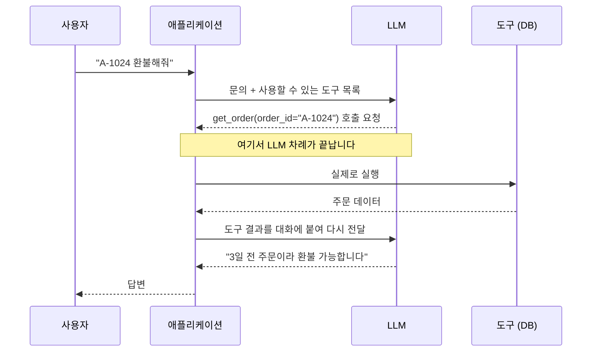
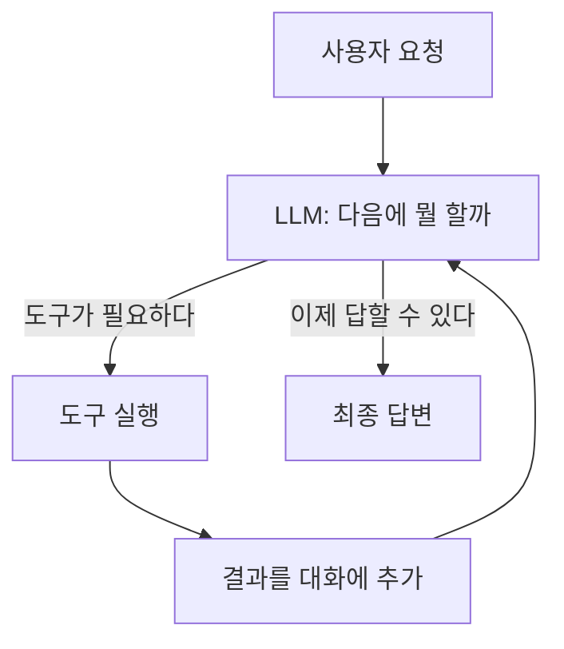

# 1.3 LLM이 다음 행동을 결정하다

> **공식 문서** — [OpenAI · Function calling](https://developers.openai.com/api/docs/guides/function-calling) · [LangChain · Agents](https://docs.langchain.com/oss/python/langchain/agents)

> **여기까지** — 구조화 출력으로 판단을 받아 냈고, 선택지를 좁히면 라우터가 된다는 것까지 왔습니다([1.2절](01-02_LLM%EC%9D%84%20%EA%B8%B0%EB%B0%98%EC%9C%BC%EB%A1%9C%20%EC%9D%98%EC%82%AC%EA%B2%B0%EC%A0%95%ED%95%98%EB%8B%A4.md)).
> **이 절의 질문** — 판단은 했는데, **실제 일은 누가 하지?**
> **다 읽으면** — 에이전트의 **심장인 루프**를 이해하게 됩니다. 이 루프가 6장부터 계속 나옵니다.

## 판단만으로는 아무 일도 안 일어납니다

"이 문의는 환불이다"까지 왔습니다. 그런데 **거기서 끝**입니다.

환불 문의면 **주문을 조회해야** 합니다. 그런데 [1.1절](01-01_AI%20%EC%97%90%EC%9D%B4%EC%A0%84%ED%8A%B8%EC%9D%98%20%EB%91%90%EB%87%8C%2C%20%EA%B1%B0%EB%8C%80%20%EC%96%B8%EC%96%B4%20%EB%AA%A8%EB%8D%B8%EC%9D%98%20%EC%9D%B4%ED%95%B4.md)에서 봤듯이 **LLM은 DB를 조회하지 못합니다.** 글밖에 못 내놓으니까요.

**판단**에서 **행동**으로 넘어가는 다리가 필요합니다. 그게 **도구 호출(Tool Calling)** 입니다.

## 가장 많이 오해하는 지점부터 짚고 갑시다

> ### LLM은 도구를 실행하지 않습니다.

이건 비유가 아니라 **사실 그대로**입니다.

LLM이 내놓는 건 여전히 **글**입니다. 다만 그 글이 이런 모양일 뿐입니다.

```json
{
  "tool": "get_order",
  "args": { "order_id": "A-1024" }
}
```

읽어 보면 **"`get_order`라는 함수를 `order_id="A-1024"`로 불러 줘"** 라는 뜻이죠.

**요청서**입니다. 실행 결과가 아닙니다.

실제로 `get_order("A-1024")`를 실행하는 건 **우리가 짠 프로그램**입니다.



이 그림에서 **LLM은 두 번 불립니다.**

| 몇 번째 | 무엇을 하려고 |
| :--- | :--- |
| 첫 번째 | **무엇을 할지 정하려고** |
| 두 번째 | **결과를 보고 답을 만들려고** |

그 사이의 **실제 작업은 전부 우리 프로그램이 합니다.**

### 왜 이렇게 나눠 놨을까요

불편해 보이지만 **안전장치**입니다.

LLM에게 DB 접근 권한을 직접 줬다고 생각해 봅시다. 모델이 실수로 `DELETE`를 날리면 막을 방법이 없습니다.

**실행을 우리 프로그램이 쥐고 있으면** 그 사이에 이런 걸 끼워 넣을 수 있습니다.

- 이 사용자가 이 주문을 볼 권한이 있나? (권한 검사)
- `order_id` 형식이 맞나? (입력 검증)
- 이건 위험한 동작이니 **사람에게 물어보자** (승인)

마지막 것을 **사람 승인(Human-in-the-loop)** 이라고 하는데, **11장에서 실제로 만듭니다.** 이 구조라서 가능한 것입니다.

## 도구를 정의한다는 건 "설명을 쓰는 일"입니다

도구 하나는 세 가지로 정의됩니다.

| 구성 | 예 | 무엇을 위한 것 |
| :--- | :--- | :--- |
| **이름** | `get_order` | 모델이 지목할 이름 |
| **설명** | "주문 번호로 주문 상세를 조회한다" | **모델이 언제 쓸지 판단하는 근거** |
| **인자 형식** | `order_id: str` (문자열) | 모델이 채워야 할 값의 타입 |

세 번째 "인자 형식"은 [1.2절](01-02_LLM%EC%9D%84%20%EA%B8%B0%EB%B0%98%EC%9C%BC%EB%A1%9C%20%EC%9D%98%EC%82%AC%EA%B2%B0%EC%A0%95%ED%95%98%EB%8B%A4.md)의 **스키마와 같은 것**입니다. "여기엔 문자열이 들어간다"를 미리 정해 두는 거죠.

### 초보자가 제일 많이 놓치는 것 — 설명

**모델은 함수 안을 들여다보지 못합니다.**

```python
def get_order(order_id: str):
    # 모델은 이 안을 절대 못 봅니다
    return db.query(...)
```

모델에게 전달되는 건 **이름과 설명뿐**입니다. 그래서 설명이 부실하면 **엉뚱한 도구를 부르거나, 써야 할 때 안 부릅니다.**

```python
# 나쁜 예 — 모델이 언제 써야 할지 알 수 없습니다
def search(q: str):
    """검색"""


# 나은 예 — 언제 쓰는지, 무엇이 나오는지가 있습니다
def search_web(query: str):
    """최신 뉴스나 실시간 정보가 필요할 때 웹을 검색한다.
    학습 시점 이후의 사건을 물어보면 이 도구를 써야 한다."""
```

> **도구 설명은 코드 주석이 아니라 프롬프트입니다.**
>
> 주석은 **사람이 읽으라고** 씁니다. 도구 설명은 **모델이 판단 근거로 쓰라고** 씁니다. 목적이 다릅니다.
>
> 6.3절에서 직접 도구를 만들어 보면 이 차이가 바로 느껴집니다. 설명 한 줄 고쳤더니 도구를 부르기 시작하는 경험을 하게 됩니다.

## 한 번으로 안 끝납니다 — 루프가 됩니다

주문을 조회했더니 **"배송 완료 3일 경과"** 가 나왔습니다.

그럼 이제 **환불 정책도 확인해야** 합니다. 3일이면 되는 건지 안 되는 건지 모르니까요. 그러려면 **도구를 또 불러야** 합니다.

즉 **도구 결과를 다시 입력에 넣고 다음 행동을 또 결정**하게 됩니다. 이게 반복되면 **루프**입니다.



**이 루프가 에이전트의 심장입니다.**

- 2장에서 이 루프에 **ReAct**라는 이름이 붙습니다
- 6장에서 `create_agent`가 이 루프를 **대신 돌려 줍니다**

### 루프가 돌면 에이전트는 이런 일을 하게 됩니다

루프 한 바퀴를 사람의 일처럼 풀어 쓰면 셋입니다.

| 단계 | 하는 일 | 어디서 배웠나 |
| :--- | :--- | :--- |
| ① | 사용자의 요청을 **분석**한다 | [1.2절](01-02_LLM%EC%9D%84%20%EA%B8%B0%EB%B0%98%EC%9C%BC%EB%A1%9C%20%EC%9D%98%EC%82%AC%EA%B2%B0%EC%A0%95%ED%95%98%EB%8B%A4.md)의 판단 |
| ② | 필요한 작업으로 **분해**한다 | 도구를 순서대로 |
| ③ | 각 단계에서 **'다음에 뭘 할지' 스스로 결정**한다 | **루프가 도는 이유** |

**③이 이 절의 핵심입니다.**

①②만 있으면 **그냥 계획을 세운 것**입니다. 결과를 보고 다시 정하는 **③이 있어야 에이전트**입니다.

> "환불 문의구나(①)
> → 주문 조회하고 정책 확인해야겠다(②)
> → 조회해보니 3일 지났네, 그럼 정책부터 봐야겠다(③)"

**③에서 예상과 다른 결과가 나와도 다시 판단할 수 있다**는 게, 미리 짜 둔 순서와의 결정적 차이입니다.

이 세 단계를 **누가 정하는가** — 그게 [1.4절](01-04_LLM%20%EA%B8%B0%EB%B0%98%20%EC%97%90%EC%9D%B4%EC%A0%84%ED%8A%B8%20%EC%8B%9C%EC%8A%A4%ED%85%9C%2C%20%EC%9D%B4%EB%9F%B0%20%EA%B5%AC%EC%A1%B0%EB%A1%9C%20%EC%84%A4%EA%B3%84%EB%90%9C%EB%8B%A4.md)의 주제입니다.

## 루프에는 두 가지 문제가 반드시 따라옵니다

에이전트를 실제로 만들면 **가장 먼저 만나는 두 개의 벽**입니다.

### 문제 ① 언제 멈추지

**루프를 끝내는 건 모델입니다.** "이제 답할 수 있다"고 판단해야 끝납니다.

판단을 잘못하면? **도구를 계속 부릅니다.** 검색하고, 또 검색하고, 또 검색하고….

그래서 프레임워크가 **최대 반복 횟수** 같은 안전장치를 둡니다. 랭그래프에서는 이 한도를 넘으면 이런 오류가 납니다.

```
GRAPH_RECURSION_LIMIT
```

**이 오류를 보면 "루프가 안 끝났구나"로 읽으면 됩니다.** 6장에서 실제로 만나게 됩니다.

### 문제 ② 대화가 계속 길어짐

도구를 부를 때마다 **요청과 결과가 대화에 쌓입니다.**

```
사용자 질문        (작음)
도구 호출 요청      (작음)
도구 결과          ← 웹페이지 전문이면 엄청 큼!
도구 호출 요청      (작음)
도구 결과          ← 또 큼!
```

[1.1절](01-01_AI%20%EC%97%90%EC%9D%B4%EC%A0%84%ED%8A%B8%EC%9D%98%20%EB%91%90%EB%87%8C%2C%20%EA%B1%B0%EB%8C%80%20%EC%96%B8%EC%96%B4%20%EB%AA%A8%EB%8D%B8%EC%9D%98%20%EC%9D%B4%ED%95%B4.md)의 **컨텍스트 윈도우** 문제가 여기서 현실이 됩니다. 웹 검색 몇 번이면 금방 찹니다.

> **무한 루프**와 **컨텍스트 초과** — 이 둘은 나중에 각각 6장과 8장에서 제대로 다룹니다. 지금은 **"이런 게 문제가 되는구나"** 만 기억하면 충분합니다.

## 요약 및 비유

**셰프와 보조**를 떠올리면 역할 분담이 선명해집니다.

셰프는 **"양파 썰어 와"라고 말만** 하고, 칼을 잡는 건 보조입니다. **셰프가 직접 썰지 않는다는 게 핵심**입니다.

| 개념 | 셰프와 보조 비유 | 기술적 의미 |
| :--- | :--- | :--- |
| **LLM** | 셰프 — 지시만 내림 | 어떤 도구를 부를지 결정 |
| **애플리케이션** | 보조 — 실제로 손을 씀 | 도구를 실제 실행 |
| **도구 호출** | "양파 썰어 와"라는 주문 | 함수명 + 인자를 담은 출력 |
| **도구 설명** | 보조가 할 줄 아는 일 목록 | 모델이 도구를 고르는 근거 |
| **도구 결과 반환** | 썬 양파를 셰프에게 보여 줌 | 결과를 대화에 붙여 재입력 |
| **루프** | 재료를 보고 다음 지시를 또 내림 | 판단 → 실행 → 관찰의 반복 |
| **최대 반복 제한** | "30분 안에 끝내" | 무한 루프 방지 |
| **실행 권한 분리** | 보조가 냉장고 열쇠를 가짐 | 권한 검사를 앱이 함 |

## 결론

* **LLM은 도구를 실행하지 않습니다.** "이 함수를 이 인자로 불러 달라"는 **요청서를 글로 내놓을 뿐**이고, 실행은 우리 프로그램이 합니다.
* 이 분리는 불편이 아니라 **안전장치**입니다. 권한 검사·입력 검증·사람 승인이 전부 이 자리에서 가능해집니다(11장).
* 도구는 **이름 · 설명 · 인자 형식**으로 정의합니다. 모델은 **함수 안을 못 보고 설명만 보고 고르므로**, 설명은 주석이 아니라 **프롬프트**입니다.
* 도구 결과를 다시 입력에 넣어 다음 행동을 정하면 **루프**가 됩니다. 이 루프가 **에이전트의 본체**이고 2장에서 **ReAct**라는 이름을 얻습니다.
* 루프가 하는 일은 셋 — **요청 분석 → 작업 분해 → 각 단계에서 다음 행동 결정.** **셋째가 있어야 에이전트**이고, 결과가 예상과 달라도 다시 판단할 수 있다는 게 차이입니다.
* 루프에는 두 문제가 항상 따라옵니다 — **무한 반복**(6장)과 **컨텍스트 초과**(8장).

---

## 다음 절로

루프는 강력합니다. 무엇을 할지 모델이 알아서 정하니 **어떤 요청이든** 대응할 수 있을 것 같습니다.

**그런데 이런 일이라면 어떨까요?**

> "매일 아침 뉴스 10건을 가져와서 요약하고 슬랙에 올려 줘."

**단계가 이미 정해져 있습니다.** 가져오기 → 요약하기 → 올리기. 순서가 바뀔 일이 없습니다.

이걸 루프에 맡기면 모델이 매번 "이제 뭘 하지?"를 고민합니다. **정해진 일을 굳이 매번 판단하게 만드는 것**이죠.

항상 루프가 답일까요? → **[1.4절](01-04_LLM%20%EA%B8%B0%EB%B0%98%20%EC%97%90%EC%9D%B4%EC%A0%84%ED%8A%B8%20%EC%8B%9C%EC%8A%A4%ED%85%9C%2C%20%EC%9D%B4%EB%9F%B0%20%EA%B5%AC%EC%A1%B0%EB%A1%9C%20%EC%84%A4%EA%B3%84%EB%90%9C%EB%8B%A4.md)**

---

[⬅ 1.2](01-02_LLM%EC%9D%84%20%EA%B8%B0%EB%B0%98%EC%9C%BC%EB%A1%9C%20%EC%9D%98%EC%82%AC%EA%B2%B0%EC%A0%95%ED%95%98%EB%8B%A4.md) · [Chapter 01](README.md) · [1.4 ➡](01-04_LLM%20%EA%B8%B0%EB%B0%98%20%EC%97%90%EC%9D%B4%EC%A0%84%ED%8A%B8%20%EC%8B%9C%EC%8A%A4%ED%85%9C%2C%20%EC%9D%B4%EB%9F%B0%20%EA%B5%AC%EC%A1%B0%EB%A1%9C%20%EC%84%A4%EA%B3%84%EB%90%9C%EB%8B%A4.md)
