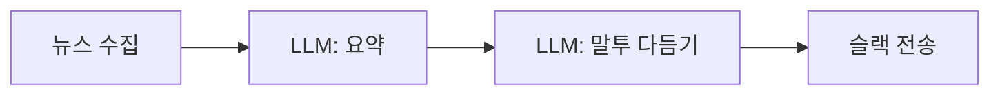
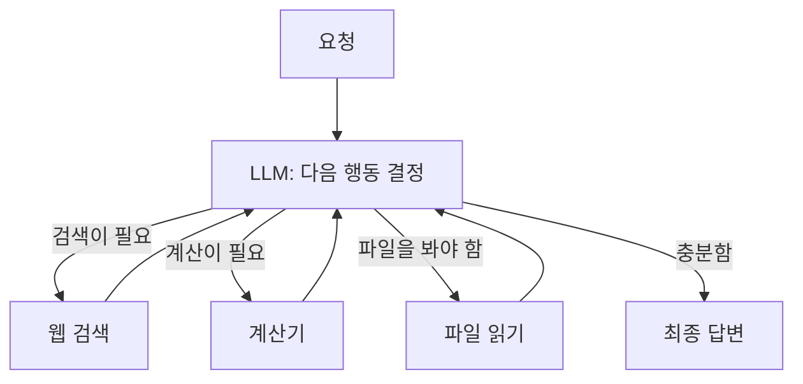
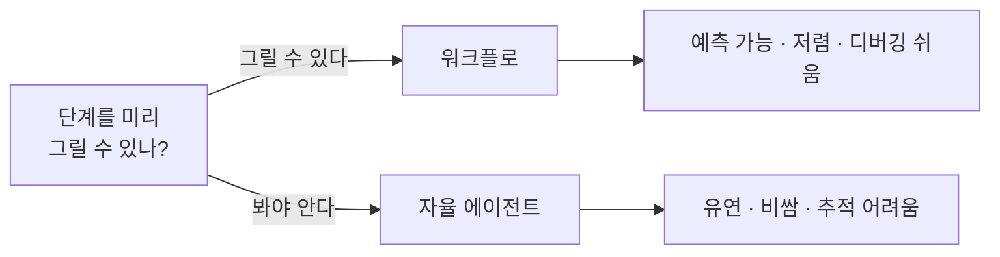

# 1.4 LLM 기반 에이전트 시스템, 이런 구조로 설계된다

> **공식 문서** — [Workflows and agents](https://docs.langchain.com/oss/python/langgraph/workflows-agents) · [Building effective agents](https://www.anthropic.com/engineering/building-effective-agents)

> **여기까지** — 도구 호출로 판단과 행동을 이었고, 그 반복이 **루프**라는 것까지 왔습니다([1.3절](01-03_LLM%EC%9D%B4%20%EB%8B%A4%EC%9D%8C%20%ED%96%89%EB%8F%99%EC%9D%84%20%EA%B2%B0%EC%A0%95%ED%95%98%EB%8B%A4.md)).
> **이 절의 질문** — **항상 루프가 답일까?**
> **다 읽으면** — 앞으로 만들 모든 시스템에서 **첫 번째로 내려야 할 설계 결정**의 기준이 생깁니다. 3장에서 이 기준을 그대로 다시 씁니다.

## 루프가 항상 답은 아닙니다

[1.3절](01-03_LLM%EC%9D%B4%20%EB%8B%A4%EC%9D%8C%20%ED%96%89%EB%8F%99%EC%9D%84%20%EA%B2%B0%EC%A0%95%ED%95%98%EB%8B%A4.md)의 루프는 강력합니다. 무엇을 할지 모델이 알아서 정하니 **어떤 요청이 와도** 대응할 수 있을 것 같습니다.

그런데 이런 일을 시킨다고 해 봅시다.

> "매일 아침 뉴스 10건을 가져와서 요약하고 슬랙에 올려 줘."

**단계가 이미 정해져 있습니다.**

```
가져오기  →  요약하기  →  올리기
```

순서가 바뀔 일도, 중간에 다른 걸 할 일도 없습니다.

이걸 자율 루프에 맡기면 어떻게 될까요? 모델이 매번 **"이제 뭘 하지?"** 를 고민합니다. 어떤 날은 요약을 두 번 하고, 어떤 날은 슬랙 올리기를 빠뜨립니다.

**정해진 일을 굳이 매번 판단하게 만든 것**입니다. 낭비이고, 불안정합니다.

에이전트 시스템의 구조는 크게 **두 갈래**이고, **어느 쪽을 고를지가 첫 번째 설계 결정**입니다.

## 1.4.1 작업의 단계를 미리 지정한 에이전트 구조

단계와 순서를 **개발자가 코드로 고정**합니다. LLM은 **각 단계 안에서만** 일합니다.

이런 구조를 **워크플로(Workflow)** 라고 부릅니다.



여기서 LLM이 하는 일은 **요약**과 **다듬기**뿐입니다. **"다음에 뭘 할지"는 묻지 않습니다.** 화살표가 이미 코드에 박혀 있으니까요.

### LLM을 안 쓰는 게 아닙니다

여기서 헷갈리기 쉽습니다.

> **워크플로 = LLM을 안 쓰는 것**이 아닙니다.
> **워크플로 = 흐름 판단만 안 맡기는 것**입니다.

각 단계 안에서는 LLM이 열심히 일합니다. 요약도 하고 말투도 다듬습니다. 다만 **"이 다음에 뭘 할까"** 를 묻지 않을 뿐입니다.

| | 워크플로에서 |
| :--- | :--- |
| 흐름 결정 | **개발자** (코드) |
| 각 단계의 내용 | **LLM** |
| 실행 경로 | 매번 같음 |
| 비용 | 예측 가능 — 호출 횟수가 고정 |
| 디버깅 | 어느 단계에서 틀렸는지 바로 보임 |

### 조건 분기가 있어도 워크플로입니다

> "감성이 부정이면 담당자에게 넘기고, 아니면 자동 응답"

이런 분기가 들어가도, **가능한 경로를 개발자가 다 그려 뒀다면 워크플로**입니다. **조건 판단을 LLM이 하더라도** 마찬가지입니다.

가르는 기준은 **"LLM이 판단하느냐"가 아니라 "경로를 미리 그렸느냐"** 입니다. 이 문장을 기억해 두세요. 헷갈릴 때마다 여기로 돌아오면 됩니다.

### 용어 정리 — 라우팅은 패턴 다섯 개 중 하나

**교재는 이 구조를 "라우터 기반 에이전트"라고 부릅니다.** 공식 문서의 워크플로와 다른 게 아니라, 워크플로 패턴 중 **라우팅(Routing)** 하나를 가리키는 이름입니다([1.2절](01-02_LLM%EC%9D%84%20%EA%B8%B0%EB%B0%98%EC%9C%BC%EB%A1%9C%20%EC%9D%98%EC%82%AC%EA%B2%B0%EC%A0%95%ED%95%98%EB%8B%A4.md)에서 라우터를 배웠습니다).

공식 문서가 정리한 패턴은 **다섯 개**이고, **이 책 전체가 그 다섯을 하나씩 배웁니다.**

| 공식 문서 패턴 | 무엇 | 이 책에서 |
| :--- | :--- | :--- |
| **Routing** | 갈림길에서 어디로 갈지 고름 | **1.4.1 (지금 여기)** |
| Prompt chaining | 정해진 순서로 이어서 실행 | 7.4절 `web_agent` |
| Parallelization | 여러 개를 동시에 실행 | 7.5절 `Send` |
| **Orchestrator-worker** | 관리자가 일을 나눠 줌 | 7.4~7.6절 · 11장 |
| **Evaluator-optimizer** | 결과를 평가하고 다시 만듦 | 2.1절 Reflection · 6.5절 RAG |

**지금 배우는 게 전체의 1/5**입니다. 나머지는 7장에서 만납니다.

## 1.4.2 작업의 단계를 동적으로 처리하는 자율 에이전트 구조

이번엔 **단계를 안 정합니다.** 도구만 쥐여 주고 **다음에 무엇을 할지 매번 모델이 정하게** 합니다.

[1.3절](01-03_LLM%EC%9D%B4%20%EB%8B%A4%EC%9D%8C%20%ED%96%89%EB%8F%99%EC%9D%84%20%EA%B2%B0%EC%A0%95%ED%95%98%EB%8B%A4.md)의 루프 그대로입니다.



**화살표가 모델의 판단에 따라 그때그때 그려집니다.** 실행 경로가 매번 다릅니다.

### 언제 이 구조가 필요한가

**미리 그릴 수 없을 때**입니다.

> "이 오류 로그 보고 원인 찾아 줘."

원인이 어디 있을까요?

- 설정 파일이 잘못됐을 수도
- 라이브러리 버전이 안 맞을 수도
- 네트워크 문제일 수도

**무엇을 봐야 할지는 봐 봐야 압니다.** 순서를 미리 못 정합니다.

| | 자율 에이전트에서 |
| :--- | :--- |
| 흐름 결정 | **LLM** |
| 실행 경로 | 매번 다름 |
| 비용 | 예측 어려움 — 몇 번 돌지 모름 |
| 디버깅 | 어려움 — 왜 그 도구를 골랐는지 추적해야 함 |
| 위험 | 무한 루프, 컨텍스트 초과 ([1.3절](01-03_LLM%EC%9D%B4%20%EB%8B%A4%EC%9D%8C%20%ED%96%89%EB%8F%99%EC%9D%84%20%EA%B2%B0%EC%A0%95%ED%95%98%EB%8B%A4.md)) |

## 어느 쪽을 고를 것인가

> ### 단계를 그릴 수 있으면 그리세요.

이게 실무의 기본값입니다.

자율 구조가 더 발전된 형태처럼 보이지만, 실제로는 **통제를 포기하는 대가로 유연성을 사는 것**입니다. 그리고 대가가 작지 않습니다.



### 전체 비교

| 기준 | 워크플로 | 자율 에이전트 |
| :--- | :--- | :--- |
| 입력의 종류 | 정해져 있음 | 무엇이 올지 모름 |
| 처리 순서 | 미리 알 수 있음 | 해 봐야 앎 |
| **종료 판단** | **개발자가 정함** — 마지막 단계면 끝 | **모델이 정함** — "이제 답할 수 있다" |
| **판단 지점** | 갈림길 몇 곳 | **매 단계마다** |
| **프롬프트 의존도** | 낮음 — 흐름이 코드에 | **높음 — 흐름이 프롬프트에** |
| 실패했을 때 | 어느 단계인지 특정됨 | 어디서 어긋났는지 찾아야 함 |
| 운영 비용 | 고정 | 변동 |
| 적합한 예 | 문서 요약 파이프라인, 정기 리포트, 분류 후 처리 | 코드 디버깅, 자료 조사, 열린 질문 |

## 프롬프트 의존도가 왜 다른가

이 차이가 실무에서 꽤 크게 다가옵니다. **흐름이 어디에 적혀 있는지**를 보면 됩니다.

| | 흐름이 어디에 적혀 있나 |
| :--- | :--- |
| **워크플로** | **코드에.** 프롬프트는 "이 문의를 셋 중 하나로 분류하라" 정도만 |
| **자율 에이전트** | **프롬프트에.** "무엇을 할 수 있고, 언제 무엇을 쓰고, 언제 끝내는지"가 전부 자연어로 |

**자율 구조에서는 프롬프트가 곧 설계도입니다.**

그래서 **프롬프트 한 줄을 고치면 동작이 통째로 달라집니다.** [1.2절](01-02_LLM%EC%9D%84%20%EA%B8%B0%EB%B0%98%EC%9C%BC%EB%A1%9C%20%EC%9D%98%EC%82%AC%EA%B2%B0%EC%A0%95%ED%95%98%EB%8B%A4.md)에서 "프롬프트도 버전 관리 대상"이라고 한 게 여기서 훨씬 절실해집니다.

## 작은 모델을 쓴다면 워크플로 쪽입니다

**모델이 작을수록 워크플로가 유리합니다.**

| | 워크플로 | 자율 에이전트 |
| :--- | :--- | :--- |
| 모델이 판단하는 횟수 | 갈림길에서 몇 번 | **매 단계** |
| 한 번 틀렸을 때 | 그 분기만 틀림 | **그 뒤가 전부 어긋남** |
| 모델에게 요구하는 능력 | 분류 | **도구 선택 + 인자 채우기 + 종료 판단** |

자율 구조는 매 단계 판단이 필요한데 **작은 모델은 그 판단이 흔들립니다.** 도구를 고르고 인자를 채우는 정확도도 떨어집니다.

반면 워크플로는 **판단 지점이 적어서** 작은 모델로도 버팁니다.

> **이 판단은 실무에서 "모델을 섞어 쓰는 방식"으로 나타납니다.**
>
> - 6.4.3절 — 대화가 길어지면 **비싼 모델로 갈아탐**
> - 11.5절 — **계획은 싼 모델, 최종 정리는 좋은 모델**
>
> **"무조건 좋은 모델"이 답이 아닙니다.** 단계마다 필요한 능력이 다르니까요.

## 둘은 배타적이지 않습니다

**실제 시스템은 대개 섞습니다.**

큰 흐름은 워크플로로 고정하고, 그중 **한 단계만** 자율 에이전트에 맡기는 식입니다.

**11장의 최종 프로젝트가 정확히 이 모양**입니다. 오케스트레이터가 어느 에이전트를 부를지는 LLM이 판단하지만, **시스템 전체 구조는 개발자가 그려 뒀습니다.**

## 이 기준은 3장에서 다시 씁니다

3장에서 **싱글 에이전트 vs 멀티 에이전트**를 고를 때, 이 절의 질문이 그대로 다시 나옵니다.

> **미리 그릴 수 있는가, 봐야 아는가.**

**두 축은 다른 질문**입니다. 겹치면 네 칸이 나옵니다.

| | 싱글 | 멀티 |
| :--- | :--- | :--- |
| **워크플로**(단계 고정) | 분류 후 정해진 처리 | 정해진 순서로 전문 에이전트 호출 |
| **자율**(LLM이 결정) | 6장 웹 검색·코딩 에이전트 | 7장 슈퍼바이저 |

## 요약 및 비유

**패키지 투어와 자유 여행**의 차이와 같습니다.

어느 쪽이 우월한 게 아니라, **일정을 미리 짤 수 있느냐**로 갈립니다.

| 개념 | 여행 비유 | 기술적 의미 |
| :--- | :--- | :--- |
| **워크플로** | 패키지 투어 — 일정표가 있음 | 단계와 순서를 코드로 고정 |
| **자율 에이전트** | 자유 여행 — 그날 정함 | 다음 행동을 LLM이 매번 결정 |
| **라우팅** | 갈림길에서 가이드가 코스를 고름 | 워크플로 패턴 중 하나 |
| **워크플로 속 LLM** | 가이드가 현장에서 설명 | 각 단계 내용은 LLM이 처리 |
| **조건 분기** | 비 오면 실내 코스 (미리 정해 둔 대안) | 경로를 다 그려 뒀으면 워크플로 |
| **종료 판단** | 일정표 끝 vs "이제 됐다" 싶을 때 | 개발자가 정함 vs 모델이 정함 |
| **프롬프트 의존도** | 일정표가 있나, 말로만 설명했나 | 흐름이 코드에 vs 프롬프트에 |
| **작은 모델** | 초행길엔 패키지가 안전 | 판단 지점이 적을수록 유리 |
| **예측 가능성** | 며칠에 얼마 드는지 미리 앎 | 호출 횟수·비용 고정 |
| **유연성** | 좋은 곳을 만나면 하루 더 머묾 | 예상 못 한 입력에 대응 |
| **무한 루프** | 길을 잃고 같은 골목만 돎 | 종료 판단 실패 |
| **섞어 쓰기** | 큰 일정은 정하고 하루는 자유 | 워크플로 안의 한 단계를 에이전트로 |

## 결론

* 에이전트 시스템의 첫 번째 설계 결정은 **"단계를 미리 그릴 수 있는가"** 입니다.
* **워크플로**는 흐름을 개발자가 고정하고 LLM은 각 단계 내용만 맡습니다. **LLM을 안 쓰는 게 아니라 흐름 판단만 안 맡기는 것**입니다.
* **조건 분기가 있어도, 경로를 다 그려 뒀다면 워크플로**입니다. 기준은 "LLM이 판단하느냐"가 아니라 **"경로를 미리 그렸느냐"** 입니다.
* 교재의 **"라우터 기반 에이전트"는 공식 문서의 워크플로 패턴 다섯 중 Routing** 하나입니다. 나머지 넷은 7장에서 만납니다.
* **자율 에이전트**는 다음 행동을 LLM이 매번 정합니다. 유연한 대신 비용 예측이 어렵고 추적이 힘듭니다.
* **종료를 누가 정하는가**도 갈립니다 — 워크플로는 개발자, 자율 에이전트는 모델.
* **프롬프트 의존도가 다른 이유는 흐름이 어디 적혀 있느냐**입니다. 자율 구조에서는 **프롬프트가 곧 설계도**입니다.
* **모델이 작을수록 워크플로가 유리합니다.** 실무에서는 **단계마다 모델을 섞어 씁니다**(6.4.3절 · 11.5절).
* 기본값은 워크플로입니다. **자율 구조는 미리 그릴 수 없을 때만** 씁니다. 실제 시스템은 대개 둘을 섞습니다(11장).
* 이 판단 기준은 **3장의 싱글 / 멀티 선택에서 그대로 다시** 쓰입니다.

---

## 1장을 마치며

네 개 절을 한 줄로 이으면 이렇습니다.

> **LLM은 다음 토큰을 고를 뿐이고(1.1)**
> **그 판단을 코드가 쓸 수 있게 형식을 강제했고(1.2)**
> **도구로 행동과 이어 루프를 만들었고(1.3)**
> **그 루프를 쓸지 말지 고르는 기준을 세웠습니다(1.4).**

**2장에서는** 이 루프를 이루는 **세 가지 부품**(추론·도구·메모리)을 하나씩 뜯어봅니다. 1.3절의 루프가 **ReAct**라는 이름을 얻는 곳입니다.

---

[⬅ 1.3](01-03_LLM%EC%9D%B4%20%EB%8B%A4%EC%9D%8C%20%ED%96%89%EB%8F%99%EC%9D%84%20%EA%B2%B0%EC%A0%95%ED%95%98%EB%8B%A4.md) · [Chapter 01](README.md) · [전체 목차](../STUDY.md)
