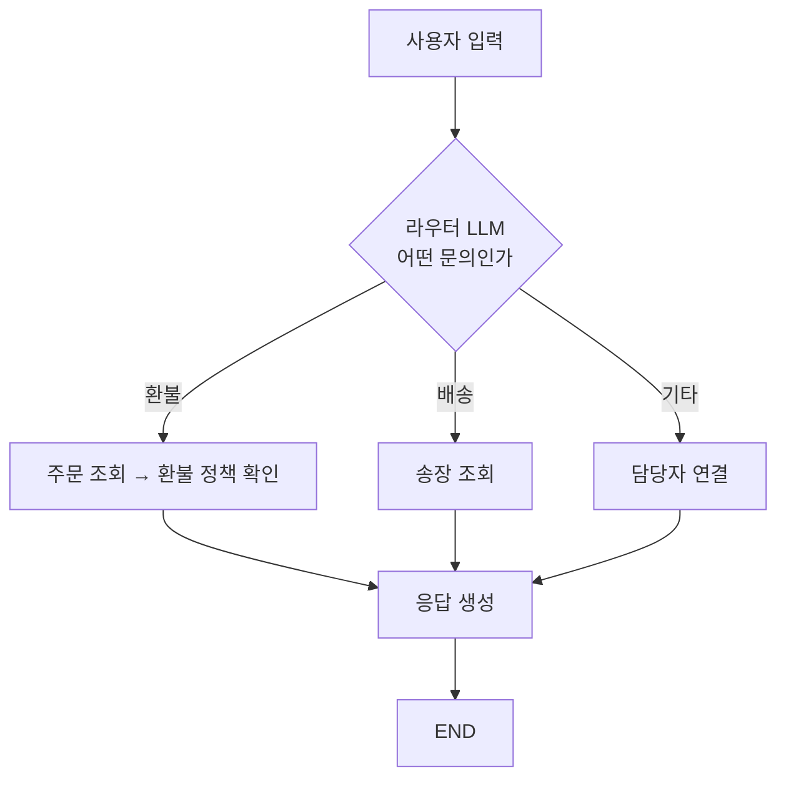
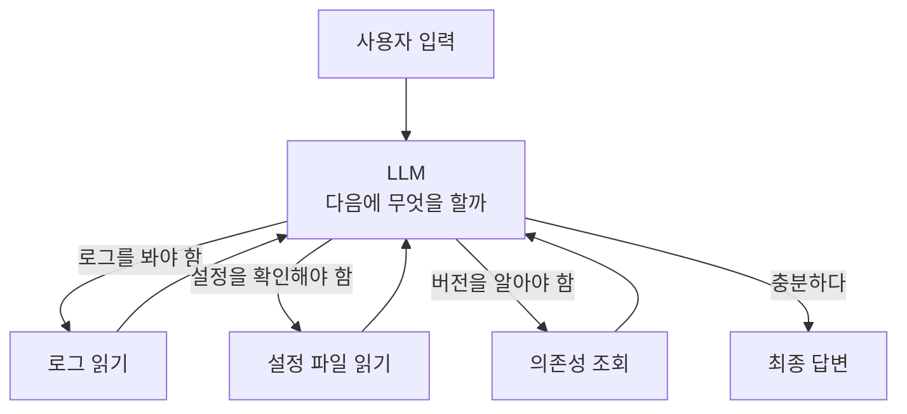

# Chapter 01 필기 — LLM 기반 의사결정 구조와 에이전트 동작 방식

> 절별 상세는 [1.1](01-01_AI%20%EC%97%90%EC%9D%B4%EC%A0%84%ED%8A%B8%EC%9D%98%20%EB%91%90%EB%87%8C%2C%20%EA%B1%B0%EB%8C%80%20%EC%96%B8%EC%96%B4%20%EB%AA%A8%EB%8D%B8%EC%9D%98%20%EC%9D%B4%ED%95%B4.md) · [1.2](01-02_LLM%EC%9D%84%20%EA%B8%B0%EB%B0%98%EC%9C%BC%EB%A1%9C%20%EC%9D%98%EC%82%AC%EA%B2%B0%EC%A0%95%ED%95%98%EB%8B%A4.md) · [1.3](01-03_LLM%EC%9D%B4%20%EB%8B%A4%EC%9D%8C%20%ED%96%89%EB%8F%99%EC%9D%84%20%EA%B2%B0%EC%A0%95%ED%95%98%EB%8B%A4.md) · [1.4](01-04_LLM%20%EA%B8%B0%EB%B0%98%20%EC%97%90%EC%9D%B4%EC%A0%84%ED%8A%B8%20%EC%8B%9C%EC%8A%A4%ED%85%9C%2C%20%EC%9D%B4%EB%9F%B0%20%EA%B5%AC%EC%A1%B0%EB%A1%9C%20%EC%84%A4%EA%B3%84%EB%90%9C%EB%8B%A4.md)
>
> **용어는 공식 문서 기준.** 교재 용어가 다를 때는 괄호로 병기함.

## LLM이란

- **거대 언어 모델(Large Language Model, LLM)** — 방대한 데이터를 학습한 모델. 사용자의 요청을 해석하는 것을 넘어 **목표를 위해 어떤 행동을 할지 결정**하는 데 쓰임 → AI 에이전트의 핵심 요소
- **트랜스포머(Transformer)** 라는 인공신경망 아키텍처 기반. 핵심은 문장 내 단어 간 관계를 파악하는 **어텐션(Attention)** 메커니즘
- **파라미터(Parameter)** — 모델 내부의 가중치와 편향 값

### 학습 데이터가 텍스트뿐일까

**아니다.** 이름은 "언어" 모델이지만 지금은 텍스트만이 아니다.

OpenAI 모델 문서는 이렇게 적고 있다 — *"All latest OpenAI models support text and image input, text output, multilingual capabilities, and vision."* ([모델 문서](https://developers.openai.com/api/docs/models))

| 입력 | 지금 |
| :--- | :--- |
| 텍스트 | ✓ |
| **이미지** | ✓ — [이미지 입력 가이드](https://developers.openai.com/api/docs/guides/images-vision)에 URL·base64·파일 ID 세 방식 |
| 음성 | 별도 모델·API 계열 |
| 출력 | 대부분 텍스트 |

**이 교재의 예제는 전부 텍스트 경로만 쓴다.** 그래서 6.5절에서 PDF를 다룰 때도 **텍스트로 뽑아서 넣는다**(11장 `extract_text_from_pdf`). 이미지를 이미지 그대로 모델에 주는 코드는 이 책에 없음.

다만 **텍스트가 아닌 것을 전제한 자리는 곳곳에 있다.**

- [10장](../ch10_a2a/10-02_A2A%EC%9D%98%20%EA%B5%AC%EC%84%B1%20%EC%9A%94%EC%86%8C%EC%99%80%20%EB%8F%99%EC%9E%91%20%ED%9D%90%EB%A6%84%20%EC%9D%B4%ED%95%B4%ED%95%98%EA%B8%B0.md) `AgentCapabilities(input_modes=['text'], output_modes=['text'])` — **모드를 명시하는 필드가 있다는 것 자체가** 텍스트만이 아니라는 뜻
- [11장](../ch11_final-project/11-01_%EC%98%A4%EC%BC%80%EC%8A%A4%ED%8A%B8%EB%A0%88%EC%9D%B4%ED%84%B0%20%EA%B8%B0%EB%B0%98%20%EB%A9%80%ED%8B%B0%20%EC%97%90%EC%9D%B4%EC%A0%84%ED%8A%B8%20%EC%84%A4%EA%B3%84.md) `TextPart` / `DataPart` / `FilePart` — 주고받는 조각의 종류가 셋

> **정리** — 모델은 이미지도 받지만, **이 책에서 배우는 경로는 텍스트**다. 나중에 이미지를 다루게 되면 `input_modes`와 `FilePart`가 이미 그 자리를 비워 두고 있었다는 걸 알게 됨.

### 파라미터는 언제 조절되나

- 가중치·편향을 **계속 조절해 성능이 올라가는 것은 학습(training) 중**의 이야기
- **우리가 API로 쓰는 시점(추론, inference)에는 파라미터가 고정**됨
- 그래서 **프롬프트를 아무리 고쳐도 모델이 "배우지" 않는다.** 매 요청이 독립적임([1.1절](01-01_AI%20%EC%97%90%EC%9D%B4%EC%A0%84%ED%8A%B8%EC%9D%98%20%EB%91%90%EB%87%8C%2C%20%EA%B1%B0%EB%8C%80%20%EC%96%B8%EC%96%B4%20%EB%AA%A8%EB%8D%B8%EC%9D%98%20%EC%9D%B4%ED%95%B4.md))
- 대화가 이어지는 것처럼 보이는 건 **이전 대화를 매번 다시 넣어 주기 때문**(8장 메모리)

### "이해한다"는 표현에 대해

[1.1절 노트](01-01_AI%20%EC%97%90%EC%9D%B4%EC%A0%84%ED%8A%B8%EC%9D%98%20%EB%91%90%EB%87%8C%2C%20%EA%B1%B0%EB%8C%80%20%EC%96%B8%EC%96%B4%20%EB%AA%A8%EB%8D%B8%EC%9D%98%20%EC%9D%B4%ED%95%B4.md)는 **"의미를 이해해서 답하는 게 아니라 그럴듯한 다음 말을 이어 붙이다 보니 답이 되는 것"** 으로 설명함. 이 관점을 택하면 뒤가 전부 설명됨.

| 현상 | 다음 토큰 예측으로 보면 |
| :--- | :--- |
| **환각(Hallucination)** | 모르는 것도 "그럴듯한 다음 말"은 만들어짐 |
| **온도(Temperature)** | 확률 분포에서 얼마나 과감히 고를지 |
| 같은 질문에 다른 답 | 매번 확률로 고르니까 |

## LLM과 에이전트의 관계

| | 담당 |
| :--- | :--- |
| **LLM** | 자연어 이해와 추론 |
| **에이전트** | 그 판단을 기반으로 한 **행동(Action)** |

- LLM 기반 AI 에이전트는 **의도를 정확히 해석**할 뿐 아니라 **목표 달성에 맞는 행동을 골라 수행**함
- 에이전트를 구현하려면 **AI 모델을 선택하고 연결**할 수 있어야 함. 어떤 모델을 고르느냐에 따라 **추론 능력과 수행 가능한 작업 범위**가 달라짐
- 에이전트는 LLM의 판단을 기반으로 동작하므로 다양한 의사결정을 맡길 수 있고, 정리된 형태로 답을 제시해 **사용자의 의사결정을 도움**

## 에이전트가 하는 일의 흐름

1. 사용자의 요청을 분석
2. 필요한 작업을 분해
3. 각 단계에서 **'다음에 무엇을 할지' 스스로 결정**

이 중심에 **LLM의 의사결정 능력**이 있음. LLM은 요청을 분석해 의도를 파악하고, 다음에 수행할 절차를 결정하며, **전체 시스템 흐름을 제어**함.

## 흐름 제어를 LLM에게 맡기기 — 라우팅

- **라우팅(Routing)** — LLM이 **주어진 선택지 안에서** 입력의 의미를 해석하고 다음에 수행할 행동을 결정하는 것. 그 역할을 하는 LLM을 **라우터(router)** 라 부름
- 이 기능을 활용하면 **상황에 따라 행동이 달라지는 동적 구조**를 설계할 수 있음
- 구현에서 중요한 것은 **LLM의 선택 과정을 시스템에 자연스럽게 연결**하는 것

> **용어 확인** — "라우팅"은 교재만의 말이 아니라 [공식 문서](https://docs.langchain.com/oss/python/langgraph/workflows-agents)에 있는 **워크플로 패턴 이름**임. 문서가 정리한 패턴은 다섯 개.
>
> **Prompt chaining · Routing · Parallelization · Orchestrator-worker · Evaluator-optimizer**
>
> 이 장에서 배우는 건 그중 **Routing** 하나. 나머지 넷은 7장 멀티 에이전트에서 만남 — 특히 **Orchestrator-worker**가 [7.4절](../ch07_multi-agent/07-04_%EC%9B%B9%ED%8E%98%EC%9D%B4%EC%A7%80%EB%A5%BC%20%EC%9A%94%EC%95%BD%ED%95%B4%EC%84%9C%20%EB%8D%B0%EC%9D%B4%ED%84%B0%EB%B2%A0%EC%9D%B4%EC%8A%A4%EC%97%90%20%EC%A0%80%EC%9E%A5%ED%95%98%EB%8A%94%20%EC%97%90%EC%9D%B4%EC%A0%84%ED%8A%B8%20%23%EC%8A%88%ED%8D%BC%EB%B0%94%EC%9D%B4%EC%A0%80.md)의 슈퍼바이저, **Evaluator-optimizer**가 [2.1절](../ch02_core-elements/02-01_%EC%97%90%EC%9D%B4%EC%A0%84%ED%8A%B8%EC%9D%98%20%EC%B6%94%EB%A1%A0%20%EB%8A%A5%EB%A0%A5%20-%20ReAct%EC%99%80%20Reflection.md)의 Reflection.

에이전트가 작업을 수행하려면 먼저 **작업을 여러 단계로 나누고 각 단계에서 어떤 판단이 필요한지 정의**해야 함. 개발자가 흐름을 단계별로 설계하고, 그 안에서 LLM이 라우터 역할로 다음 단계를 결정하게 만들어 전체 흐름을 제어함.

> **여기서 두 갈래로 갈림.**
> 라우팅 중심 설계 = 복잡한 작업을 세분화하고 **실행 흐름을 개발자가 직접 정의**.
> 반대로 입력·상황이 다양해 **흐름을 예측하기 어려우면** 자율성을 높인 구조를 씀.

## 1. 워크플로 — 작업의 단계를 미리 지정한 구조

> 교재 표현: *작업의 단계를 미리 지정한 에이전트 구조* / *제한적인 자율성을 가진 라우터 기반 에이전트*
> 공식 문서: **워크플로(Workflow)** — *"predetermined code paths, designed to operate in a certain order"*

- 작업 단계를 미리 정해두므로 **정해진 순서**에 따라 흐름이 정의됨
- 라우터 LLM이 사용자 입력을 받아 분석
- 불필요한 단계를 생략하고 **결정이 필요한 지점에서만** 동적 제어를 수행
- 단, 전체 작업 순서와 각 단계의 역할은 **사전에 정의된 흐름**을 따르고, 라우터는 그 안에서 **최소한의 판단만** 담당
- 라우팅되어 결과를 출력하도록 **프롬프트를 작성**해야 함 — 시스템 프롬프트 / 유저 프롬프트

### 예시 — 고객 문의 챗봇

**화살표가 전부 개발자가 그려 둔 것.** 라우터는 갈림길 한 곳에서만 판단하고, 그다음 경로는 정해져 있음. **되돌아오는 화살표가 없다는 점**이 아래 구조와의 결정적 차이.

## 2. 에이전트 — 작업의 단계를 동적으로 처리하는 자율 구조

> 교재 표현: *작업의 단계를 동적으로 처리하는 자율 에이전트 구조*
> 공식 문서: **에이전트(Agent)** — *"dynamic and define their own processes and tool usage"*

- 에이전트가 **자율적으로 필요한 작업을 선택**하므로, 현재 상황에 필요한 작업을 동적으로 수행
- 작업 단계를 **사전에 고정하지 않고** 에이전트가 상황을 스스로 판단해 문제를 해결
- 구현하려면 **LLM이 수행할 역할과 작업 범위에 대한 가이드를 프롬프트로 명확히** 제공해야 함
- 프롬프트에 **수행할 단계와 결과에 따른 분기가 자연어로 명시**돼 있음

### 예시 — 오류 원인 찾기

**되돌아오는 화살표가 있음.** 도구 결과를 보고 다시 판단하므로 **실행 경로가 매번 달라짐.** 무엇을 봐야 할지는 봐야 알 수 있는 문제에 씀.

> **언제 멈추나** — 종료 판단도 LLM이 함. 그래서 **무한 반복**이 실제 문제가 되고, 프레임워크는 최대 반복 횟수를 둠. 랭그래프에서는 한도를 넘으면 `GRAPH_RECURSION_LIMIT` 오류([1.3절](01-03_LLM%EC%9D%B4%20%EB%8B%A4%EC%9D%8C%20%ED%96%89%EB%8F%99%EC%9D%84%20%EA%B2%B0%EC%A0%95%ED%95%98%EB%8B%A4.md), [6.1절](../ch06_single-agent/06-01_%EB%8F%84%EA%B5%AC%EB%A5%BC%20%ED%98%B8%EC%B6%9C%ED%95%98%EB%8A%94%20%EC%97%90%EC%9D%B4%EC%A0%84%ED%8A%B8%20%EC%9D%B4%ED%95%B4%ED%95%98%EA%B8%B0.md)).

## 3. 두 구조 비교

| | 1. 워크플로 (라우팅) | 2. 에이전트 (자율) |
| :--- | :--- | :--- |
| 흐름 결정 | **개발자**(코드) | **LLM** |
| 라우터의 역할 | 갈림길에서 최소한의 판단 | 매 단계 판단 |
| 실행 경로 | 매번 같음 | 매번 다름 |
| 되돌아가기 | 없음 | **있음** |
| 종료 판단 | 개발자가 정함 | **LLM이 정함** |
| 비용 | 예측 가능 | 예측 어려움 |
| 디버깅 | 어느 단계인지 바로 보임 | 왜 그 선택을 했는지 추적해야 함 |
| 프롬프트 의존도 | 낮음 | **높음** |

> **조건 분기가 있어도 워크플로다.** 경로를 개발자가 다 그려 뒀다면, 분기 판단을 LLM이 하더라도 워크플로임([1.4절](01-04_LLM%20%EA%B8%B0%EB%B0%98%20%EC%97%90%EC%9D%B4%EC%A0%84%ED%8A%B8%20%EC%8B%9C%EC%8A%A4%ED%85%9C%2C%20%EC%9D%B4%EB%9F%B0%20%EA%B5%AC%EC%A1%B0%EB%A1%9C%20%EC%84%A4%EA%B3%84%EB%90%9C%EB%8B%A4.md)). 가르는 기준은 **"LLM이 판단하느냐"가 아니라 "경로를 미리 그렸느냐"**.

## 4. 내 생각

- **프롬프트 의존도**는 워크플로보다 **자율 에이전트가 높음.**
  → 1번은 흐름이 코드에 있고 프롬프트는 분류만 시키면 되지만, 2번은 **흐름 자체가 프롬프트에 적혀 있음.** 프롬프트가 곧 설계도가 되는 셈.
- **낮은 파라미터 모델에서는 워크플로가 나음.**
  → 2번은 매 단계 판단이 필요한데 작은 모델은 그 판단이 흔들림. 도구를 고르고 인자를 채우는 정확도도 떨어짐. 1번은 판단 지점이 한 곳뿐이라 작은 모델로도 버팀.
  → 실제로 이 판단은 [6.4.3절](../ch06_single-agent/06-04_create_agent%20%EC%83%81%EC%84%B8%20%EA%B5%AC%EC%A1%B0%20%EC%9D%B4%ED%95%B4%ED%95%98%EA%B8%B0.md)에서 **대화 길이에 따라 모델을 바꾸는 미들웨어**로, [11.5절](../ch11_final-project/11-05_%EC%98%A4%EC%BC%80%EC%8A%A4%ED%8A%B8%EB%A0%88%EC%9D%B4%ED%84%B0%20%EC%97%90%EC%9D%B4%EC%A0%84%ED%8A%B8.md)에서 **계획은 싼 모델·통합은 좋은 모델**로 나오는 걸 보면 실무에서도 같은 고민을 함.

## 아직 열린 것

- [ ] 워크플로 패턴 나머지 넷(Prompt chaining · Parallelization · Orchestrator-worker · Evaluator-optimizer)이 각각 어떤 모양인지 — 7장에서 확인
- [ ] 이미지 입력을 실제로 쓰려면 어떻게 하는지 — 이 교재 범위 밖. [이미지 입력 가이드](https://developers.openai.com/api/docs/guides/images-vision) 참고
- [ ] 3장에서 **싱글/멀티 에이전트**를 고를 때 이 장의 기준(흐름을 미리 그릴 수 있는가)이 그대로 쓰이는지

---

[⬅ Chapter 01](README.md) · [전체 목차](../STUDY.md)
