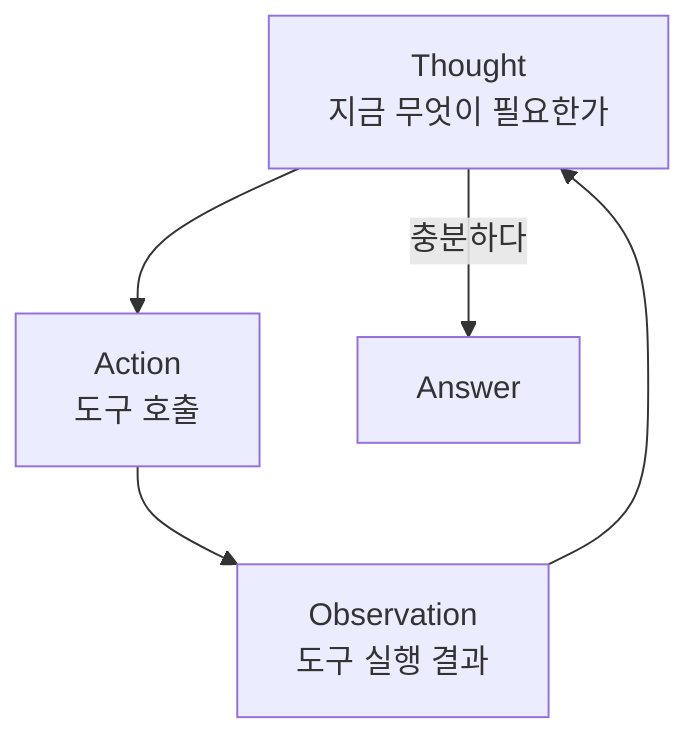
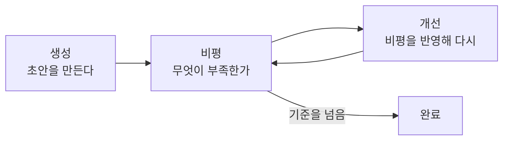

# 2.1 에이전트의 추론 능력: ReAct와 Reflection

> **공식 문서** — [ReAct 논문](https://arxiv.org/abs/2210.03629) · [Reflexion 논문](https://arxiv.org/abs/2303.11366)

[1.3절](../ch01_llm-decision/01-03_LLM%EC%9D%B4%20%EB%8B%A4%EC%9D%8C%20%ED%96%89%EB%8F%99%EC%9D%84%20%EA%B2%B0%EC%A0%95%ED%95%98%EB%8B%A4.md)에서 이런 루프를 그렸습니다.

```
LLM이 도구를 고른다 → 애플리케이션이 실행한다 → 결과를 다시 넣는다 → 반복
```

이 루프에는 이름이 있습니다. **ReAct**입니다. 그리고 이 루프만으로는 부족한 지점에서 **Reflection**이 나옵니다.

두 가지 다 논문에서 온 이름이고, 랭그래프·랭체인이 제공하는 기능 이름이 아닙니다. **에이전트를 어떻게 생각하게 만들 것인가에 대한 설계 패턴**입니다.

## 2.1.1 ReAct

### 이름 그대로 Reasoning + Acting 입니다

ReAct 이전에는 LLM을 쓰는 방식이 둘로 갈려 있었습니다.

| 방식 | 하는 일 | 한계 |
| :--- | :--- | :--- |
| **생각만 시키기**<br/>(Chain-of-Thought) | "단계별로 생각해 보자"라고 시켜서 추론 과정을 쓰게 함 | 머릿속에서만 굴림. **틀린 전제를 확인할 방법이 없음** |
| **행동만 시키기** | 도구를 부르게 함 | 왜 그 도구를 부르는지 근거가 없음. **엉뚱한 걸 불러도 모름** |

ReAct는 **둘을 번갈아** 합니다. 생각하고, 행동하고, 결과를 보고, 다시 생각합니다.

```
Thought:     세종대왕의 재위 기간을 알아야 한다. 검색하자.
Action:      search("세종대왕 재위 기간")
Observation: 1418년 ~ 1450년
Thought:     32년이다. 이제 질문에 답할 수 있다.
Answer:      32년입니다.
```

**Thought / Action / Observation** 이 세 단어가 ReAct의 전부입니다.



### 왜 생각을 굳이 글로 쓰게 할까요

"생각"을 출력에 드러내는 게 낭비처럼 보입니다. 토큰을 더 쓰니까요. 그런데 이게 핵심입니다.

[1.1절](../ch01_llm-decision/01-01_AI%20%EC%97%90%EC%9D%B4%EC%A0%84%ED%8A%B8%EC%9D%98%20%EB%91%90%EB%87%8C%2C%20%EA%B1%B0%EB%8C%80%20%EC%96%B8%EC%96%B4%20%EB%AA%A8%EB%8D%B8%EC%9D%98%20%EC%9D%B4%ED%95%B4.md)에서 LLM은 **지금까지의 글을 보고 다음 토큰을 고른다**고 했습니다. 그러면 "왜 이 도구가 필요한지"를 글로 써 두면, **그 글이 다음 토큰을 고르는 입력이 됩니다.** 생각을 적는 행위 자체가 다음 판단의 근거가 되는 겁니다.

부수 효과도 큽니다. 에이전트가 이상하게 굴 때 **Thought를 읽으면 왜 그랬는지 보입니다.** [1.2절](../ch01_llm-decision/01-02_LLM%EC%9D%84%20%EA%B8%B0%EB%B0%98%EC%9C%BC%EB%A1%9C%20%EC%9D%98%EC%82%AC%EA%B2%B0%EC%A0%95%ED%95%98%EB%8B%A4.md)에서 `reason` 필드를 받아 두라고 한 것과 같은 이유입니다.

> **최근 모델에서는 Thought를 프롬프트로 강제하지 않는 경우가 많습니다.** 도구 호출이 모델 자체 기능으로 들어가면서, 예전처럼 `Thought:` `Action:` 형식을 텍스트로 파싱하지 않습니다. 하지만 **생각 → 행동 → 관찰의 반복**이라는 뼈대는 그대로입니다. 6장의 `create_agent`가 돌리는 루프가 바로 이것입니다.

### ReAct가 막히는 지점

ReAct는 **앞으로 나아가기만 합니다.** 되돌아보지 않습니다.

- 검색 결과가 엉뚱했는데 그걸 사실로 받아들이면, 그 위에 계속 쌓아 올립니다
- 같은 도구를 조금씩 바꿔가며 계속 부르는 루프에 빠지기도 합니다
- "내가 지금 잘하고 있나"를 묻는 단계가 없습니다

여기서 Reflection이 나옵니다.

## 2.1.2 Reflection

### 결과를 스스로 검사하고 다시 합니다

Reflection은 **한 번 만든 결과를 스스로 비평하고, 그 비평을 반영해 다시 만드는** 패턴입니다.



비평하는 쪽도 LLM입니다. **같은 모델에게 역할만 바꿔서** 시킵니다.

```
[생성] 이 주제로 블로그 글을 써 줘.
       → 초안

[비평] 아래 글을 편집자 입장에서 평가해 줘.
       근거가 없는 주장, 중복, 빠진 관점을 지적해 줘.
       → "3문단의 통계에 출처가 없습니다. 결론이 서론과 겹칩니다."

[개선] 위 지적을 반영해서 다시 써 줘.
       → 수정본
```

### ReAct와 무엇이 다른가

두 패턴은 **묻는 질문이 다릅니다.**

| | ReAct | Reflection |
| :--- | :--- | :--- |
| 묻는 것 | **다음에 무엇을 할까** | **방금 한 것이 괜찮은가** |
| 방향 | 앞으로 | 뒤로 |
| 반복하는 대상 | 도구 호출 | 결과물 |
| 끝나는 조건 | 답할 정보가 모였을 때 | 품질 기준을 넘었을 때 |
| 비용 | 도구 호출 횟수만큼 | **생성마다 2~3배** (생성 + 비평 + 재생성) |

**둘은 대체 관계가 아닙니다.** 겹쳐 쓸 수 있습니다. ReAct로 자료를 모으고, 모은 결과로 쓴 초안을 Reflection으로 다듬는 식입니다. **7.6절의 플래닝 기반 슈퍼바이저**가 이 조합에 가깝습니다.

### 함정 두 가지

> **자기 비평은 생각보다 후합니다.** 같은 모델에게 자기 글을 평가시키면 "전반적으로 좋습니다"로 끝나기 쉽습니다. 비평 프롬프트에는 **무엇을 볼지 구체적으로** 적어야 합니다 — "근거 없는 주장을 찾아라", "중복을 지적하라"처럼요.

> **끝나지 않을 수 있습니다.** "완벽해질 때까지"로 두면 계속 돕니다. **최대 반복 횟수를 반드시 정하세요.** [1.3절](../ch01_llm-decision/01-03_LLM%EC%9D%B4%20%EB%8B%A4%EC%9D%8C%20%ED%96%89%EB%8F%99%EC%9D%84%20%EA%B2%B0%EC%A0%95%ED%95%98%EB%8B%A4.md)의 무한 루프 문제가 여기서도 똑같이 나옵니다.

## 요약 및 비유

**탐정의 수사**가 두 패턴을 한 그림에 담습니다. 단서를 좇아 나아가는 것이 ReAct, 조서를 다시 읽으며 빠진 것을 찾는 것이 Reflection입니다.

| 개념 | 탐정 수사 비유 | 기술적 의미 |
| :--- | :--- | :--- |
| **Thought** | "이 사람 알리바이를 확인해야겠다" | 다음 행동의 근거를 글로 남김 |
| **Action** | 현장에 가서 조사 | 도구 호출 |
| **Observation** | 알아낸 사실 | 도구 실행 결과 |
| **ReAct 루프** | 단서 하나 확인하고 다음 단서로 | 생각 → 행동 → 관찰의 반복 |
| **생각을 적는 이유** | 수첩에 적어야 다음 판단이 됨 | 적힌 글이 다음 토큰의 입력이 됨 |
| **ReAct의 한계** | 잘못된 단서를 믿고 계속 감 | 관찰이 틀려도 되돌아보지 않음 |
| **Reflection** | 조서를 처음부터 다시 읽어 봄 | 결과를 비평하고 다시 생성 |
| **비평 프롬프트** | "무엇을 놓쳤는지 항목별로 짚어라" | 볼 것을 구체적으로 지정 |
| **반복 제한** | 마감이 있는 수사 | 최대 반복 횟수 |

## 결론

* **ReAct는 생각(Thought) → 행동(Action) → 관찰(Observation)의 반복**입니다. 1.3절에서 그린 루프가 바로 이것입니다.
* 생각을 글로 쓰게 하는 이유는 **적힌 글이 다음 판단의 입력이 되기 때문**입니다. 덤으로 디버깅이 가능해집니다.
* 요즘 모델은 `Thought:` 형식을 강제하지 않지만, **생각 → 행동 → 관찰의 뼈대는 그대로**입니다. 6장 `create_agent`가 이 루프를 돌립니다.
* **ReAct는 앞으로만 갑니다.** 잘못된 관찰 위에 계속 쌓는 문제가 있고, 여기서 Reflection이 나옵니다.
* **Reflection은 결과를 스스로 비평하고 다시 만듭니다.** ReAct가 "다음에 뭘 할까"라면 Reflection은 "방금 게 괜찮은가"입니다.
* Reflection은 **비용이 2~3배**이고, 자기 비평이 후해지기 쉬우며, 반복 제한이 없으면 끝나지 않습니다.

---

[Chapter 02](README.md) · [2.2 ➡](02-02_%EC%97%90%EC%9D%B4%EC%A0%84%ED%8A%B8%EC%9D%98%20%EC%99%B8%EB%B6%80%20%EC%A7%80%EC%8B%9D%20%ED%99%9C%EC%9A%A9%20-%20%EB%8F%84%EA%B5%AC%20%ED%98%B8%EC%B6%9C.md)
