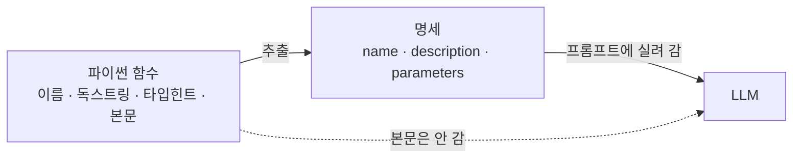

# 2.2 에이전트의 외부 지식 활용: 도구 호출

> **공식 문서** — [LangChain · Tools](https://docs.langchain.com/oss/python/langchain/tools)

[1.3절](../ch01_llm-decision/01-03_LLM%EC%9D%B4%20%EB%8B%A4%EC%9D%8C%20%ED%96%89%EB%8F%99%EC%9D%84%20%EA%B2%B0%EC%A0%95%ED%95%98%EB%8B%A4.md)에서 도구 호출이 무엇인지 봤습니다. **LLM은 실행하지 않고, 부르라는 요청만 낸다**는 것까지요.

이 절은 그 도구를 **어떻게 정의하고, 무엇이 실제로 모델에게 전달되는지**를 봅니다. 6장에서 직접 도구를 만들 때 여기서 잡은 그림이 그대로 쓰입니다.

## 모델에게 전달되는 것은 함수가 아니라 설명서입니다

이게 가장 자주 어긋나는 지점입니다. 파이썬 함수를 도구로 등록하면, 모델에게 **함수가 가는 게 아닙니다.** 함수에서 뽑아낸 **명세**가 갑니다.

```python
@tool
def get_weather(city: str) -> str:
    """도시 이름으로 현재 날씨를 조회한다."""
    resp = requests.get(f"https://api.example.com/weather?city={city}")
    return resp.json()["summary"]
```

이 함수에서 모델에게 전달되는 것은 이 정도입니다.

```json
{
  "name": "get_weather",
  "description": "도시 이름으로 현재 날씨를 조회한다.",
  "parameters": {
    "type": "object",
    "properties": { "city": { "type": "string" } },
    "required": ["city"]
  }
}
```

**본문은 가지 않습니다.** `requests.get`도, API 주소도, 반환값을 어떻게 가공하는지도 모델은 모릅니다.



여기서 두 가지가 따라 나옵니다.

**독스트링은 문서가 아니라 프롬프트입니다.** 모델이 이 도구를 쓸지 말지 판단하는 유일한 근거입니다.

**타입 힌트는 검증 장치입니다.** `city: str`이 있어야 모델이 채울 값의 형식이 정해집니다. [1.2절](../ch01_llm-decision/01-02_LLM%EC%9D%84%20%EA%B8%B0%EB%B0%98%EC%9C%BC%EB%A1%9C%20%EC%9D%98%EC%82%AC%EA%B2%B0%EC%A0%95%ED%95%98%EB%8B%A4.md)의 구조화 출력과 같은 원리입니다 — **선택지를 좁혀서 흔들림을 막는 것**입니다.

## 좋은 도구 설명의 조건

모델은 여러 도구 중 하나를 고릅니다. 그러니 설명은 **"이 도구는 무엇인가"가 아니라 "언제 이 도구를 써야 하는가"** 를 담아야 합니다.

| 담아야 할 것 | 예 |
| :--- | :--- |
| **언제 쓰는가** | "학습 시점 이후의 최신 정보가 필요할 때" |
| **무엇이 나오는가** | "제목·요약·URL 목록을 반환한다" |
| **언제 쓰면 안 되는가** | "일반 상식 질문에는 쓰지 않는다" |
| **인자의 의미** | "query: 검색어. 문장이 아니라 키워드로" |

```python
# 안 좋은 예 — 모델이 고를 근거가 없습니다
@tool
def search(q: str) -> str:
    """검색합니다."""

# 나은 예
@tool
def search_news(query: str) -> str:
    """최신 뉴스가 필요할 때 웹에서 기사를 검색한다.
    학습 시점 이후의 사건, 오늘의 시세, 진행 중인 이슈에 사용한다.
    일반 상식이나 개념 설명에는 쓰지 않는다.
    query 는 문장이 아니라 키워드로 넣는다. 제목·요약·URL 목록을 반환한다."""
```

> **도구가 많아질수록 설명이 더 중요해집니다.** 도구가 2개면 대충 써도 고릅니다. 10개가 되면 비슷한 것끼리 헷갈리기 시작합니다. **7장의 멀티 에이전트는 이 문제를 "도구를 나눠 갖는 것"으로 푸는 접근**이기도 합니다.

## 도구가 늘면 생기는 비용

도구 명세는 **매 요청마다 프롬프트에 실려 갑니다.** 도구 20개를 등록하면 매번 20개의 설명이 함께 갑니다.

| 도구 수 | 일어나는 일 |
| :--- | :--- |
| 적음 (2~5) | 문제 없음 |
| 중간 (10~20) | 컨텍스트를 잡아먹기 시작. 비슷한 도구 간 혼동 |
| 많음 (30+) | 매 호출 비용 증가 + 선택 정확도 하락 |

그래서 **도구를 무제한으로 붙이는 것은 해결책이 아닙니다.** 6장에서 도구를 만들 때, 7장에서 에이전트를 나눌 때 이 제약이 판단 근거가 됩니다.

## 도구 실행이 실패하면

도구는 실패합니다. API가 죽고, 인자가 틀리고, 타임아웃이 납니다. 이때 선택지는 둘입니다.

| 방식 | 동작 | 언제 |
| :--- | :--- | :--- |
| **에러를 모델에게 돌려준다** | "그 도시는 없습니다"를 Observation으로 넣음 → 모델이 다시 시도 | 모델이 고칠 수 있는 오류 (인자 오타 등) |
| **애플리케이션이 처리한다** | 예외를 잡아서 흐름을 끊거나 대체 경로로 | 모델이 어쩔 수 없는 오류 (인증 실패, 서비스 다운) |

첫 번째가 에이전트다운 방식입니다. **에러 메시지 자체가 다음 판단의 재료**가 되니까요. [2.1절](02-01_%EC%97%90%EC%9D%B4%EC%A0%84%ED%8A%B8%EC%9D%98%20%EC%B6%94%EB%A1%A0%20%EB%8A%A5%EB%A0%A5%20-%20ReAct%EC%99%80%20Reflection.md)의 Observation 자리에 에러가 들어가는 것뿐입니다.

> 다만 **모델이 고칠 수 없는 오류를 계속 돌려주면 무한 루프**가 됩니다. API 키가 없어서 나는 401을 아무리 다시 시도해도 안 고쳐집니다. 이런 건 애플리케이션이 끊어야 합니다.

## 도구를 밖에서 가져올 수도 있습니다

지금까지는 도구를 우리가 직접 함수로 만들었습니다. 그런데 도구를 **외부 서버에서 받아 오는** 방법도 있습니다. 그게 **MCP(Model Context Protocol)** 이고 9장에서 다룹니다.

핵심 차이만 미리 잡아 두면 됩니다.

| | 직접 정의한 도구 | MCP로 가져온 도구 |
| :--- | :--- | :--- |
| 어디 있나 | 내 코드 안 | 별도 서버 |
| 누가 만드나 | 내가 | 남이 만든 것도 씀 |
| 모델에게 가는 것 | 이름·설명·스키마 | **똑같음** |

**모델 입장에서는 구분이 없습니다.** 어디서 왔든 이름·설명·인자 스키마를 받아서 고를 뿐입니다. 이 점을 알고 9장에 들어가면 MCP가 훨씬 쉬워집니다.

## 요약 및 비유

**공구함**을 떠올리면 정리됩니다. 공구함에는 공구가 아니라 **"이 공구는 이럴 때 씁니다"라고 적힌 라벨**만 보이고, 실제로 공구를 쥐고 쓰는 건 다른 사람입니다.

| 개념 | 공구함 비유 | 기술적 의미 |
| :--- | :--- | :--- |
| **도구 명세** | 공구에 붙은 라벨 | name · description · parameters |
| **함수 본문** | 공구의 내부 구조 — 라벨에 안 적힘 | 모델에게 전달되지 않음 |
| **독스트링** | "나사를 조일 때 쓰세요" | 모델이 고르는 유일한 근거 |
| **타입 힌트** | 규격 표시 (M4 볼트 전용) | 인자 형식 제한 |
| **도구가 많아짐** | 공구함이 커져서 뭘 꺼낼지 헷갈림 | 컨텍스트 낭비 + 선택 정확도 하락 |
| **도구 실행 실패** | 공구가 안 맞음 | 에러를 Observation 으로 돌려주기 |
| **고칠 수 없는 실패** | 공구가 아예 없음 | 애플리케이션이 끊어야 함 |
| **MCP 도구** | 옆집에서 빌려 온 공구 | 라벨 형식은 똑같음 (9장) |

## 결론

* 모델에게 가는 것은 함수가 아니라 **이름 · 설명 · 인자 스키마**입니다. 본문은 가지 않습니다.
* 그래서 **독스트링은 주석이 아니라 프롬프트**입니다. "무엇인가"보다 **"언제 쓰는가, 언제 쓰면 안 되는가"** 를 적어야 합니다.
* 타입 힌트는 [1.2절](../ch01_llm-decision/01-02_LLM%EC%9D%84%20%EA%B8%B0%EB%B0%98%EC%9C%BC%EB%A1%9C%20%EC%9D%98%EC%82%AC%EA%B2%B0%EC%A0%95%ED%95%98%EB%8B%A4.md)의 구조화 출력과 같은 역할입니다 — **선택지를 좁혀 흔들림을 막습니다.**
* 도구 명세는 **매 요청마다 프롬프트에 실려 갑니다.** 도구를 늘리는 데는 비용과 정확도 대가가 따릅니다.
* 도구 실패는 **에러를 Observation으로 돌려주는 것**이 기본입니다. 다만 모델이 고칠 수 없는 오류는 애플리케이션이 끊어야 합니다.
* MCP로 가져온 도구도 **모델 입장에서는 똑같습니다**(9장).

---

[⬅ 2.1](02-01_%EC%97%90%EC%9D%B4%EC%A0%84%ED%8A%B8%EC%9D%98%20%EC%B6%94%EB%A1%A0%20%EB%8A%A5%EB%A0%A5%20-%20ReAct%EC%99%80%20Reflection.md) · [Chapter 02](README.md) · [2.3 ➡](02-03_%EC%97%90%EC%9D%B4%EC%A0%84%ED%8A%B8%EC%9D%98%20%EA%B8%B0%EC%96%B5%EB%A0%A5%20-%20%EB%A9%94%EB%AA%A8%EB%A6%AC.md)
