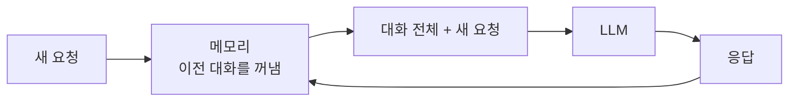
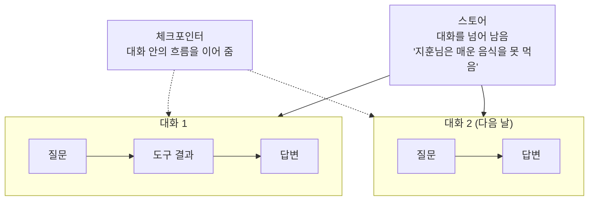

# 2.3 에이전트의 기억력: 메모리

> **공식 문서** — [LangGraph · Memory](https://docs.langchain.com/oss/python/langgraph/add-memory)

> **여기까지** — 판단(2.1)과 도구(2.2)로 에이전트가 일을 할 수 있게 됐습니다.
> **이 절의 질문** — **다음 요청에서 다 잊어버리는데** 어떻게 대화가 이어지지?
> **다 읽으면** — 8장 전체를 떠받치는 **두 단어**(체크포인터·스토어)를 잡게 됩니다.

## 다시 한번 — LLM에는 기억이 없습니다

[1.1절](../ch01_llm-decision/01-01_AI%20%EC%97%90%EC%9D%B4%EC%A0%84%ED%8A%B8%EC%9D%98%20%EB%91%90%EB%87%8C%2C%20%EA%B1%B0%EB%8C%80%20%EC%96%B8%EC%96%B4%20%EB%AA%A8%EB%8D%B8%EC%9D%98%20%EC%9D%B4%ED%95%B4.md)에서 이렇게 말했습니다.

> **LLM은 이전 대화를 기억하지 않습니다.** 매번 지금까지의 대화 전체를 다시 입력으로 받습니다.

이 문장이 이 절의 전부입니다. 눈으로 확인해 봅시다.

```
[요청 1]  사용자: 내 이름은 지훈이야
          → 모델에게 보낸 것: ["내 이름은 지훈이야"]
          모델: 반갑습니다 지훈님

[요청 2]  사용자: 내 이름이 뭐라고?
          → 모델에게 보낸 것: ["내 이름이 뭐라고?"]     ← 앞 대화가 없음!
          모델: 알 수 없습니다
```

**두 번째 요청은 첫 번째를 전혀 모릅니다.** 우리가 안 넣어 줬으니까요.

이름을 알게 하려면 **1번 대화를 다시 넣어야** 합니다.

```
[요청 2']  → 모델에게 보낸 것:
             ["내 이름은 지훈이야",
              "반갑습니다 지훈님",
              "내 이름이 뭐라고?"]      ← 전부 다시 넣음
           모델: 지훈님입니다
```

**이 "다시 넣어 주는 일"을 자동으로 해 주는 장치가 메모리입니다.**



> **그러니 "메모리를 붙인다"는 말은 정확히는 이런 뜻입니다.**
> **"무엇을 얼마나 다시 넣어 줄지 관리하는 장치를 붙인다."**

## 그런데 전부 넣으면 터집니다

대화가 길어지면 [1.1절](../ch01_llm-decision/01-01_AI%20%EC%97%90%EC%9D%B4%EC%A0%84%ED%8A%B8%EC%9D%98%20%EB%91%90%EB%87%8C%2C%20%EA%B1%B0%EB%8C%80%20%EC%96%B8%EC%96%B4%20%EB%AA%A8%EB%8D%B8%EC%9D%98%20%EC%9D%B4%ED%95%B4.md)의 **컨텍스트 윈도우**에 부딪힙니다.

**에이전트에서는 이게 훨씬 빨리 옵니다.** [2.2절](02-02_%EC%97%90%EC%9D%B4%EC%A0%84%ED%8A%B8%EC%9D%98%20%EC%99%B8%EB%B6%80%20%EC%A7%80%EC%8B%9D%20%ED%99%9C%EC%9A%A9%20-%20%EB%8F%84%EA%B5%AC%20%ED%98%B8%EC%B6%9C.md)에서 본 것처럼 **도구 호출 요청과 결과까지 전부 대화에 쌓이기** 때문입니다.

```
사용자 질문                    (작음)
도구 호출 요청                  (작음)
도구 결과 — 웹페이지 전문        ← 큼!
도구 호출 요청                  (작음)
도구 결과 — 검색 결과 10건       ← 큼!
...
```

**웹 검색 몇 번이면 금방 찹니다.**

그래서 메모리 설계는 **저장의 문제가 아니라 무엇을 버릴 것인가의 문제**입니다. 대응은 셋입니다.

| 방법 | 하는 일 | 잃는 것 |
| :--- | :--- | :--- |
| **최근 N개만 유지** | 오래된 대화를 잘라냄 | 앞부분 맥락 |
| **요약해서 압축** | 오래된 대화를 요약문 하나로 | 세부 사항 |
| **필요할 때만 꺼내기** | 관련 있는 것만 찾아서 넣음 | 검색이 놓치면 못 씀 |

**세 번째가 RAG와 같은 발상입니다.** 6.5절에서 **문서**에 대해 하는 일을, 8장에서는 **과거 대화**에 대해 합니다.

> **RAG(Retrieval-Augmented Generation)** — 우리말로 하면 **"찾아서 넣고 답하기"** 입니다. 모델 안에 없는 내용을 **밖에서 검색해 입력에 붙여 준 다음** 답하게 하는 방식입니다([1.1절](../ch01_llm-decision/01-01_AI%20%EC%97%90%EC%9D%B4%EC%A0%84%ED%8A%B8%EC%9D%98%20%EB%91%90%EB%87%8C%2C%20%EA%B1%B0%EB%8C%80%20%EC%96%B8%EC%96%B4%20%EB%AA%A8%EB%8D%B8%EC%9D%98%20%EC%9D%B4%ED%95%B4.md)의 환각 대책). **6.5절에서 직접 만듭니다.**

앞의 둘은 **8.3절**에서, 세 번째는 **8.4절**에서 실제로 만듭니다.

## 단기와 장기 — 자리가 다릅니다

에이전트 메모리는 **두 층**으로 나눠 생각합니다. 8장에서 실제 구현으로 만나므로 **여기서 이름만 잡아 둡니다.**

| | 단기 메모리 | 장기 메모리 |
| :--- | :--- | :--- |
| **범위** | **대화 하나 안에서** | **대화를 넘어서** |
| 예 | 방금 물어본 것, 직전 도구 결과 | 사용자의 이름·취향·과거 이력 |
| 사라지는 시점 | 대화가 끝나면 | 지우기 전까지 남음 |
| **랭그래프 용어** | **체크포인터(Checkpointer)** | **스토어(Store)** |
| 공식 문서 표현 | **thread-scoped** (대화 하나 범위) | **cross-thread** (대화를 가로지름) |
| **구분 열쇠** | **`thread_id`** | **네임스페이스** |
| 8장 실습 | 8.3절 | 8.4절 |

> **여기서 `thread`는 "대화 하나"를 뜻합니다.** 파이썬의 스레드(동시 실행)와는 **관계없습니다.** 게시판의 "댓글 스레드"에 가까운 뜻입니다.

> **문서를 찾을 때는 "단기/장기"가 아니라 `checkpointer`·`store`로 검색하세요.** 공식 문서는 그 이름으로 쓰여 있습니다.

### 무엇으로 갈리는지가 다릅니다

**체크포인터는 `thread_id`로 갈립니다.** 값을 바꾸면 **새 대화**가 시작됩니다.

```python
{"configurable": {"thread_id": "대화-1"}}   # 이어짐
{"configurable": {"thread_id": "대화-2"}}   # 처음부터
```

그래서 **"대화가 언제 끝나는가"는 개발자가 정하는 것**입니다. `thread_id`를 언제 새로 발급할지가 곧 그 답입니다. **자동으로 정해지지 않습니다.**

**스토어는 네임스페이스로 갈립니다.**

> **네임스페이스(namespace)** — **"이름이 겹치지 않게 나눠 둔 칸"** 입니다. 폴더를 떠올리면 됩니다. `사진/졸업식.jpg`와 `과제/졸업식.jpg`가 다른 파일인 것처럼요.

관례적으로 **사용자 구분자를 넣어** 씁니다.

```python
("memories", "user-1")   # 이 사람의 기억
("memories", "user-2")   # 다른 사람의 기억
```

> **`user_id`는 프레임워크가 정해 준 이름이 아닙니다.** 네임스페이스에 무엇을 넣을지는 우리가 정합니다. 사용자별로 나눌 수도, 팀별로 나눌 수도 있습니다.



> **용어가 헷갈리면 이것만 기억하세요.**
>
> - **체크포인터** = **하나의 대화**를 이어 붙이는 것
> - **스토어** = **여러 대화**에 걸쳐 남기는 것
>
> **8장 전체가 이 두 단어 위에 서 있습니다.**

## 메모리는 왜 "핵심 요소"인가

2장의 세 가지 요소를 한 줄로 놓아 봅시다.

| 요소 | 없으면 |
| :--- | :--- |
| **추론**(2.1) | 다음에 뭘 할지 **정하지 못함** |
| **도구**(2.2) | 정해도 **실행할 수단이 없음** |
| **메모리**(2.3) | 실행해도 **다음 턴에 잊어버림** |

**셋 중 하나만 빠져도 에이전트가 성립하지 않습니다.**

[1.1절](../ch01_llm-decision/01-01_AI%20%EC%97%90%EC%9D%B4%EC%A0%84%ED%8A%B8%EC%9D%98%20%EB%91%90%EB%87%8C%2C%20%EA%B1%B0%EB%8C%80%20%EC%96%B8%EC%96%B4%20%EB%AA%A8%EB%8D%B8%EC%9D%98%20%EC%9D%B4%ED%95%B4.md) 마지막에서 **"두뇌에 손발과 기억을 붙인 것이 에이전트"** 라고 했는데, 그 손발과 기억이 이 셋입니다.

## 요약 및 비유

**책상과 서랍**이 두 층을 잘 보여 줍니다.

책상 위 메모지는 그 일이 끝나면 버리고, **서랍의 파일은 계속 남습니다.**

| 개념 | 책상과 서랍 비유 | 기술적 의미 |
| :--- | :--- | :--- |
| **LLM에 기억이 없음** | 매일 아침 기억이 지워지는 직원 | 매 요청이 독립적 |
| **메모리** | 어제 메모를 다시 책상에 올려 줌 | 이전 대화를 재전송 |
| **단기 메모리** | 지금 작업 중인 책상 위 메모지 | 체크포인터 — 대화 하나 안 |
| **장기 메모리** | 서랍에 넣어 둔 고객 파일 | 스토어 — 대화를 넘어 |
| **컨텍스트 초과** | 책상이 좁아 더 못 올림 | 컨텍스트 윈도우 한도 |
| **자르기** | 오래된 메모부터 버림 | 최근 N개만 유지 |
| **요약** | 여러 장을 한 장으로 정리 | 대화 압축 |
| **필요할 때 꺼내기** | 서랍에서 관련 파일만 찾아 옴 | 검색 기반 회수 (RAG 발상) |

## 결론

* **LLM에는 기억이 없습니다.** 기억처럼 보이는 건 매 요청에 이전 대화를 **다시 넣어 주기 때문**입니다.
* 그래서 메모리 설계는 저장이 아니라 **"무엇을 얼마나 다시 넣을 것인가"** 의 문제입니다.
* 에이전트는 **도구 호출 요청과 결과까지 쌓이므로** 컨텍스트 한도에 훨씬 빨리 도달합니다.
* 대응은 셋 — **자르기 · 요약하기 · 필요할 때만 꺼내기.** 세 번째는 RAG와 같은 발상입니다.
* 메모리는 두 층입니다. **체크포인터 = 대화 하나 안(단기)**, **스토어 = 대화를 넘어(장기)**. **8장 전체가 이 구분 위에** 있습니다.
* **추론·도구·메모리 셋 중 하나만 빠져도** 에이전트가 되지 않습니다.

---

## 다음 절로

부품을 셋 다 봤습니다. **추론 · 도구 · 메모리.**

**그런데 부품을 안다고 조립이 되는 건 아니죠.**

이 셋을 실제로 어떻게 엮으면 에이전트가 될까요? 그리고 그게 그렇게 간단하다면 **랭그래프 같은 건 왜 필요할까요?** → **[2.4절](02-04_ReAct%20%EA%B8%B0%EB%B0%98%20LLM%20%EC%97%90%EC%9D%B4%EC%A0%84%ED%8A%B8.md)**

---

[⬅ 2.2](02-02_%EC%97%90%EC%9D%B4%EC%A0%84%ED%8A%B8%EC%9D%98%20%EC%99%B8%EB%B6%80%20%EC%A7%80%EC%8B%9D%20%ED%99%9C%EC%9A%A9%20-%20%EB%8F%84%EA%B5%AC%20%ED%98%B8%EC%B6%9C.md) · [Chapter 02](README.md) · [2.4 ➡](02-04_ReAct%20%EA%B8%B0%EB%B0%98%20LLM%20%EC%97%90%EC%9D%B4%EC%A0%84%ED%8A%B8.md)
