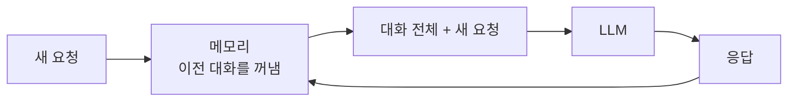
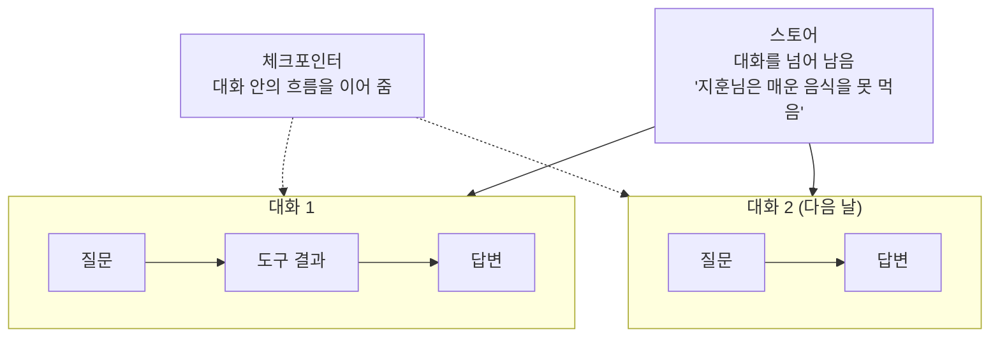

# 2.3 에이전트의 기억력: 메모리

> **공식 문서** — [LangGraph · Memory](https://docs.langchain.com/oss/python/langgraph/add-memory)

[1.1절](../ch01_llm-decision/01-01_AI%20%EC%97%90%EC%9D%B4%EC%A0%84%ED%8A%B8%EC%9D%98%20%EB%91%90%EB%87%8C%2C%20%EA%B1%B0%EB%8C%80%20%EC%96%B8%EC%96%B4%20%EB%AA%A8%EB%8D%B8%EC%9D%98%20%EC%9D%B4%ED%95%B4.md)에서 이렇게 말했습니다.

> LLM은 이전 대화를 기억하지 않습니다. 매번 지금까지의 대화 전체를 다시 입력으로 받습니다.

이 문장이 이 절의 전부입니다. **LLM에는 기억이 없습니다.** 있는 것처럼 보이는 건 우리가 매번 다시 넣어 주고 있기 때문입니다.

그러니 "에이전트에 메모리를 붙인다"는 말은 정확히는 **"무엇을 얼마나 다시 넣어 줄지 관리한다"** 는 뜻입니다.

## 기억이 없다는 것을 눈으로 보기

```
[요청 1]  사용자: 내 이름은 지훈이야
          → 모델에게 보낸 것: ["내 이름은 지훈이야"]
          모델: 반갑습니다 지훈님

[요청 2]  사용자: 내 이름이 뭐라고?
          → 모델에게 보낸 것: ["내 이름이 뭐라고?"]        ← 앞 대화가 없음
          모델: 알 수 없습니다
```

두 번째 요청에 이름을 알려면 **1번 대화를 다시 넣어야** 합니다.

```
[요청 2']  → 모델에게 보낸 것:
             ["내 이름은 지훈이야",
              "반갑습니다 지훈님",
              "내 이름이 뭐라고?"]
           모델: 지훈님입니다
```

이 "다시 넣어 주는 일"을 자동으로 해 주는 장치가 메모리입니다.



## 그런데 전부 넣으면 터집니다

대화가 길어지면 [1.1절](../ch01_llm-decision/01-01_AI%20%EC%97%90%EC%9D%B4%EC%A0%84%ED%8A%B8%EC%9D%98%20%EB%91%90%EB%87%8C%2C%20%EA%B1%B0%EB%8C%80%20%EC%96%B8%EC%96%B4%20%EB%AA%A8%EB%8D%B8%EC%9D%98%20%EC%9D%B4%ED%95%B4.md)의 **컨텍스트 윈도우**에 부딪힙니다. 에이전트에서는 이게 더 빨리 옵니다. [2.2절](02-02_%EC%97%90%EC%9D%B4%EC%A0%84%ED%8A%B8%EC%9D%98%20%EC%99%B8%EB%B6%80%20%EC%A7%80%EC%8B%9D%20%ED%99%9C%EC%9A%A9%20-%20%EB%8F%84%EA%B5%AC%20%ED%98%B8%EC%B6%9C.md)에서 본 것처럼 **도구 호출 요청과 결과까지 전부 대화에 쌓이기** 때문입니다.

```
사용자 질문                    (작음)
도구 호출 요청                  (작음)
도구 결과 — 웹페이지 전문        (큼!)
도구 호출 요청                  (작음)
도구 결과 — 검색 결과 10건       (큼!)
...
```

웹 검색 몇 번이면 금방 찹니다. 그래서 메모리는 **저장**의 문제가 아니라 **무엇을 버릴 것인가**의 문제입니다.

| 방법 | 하는 일 | 잃는 것 |
| :--- | :--- | :--- |
| **최근 N개만 유지** | 오래된 대화를 잘라냄 | 앞부분 맥락 |
| **요약해서 압축** | 오래된 대화를 요약문 하나로 | 세부 사항 |
| **필요할 때만 꺼내기** | 관련 있는 것만 검색해서 넣음 | 검색이 놓치면 못 씀 |

세 번째가 **RAG와 같은 발상**입니다. 6.5절에서 문서에 대해 하는 일을, 8장에서는 과거 대화에 대해 합니다.

## 단기와 장기 — 자리가 다릅니다

에이전트 메모리는 두 층으로 나눠 생각합니다. 8장에서 실제 구현으로 만나는 구분이라 여기서 이름을 잡아 둡니다.

| | 단기 메모리 | 장기 메모리 |
| :--- | :--- | :--- |
| 범위 | **대화 하나 안에서** | **대화를 넘어서** |
| 예 | 방금 물어본 것, 직전 도구 결과 | 사용자의 이름·취향·과거 이력 |
| 사라지는 시점 | 대화가 끝나면 | 지우기 전까지 남음 |
| 랭그래프 용어 | **체크포인터(Checkpointer)** | **스토어(Store)** |
| 8장 실습 | 8.3절 | 8.4절 |



> **용어가 헷갈리면 이것만 기억하세요.** 체크포인터는 **하나의 대화를 이어 붙이는 것**, 스토어는 **여러 대화에 걸쳐 남기는 것**입니다. 8장 전체가 이 두 단어 위에 서 있습니다.

## 메모리는 왜 "핵심 요소"인가

2장의 세 가지 요소를 한 줄로 놓으면 이렇습니다.

| 요소 | 없으면 |
| :--- | :--- |
| **추론**(2.1) | 다음에 뭘 할지 정하지 못함 |
| **도구**(2.2) | 정해도 실행할 수단이 없음 |
| **메모리**(2.3) | 실행해도 다음 턴에 잊어버림 |

셋 중 하나만 빠져도 에이전트가 성립하지 않습니다. [1.1절](../ch01_llm-decision/01-01_AI%20%EC%97%90%EC%9D%B4%EC%A0%84%ED%8A%B8%EC%9D%98%20%EB%91%90%EB%87%8C%2C%20%EA%B1%B0%EB%8C%80%20%EC%96%B8%EC%96%B4%20%EB%AA%A8%EB%8D%B8%EC%9D%98%20%EC%9D%B4%ED%95%B4.md) 마지막에서 "두뇌에 손발과 기억을 붙인 것이 에이전트"라고 한 것이 이 셋입니다.

## 요약 및 비유

**책상과 서랍**이 두 층을 잘 보여 줍니다. 책상 위 메모지는 그 일이 끝나면 버리고, 서랍의 파일은 계속 남습니다.

| 개념 | 책상과 서랍 비유 | 기술적 의미 |
| :--- | :--- | :--- |
| **LLM에 기억이 없음** | 매일 아침 기억이 지워지는 직원 | 매 요청이 독립적 |
| **메모리** | 어제 메모를 다시 책상에 올려 줌 | 이전 대화를 재전송 |
| **단기 메모리** | 지금 작업 중인 책상 위 메모지 | 체크포인터 — 대화 하나 안 |
| **장기 메모리** | 서랍에 넣어 둔 고객 파일 | 스토어 — 대화를 넘어 |
| **컨텍스트 초과** | 책상이 좁아 더 못 올림 | 컨텍스트 윈도우 한도 |
| **자르기** | 오래된 메모부터 버림 | 최근 N개만 유지 |
| **요약** | 여러 장을 한 장으로 정리 | 대화 압축 |
| **필요할 때 꺼내기** | 서랍에서 관련 파일만 찾아 옴 | 검색 기반 회수 (RAG 발상) |

## 결론

* **LLM에는 기억이 없습니다.** 기억처럼 보이는 것은 매 요청에 이전 대화를 다시 넣어 주기 때문입니다.
* 그래서 메모리 설계는 저장이 아니라 **"무엇을 얼마나 다시 넣을 것인가"** 의 문제입니다.
* 에이전트는 **도구 호출 요청과 결과까지 대화에 쌓이므로** 컨텍스트 한도에 훨씬 빨리 도달합니다.
* 대응은 세 가지입니다 — **자르기 · 요약하기 · 필요할 때만 꺼내기.** 세 번째는 RAG와 같은 발상입니다.
* 메모리는 두 층입니다. **체크포인터 = 대화 하나 안(단기)**, **스토어 = 대화를 넘어(장기)**. 8장 전체가 이 구분 위에 있습니다.
* 추론·도구·메모리 셋 중 하나만 빠져도 에이전트가 되지 않습니다.

---

[⬅ 2.2](02-02_%EC%97%90%EC%9D%B4%EC%A0%84%ED%8A%B8%EC%9D%98%20%EC%99%B8%EB%B6%80%20%EC%A7%80%EC%8B%9D%20%ED%99%9C%EC%9A%A9%20-%20%EB%8F%84%EA%B5%AC%20%ED%98%B8%EC%B6%9C.md) · [Chapter 02](README.md) · [2.4 ➡](02-04_ReAct%20%EA%B8%B0%EB%B0%98%20LLM%20%EC%97%90%EC%9D%B4%EC%A0%84%ED%8A%B8.md)
