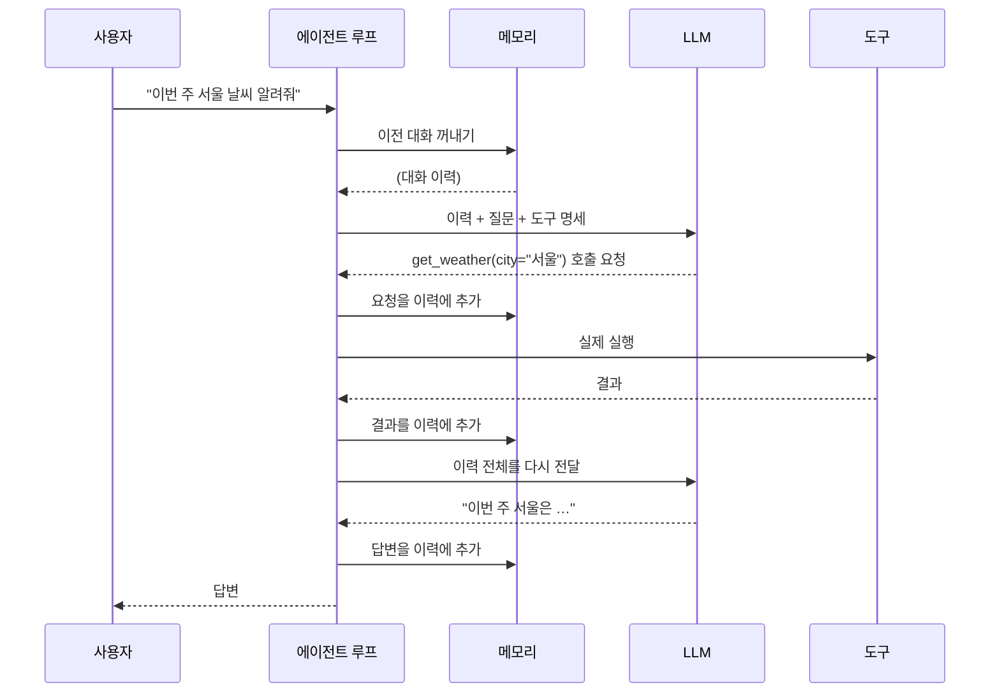
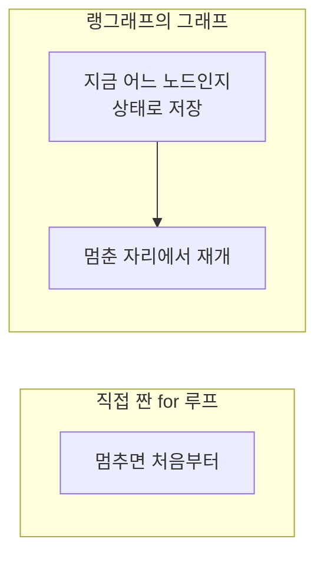

# 2.4 ReAct 기반 LLM 에이전트

> **공식 문서** — [LangChain · Agents](https://docs.langchain.com/oss/python/langchain/agents)

앞의 세 절에서 부품을 하나씩 봤습니다. 이제 조립합니다.

| 절 | 부품 | 역할 |
| :--- | :--- | :--- |
| [2.1](02-01_%EC%97%90%EC%9D%B4%EC%A0%84%ED%8A%B8%EC%9D%98%20%EC%B6%94%EB%A1%A0%20%EB%8A%A5%EB%A0%A5%20-%20ReAct%EC%99%80%20Reflection.md) | 추론 | 다음에 무엇을 할지 정한다 |
| [2.2](02-02_%EC%97%90%EC%9D%B4%EC%A0%84%ED%8A%B8%EC%9D%98%20%EC%99%B8%EB%B6%80%20%EC%A7%80%EC%8B%9D%20%ED%99%9C%EC%9A%A9%20-%20%EB%8F%84%EA%B5%AC%20%ED%98%B8%EC%B6%9C.md) | 도구 | 정한 것을 실행한다 |
| [2.3](02-03_%EC%97%90%EC%9D%B4%EC%A0%84%ED%8A%B8%EC%9D%98%20%EA%B8%B0%EC%96%B5%EB%A0%A5%20-%20%EB%A9%94%EB%AA%A8%EB%A6%AC.md) | 메모리 | 한 일을 다음 판단에 다시 넣는다 |

## 전체 흐름



**LLM이 두 번 불린다는 점**을 다시 확인하세요. 한 번은 "무엇을 할지" 정하려고, 한 번은 "결과를 보고 답하려고". [1.3절](../ch01_llm-decision/01-03_LLM%EC%9D%B4%20%EB%8B%A4%EC%9D%8C%20%ED%96%89%EB%8F%99%EC%9D%84%20%EA%B2%B0%EC%A0%95%ED%95%98%EB%8B%A4.md)의 그림에 메모리가 하나 더 붙었을 뿐입니다.

## 코드로 보면 이 정도입니다

프레임워크 없이 직접 짜면 뼈대가 이렇게 됩니다. 개념을 눈으로 보기 위한 의사 코드입니다.

```python
history = memory.load(session_id)      # 2.3 메모리
history.append(user_message)

for step in range(MAX_STEPS):          # 무한 루프 방지
    response = llm.invoke(
        messages=history,
        tools=[spec(t) for t in tools],  # 2.2 도구 명세
    )
    history.append(response)

    if not response.tool_calls:         # 더 부를 도구가 없으면
        break                           # 종료 — 이게 2.1의 "충분하다"

    for call in response.tool_calls:    # 2.1 Action
        try:
            result = tools[call.name](**call.args)
        except Exception as e:
            result = f"오류: {e}"       # 2.2 — 에러도 관찰로 돌려준다
        history.append(tool_message(result))   # 2.1 Observation

memory.save(session_id, history)
```

스무 줄 남짓입니다. **에이전트의 본체는 생각보다 단순합니다.**

> 이 코드는 **구조를 보기 위한 것이고 실행하지 않았습니다.** 실제로 동작하는 코드는 6.1절부터 나옵니다.

## 그런데 왜 프레임워크를 쓰나

위 스무 줄이 전부라면 랭그래프가 왜 필요할까요. **빠진 것들이 많기 때문**입니다.

| 빠진 것 | 직접 하면 | 배우는 곳 |
| :--- | :--- | :--- |
| 중간에 멈추고 사람 승인 받기 | 루프를 쪼개고 상태를 어딘가 저장해야 함 | 5장 · 11장 |
| 실패한 지점부터 다시 시작 | 어디까지 갔는지 기록해 둬야 함 | 5장 (체크포인트) |
| 진행 상황을 실시간으로 보여 주기 | 루프 안에서 이벤트를 흘려보내야 함 | 6장 (스트리밍) |
| 대화가 길어질 때 잘라내기 | 자르는 규칙을 직접 구현 | 8장 |
| 에이전트 여러 개를 엮기 | 서로 호출하고 결과를 합치는 배선 | 7장 |
| 지금 무슨 일이 일어났는지 추적 | 로그를 직접 심어야 함 | 6장 (LangSmith) |

특히 **"멈췄다가 다시 시작하기"** 가 직접 만들기 어렵습니다. 위 코드는 `for` 루프라서 중간에 멈추면 처음부터 다시입니다. 랭그래프가 루프 대신 **그래프**를 쓰는 이유가 여기 있습니다 — 그래프는 지금 어느 노드에 있는지를 상태로 들고 있을 수 있으니까요.



**5장이 바로 이 이야기**입니다. 왜 루프가 아니라 그래프인가.

## 2장에서 3장으로

여기까지가 **에이전트 하나**입니다. 3장은 질문을 하나 더 던집니다.

> 이 에이전트에 도구를 20개 붙일 것인가, 아니면 에이전트를 여러 개 만들어 나눠 가질 것인가?

[2.2절](02-02_%EC%97%90%EC%9D%B4%EC%A0%84%ED%8A%B8%EC%9D%98%20%EC%99%B8%EB%B6%80%20%EC%A7%80%EC%8B%9D%20%ED%99%9C%EC%9A%A9%20-%20%EB%8F%84%EA%B5%AC%20%ED%98%B8%EC%B6%9C.md)에서 도구가 많아지면 선택 정확도가 떨어진다고 했습니다. 그 문제의 답이 3장의 멀티 에이전트입니다.

## 요약 및 비유

**자전거 조립**과 같습니다. 부품을 다 알아도 굴러가려면 연결이 맞아야 하고, 실제로 타려면 브레이크·기어처럼 안 보이던 것들이 더 필요해집니다.

| 개념 | 자전거 비유 | 기술적 의미 |
| :--- | :--- | :--- |
| **추론** | 어디로 갈지 정하는 사람 | 다음 행동 결정 (2.1) |
| **도구** | 페달과 바퀴 | 실제 실행 수단 (2.2) |
| **메모리** | 지금까지 온 길 | 이력을 다시 입력에 (2.3) |
| **에이전트 루프** | 밟고 → 굴러가고 → 다시 밟고 | 20줄짜리 반복문 |
| **종료 조건** | 목적지 도착 | 부를 도구가 없을 때 |
| **최대 반복** | 체력 한계 | MAX_STEPS |
| **프레임워크** | 브레이크·기어·계기판 | 중단·재개·추적·스트리밍 |
| **for 루프의 한계** | 멈추면 출발점으로 되돌아감 | 상태를 못 들고 있음 |
| **그래프** | 어디쯤 왔는지 아는 내비게이션 | 노드 단위 상태 저장 (5장) |

## 결론

* ReAct 기반 에이전트는 **추론 · 도구 · 메모리를 하나의 루프로 엮은 것**입니다. 뼈대는 스무 줄 남짓으로 단순합니다.
* 한 번의 요청에 **LLM은 최소 두 번 불립니다** — 무엇을 할지 정할 때, 결과를 보고 답할 때.
* 종료 조건은 **"모델이 더 이상 도구를 부르지 않을 때"** 이고, 안전장치로 최대 반복 횟수를 둡니다.
* 프레임워크가 필요한 이유는 루프 자체가 어려워서가 아니라 **중단·재개·추적·스트리밍·다중 에이전트 배선**이 필요해서입니다.
* 특히 **for 루프는 멈추면 처음부터**입니다. 랭그래프가 그래프를 쓰는 이유이고, 5장의 주제입니다.
* 도구를 더 붙일 것인가 에이전트를 나눌 것인가 — 이 질문이 3장으로 이어집니다.

---

[⬅ 2.3](02-03_%EC%97%90%EC%9D%B4%EC%A0%84%ED%8A%B8%EC%9D%98%20%EA%B8%B0%EC%96%B5%EB%A0%A5%20-%20%EB%A9%94%EB%AA%A8%EB%A6%AC.md) · [Chapter 02](README.md) · [전체 목차](../STUDY.md)
