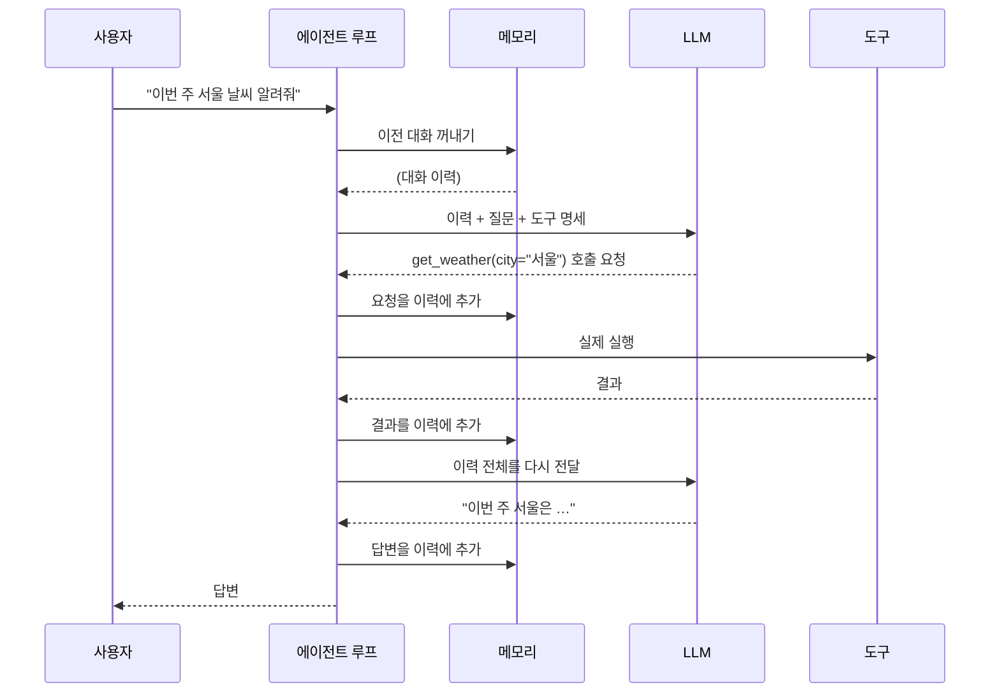
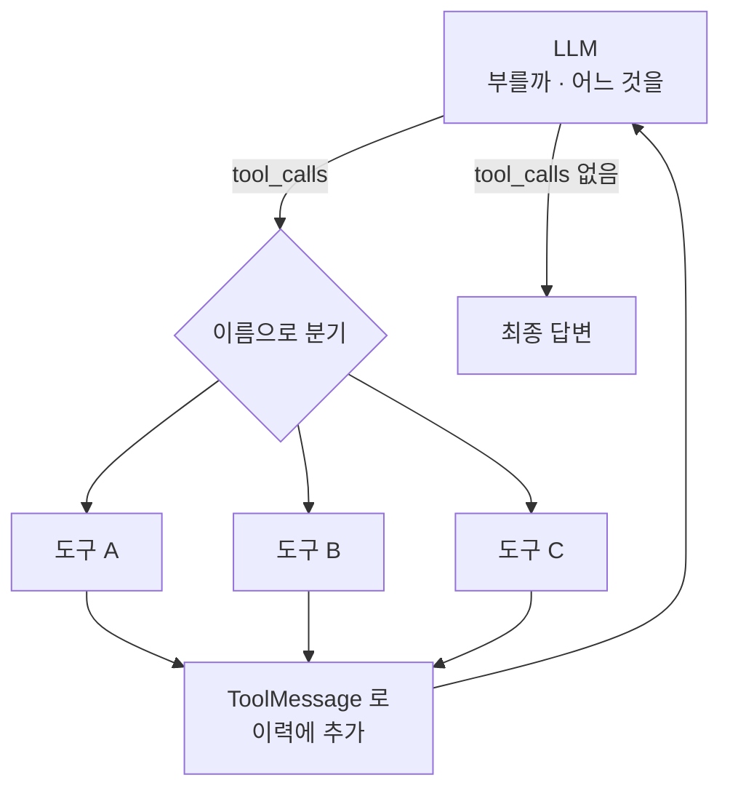
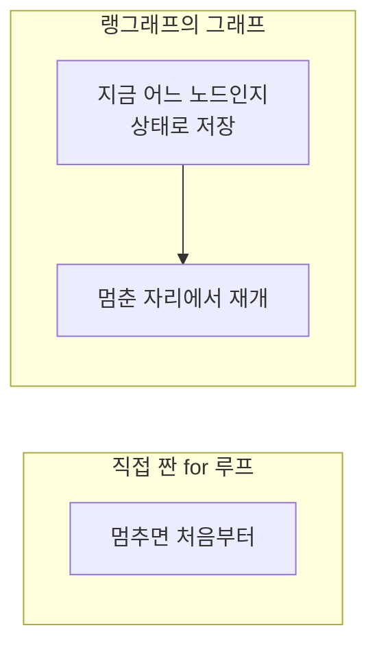

# 2.4 ReAct 기반 LLM 에이전트

> **공식 문서** — [LangChain · Agents](https://docs.langchain.com/oss/python/langchain/agents)

> **여기까지** — 부품 셋을 봤습니다. **추론**(2.1) · **도구**(2.2) · **메모리**(2.3).
> **이 절의 질문** — 이 셋을 **어떻게 엮으면** 에이전트가 되지? 그리고 **랭그래프는 왜 필요하지?**
> **다 읽으면** — 에이전트의 본체가 **생각보다 단순하다**는 것과, 그럼에도 프레임워크가 필요한 이유를 알게 됩니다. 5장의 출발점입니다.

## 부품을 조립합니다

| 절 | 부품 | 역할 |
| :--- | :--- | :--- |
| [2.1](02-01_%EC%97%90%EC%9D%B4%EC%A0%84%ED%8A%B8%EC%9D%98%20%EC%B6%94%EB%A1%A0%20%EB%8A%A5%EB%A0%A5%20-%20ReAct%EC%99%80%20Reflection.md) | **추론** | 다음에 무엇을 할지 정한다 |
| [2.2](02-02_%EC%97%90%EC%9D%B4%EC%A0%84%ED%8A%B8%EC%9D%98%20%EC%99%B8%EB%B6%80%20%EC%A7%80%EC%8B%9D%20%ED%99%9C%EC%9A%A9%20-%20%EB%8F%84%EA%B5%AC%20%ED%98%B8%EC%B6%9C.md) | **도구** | 정한 것을 실행한다 |
| [2.3](02-03_%EC%97%90%EC%9D%B4%EC%A0%84%ED%8A%B8%EC%9D%98%20%EA%B8%B0%EC%96%B5%EB%A0%A5%20-%20%EB%A9%94%EB%AA%A8%EB%A6%AC.md) | **메모리** | 한 일을 다음 판단에 다시 넣는다 |

## 전체 흐름



**LLM이 두 번 불린다**는 걸 다시 확인하세요.

| 몇 번째 | 무엇을 하려고 |
| :--- | :--- |
| 첫 번째 | 무엇을 할지 정하려고 |
| 두 번째 | 결과를 보고 답을 만들려고 |

[1.3절](../ch01_llm-decision/01-03_LLM%EC%9D%B4%20%EB%8B%A4%EC%9D%8C%20%ED%96%89%EB%8F%99%EC%9D%84%20%EA%B2%B0%EC%A0%95%ED%95%98%EB%8B%A4.md)의 그림에 **메모리가 하나 더 붙었을 뿐**입니다.

### 도구를 여러 개 주면 무엇이 달라지나

위 그림은 도구가 하나일 때입니다. **둘 이상 주면 LLM이 판단해야 할 범위가 늘어납니다** — "부를까 말까"에 **"셋 중 어느 것을"** 이 얹힙니다.



**루프의 모양은 그대로입니다.** 늘어나는 건 **가운데 갈림길의 가짓수**뿐입니다. 코드도 거의 안 바뀝니다 — `tool_calls`의 이름을 보고 맞는 함수를 부르면 되니까요.

**바뀌는 건 정확도입니다.** 고를 것이 많아질수록 [2.2절](02-02_%EC%97%90%EC%9D%B4%EC%A0%84%ED%8A%B8%EC%9D%98%20%EC%99%B8%EB%B6%80%20%EC%A7%80%EC%8B%9D%20%ED%99%9C%EC%9A%A9%20-%20%EB%8F%84%EA%B5%AC%20%ED%98%B8%EC%B6%9C.md)에서 본 **설명(description)의 품질**이 결과를 좌우하게 됩니다. 이 절 아래 "2장에서 3장으로"의 질문이 여기서 나옵니다.

## 코드로 보면 이 정도입니다

프레임워크 없이 직접 짜면 뼈대가 이렇게 됩니다.

```python
history = memory.load(session_id)        # 2.3 메모리
history.append(user_message)

for step in range(MAX_STEPS):            # 무한 루프 방지
    response = llm.invoke(
        messages=history,
        tools=[spec(t) for t in tools],  # 2.2 도구 명세
    )
    history.append(response)

    if not response.tool_calls:          # 더 부를 도구가 없으면
        break                            # 종료 — 2.1의 "충분하다"

    for call in response.tool_calls:     # 2.1 Action
        try:
            result = tools[call.name](**call.args)
        except Exception as e:
            result = f"오류: {e}"        # 2.2 — 에러도 관찰로 돌려준다
        history.append(tool_message(result))   # 2.1 Observation

memory.save(session_id, history)
```

**스무 줄 남짓입니다.**

> **에이전트의 본체는 생각보다 단순합니다.** 여기까지 읽고 "이게 다야?" 싶다면 제대로 이해하신 겁니다.
>
> 이 코드는 **구조를 보기 위한 것이고 실행하지 않았습니다.** 실제로 동작하는 코드는 **6.1절**부터 나옵니다.

읽는 법은 이렇습니다.

| 코드 | 어느 절 |
| :--- | :--- |
| `memory.load` / `memory.save` | 2.3 메모리 |
| `tools=[spec(t) for t in tools]` | 2.2 도구 명세 (본문이 아니라 명세) |
| `if not response.tool_calls: break` | 2.1 "충분하다" — 종료 판단 |
| `tools[call.name](**call.args)` | 2.1 Action — **프로그램이 실행** |
| `history.append(tool_message(...))` | 2.1 Observation |
| `range(MAX_STEPS)` | 무한 루프 방지 (1.3절) |

## 그런데 왜 프레임워크를 쓰나

위 스무 줄이 전부라면 **랭그래프는 왜 필요할까요?**

**빠진 것들이 많기 때문**입니다.

| 빠진 것 | 직접 하려면 | 배우는 곳 |
| :--- | :--- | :--- |
| 중간에 멈추고 **사람 승인** 받기 | 루프를 쪼개고 상태를 어딘가 저장 | 5장 · 11장 |
| **실패한 지점부터** 다시 시작 | 어디까지 갔는지 기록해야 함 | 5장 |
| 진행 상황을 **실시간으로** 보여 주기 | 루프 안에서 이벤트를 흘려보내야 함 | 6장 |
| 대화가 길어질 때 **잘라내기** | 자르는 규칙을 직접 구현 | 8장 |
| **에이전트 여러 개**를 엮기 | 서로 호출하고 결과를 합치는 배선 | 7장 |
| 무슨 일이 일어났는지 **추적** | 로그를 직접 심어야 함 | 6장 |

### 특히 "멈췄다가 다시 시작하기"가 어렵습니다

위 코드는 **`for` 루프**입니다. 그래서 이런 문제가 있습니다.

> **중간에 멈추면 처음부터 다시 해야 합니다.**

진행 상황이 `history`라는 **지역 변수**에만 있으니까요. 프로그램이 죽으면 같이 사라집니다.

랭그래프가 루프 대신 **그래프**를 쓰는 이유가 여기 있습니다. 그래프는 **지금 어느 노드에 있는지를 상태로 들고 있을 수** 있습니다.



**5장이 바로 이 이야기입니다.** 왜 루프가 아니라 그래프인가.

## 2장에서 3장으로

여기까지가 **에이전트 하나**입니다. 3장은 질문을 하나 더 던집니다.

> 이 에이전트에 도구를 **20개 붙일 것인가**, 아니면 **에이전트를 여러 개 만들어 나눠 가질 것인가?**

[2.2절](02-02_%EC%97%90%EC%9D%B4%EC%A0%84%ED%8A%B8%EC%9D%98%20%EC%99%B8%EB%B6%80%20%EC%A7%80%EC%8B%9D%20%ED%99%9C%EC%9A%A9%20-%20%EB%8F%84%EA%B5%AC%20%ED%98%B8%EC%B6%9C.md)에서 **도구가 많아지면 선택 정확도가 떨어진다**고 했습니다. 그 문제의 답이 3장의 멀티 에이전트입니다.

## 요약 및 비유

**자전거 조립**과 같습니다.

부품을 다 알아도 굴러가려면 **연결이 맞아야** 하고, 실제로 도로에 나가려면 **브레이크·기어처럼 안 보이던 것들**이 더 필요해집니다.

| 개념 | 자전거 비유 | 기술적 의미 |
| :--- | :--- | :--- |
| **추론** | 어디로 갈지 정하는 사람 | 다음 행동 결정 (2.1) |
| **도구** | 페달과 바퀴 | 실제 실행 수단 (2.2) |
| **메모리** | 지금까지 온 길 | 이력을 다시 입력에 (2.3) |
| **에이전트 루프** | 밟고 → 굴러가고 → 다시 밟고 | 20줄짜리 반복문 |
| **종료 조건** | 목적지 도착 | 부를 도구가 없을 때 |
| **최대 반복** | 체력 한계 | `MAX_STEPS` |
| **프레임워크** | 브레이크·기어·계기판 | 중단·재개·추적·스트리밍 |
| **`for` 루프의 한계** | 멈추면 출발점으로 되돌아감 | 상태를 못 들고 있음 |
| **그래프** | 어디쯤 왔는지 아는 내비게이션 | 노드 단위 상태 저장 (5장) |

## 결론

* ReAct 기반 에이전트는 **추론 · 도구 · 메모리를 하나의 루프로 엮은 것**입니다. **뼈대는 스무 줄 남짓**으로 단순합니다.
* 한 번의 요청에 **LLM은 최소 두 번** 불립니다 — 무엇을 할지 정할 때, 결과를 보고 답할 때.
* 종료 조건은 **"모델이 더 이상 도구를 부르지 않을 때"** 이고, 안전장치로 최대 반복 횟수를 둡니다.
* 프레임워크가 필요한 이유는 **루프 자체가 어려워서가 아닙니다.** 중단·재개·추적·스트리밍·다중 에이전트 배선이 필요해서입니다.
* 특히 **`for` 루프는 멈추면 처음부터**입니다. 진행 상황이 지역 변수에만 있으니까요. **랭그래프가 그래프를 쓰는 이유**이고 5장의 주제입니다.
* 도구를 더 붙일 것인가 에이전트를 나눌 것인가 — 이 질문이 **3장**으로 이어집니다.

---

## 2장을 마치며

네 개 절을 한 줄로 이으면 이렇습니다.

> **1장의 루프에 ReAct라는 이름이 붙었고(2.1) → 그 Action 자리의 도구가 실은 "설명서"임을 알았고(2.2) → 기억이 없다는 사실과 두 층의 메모리를 잡았고(2.3) → 셋을 스무 줄로 조립해 봤습니다(2.4).**

**3장에서는** 이 에이전트를 **하나로 둘지 여럿으로 나눌지** 고르는 기준을 세웁니다. 1.4절에서 세운 "미리 그릴 수 있는가"라는 축이 **다시 한번** 나옵니다.

---

[⬅ 2.3](02-03_%EC%97%90%EC%9D%B4%EC%A0%84%ED%8A%B8%EC%9D%98%20%EA%B8%B0%EC%96%B5%EB%A0%A5%20-%20%EB%A9%94%EB%AA%A8%EB%A6%AC.md) · [Chapter 02](README.md) · [전체 목차](../STUDY.md)
