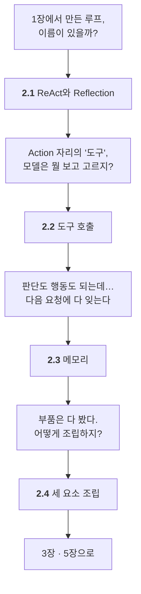

# Chapter 02 · AI 에이전트를 구성하는 3가지 핵심 요소

> Part 01 | AI 에이전트의 개념과 원리

## 학습 목표

- ReAct와 Reflection 추론 패턴의 동작 방식과 차이를 설명할 수 있다
- 도구 호출(tool calling)이 왜 필요한지, 어떤 정보가 LLM에 전달되는지 이해한다
- 에이전트 메모리의 역할을 이해하고 8장 학습의 밑그림을 그린다

## 이 장의 이해 흐름

1장에서 만든 **루프를 뜯어보는 장**입니다. 한 절이 남긴 질문을 다음 절이 풉니다.

| 절 | 이 절의 질문 | 얻는 것 |
| :--- | :--- | :--- |
| **2.1** | 그 루프에 이름이 있을까? 그걸로 충분할까? | **ReAct**와 **Reflection**의 차이 |
| **2.2** | 모델은 함수 안을 못 보는데 뭘 보고 고르지? | 도구는 **함수가 아니라 설명서** |
| **2.3** | 다음 요청에 다 잊는데 어떻게 이어지지? | **체크포인터**와 **스토어** |
| **2.4** | 셋을 어떻게 엮지? 프레임워크는 왜 필요하지? | 20줄짜리 루프와 **그 한계** |

### 2장 전체를 한 줄로

> **1장의 루프에 ReAct라는 이름이 붙었고(2.1) → Action 자리의 도구가 실은 "설명서"임을 알았고(2.2) → 기억이 없다는 사실과 두 층의 메모리를 잡았고(2.3) → 셋을 스무 줄로 조립해 봤다(2.4).**

## 절별 노트

| 절 | 노트 파일 | 진도 |
| --- | --- | --- |
| 2.1 | [`02-01_에이전트의 추론 능력 - ReAct와 Reflection.md`](02-01_%EC%97%90%EC%9D%B4%EC%A0%84%ED%8A%B8%EC%9D%98%20%EC%B6%94%EB%A1%A0%20%EB%8A%A5%EB%A0%A5%20-%20ReAct%EC%99%80%20Reflection.md) | ☐ |
| 2.2 | [`02-02_에이전트의 외부 지식 활용 - 도구 호출.md`](02-02_%EC%97%90%EC%9D%B4%EC%A0%84%ED%8A%B8%EC%9D%98%20%EC%99%B8%EB%B6%80%20%EC%A7%80%EC%8B%9D%20%ED%99%9C%EC%9A%A9%20-%20%EB%8F%84%EA%B5%AC%20%ED%98%B8%EC%B6%9C.md) | ☐ |
| 2.3 | [`02-03_에이전트의 기억력 - 메모리.md`](02-03_%EC%97%90%EC%9D%B4%EC%A0%84%ED%8A%B8%EC%9D%98%20%EA%B8%B0%EC%96%B5%EB%A0%A5%20-%20%EB%A9%94%EB%AA%A8%EB%A6%AC.md) | ☐ |
| 2.4 | [`02-04_ReAct 기반 LLM 에이전트.md`](02-04_ReAct%20%EA%B8%B0%EB%B0%98%20LLM%20%EC%97%90%EC%9D%B4%EC%A0%84%ED%8A%B8.md) | ☐ |

소절까지 펼쳐보기

- [ ] **[2.1 에이전트의 추론 능력: ReAct와 Reflection](02-01_%EC%97%90%EC%9D%B4%EC%A0%84%ED%8A%B8%EC%9D%98%20%EC%B6%94%EB%A1%A0%20%EB%8A%A5%EB%A0%A5%20-%20ReAct%EC%99%80%20Reflection.md)**
  - [ ] 2.1.1 ReAct
  - [ ] 2.1.2 Reflection
- [ ] **[2.2 에이전트의 외부 지식 활용: 도구 호출](02-02_%EC%97%90%EC%9D%B4%EC%A0%84%ED%8A%B8%EC%9D%98%20%EC%99%B8%EB%B6%80%20%EC%A7%80%EC%8B%9D%20%ED%99%9C%EC%9A%A9%20-%20%EB%8F%84%EA%B5%AC%20%ED%98%B8%EC%B6%9C.md)**
- [ ] **[2.3 에이전트의 기억력: 메모리](02-03_%EC%97%90%EC%9D%B4%EC%A0%84%ED%8A%B8%EC%9D%98%20%EA%B8%B0%EC%96%B5%EB%A0%A5%20-%20%EB%A9%94%EB%AA%A8%EB%A6%AC.md)**
- [ ] **[2.4 ReAct 기반 LLM 에이전트](02-04_ReAct%20%EA%B8%B0%EB%B0%98%20LLM%20%EC%97%90%EC%9D%B4%EC%A0%84%ED%8A%B8.md)**

## 관련 예제 코드

이 장은 개념 설명 중심이라 저장소에 대응하는 예제 코드가 없습니다.

## 참고 문서

| 무엇을 볼 때 | 문서 |
| --- | --- |
| 2.1 ReAct — 원 논문 | [ReAct: Synergizing Reasoning and Acting in Language Models](https://arxiv.org/abs/2210.03629) |
| 2.1 Reflection — 원 논문 | [Reflexion: Language Agents with Verbal Reinforcement Learning](https://arxiv.org/abs/2303.11366) |
| 2.2 도구 호출 | [LangChain · Tools](https://docs.langchain.com/oss/python/langchain/tools) |
| 2.3 메모리 개념 | [LangGraph · Memory](https://docs.langchain.com/oss/python/langgraph/add-memory) |
| 2.4 ReAct 루프의 실제 구현 | [LangChain · Agents](https://docs.langchain.com/oss/python/langchain/agents) |

> ReAct/Reflection은 논문이 짧고 그림이 명확합니다. 2차 자료보다 원문이 빠릅니다.

## 이 폴더 구성

- `02-01_…md` ~ `02-04_…md` — 절별 학습 노트
- `notes.md` — 장 전체 요약 (절 노트를 다 쓴 뒤 마지막에 정리)
- `practice/` — 예제를 보지 않고 직접 쳐보는 공간

> **메모**  
> 개념 위주의 장입니다. 추론·도구·메모리 세 축을 한 장으로 정리해두면 6~8장에서 계속 되돌아보게 됩니다.

---

[⬅ 전체 목차로](../STUDY.md)
