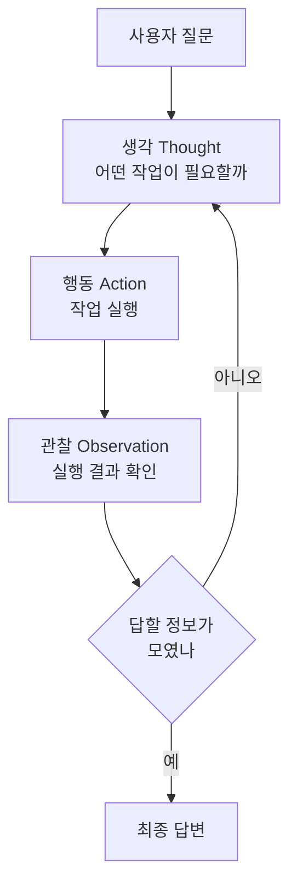
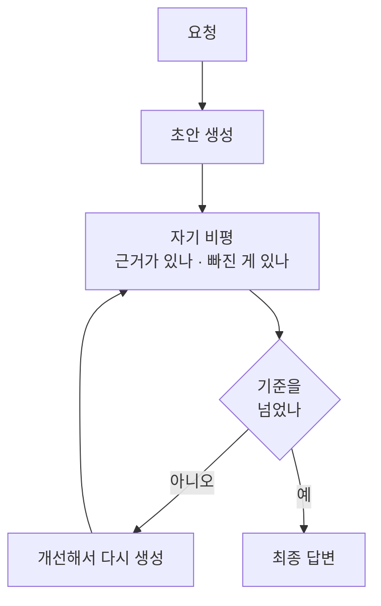
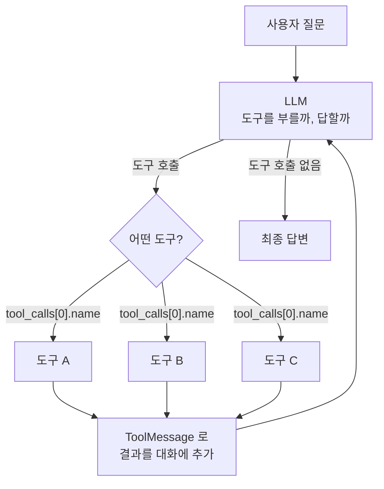

# Chapter 02 필기 — 에이전트를 이루는 세 부품

> 절별 상세는 [2.1](02-01_%EC%97%90%EC%9D%B4%EC%A0%84%ED%8A%B8%EC%9D%98%20%EC%B6%94%EB%A1%A0%20%EB%8A%A5%EB%A0%A5%20-%20ReAct%EC%99%80%20Reflection.md) · [2.2](02-02_%EC%97%90%EC%9D%B4%EC%A0%84%ED%8A%B8%EC%9D%98%20%EC%99%B8%EB%B6%80%20%EC%A7%80%EC%8B%9D%20%ED%99%9C%EC%9A%A9%20-%20%EB%8F%84%EA%B5%AC%20%ED%98%B8%EC%B6%9C.md) · [2.3](02-03_%EC%97%90%EC%9D%B4%EC%A0%84%ED%8A%B8%EC%9D%98%20%EA%B8%B0%EC%96%B5%EB%A0%A5%20-%20%EB%A9%94%EB%AA%A8%EB%A6%AC.md) · [2.4](02-04_ReAct%20%EA%B8%B0%EB%B0%98%20LLM%20%EC%97%90%EC%9D%B4%EC%A0%84%ED%8A%B8.md)
>
> **용어는 공식 문서 기준.** 교재 용어가 다를 때는 괄호로 병기함.

## 이 장의 질문

1장에서 **에이전트가 LLM 기반으로 시스템의 흐름을 동적으로 제어하고 작업하도록 설계할 수 있다**는 것을 확인함.

> 그렇다면 에이전트가 결과물을 도출하기까지 거치는 **생각의 과정(추론 능력)은 시스템으로 어떻게 구현**할 것인가?

이 장은 그 답을 **세 부품**으로 나눠 제시함 — 추론(2.1) · 도구(2.2) · 메모리(2.3). 2.4에서 셋을 조립함.

## 추론

- **프롬프트 기법은 언어 모델이 더 나은 답변을 생성하도록 돕는 방법**이지만, 에이전트 시스템 내부의 **사고 과정(추론)을 구조화하는 수단**으로 활용할 수 있음
- 대표적인 추론 패턴은 **ReAct**와 **Reflection**. 에이전트가 문제 해결 과정에서 **어떻게 사고를 전개하고, 행동을 선택하며, 결과를 점검하는지** 확인해야 함

### ReAct (Reasoning & Acting)

- 문제에 대한 **사고와 실제 행동을 함께 수행**하도록 유도하여, 정확하고 근거 있는 답변을 생성하도록 설계된 방법론
- **생각(Thought) → 행동(Action) → 관찰(Observation)** 3단계로 이루어짐

| 단계 | 하는 일 |
| :--- | :--- |
| **생각(Thought)** | 어떤 작업이 필요할까 |
| **행동(Action)** | 작업 실행 |
| **관찰(Observation)** | 실행 결과 확인 |

- 문제 해결을 위해 **어떤 순서로 작업을 수행할 건지 생각**하고, 생각에 기반해 **행동**하고, 행동의 **결과를 관찰**하며, 이 과정을 **반복**하면서 최적의 결과를 생성하도록 유도함



**되돌아오는 화살표가 핵심.** 관찰 결과를 보고 다시 생각하므로 [1.4절](../ch01_llm-decision/01-04_LLM%20%EA%B8%B0%EB%B0%98%20%EC%97%90%EC%9D%B4%EC%A0%84%ED%8A%B8%20%EC%8B%9C%EC%8A%A4%ED%85%9C%2C%20%EC%9D%B4%EB%9F%B0%20%EA%B5%AC%EC%A1%B0%EB%A1%9C%20%EC%84%A4%EA%B3%84%EB%90%9C%EB%8B%A4.md)의 **자율 에이전트 구조**에 해당함. 1장에서 그린 루프에 **이름이 붙은 것**.

### Reflection

- **초기 답변에 대한 반성**을 통해 더 정확한 결과를 도출하도록 함
- 답변을 바로 내놓지 않고 **'왜 그렇게 생각했는지' 근거를 설명**하게 하여 오류를 줄이는 전략
- 모델은 단일 응답 생성에 그치지 않고, **스스로 오류를 발견하고 개선하는 단계**를 추가로 수행함
- LLM이 답변하기 전에 **의도와 근거를 한 번 더 점검**하도록 유도하면, 사용자에게 전달될 답변이 타당한지 판단 가능
- 답변이 **근거에 기반한 추론**이기 때문에 신뢰할 수 있는 응답을 만들고 오류 가능성도 줄일 수 있음
- 한 번의 실행 이후 작업을 종료하는 대신, 시스템 내부에 **결과 검토와 재평가 단계를 포함**함으로써 보다 안정적인 결과를 유도함
- LLM이 **답변에 근거하여 충분히 고민한 것처럼** 유도됨



**ReAct와 묻는 질문이 다름.** ReAct는 *"다음에 무엇을 할까"*(앞으로), Reflection은 *"방금 한 게 괜찮은가"*(뒤로). 반복하는 대상도 ReAct는 **도구 호출**, Reflection은 **결과물**([2.1절](02-01_%EC%97%90%EC%9D%B4%EC%A0%84%ED%8A%B8%EC%9D%98%20%EC%B6%94%EB%A1%A0%20%EB%8A%A5%EB%A0%A5%20-%20ReAct%EC%99%80%20Reflection.md)).

> **둘은 대체 관계가 아님.** ReAct로 자료를 모으고 그 초안을 Reflection으로 다듬는 식으로 겹쳐 쓸 수 있음.

### 개선 가능성과 주의할 점

| | 내용 |
| :--- | :--- |
| **비용** | 생성마다 **2~3배** (생성 + 비평 + 재생성) |
| **자기 비평이 후해짐** | 같은 모델에게 자기 글을 평가시키면 *"전반적으로 좋습니다"* 로 끝나기 쉬움 → 비평 프롬프트에 **무엇을 볼지 구체적으로** 적어야 함 |
| **끝나지 않을 수 있음** | "완벽해질 때까지"로 두면 계속 돎 → **최대 반복 횟수를 반드시 정할 것** |

> 종료 판단을 모델에게 맡기면 **항상 따라오는 문제**. [1.3절](../ch01_llm-decision/01-03_LLM%EC%9D%B4%20%EB%8B%A4%EC%9D%8C%20%ED%96%89%EB%8F%99%EC%9D%84%20%EA%B2%B0%EC%A0%95%ED%95%98%EB%8B%A4.md)의 무한 루프가 여기서도 그대로 나옴.

## 도구 호출

- 에이전트가 더 다양한 작업을 수행하려면 **LLM이 본래 가지지 못한 능력을 외부 도구를 통해 보완**할 필요가 있음
- LLM은 **자신이 사용 가능한 도구 리스트를 참고**하여 사용자 요청에 따라 도구를 호출할 수 있음
- 도구 호출은 LLM에게 **특정 능력을 부여**하여 **기존의 지식으로 해결할 수 없는 문제**를 풀게 하기 위한 기법

### 모델에게 가는 것은 함수가 아님

**이름 · 설명 · 인자 스키마**만 감. **함수 본문은 가지 않음**([2.2절](02-02_%EC%97%90%EC%9D%B4%EC%A0%84%ED%8A%B8%EC%9D%98%20%EC%99%B8%EB%B6%80%20%EC%A7%80%EC%8B%9D%20%ED%99%9C%EC%9A%A9%20-%20%EB%8F%84%EA%B5%AC%20%ED%98%B8%EC%B6%9C.md)). 그래서 **독스트링이 모델이 고르는 유일한 근거**가 됨 → [1.3절](../ch01_llm-decision/01-03_LLM%EC%9D%B4%20%EB%8B%A4%EC%9D%8C%20%ED%96%89%EB%8F%99%EC%9D%84%20%EA%B2%B0%EC%A0%95%ED%95%98%EB%8B%A4.md)에서 본 것과 같은 이야기.

**도구가 많아질수록 설명이 더 중요해짐.** 도구 20개를 등록하면 **매번 20개의 설명이 함께** 감 — 하나도 안 쓰는 요청에도.

## 메모리

- 에이전트가 사람과 더욱 자연스럽게 상호작용하려면 **이전 대화를 기억하는 것에 그치지 않고**, 사용자의 **맥락과 성향을 장기적으로 기억**해야 함
- 메모리는 **범위에 따라 구분**됨

| | 범위 | 내용 |
| :--- | :--- | :--- |
| **단기 메모리** | **현재 대화 안** | 발생한 정보. 이전 답변에 대해 피드백을 주고받으며 **연속적인 대화를 이어갈 수 있음** |
| **장기 메모리** | **처음 접속 이후 전체** | 나눈 대화 전체를 기반으로 습득한 정보. 사용자의 **과거 경험과 성향에 기반**하여 답할 수 있음 |

> 구현에서는 **체크포인터(단기)** 와 **스토어(장기)** 로 나뉨. 8장에서 다룸.

## ReAct 기반 LLM 에이전트

- **외부 도구를 호출하는 에이전트**를 구성하며, ReAct 기반의 추론 능력을 지닌 에이전트가 **어떻게 구현되는지** 확인
- 에이전트가 **도구를 2개 이상** 가지는 경우, LLM이 **어떤 도구를 호출해야 하는지 판단하는 범위가 늘어남**



**도구가 늘어도 그림의 모양은 그대로.** 늘어나는 건 **가운데 갈림길의 가짓수**뿐임. 그래서 도구가 많아질수록 **설명의 품질이 정확도를 좌우**하게 됨(위 도구 호출 절).

## 아직 열린 것

미리 찾아본 답을 적어 둠. **직접 그 장에 가서 확인할 것.**

### 1. Reflection의 비평 프롬프트를 실제로 어떻게 쓰는지

2.1절에는 원칙만 있음 — *"무엇을 볼지 구체적으로 적어라"*. 실물은 **[7.6절](../ch07_multi-agent/07-06_%EC%9E%90%EB%A3%8C%20%EC%A1%B0%EC%82%AC%20%EC%A0%84%EB%AC%B8%EA%B0%80%20%2B%20%EB%AC%B8%EC%84%9C%20%EC%9E%91%EC%84%B1%20%EC%A0%84%EB%AC%B8%EA%B0%80%20%EC%97%90%EC%9D%B4%EC%A0%84%ED%8A%B8%20%23%ED%94%8C%EB%9E%98%EB%8B%9D%20%EA%B8%B0%EB%B0%98%20%EC%8A%88%ED%8D%BC%EB%B0%94%EC%9D%B4%EC%A0%80.md)의 재계획(replanner)** 에 있음.

```
현재 계획: {plan}
현재까지 완료한 작업들: {past_steps}

만약 아직 더 수행해야 할 작업이 있다면:
- Plan으로 남은 작업들만 포함한 계획을 제공하세요
- 이미 완료된 작업은 포함하지 마세요
```

**포인트 — 비평 대상을 상태로 넘겨줌.** "잘했나?"라고 막연히 묻지 않고 **`plan`과 `past_steps`를 같이 넣어** 무엇과 비교할지 정해 줌. 2.1절이 말한 "구체적으로"가 이런 모양임.

같은 프롬프트에 **제약도 걸어 둠** — *"단계의 개수는 2~5개 사이로 유지하세요"*. 상한이 없으면 20단계짜리 계획이 나오고, 단계마다 LLM 호출이 최소 3번이라 **60번**이 됨. 위에 적은 **"끝나지 않을 수 있음"** 에 대한 실제 대응책.

> **확인할 것** — 이건 Reflection을 **계획 재검토**에 쓴 경우임. **글의 품질**을 비평하는 형태는 이 교재에 안 나오는 듯. 6장에서 확인.

### 2. 도구가 20개쯤 되면 어떻게 줄이는지

**MCP는 이 문제를 풀어 주지 않음.** [9.2절](../ch09_mcp/09-02_MCP%20%EA%B8%B0%EB%8A%A5%EC%9D%B4%20%EB%93%A4%EC%96%B4%EA%B0%84%20%EC%97%90%EC%9D%B4%EC%A0%84%ED%8A%B8%20%EC%84%9C%EB%B9%84%EC%8A%A4.md)이 명시함 — 서버를 여러 개 붙이면 도구가 금방 수십 개가 되고, **명세가 매 요청마다 프롬프트에 실려 가는 것**도 **비슷한 도구끼리 헷갈리는 것**도 그대로임. MCP는 **연동을 쉽게 해 줄 뿐**.

**답은 "줄이기"가 아니라 "나누기".**

| 어디 | 나누는 기준 |
| :--- | :--- |
| [3.2절](../ch03_architecture/03-02_%EB%A9%80%ED%8B%B0%20%EC%97%90%EC%9D%B4%EC%A0%84%ED%8A%B8.md) | 에이전트끼리 **도구를 나눠 가짐** |
| [9.5절](../ch09_mcp/09-05_%EB%9E%AD%EA%B7%B8%EB%9E%98%ED%94%84%EC%97%90%EC%84%9C%20MCP%20%EA%B8%B0%EB%B0%98%20%EB%A9%80%ED%8B%B0%20%EC%97%90%EC%9D%B4%EC%A0%84%ED%8A%B8%20%EA%B5%AC%ED%98%84%ED%95%98%EA%B8%B0.md) | `get_tools(server_name=…)` — **서버별로 나눠 받음** |

**서버 하나 = 에이전트 하나**가 되어, 각 에이전트는 자기 서버의 도구만 봄. 전체 도구가 30개라도 **한 에이전트가 보는 건 5~6개**.

> 즉 **2장의 도구 문제가 3장(멀티 에이전트)의 존재 이유 중 하나**임. 도구를 나눠 갖자는 게 곧 에이전트를 나누자는 말.

### 3. 단기/장기 경계를 "대화"로 잡는 게 맞는지

**맞음.** [8.1절](../ch08_memory/08-01_AI%20%EC%97%90%EC%9D%B4%EC%A0%84%ED%8A%B8%EC%97%90%EC%84%9C%20%EB%A9%94%EB%AA%A8%EB%A6%AC%EC%9D%98%20%EC%97%AD%ED%95%A0.md)이 그대로 *"두 층의 경계는 대화입니다"* 라고 씀. 다만 **구현에서는 구분 열쇠가 따로 있음.**

| | 단기 | 장기 |
| :--- | :--- | :--- |
| 저장소 | **체크포인터** | **스토어** |
| 구분 열쇠 | **`thread_id`** | **`user_id`** (직접 정함) |
| 범위 | 대화 하나 안 | 대화를 넘어 |

**`thread_id`를 바꾸면 새 대화**, **`user_id`가 같으면 같은 사람.** 그래서 같은 사람이 대화를 열 번 해도 장기 메모리는 하나로 쌓임.

> **주의 — "대화"의 경계는 개발자가 정하는 것.** `thread_id`를 언제 새로 발급할지가 곧 "대화가 언제 끝나는가"임. 자동으로 정해지지 않음.

---

[⬅ Chapter 02](README.md) · [전체 목차](../STUDY.md)
