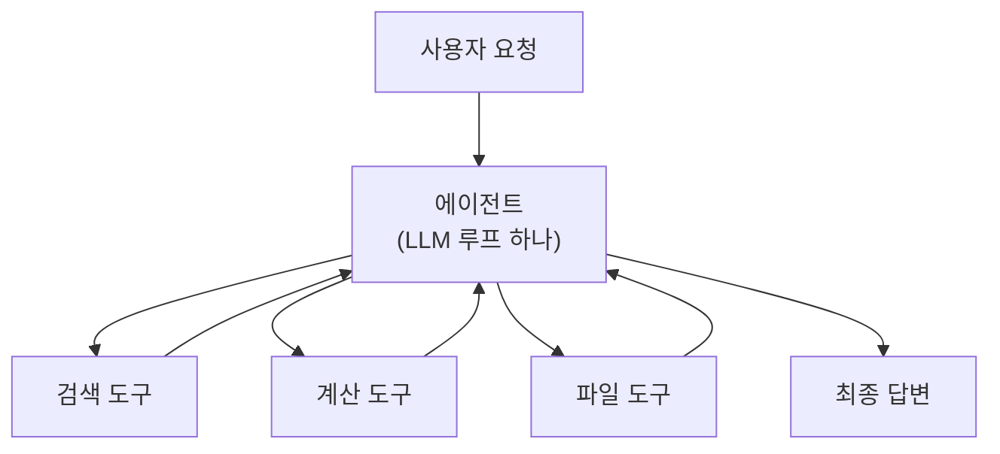

# 3.1 싱글 에이전트

> **공식 문서** — [LangChain · Agents](https://docs.langchain.com/oss/python/langchain/agents) · [Workflows and agents](https://docs.langchain.com/oss/python/langgraph/workflows-agents)

> **여기까지** — 추론·도구·메모리를 하나의 루프로 조립했습니다([2.4절](../ch02_core-elements/02-04_ReAct%20%EA%B8%B0%EB%B0%98%20LLM%20%EC%97%90%EC%9D%B4%EC%A0%84%ED%8A%B8.md)).
> **이 절의 질문** — 그렇게 만든 에이전트 하나가 **어디까지 감당할 수 있지?**
> **다 읽으면** — 가장 기본이 되는 구조와, **이게 언제 무너지는지**를 알게 됩니다.

## 우리가 만든 게 바로 싱글 에이전트입니다

[2.4절](../ch02_core-elements/02-04_ReAct%20%EA%B8%B0%EB%B0%98%20LLM%20%EC%97%90%EC%9D%B4%EC%A0%84%ED%8A%B8.md)의 스무 줄짜리 루프 — 그게 **싱글 에이전트**입니다. 이 절은 거기에 이름을 붙이고 **한계선을 긋습니다.**

## 3.1.1 싱글 에이전트의 정의

> **하나의 LLM 루프가 모든 도구를 들고 처음부터 끝까지 처리하는 구조**



구성 요소는 셋뿐입니다.

| 구성 | 내용 |
| :--- | :--- |
| **프롬프트 하나** | "너는 무엇이고 어떻게 행동해야 하는가" |
| **도구 묶음** | 이 에이전트가 쓸 수 있는 전부 |
| **대화 이력 하나** | 처음부터 끝까지 한 줄기로 쌓임 |

**"하나"라는 말이 세 번 나온다**는 걸 보세요. 프롬프트도 하나, 이력도 하나, 판단 주체도 하나입니다.

**그래서 단순하고, 그래서 한계도 명확합니다.**

> **"싱글"은 도구가 하나라는 뜻이 아닙니다.**
>
> 도구는 얼마든지 많을 수 있습니다. **판단하는 주체가 하나**라는 뜻입니다. 여기서 헷갈리는 사람이 많습니다.

### 에이전트라면 셋을 할 수 있어야 합니다

에이전트는 **특정 목적을 가진 실행 주체**입니다. 목적을 달성하려면 이 셋이 필요합니다.

| | 하는 일 | 어디서 배웠나 |
| :--- | :--- | :--- |
| **해석** | 지금 상황이 어떤지 읽음 | [1.2절](../ch01_llm-decision/01-02_LLM%EC%9D%84%20%EA%B8%B0%EB%B0%98%EC%9C%BC%EB%A1%9C%20%EC%9D%98%EC%82%AC%EA%B2%B0%EC%A0%95%ED%95%98%EB%8B%A4.md) 구조화 출력 |
| **결정** | 다음에 뭘 할지 **스스로** 정함 | [1.3절](../ch01_llm-decision/01-03_LLM%EC%9D%B4%20%EB%8B%A4%EC%9D%8C%20%ED%96%89%EB%8F%99%EC%9D%84%20%EA%B2%B0%EC%A0%95%ED%95%98%EB%8B%A4.md) 루프 |
| **실행** | 필요하면 도구로 실제로 함 | [2.2절](../ch02_core-elements/02-02_%EC%97%90%EC%9D%B4%EC%A0%84%ED%8A%B8%EC%9D%98%20%EC%99%B8%EB%B6%80%20%EC%A7%80%EC%8B%9D%20%ED%99%9C%EC%9A%A9%20-%20%EB%8F%84%EA%B5%AC%20%ED%98%B8%EC%B6%9C.md) 도구 호출 |

**싱글 에이전트는 이 셋을 하나의 주체 안에서 전부 충족합니다.** 다른 에이전트와 협력하거나 역할을 나누지 않습니다.

> **판단 기준을 한 줄로 줄이면** — *하나의 판단 주체가 여러 능력을 통합적으로 쓸 수 있는가.*

### 무엇이 좋은가

**장점이 전부 "하나"에서 나옵니다.**

| 장점 | 왜 |
| :--- | :--- |
| **디버깅이 쉽다** | 이력이 한 줄기라 **위에서 아래로 읽으면 끝** |
| **맥락이 안 끊긴다** | 앞에서 알아낸 것을 뒤에서 그대로 씀 |
| **비용이 예측된다** | LLM 호출 지점이 한 곳 |
| **만들기 쉽다** | `create_agent` **한 줄**로 시작 |

## 3.1.2 싱글 에이전트의 대표적 예시

**대표적인 세 가지가 전부 싱글 에이전트입니다.** 이름과 모양을 잡아 둡시다.

### 웹 검색 에이전트

최신 정보가 필요할 때 검색 도구를 부릅니다.

```
질문 → 검색 → 결과 읽기 → (부족하면 다시 검색) → 답변
```

[1.1절](../ch01_llm-decision/01-01_AI%20%EC%97%90%EC%9D%B4%EC%A0%84%ED%8A%B8%EC%9D%98%20%EB%91%90%EB%87%8C%2C%20%EA%B1%B0%EB%8C%80%20%EC%96%B8%EC%96%B4%20%EB%AA%A8%EB%8D%B8%EC%9D%98%20%EC%9D%B4%ED%95%B4.md)의 **지식 컷오프** 문제를 도구로 메우는 **가장 직접적인 형태**입니다.

### 코딩 에이전트

코드를 실행하고 파일을 저장하는 도구를 씁니다.

**결과를 보고 고쳐서 다시 실행**하는 흐름이라 [2.1절](../ch02_core-elements/02-01_%EC%97%90%EC%9D%B4%EC%A0%84%ED%8A%B8%EC%9D%98%20%EC%B6%94%EB%A1%A0%20%EB%8A%A5%EB%A0%A5%20-%20ReAct%EC%99%80%20Reflection.md)의 **ReAct 루프가 가장 잘 드러납니다.** 에러 메시지가 그대로 **Observation**이 됩니다.

```
Action:      python_exec("print(fib(10))")
Observation: NameError: name 'fib' is not defined
Thought:     함수를 먼저 정의해야겠다
```

### RAG 에이전트

문서를 미리 넣어 두고, 질문이 오면 **관련 조각을 찾아 프롬프트에 넣습니다.** 모델이 모르는 **내부 문서**를 다룰 때 씁니다.

| | 웹 검색 | RAG |
| :--- | :--- | :--- |
| 어디서 가져오나 | **인터넷** | **내가 넣어 둔 문서** |
| 언제 쓰나 | 최신 정보 | 사내 규정·매뉴얼처럼 **공개되지 않은 것** |

> **저자 예제를 미리 열어 봐도 좋습니다** — `ch06_single-agent/examples/` 아래 `web_agent/` · `coding_agent/` · `rag_agent/`

## 목적이 하나면 단계가 많아도 싱글입니다

세 예시의 공통점을 보면 기준이 보입니다. **전부 목적이 하나입니다.**

**여행 계획을 짠다**고 해 봅시다. 항공권을 알아보고, 숙소를 고르고, 동선을 짜고, 예산을 맞춥니다. **단계가 여럿이고 판단도 여러 번** 합니다.

그래도 **싱글 에이전트로 충분합니다.** 모든 결정이 **"여행 계획을 완성한다"는 하나의 목표**를 향하기 때문입니다.

> **나누는 기준은 "일이 많은가"가 아니라 "목적이 갈리는가"입니다.** 여기서 착각하기 쉽습니다.

## 어디서 무너지는가

싱글 에이전트는 **도구가 늘어날 때** 무너집니다. [2.2절](../ch02_core-elements/02-02_%EC%97%90%EC%9D%B4%EC%A0%84%ED%8A%B8%EC%9D%98%20%EC%99%B8%EB%B6%80%20%EC%A7%80%EC%8B%9D%20%ED%99%9C%EC%9A%A9%20-%20%EB%8F%84%EA%B5%AC%20%ED%98%B8%EC%B6%9C.md)에서 예고한 문제가 **여기서 현실이 됩니다.**

| 증상 | 원인 |
| :--- | :--- |
| **엉뚱한 도구를 부른다** | 비슷한 도구가 여러 개라 설명만으로 구분이 안 됨 |
| **프롬프트가 걷잡을 수 없이 길어진다** | 도구마다 예외 규칙을 계속 덧붙이게 됨 |
| **한 곳을 고치면 다른 게 망가진다** | 프롬프트 하나에 여러 역할이 섞임 |
| **컨텍스트가 금방 찬다** | 도구 명세 + **모든 도구 결과**가 한 이력에 쌓임 |

**마지막이 특히 아픕니다.**

이력이 하나라는 **장점이 그대로 단점이 됩니다.** 웹 검색 결과 전문과 DB 조회 결과와 파일 내용이 **전부 같은 대화에 쌓입니다.** 검색 결과가 필요 없는 판단을 할 때도 그게 계속 딸려 갑니다.

이 지점에서 [3.2절](03-02_%EB%A9%80%ED%8B%B0%20%EC%97%90%EC%9D%B4%EC%A0%84%ED%8A%B8.md)의 멀티 에이전트가 나옵니다.

## 요약 및 비유

**만능 직원 한 명**입니다.

작은 가게에서는 이 사람이 제일 효율적입니다. 손님을 응대하다가 재고를 확인하고 계산까지 합니다. **문제는 가게가 커질 때** 생깁니다.

| 개념 | 만능 직원 비유 | 기술적 의미 |
| :--- | :--- | :--- |
| **싱글 에이전트** | 혼자 다 하는 직원 | 판단 주체가 하나 |
| **도구 묶음** | 그가 다룰 줄 아는 일들 | 등록된 도구 전체 |
| **이력 하나** | 그의 머릿속 오늘 기억 | 한 줄기 대화 이력 |
| **맥락 유지** | 아까 손님 얘기를 그대로 기억 | 앞 정보를 뒤에서 그대로 씀 |
| **디버깅 쉬움** | 물어볼 사람이 한 명 | 이력을 위에서 아래로 읽으면 끝 |
| **도구가 늘어남** | 업무 매뉴얼이 두꺼워짐 | 도구 명세가 컨텍스트를 잠식 |
| **역할 충돌** | 응대 규칙과 회계 규칙이 섞임 | 프롬프트 하나에 여러 역할 |
| **한계 지점** | 가게가 커지면 사람을 나눠야 함 | 멀티 에이전트 (3.2절) |

## 결론

* 싱글 에이전트는 **프롬프트 하나 · 도구 묶음 하나 · 이력 하나**로 처음부터 끝까지 처리하는 구조입니다.
* **"싱글"은 도구가 하나라는 뜻이 아니라 판단 주체가 하나**라는 뜻입니다.
* 장점은 전부 "하나"에서 나옵니다 — 디버깅이 쉽고, 맥락이 안 끊기고, 비용이 예측됩니다.
* **웹 검색 · 코딩 · RAG 에이전트가 모두 싱글 에이전트**입니다.
* 무너지는 지점은 **도구가 늘어날 때**입니다. 도구 혼동, 프롬프트 비대, 역할 충돌, 컨텍스트 포화가 함께 옵니다.
* **이력이 하나라는 장점이 그대로 단점이 됩니다.** 여기서 멀티 에이전트가 나옵니다.

---

## 다음 절로

도구가 늘어 무너진다면, **나누면 되지 않을까요?**

그런데 "에이전트를 여러 개 만든다"는 게 **정확히 무엇을 나누는 걸까요?** 그리고 나누면 **공짜일까요?** → **[3.2절](03-02_%EB%A9%80%ED%8B%B0%20%EC%97%90%EC%9D%B4%EC%A0%84%ED%8A%B8.md)**

---

[Chapter 03](README.md) · [3.2 ➡](03-02_%EB%A9%80%ED%8B%B0%20%EC%97%90%EC%9D%B4%EC%A0%84%ED%8A%B8.md)
