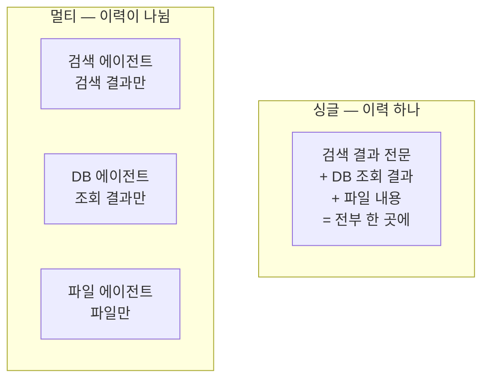
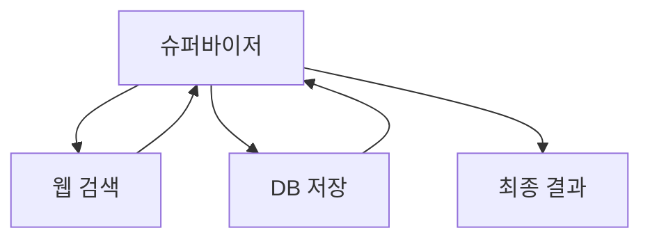

# 3.2 멀티 에이전트

> **공식 문서** — [LangChain · Subagents](https://docs.langchain.com/oss/python/langchain/multi-agent/subagents)

> **여기까지** — 싱글 에이전트는 **도구가 늘어날 때 무너진다**는 것까지 왔습니다([3.1절](03-01_%EC%8B%B1%EA%B8%80%20%EC%97%90%EC%9D%B4%EC%A0%84%ED%8A%B8.md)).
> **이 절의 질문** — "에이전트를 나눈다"는 게 **정확히 무엇을 나누는 거지?**
> **다 읽으면** — 멀티 에이전트 세 가지 패턴의 모양과, **나누는 대가**를 알게 됩니다.

## 나눈다 = 컨텍스트를 나눈다

"에이전트를 여러 개 만든다"가 막연하게 들립니다. **실제로 나뉘는 건 셋**입니다.

| 나뉘는 것 | 나누면 |
| :--- | :--- |
| **프롬프트** | 각자 자기 역할 규칙만 가짐 → **역할 충돌이 사라짐** |
| **도구** | 각자 5개씩만 가짐 → **도구 혼동이 줄어듦** |
| **대화 이력** | 각자 자기가 한 일만 쌓임 → **컨텍스트가 작아짐** |

**세 번째가 가장 큽니다.**

웹 검색 에이전트가 읽은 페이지 전문이 **DB 에이전트의 컨텍스트에는 안 들어갑니다.** 각자 자기 일에 필요한 것만 봅니다.

> **주의 — 총 토큰이 줄어드는 게 아닙니다.**
>
> 오히려 늘어나기 쉽습니다(아래 "대가" 참고). 줄어드는 것은 **한 번의 LLM 호출에 들어가는 양**입니다.
>
> 그래서 **각자의 판단이 정확해집니다.** 이게 나누는 진짜 이유입니다.

## 핸드오프 — 일을 넘기는 방법

에이전트가 여러 개면 **누가 언제 일을 넘기는가**를 정해야 합니다. 이 넘김을 **핸드오프(Handoff)** 라고 합니다.

이어달리기의 **바통 터치**를 생각하면 됩니다. 정할 것은 둘입니다.

| 결정할 것 | 선택지 |
| :--- | :--- |
| **누구에게 넘길지 누가 정하나** | 지금 일하는 에이전트 / 관리자 역할의 에이전트 |
| **무엇을 넘길지** | 대화 전체 / 요약본 / 지정한 값만 |

**두 번째가 실무에서 자주 어긋납니다.**

| 넘기는 양 | 문제 |
| :--- | :--- |
| **대화 전체** | **컨텍스트를 나눈 의미가 사라짐** |
| **너무 적게** | 받는 쪽이 맥락을 몰라 엉뚱한 일을 함 |

랭그래프에서는 이 핸드오프를 **`Command`** 라는 것으로 표현합니다. **멀티 에이전트 예제에서 가장 많이 나오는 코드**이니 이름만 기억해 두세요.

## 세 가지 유형

여기서는 **모양의 차이**만 잡습니다.

### ① 네트워크 — 서로가 서로를 부름

**관리자가 없습니다.** 각 에이전트가 "이건 저쪽이 할 일"이라고 판단해서 **직접 넘깁니다.**

| | |
| :--- | :--- |
| **장점** | 구조가 단순하고 유연함. 중간 경유가 없어 호출이 적음 |
| **단점** | 에이전트가 늘면 **서로 떠넘기는 핑퐁**이 생김. 흐름 추적도 어려움 |

### ② 슈퍼바이저 — 관리자가 배분함

**관리자 에이전트가 누가 할지 정하고, 결과를 받아 다시 판단**합니다. 작업자끼리는 **직접 대화하지 않습니다.**

| | |
| :--- | :--- |
| **장점** | 흐름이 한곳으로 모여 **추적과 통제가 쉬움**. 작업자 추가가 간단 |
| **단점** | **슈퍼바이저가 병목.** 매번 거쳐 가니 호출이 늘어남 |

### ③ 플래닝 기반 — 계획을 먼저 세움

슈퍼바이저의 변형입니다. 일을 배분하기 전에 **먼저 전체 계획을 세우고**, 그 계획대로 배분합니다.

| | |
| :--- | :--- |
| **장점** | 큰 작업에서 **중간에 길을 잃지 않음** |
| **단점** | **계획이 틀리면 전체가 틀림** |

### 한눈에

| 유형 | 관리자 | 흐름 | 적합한 곳 |
| :--- | :--- | :--- | :--- |
| **네트워크** | 없음 | 자유롭게 오감 | 에이전트 2~3개, 역할이 명확히 다름 |
| **슈퍼바이저** | 있음 | 항상 관리자를 거침 | 작업자가 여럿, 통제가 중요 |
| **플래닝** | 있음 + 계획 | 계획 → 배분 | 단계가 많고 긴 작업 |

> **공식 문서는 이름이 다릅니다.** 슈퍼바이저와 플래닝을 묶어 **`Orchestrator-worker`**(관리자–작업자)라고 부릅니다. 검색할 때는 이 이름을 쓰세요 — "슈퍼바이저"로 찾으면 이 교재가 나오고, `Orchestrator-worker`로 찾으면 프레임워크 문서가 나옵니다.
>
> **네트워크는 공식 패턴 이름이 따로 없습니다.** 관리자를 두지 않는 형태라 "에이전트끼리 직접 넘긴다"로 설명됩니다.

## 대가를 반드시 계산하세요

**멀티 에이전트는 공짜가 아닙니다.**

| 대가 | 내용 |
| :--- | :--- |
| **호출 횟수 증가** | 슈퍼바이저를 거칠 때마다 LLM 호출이 추가됨 |
| **지연 증가** | 순차로 넘기면 그만큼 느려짐 |
| **추적 어려움** | 어느 에이전트에서 어긋났는지 찾아야 함 |
| **핸드오프 설계 부담** | 무엇을 넘길지 매번 결정해야 함 |
| **오류 전파** | 앞 에이전트의 잘못된 결과를 뒤에서 **사실로 받음** |

**마지막이 조용히 위험합니다.**

검색 에이전트가 틀린 정보를 가져오면, 요약 에이전트는 그것을 **의심 없이** 요약합니다. [2.1절](../ch02_core-elements/02-01_%EC%97%90%EC%9D%B4%EC%A0%84%ED%8A%B8%EC%9D%98%20%EC%B6%94%EB%A1%A0%20%EB%8A%A5%EB%A0%A5%20-%20ReAct%EC%99%80%20Reflection.md)에서 본 **"잘못된 관찰 위에 계속 쌓는" 문제**가, **에이전트 사이 경계에서 더 크게** 일어납니다.

> **에이전트를 나눴다고 문제가 사라지지 않습니다.**
> **문제가 경계로 옮겨 갈 뿐입니다.**
>
> 어느 쪽이 나은지는 [3.3절](03-03_%EC%96%B4%EB%96%A4%20%EC%97%90%EC%9D%B4%EC%A0%84%ED%8A%B8%EB%A5%BC%20%EC%84%A4%EA%B3%84%ED%95%B4%EC%95%BC%20%ED%95%A0%EA%B9%8C.md)에서 판단합니다.

## 요약 및 비유

**부서가 나뉜 회사**입니다.

사람이 늘면 나누는 게 맞지만, 나누는 순간 **부서 간 인수인계**라는 새로운 일이 생깁니다.

| 개념 | 회사 조직 비유 | 기술적 의미 |
| :--- | :--- | :--- |
| **멀티 에이전트** | 부서를 나눈 회사 | 판단 주체가 여러 개 |
| **프롬프트 분리** | 부서별 업무 규정 | 역할 충돌 제거 |
| **도구 분리** | 부서별 권한과 장비 | 도구 혼동 감소 |
| **이력 분리** | 부서마다 자기 문서만 봄 | 호출당 컨텍스트 축소 |
| **핸드오프** | 인수인계서 | `Command` 로 제어권 이동 |
| **무엇을 넘길지** | 인수인계서를 얼마나 자세히 | 전체 / 요약 / 지정 값 |
| **네트워크** | 팀끼리 직접 협의 | 관리자 없이 상호 호출 |
| **슈퍼바이저** | 팀장이 배분하고 취합 | 관리자 경유 |
| **플래닝** | 프로젝트 계획서 먼저 | 계획 후 배분 |
| **오류 전파** | 앞 부서 자료를 검증 없이 씀 | 잘못된 결과가 그대로 흘러감 |

## 결론

* 멀티 에이전트에서 실제로 나뉘는 건 **프롬프트 · 도구 · 대화 이력** 셋입니다.
* 가장 큰 이득은 **한 번의 LLM 호출에 들어가는 컨텍스트가 작아지는 것**입니다. **총 토큰이 주는 게 아닙니다.**
* 에이전트 사이에 일을 넘기는 것이 **핸드오프**이고, **무엇을 넘길지**가 설계의 핵심입니다. **전부 넘기면 나눈 의미가 없어집니다.**
* 유형은 셋 — **네트워크**(관리자 없음), **슈퍼바이저**(관리자 경유), **플래닝**(계획 먼저).
* 대가가 분명합니다 — 호출 증가, 지연, 추적 난이도, 그리고 **오류 전파**.
* **나눈다고 문제가 사라지지 않습니다. 경계로 옮겨 갈 뿐입니다.**

---

## 다음 절로

싱글도 알았고 멀티도 알았습니다. **그럼 언제 어느 쪽을 고르죠?**

"도구가 많으니 나눠야지"는 맞는 판단일까요? → **[3.3절](03-03_%EC%96%B4%EB%96%A4%20%EC%97%90%EC%9D%B4%EC%A0%84%ED%8A%B8%EB%A5%BC%20%EC%84%A4%EA%B3%84%ED%95%B4%EC%95%BC%20%ED%95%A0%EA%B9%8C.md)**

---

[⬅ 3.1](03-01_%EC%8B%B1%EA%B8%80%20%EC%97%90%EC%9D%B4%EC%A0%84%ED%8A%B8.md) · [Chapter 03](README.md) · [3.3 ➡](03-03_%EC%96%B4%EB%96%A4%20%EC%97%90%EC%9D%B4%EC%A0%84%ED%8A%B8%EB%A5%BC%20%EC%84%A4%EA%B3%84%ED%95%B4%EC%95%BC%20%ED%95%A0%EA%B9%8C.md)
