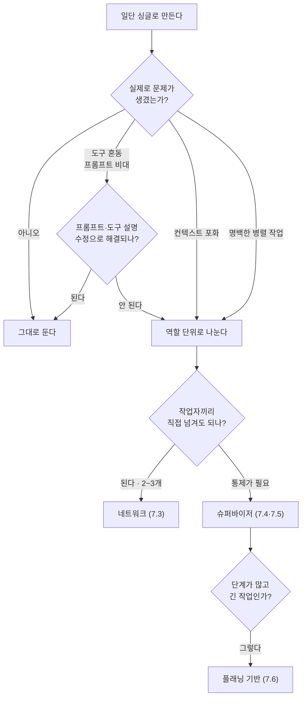

# 3.3 어떤 에이전트를 설계해야 할까

> **공식 문서** — [Building effective agents](https://www.anthropic.com/engineering/building-effective-agents) · [Workflows and agents](https://docs.langchain.com/oss/python/langgraph/workflows-agents)

> **여기까지** — 싱글([3.1절](03-01_%EC%8B%B1%EA%B8%80%20%EC%97%90%EC%9D%B4%EC%A0%84%ED%8A%B8.md))과 멀티([3.2절](03-02_%EB%A9%80%ED%8B%B0%20%EC%97%90%EC%9D%B4%EC%A0%84%ED%8A%B8.md))의 모양과 대가를 봤습니다.
> **이 절의 질문** — **언제 나누고 언제 나누지 말아야 하지?**
> **다 읽으면** — 앞으로 만들 시스템에서 **나눌지 말지 결정하는 기준**이 생깁니다. 6·7·11장이 전부 이 기준 위에 있습니다.

## 결론부터

> ### 싱글로 시작하세요. 무너지는 것을 확인한 다음에 나누세요.

멀티가 더 발전된 형태처럼 보입니다. 그런데 [3.2절](03-02_%EB%A9%80%ED%8B%B0%20%EC%97%90%EC%9D%B4%EC%A0%84%ED%8A%B8.md)에서 봤듯 **다른 대가를 치르는 구조**일 뿐입니다.

**[1.4절](../ch01_llm-decision/01-04_LLM%20%EA%B8%B0%EB%B0%98%20%EC%97%90%EC%9D%B4%EC%A0%84%ED%8A%B8%20%EC%8B%9C%EC%8A%A4%ED%85%9C%2C%20%EC%9D%B4%EB%9F%B0%20%EA%B5%AC%EC%A1%B0%EB%A1%9C%20%EC%84%A4%EA%B3%84%EB%90%9C%EB%8B%A4.md)에서 워크플로와 자율 에이전트를 놓고 한 이야기가 그대로 반복됩니다** — 통제를 포기하는 대가로 유연성을 사는 것이고, 대가가 작지 않습니다.

## 3.3.1 싱글 에이전트로 충분한 경우

**다음 중 하나라도 해당하면 싱글로 시작하세요.**

| 조건 | 왜 |
| :--- | :--- |
| **도구가 10개 이하** | 아직 도구 혼동이 안 생김 |
| **역할이 하나** | "검색해서 답한다"처럼 **한 문장으로 설명됨** |
| **앞 정보를 뒤에서 계속 씀** | 이력이 한 줄기인 게 **오히려 유리** |
| **처음 만들어 본다** | 무엇이 문제인지 **겪어 봐야** 나눌 기준이 생김 |

### 맥락이 이어져야 하는 일은 나누면 손해입니다

세 번째 조건을 좀 더 봅시다.

```
사용자: 이 로그 보고 원인 찾아 줘

→ 로그를 읽고
→ (로그에서 본 것을 근거로) 설정 파일을 확인하고
→ (설정에서 본 것을 근거로) 버전을 조회하고
→ 종합 판단
```

**앞에서 본 것이 뒤 판단에 계속 필요합니다.**

나누면 그때마다 넘겨야 하는데, **넘기는 비용이 이득보다 큽니다.** 그리고 뭘 넘길지 매번 고민해야 합니다([3.2절](03-02_%EB%A9%80%ED%8B%B0%20%EC%97%90%EC%9D%B4%EC%A0%84%ED%8A%B8.md)).

> **"도구가 많으니 나눠야지"는 성급합니다.**
>
> 도구 10개를 하나가 들고 있어서 **정말 문제가 생기는지 먼저 확인**하세요. 프롬프트를 다듬거나 도구 설명을 고쳐서([2.2절](../ch02_core-elements/02-02_%EC%97%90%EC%9D%B4%EC%A0%84%ED%8A%B8%EC%9D%98%20%EC%99%B8%EB%B6%80%20%EC%A7%80%EC%8B%9D%20%ED%99%9C%EC%9A%A9%20-%20%EB%8F%84%EA%B5%AC%20%ED%98%B8%EC%B6%9C.md)) **해결되는 경우가 많습니다.**

## 3.3.2 멀티 에이전트가 필요한 경우

**싱글에서 실제로 다음 증상이 나타났을 때** 나눕니다.

| 증상 | 나누면 해결되는 이유 |
| :--- | :--- |
| **비슷한 도구를 계속 헷갈린다** | 각자 5개씩만 가지면 구분이 쉬워짐 |
| **프롬프트에 "단, ~인 경우에는"이 계속 붙는다** | **역할이 섞였다는 신호.** 규정을 분리 |
| **한 곳을 고치면 다른 곳이 깨진다** | 프롬프트 하나에 **여러 책임**이 있다는 신호 |
| **컨텍스트가 도구 결과로 꽉 찬다** | 이력을 나누면 **호출당 크기**가 줄어듦 |
| **작업이 명백히 병렬이다** | 동시에 돌릴 수 있음 |

**두 번째와 세 번째가 좋은 신호입니다.** 코드에서 클래스 하나가 너무 많은 일을 할 때 나타나는 증상과 똑같습니다.

### 처음부터 멀티가 맞는 경우도 있습니다

| 경우 | 예 |
| :--- | :--- |
| **전문성이 명백히 다를 때** | 자료 조사와 문서 작성은 **잘하는 방식이 다름** (7.6절) |
| **권한을 분리해야 할 때** | 읽기만 하는 에이전트와 쓰기까지 하는 에이전트를 나누면 **위험한 동작을 구조적으로 차단** |
| **다른 팀·다른 시스템과 붙일 때** | **10장의 A2A**가 이 경우 |

**두 번째가 특히 실용적입니다.** 프롬프트로 "파일을 지우지 마"라고 부탁하는 것보다, **애초에 삭제 도구를 안 주는 게** 훨씬 확실합니다.

## 판단 순서



## 나눌 때의 기준은 "역할"입니다

나누기로 했다면 **무엇을 기준으로 자를지**가 다음 문제입니다.

| 기준 | 예 | 평가 |
| :--- | :--- | :--- |
| **역할·전문성** | 조사 담당 / 작성 담당 | **좋음** — 프롬프트가 자연스럽게 나뉨 |
| **데이터 출처** | 웹 담당 / 내부 DB 담당 | **좋음** — 도구와 컨텍스트가 같이 나뉨 |
| **권한 수준** | 읽기 전용 / 쓰기 가능 | **좋음** — 안전 경계가 생김 |
| **단순 작업 순서** | 1단계 담당 / 2단계 담당 | **나쁨** — 그건 [워크플로](../ch01_llm-decision/01-04_LLM%20%EA%B8%B0%EB%B0%98%20%EC%97%90%EC%9D%B4%EC%A0%84%ED%8A%B8%20%EC%8B%9C%EC%8A%A4%ED%85%9C%2C%20%EC%9D%B4%EB%9F%B0%20%EA%B5%AC%EC%A1%B0%EB%A1%9C%20%EC%84%A4%EA%B3%84%EB%90%9C%EB%8B%A4.md)로 짜세요 |

**마지막 줄이 중요합니다.**

**순서가 정해진 일을 에이전트로 나누는 것은 낭비입니다.** 단계가 고정돼 있으면 **코드로 이어 붙이면** 됩니다. LLM에게 "다음에 누구를 부를까"를 물을 이유가 없습니다.

## 1장의 질문과 겹쳐 보기

[1.4절](../ch01_llm-decision/01-04_LLM%20%EA%B8%B0%EB%B0%98%20%EC%97%90%EC%9D%B4%EC%A0%84%ED%8A%B8%20%EC%8B%9C%EC%8A%A4%ED%85%9C%2C%20%EC%9D%B4%EB%9F%B0%20%EA%B5%AC%EC%A1%B0%EB%A1%9C%20%EC%84%A4%EA%B3%84%EB%90%9C%EB%8B%A4.md)의 축과 3장의 축은 **다른 질문**입니다.

- **1.4의 질문** — 흐름을 미리 그릴 수 있는가? (워크플로 / 자율)
- **3장의 질문** — 판단 주체가 하나인가 여럿인가? (싱글 / 멀티)

**둘을 겹치면 네 칸이 나옵니다.**

| | 싱글 | 멀티 |
| :--- | :--- | :--- |
| **워크플로**<br/>(단계 고정) | 분류 후 정해진 처리 | 정해진 순서로 전문 에이전트 호출 |
| **자율**<br/>(LLM이 결정) | **6장의 웹 검색·코딩 에이전트** | **7장의 슈퍼바이저** |

**11장의 최종 프로젝트는 오른쪽 아래에 가깝되 큰 틀은 고정된 형태**입니다. 오케스트레이터가 어느 에이전트를 부를지 판단하지만, **시스템 전체 구조는 개발자가 그려 뒀습니다.**

## 요약 및 비유

**조직을 설계하는 일**과 같습니다.

사람을 나누는 것 자체가 목적이 아니라, **나눠서 얻는 것이 인수인계 비용보다 클 때만** 나눕니다.

| 개념 | 조직 설계 비유 | 기술적 의미 |
| :--- | :--- | :--- |
| **싱글로 시작** | 1인 가게로 시작 | 가장 단순한 구조부터 |
| **문제를 확인하고 나눔** | 바빠진 걸 확인하고 채용 | 증상이 실제로 생긴 뒤 분리 |
| **프롬프트부터 손보기** | 업무 매뉴얼 정리로 해결되나 | 나누기 전에 설명 개선 |
| **역할로 나누기** | 직무 기준 채용 | 프롬프트가 자연스럽게 갈림 |
| **권한으로 나누기** | 금고 열쇠는 한 사람만 | 위험 동작을 구조로 차단 |
| **순서로 나누기(나쁨)** | 컨베이어를 사람으로 흉내 | 워크플로로 짤 일 |
| **인수인계 비용** | 부서 간 문서 주고받기 | 핸드오프 오버헤드 |
| **맥락이 이어지는 일** | 한 사람이 끝까지 보는 게 나음 | 나누면 손해 |

## 결론

* **싱글로 시작하세요.** 멀티는 더 나은 구조가 아니라 **다른 대가를 치르는 구조**입니다.
* 도구가 10개 이하이고, 역할이 한 문장으로 설명되고, **앞 정보를 뒤에서 계속 쓴다면** 싱글로 충분합니다.
* 나누는 것은 **증상을 실제로 확인한 뒤**입니다 — 도구 혼동, 프롬프트 비대, 수정 시 연쇄 파손, 컨텍스트 포화.
* 나누기 전에 **프롬프트와 도구 설명 수정으로 해결되는지 먼저 확인**하세요. 대부분 여기서 해결됩니다.
* 처음부터 멀티가 맞는 경우도 있습니다 — **전문성이 다를 때, 권한을 분리할 때, 외부 시스템과 붙일 때**(10장).
* 나눌 때 기준은 **역할 · 데이터 출처 · 권한**입니다. **단순 작업 순서로 나누지 마세요** — 그건 워크플로입니다.
* 1장의 **워크플로/자율** 축과 3장의 **싱글/멀티** 축은 다른 질문이고, 겹치면 네 칸이 나옵니다.

---

## 3장을 마치며

세 개 절을 한 줄로 이으면 이렇습니다.

> **2장에서 만든 에이전트 하나가 싱글이고(3.1) → 도구가 늘면 무너져서 나누는 게 멀티이며(3.2) → 나누는 건 증상을 확인한 뒤에, 역할·출처·권한을 기준으로 한다(3.3).**

**여기까지가 Part 01, 개념입니다.**

4장부터는 **직접 만듭니다.** 환경을 갖추고(4장), 랭그래프 문법을 익히고(5장), 3.1절에서 이름만 본 **웹 검색 · 코딩 · RAG 에이전트를 실제로 만듭니다**(6장).

> **개념 장을 다 읽었으니 한 가지 정해 두면 좋습니다.**
> **"내가 만들고 싶은 것"을 하나 적어 두세요.** 6장부터 예제를 따라갈 때 "이걸 내 것에 어떻게 쓰지?"를 같이 생각하면 훨씬 남습니다.

---

[⬅ 3.2](03-02_%EB%A9%80%ED%8B%B0%20%EC%97%90%EC%9D%B4%EC%A0%84%ED%8A%B8.md) · [Chapter 03](README.md) · [전체 목차](../STUDY.md)
