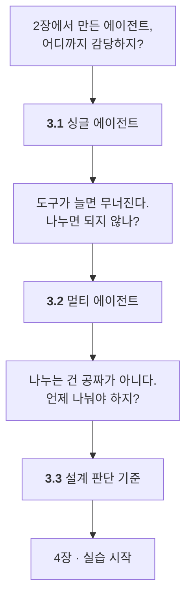

# Chapter 03 · 목적에 따른 에이전트 아키텍처 설계 기준

> Part 01 | AI 에이전트의 개념과 원리

## 학습 목표

- 싱글 에이전트와 멀티 에이전트의 정의와 대표 사례를 구분할 수 있다
- 주어진 문제에 대해 싱글/멀티 중 어느 쪽이 적합한지 판단 기준을 세울 수 있다

## 이 장의 이해 흐름

2장에서 만든 에이전트를 **하나로 둘지 여럿으로 나눌지** 정하는 장입니다. **Part 01의 마지막**입니다.

| 절 | 이 절의 질문 | 얻는 것 |
| :--- | :--- | :--- |
| **3.1** | 에이전트 하나가 어디까지 감당하지? | **"싱글 = 판단 주체가 하나"** 와 무너지는 지점 |
| **3.2** | "나눈다"는 게 정확히 뭘 나누는 거지? | **프롬프트·도구·이력**의 분리와 **세 가지 패턴** |
| **3.3** | 언제 나누고 언제 나누지 말아야 하지? | **증상을 확인한 뒤 역할·출처·권한으로** |

### 3장 전체를 한 줄로

> **2장에서 만든 에이전트 하나가 싱글이고(3.1) → 도구가 늘면 무너져서 나누는 게 멀티이며(3.2) → 나누는 건 증상을 확인한 뒤에, 역할·출처·권한을 기준으로 한다(3.3).**

## 절별 노트

| 절 | 노트 파일 | 진도 |
| --- | --- | --- |
| 3.1 | [`03-01_싱글 에이전트.md`](03-01_%EC%8B%B1%EA%B8%80%20%EC%97%90%EC%9D%B4%EC%A0%84%ED%8A%B8.md) | ☐ |
| 3.2 | [`03-02_멀티 에이전트.md`](03-02_%EB%A9%80%ED%8B%B0%20%EC%97%90%EC%9D%B4%EC%A0%84%ED%8A%B8.md) | ☐ |
| 3.3 | [`03-03_어떤 에이전트를 설계해야 할까.md`](03-03_%EC%96%B4%EB%96%A4%20%EC%97%90%EC%9D%B4%EC%A0%84%ED%8A%B8%EB%A5%BC%20%EC%84%A4%EA%B3%84%ED%95%B4%EC%95%BC%20%ED%95%A0%EA%B9%8C.md) | ☐ |

소절까지 펼쳐보기

- [ ] **[3.1 싱글 에이전트](03-01_%EC%8B%B1%EA%B8%80%20%EC%97%90%EC%9D%B4%EC%A0%84%ED%8A%B8.md)**
  - [ ] 3.1.1 싱글 에이전트의 정의
  - [ ] 3.1.2 싱글 에이전트의 대표적 예시
- [ ] **[3.2 멀티 에이전트](03-02_%EB%A9%80%ED%8B%B0%20%EC%97%90%EC%9D%B4%EC%A0%84%ED%8A%B8.md)**
- [ ] **[3.3 어떤 에이전트를 설계해야 할까](03-03_%EC%96%B4%EB%96%A4%20%EC%97%90%EC%9D%B4%EC%A0%84%ED%8A%B8%EB%A5%BC%20%EC%84%A4%EA%B3%84%ED%95%B4%EC%95%BC%20%ED%95%A0%EA%B9%8C.md)**
  - [ ] 3.3.1 싱글 에이전트로 충분한 경우
  - [ ] 3.3.2 멀티 에이전트가 필요한 경우

## 관련 예제 코드

이 장은 개념 설명 중심이라 저장소에 대응하는 예제 코드가 없습니다.

## 참고 문서

| 무엇을 볼 때 | 문서 |
| --- | --- |
| 3.1~3.2 싱글 vs 멀티 구조 비교 | [Workflows and agents](https://docs.langchain.com/oss/python/langgraph/workflows-agents) |
| 3.3 "언제 멀티로 가야 하나" | Anthropic, [Building effective agents](https://www.anthropic.com/engineering/building-effective-agents) |
| 멀티 에이전트 위임 패턴 | [LangChain · Subagents](https://docs.langchain.com/oss/python/langchain/multi-agent/subagents) |
| 설계 사고 훈련 | [Thinking in LangGraph](https://docs.langchain.com/oss/python/langgraph/thinking-in-langgraph) |

> 3장의 판단 기준은 7장 실습에서 그대로 다시 쓰입니다. 넘어가지 말고 정리해두세요.

## 이 폴더 구성

- `03-01_…md` ~ `03-03_…md` — 절별 학습 노트
- `notes.md` — 장 전체 요약 (절 노트를 다 쓴 뒤 마지막에 정리)
- `practice/` — 예제를 보지 않고 직접 쳐보는 공간

> **메모**  
> 개념 위주의 장입니다. 내가 만들고 싶은 서비스를 하나 정해두고, 이 장의 기준으로 아키텍처를 스케치해보세요.

---

[⬅ 전체 목차로](../STUDY.md)
