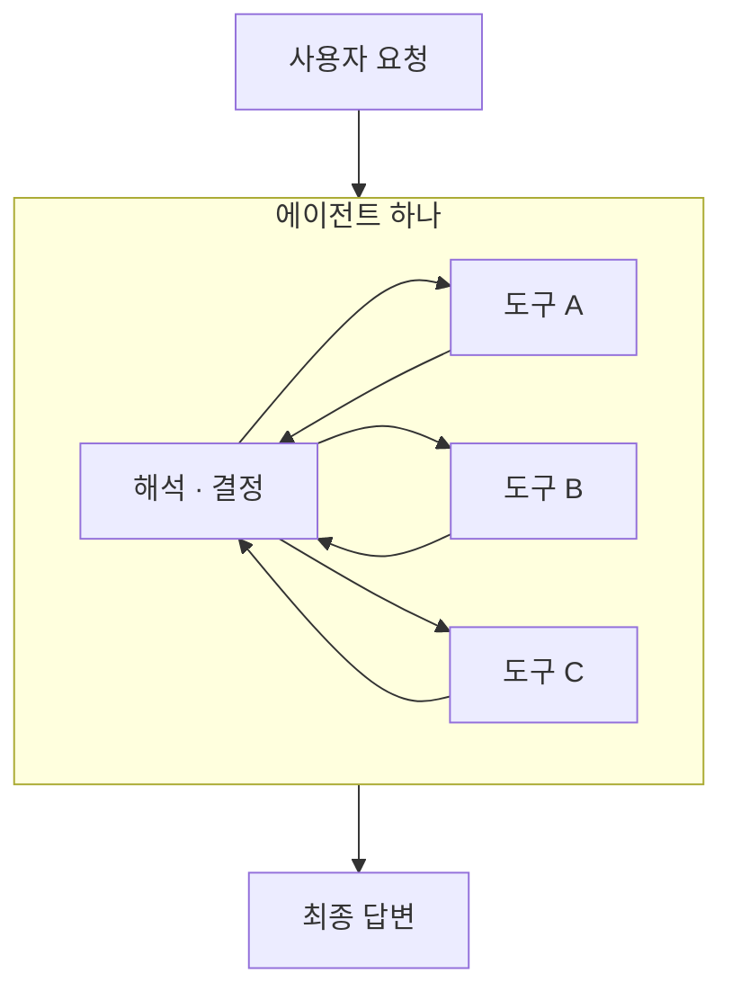
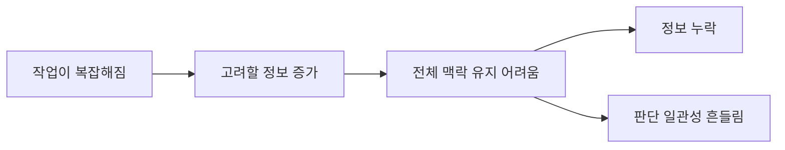
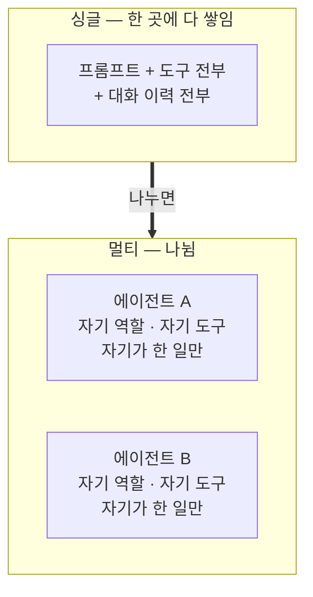
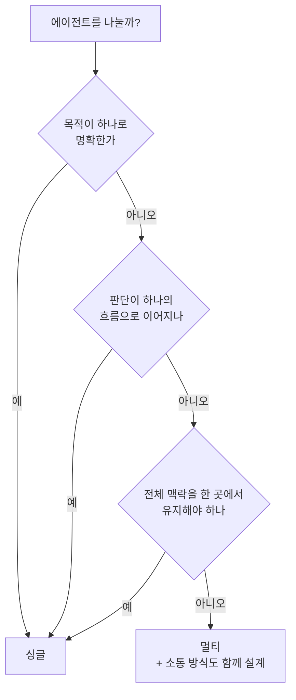

# Chapter 03 필기 — 싱글 에이전트와 멀티 에이전트

> 절별 상세는 [3.1](03-01_%EC%8B%B1%EA%B8%80%20%EC%97%90%EC%9D%B4%EC%A0%84%ED%8A%B8.md) · [3.2](03-02_%EB%A9%80%ED%8B%B0%20%EC%97%90%EC%9D%B4%EC%A0%84%ED%8A%B8.md) · [3.3](03-03_%EC%96%B4%EB%96%A4%20%EC%97%90%EC%9D%B4%EC%A0%84%ED%8A%B8%EB%A5%BC%20%EC%84%A4%EA%B3%84%ED%95%B4%EC%95%BC%20%ED%95%A0%EA%B9%8C.md)
>
> **용어는 공식 문서 기준.** 교재 용어가 다를 때는 괄호로 병기함.

## 용어 대응

| 공식 문서 | 교재 · 필기 | 비고 |
| :--- | :--- | :--- |
| **에이전트(Agent)** | 싱글 에이전트 | 공식 문서는 그냥 agent. "싱글"은 멀티와 대비할 때만 붙임 |
| **Orchestrator-worker** | 슈퍼바이저 · 플래닝 | 검색할 때는 이 이름 |
| **핸드오프(Handoff)** | 에이전트 간 소통 | 랭그래프에서는 `Command`로 표현 |
| — | 네트워크 | 공식 패턴 이름이 따로 없음 |

## 이 장의 질문

2장에서 **추론·도구·메모리를 하나의 루프로 조립**했습니다. 그렇게 만든 에이전트가 **하나면 충분한가, 나눠야 하는가**를 정하는 것이 이 장입니다.

## 싱글 에이전트

- **하나의 에이전트가 독립적으로 모든 추론과 행동을 수행하는 시스템**을 의미. **도구 호출 에이전트**가 대표적인 예시
- 스스로 판단하고 행동하는 과정이 **하나의 주체 안에서** 이루어지며, 목적에 따라 필요한 도구를 선택하고 실행까지 담당함. **다른 에이전트와 협력하거나 역할을 분리하지 않는다**는 점이 핵심

### 에이전트가 갖춰야 할 것

에이전트는 **특정 목적을 가진 실행 주체**입니다. 주어진 목적을 달성하기 위해 셋을 할 수 있어야 합니다.

| | 하는 일 |
| :--- | :--- |
| **해석** | 현재 상황을 읽음 |
| **결정** | 그에 맞는 행동을 스스로 정함 |
| **실행** | 필요하면 도구를 써서 실제로 함 |

**싱글 에이전트는 이 셋을 하나의 독립된 주체 안에서 충족합니다.**

**도구는 여럿이어도 판단하는 주체는 하나**입니다. 이게 싱글 에이전트의 정의입니다 — 도구 개수가 아니라 **판단 주체의 수**로 가릅니다.

### 장점 — 전부 "하나"에서 나옵니다

- **의사결정이 빠르고 불필요한 소통 비용이 발생하지 않음**
- 범위가 명확하고 목적이 분명한 경우, 하나의 주체가 모든 판단과 실행을 담당하는 방식이 **효율적**
- **하나의 목적 아래에서 판단과 실행을 정리할 수 있다면 충분히 싱글로 해결 가능**

> **여행 계획 예시** — 여러 단계의 판단과 선택이 들어가지만, 모든 결정이 **"여행 계획을 완성한다"는 하나의 목표**를 중심으로 이루어짐. 그래서 나눌 이유가 없음.

**판단 기준을 한 줄로** — *하나의 판단 주체가 여러 능력을 통합적으로 활용할 수 있는가.*

### 어디서 무너지는가

작업이 복잡해질수록 **하나의 에이전트가 고려할 정보의 양과 판단의 범위가 급격히 늘어납니다.**

**정보량이 늘면 판단이 흔들린다** — 이게 다음 절로 넘어가는 이유입니다.

## 멀티 에이전트

- **여러 개의 에이전트가 각자의 판단을 수행하며 상호작용하는 구조**
- **단순히 싱글 에이전트를 여러 개 나열한다고 멀티 에이전트가 되는 것은 아님.** 핵심은 **에이전트 간 의사결정과 정보 교환이 발생하는가**
- 각 에이전트가 **독립적인 판단 주체**로 동작함. 동일한 목표를 향해 협력할 수도, 서로 다른 하위 목적을 맡아 역할을 분담할 수도 있음
- 중요한 점은 **하나의 에이전트에 모여 있지 않고 여러 에이전트로 분산된다**는 것

### 나누면 무엇이 나뉘나

각 에이전트가 **자신에게 할당된 역할과 목적에만 집중**하므로, **개별 에이전트가 다뤄야 할 정보의 범위가 줄어들어 안정적으로 판단을 유지**할 수 있습니다.

> **한 줄로** — 멀티 에이전트는 하나의 에이전트가 모든 일을 처리하는 대신, **여러 에이전트가 문제를 나누어 생각하도록 설계된 구조**입니다.

**확장에도 유리합니다.** 새로운 역할이나 기능이 필요하면 **그 역할에 특화된 에이전트를 추가**하면 됩니다. 유지·보수에도 좋습니다.

### 대가 — 소통 비용

에이전트 간 소통이 필수이므로 **시스템이 커질수록 비용도 증가합니다.**

| 무엇이 | 왜 |
| :--- | :--- |
| **호출 횟수** | 각 에이전트의 작업물이 매번 다른 에이전트에 전달돼야 함 |
| **정보 손실 위험** | 전달 과정에서 **누락되거나 왜곡**될 수 있음 |
| **품질** | 소통 구조가 잘 설계되지 않으면 **맥락이 어긋나** 전체 결과가 나빠짐 |

> **총 토큰이 줄어드는 게 아닙니다.** 오히려 늘어나기 쉽습니다. 줄어드는 것은 **한 번의 LLM 호출에 들어가는 양**이고, 그래서 각자의 판단이 정확해집니다([3.2절](03-02_%EB%A9%80%ED%8B%B0%20%EC%97%90%EC%9D%B4%EC%A0%84%ED%8A%B8.md)).

## 어떤 에이전트를 설계해야 할까

**기본값은 싱글입니다.** 나눠서 얻는 것이 소통 비용보다 클 때만 나눕니다.

| | 싱글로 충분 | 멀티가 필요 |
| :--- | :--- | :--- |
| **예** | 웹 검색 기반 질의응답, 파일 관리 | 자료 조사 + 보고서 작성, 풀스택 코딩 |
| **조건** | 목적이 하나로 명확 / 판단이 한 흐름 / 맥락을 한 곳에서 유지 | 위가 안 될 때 |
| **주의** | — | **에이전트 간 소통 방식이 함께 설계돼야** 효과가 남 |

### 나눌 때는 무엇을 기준으로

| 기준 | 평가 |
| :--- | :--- |
| **역할·전문성** (조사 / 작성) | 좋음 |
| **데이터 출처** (웹 / 내부 DB) | 좋음 |
| **권한 수준** (읽기 전용 / 쓰기 가능) | 좋음 |
| **단순 작업 순서** (1단계 / 2단계) | **나쁨** |

**마지막이 함정입니다.** 순서가 고정된 일은 **코드로 이어 붙이면** 됩니다. LLM에게 "다음에 누구를 부를까"를 물을 이유가 없습니다 — 그건 워크플로입니다([1.4절](../ch01_llm-decision/01-04_LLM%20%EA%B8%B0%EB%B0%98%20%EC%97%90%EC%9D%B4%EC%A0%84%ED%8A%B8%20%EC%8B%9C%EC%8A%A4%ED%85%9C%2C%20%EC%9D%B4%EB%9F%B0%20%EA%B5%AC%EC%A1%B0%EB%A1%9C%20%EC%84%A4%EA%B3%84%EB%90%9C%EB%8B%A4.md)).

## 1장의 질문과 겹치는 지점

**두 축은 다른 질문**입니다.

| | 묻는 것 |
| :--- | :--- |
| **1.4의 축** | 흐름을 **미리 그릴 수 있는가** (워크플로 / 자율) |
| **3장의 축** | 판단 주체가 **하나면 되는가** (싱글 / 멀티) |

겹치면 네 칸이 나오고, 실제 시스템은 대개 **"큰 틀은 고정, 안쪽은 자율"** 자리에 놓입니다.

## 아직 열린 것

- [ ] "소통 방식을 함께 설계한다"가 **코드로는 무엇인지** — `Command`와 핸드오프 도구. 7장에서 확인
- [ ] 나누는 기준으로 **권한**을 쓰는 경우가 이 교재에 실제로 나오는지 — 11장 파일 삭제 도구가 그 예로 보임
- [ ] 네트워크 유형은 왜 공식 패턴 이름이 없는지 — 관리자가 없어서 "패턴"으로 굳지 않은 것인지

---

[⬅ Chapter 03](README.md) · [전체 목차](../STUDY.md)
