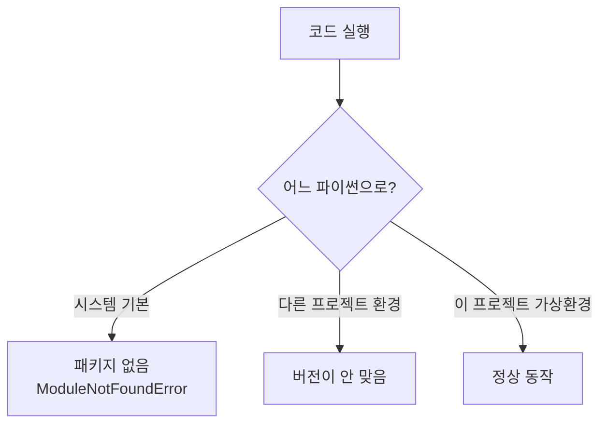

# 4.1 비주얼 스튜디오 코드 환경 설정하기

> **공식 문서** — [VS Code · Python 시작하기](https://code.visualstudio.com/docs/python/python-tutorial)

> **여기까지** — Part 01에서 **개념**을 잡았습니다. 에이전트가 무엇이고 어떤 구조로 만드는지.
> **이 절의 질문** — 이제 만들려면 **무엇부터 깔아야 하지?**
> **다 읽으면** — `ModuleNotFoundError`가 왜 나는지, 왜 패키지를 다시 깔아도 안 고쳐지는지 알게 됩니다.

1~3장은 개념이었습니다. 4장부터는 실제로 코드를 씁니다. 그 전에 **손이 닿는 자리**를 만듭니다.

이 책의 실습은 세 가지를 오갑니다.

- **`.py` 파일** — 에이전트 서버처럼 계속 도는 것
- **주피터 노트북(`.ipynb`)** — 한 줄씩 확인하며 개념을 익히는 것 (이 책 예제 상당수가 이 형태입니다)
- **터미널** — `langgraph dev` 같은 명령을 돌리는 것

셋을 한 창에서 할 수 있어야 합니다. 그래서 VS Code입니다.

## 4.1.1 [실습] VS Code 설치하기

설치 자체는 [공식 사이트](https://code.visualstudio.com/)에서 받아 실행하면 끝입니다. 중요한 건 그다음입니다.

### 확장 두 개를 반드시 깝니다

| 확장 | 식별자 | 없으면 |
| :--- | :--- | :--- |
| **Python** | `ms-python.python` | 인터프리터 선택·디버깅·자동완성이 안 됨 |
| **Jupyter** | `ms-toolsai.jupyter` | `.ipynb` 파일을 못 엶 |

`Ctrl+Shift+X`로 확장 탭을 열고 이름으로 검색해 설치합니다.

> **Python 확장을 깔면 Jupyter가 딸려 오는 경우가 많지만, 확인하세요.** 예제 상당수가 노트북이라 Jupyter가 없으면 첫 실습부터 막힙니다.

### 인터프리터 선택 — 여기서 제일 많이 막힙니다

VS Code는 **파이썬을 여러 개 찾아낼 수 있습니다.** 시스템에 깔린 것, 아나콘다 기본 환경, 프로젝트 가상 환경… 그중 **어느 것으로 실행할지 직접 골라 줘야** 합니다.

```
Ctrl+Shift+P  →  Python: Select Interpreter
```



> **`ModuleNotFoundError: No module named 'langchain'` 이 나면 십중팔구 이것입니다.**
> 터미널에서는 설치했는데 VS Code가 다른 파이썬을 보고 있는 상황입니다. 패키지를 다시 깔지 말고 **인터프리터부터 확인**하세요. 창 아래쪽 상태 표시줄에 현재 선택된 인터프리터가 보입니다.
>
> 가상 환경은 [4.2절](04-02_%EC%95%84%EB%82%98%EC%BD%98%EB%8B%A4%20%EB%B0%8F%20%EA%B0%80%EC%83%81%20%ED%99%98%EA%B2%BD%20%EC%84%A4%EC%A0%95%ED%95%98%EA%B8%B0.md)에서 만듭니다. 만든 뒤에 이 선택을 다시 해 줘야 합니다.

**노트북은 선택이 따로입니다.** `.ipynb`를 열면 오른쪽 위에 커널 선택이 별도로 있습니다. 파일 실행은 잘되는데 노트북만 안 되면 여기를 보세요.

### 이 저장소에서 골라야 할 인터프리터

> **실측 (2026-08-31 · 이 PC)**

이 PC에서 `python`을 그냥 치면 **파이썬이 아니라 Microsoft Store 스텁**이 잡힙니다.

```powershell
Get-Command python | Select-Object -ExpandProperty Source
python --version
```

```
C:\Users\dorim\AppData\Local\Microsoft\WindowsApps\python.exe
Python
```

**`Python` 뒤에 버전 번호가 없습니다.** 진짜 파이썬이면 `Python 3.12.14`처럼 나옵니다. 이 스텁은 실행해도 아무 일이 일어나지 않거나 스토어를 엽니다. **VS Code가 이걸 고르면 위 그림의 "패키지 없음" 경로로 갑니다.**

골라야 할 것은 프로젝트 안의 가상 환경입니다.

```powershell
uv run python -c "import sys; print(sys.executable)"
```

```
C:\Users\dorim\Study\ai-agent\.venv\Scripts\python.exe
```

**이 경로를 `Python: Select Interpreter`에 넣으면 됩니다.** 보통은 목록에 `.venv`가 자동으로 뜹니다. 안 보이면 `Enter interpreter path…`로 위 경로를 직접 붙여 넣으세요.

> **터미널에서는 `uv run`을 쓰세요.** `python main.py`라고 치면 스텁이 잡힙니다. `uv run python main.py`가 맞습니다. 자세한 것은 [4.2절](04-02_%EC%95%84%EB%82%98%EC%BD%98%EB%8B%A4%20%EB%B0%8F%20%EA%B0%80%EC%83%81%20%ED%99%98%EA%B2%BD%20%EC%84%A4%EC%A0%95%ED%95%98%EA%B8%B0.md).

## 4.1.2 [실습] 프로젝트 폴더 생성하기

폴더 하나를 만들고 **VS Code로 그 폴더를 엽니다.** 파일 하나만 여는 게 아니라 폴더를 여는 것이 중요합니다. VS Code는 열린 폴더를 기준으로 인터프리터·설정·상대 경로를 판단합니다.

```
File → Open Folder…
```

### 작업 디렉터리가 상대 경로의 기준입니다

앞으로 자주 걸릴 문제라 여기서 짚습니다. 파이썬에서 `.env`나 문서 파일을 **상대 경로로 읽을 때 기준은 "파일이 있는 위치"가 아니라 "실행한 위치"** 입니다.

| 실행 방식 | 기준 디렉터리 |
| :--- | :--- |
| 터미널에서 `python main.py` | 터미널의 현재 위치 |
| 노트북 셀 실행 | **그 노트북 파일이 있는 폴더** |
| VS Code 실행 버튼 | 설정에 따라 다름 |

[4.3절](04-03_%ED%99%98%EA%B2%BD%EB%B3%80%EC%88%98%20%EC%84%A4%EC%A0%95%ED%95%98%EA%B8%B0.md)에서 `.env`를 못 찾는 문제가 정확히 이것 때문에 생깁니다.

### 이 저장소의 폴더 구조

교재는 폴더 하나에서 시작하지만, 이 학습 저장소는 장별로 나뉘어 있습니다.

```
ai-agent/
├── ch04_dev-env/
│   ├── .env.example      ← 복사해서 .env 로
│   ├── examples/         ← 저자 원본 (읽기 전용)
│   └── practice/         ← 직접 치는 곳
└── ch05_langgraph-basics/
    └── …
```

**저장소 루트를 VS Code로 여세요.** 장별로 따로 열면 장을 옮길 때마다 인터프리터를 다시 골라야 합니다.

## 요약 및 비유

**작업실을 차리는 일**입니다. 연장을 사 두는 것(설치)보다 **어느 연장을 쓸지 정해 두는 것**(인터프리터 선택)이 실제로는 더 자주 문제가 됩니다.

| 개념 | 작업실 비유 | 기술적 의미 |
| :--- | :--- | :--- |
| **VS Code** | 작업대 | 편집기 + 터미널 + 노트북을 한 창에 |
| **Python 확장** | 전동 공구 어댑터 | 인터프리터 인식·디버깅 |
| **Jupyter 확장** | 실험용 작업판 | `.ipynb` 실행 |
| **인터프리터 선택** | 어느 공구를 쓸지 지정 | 실행할 파이썬 지정 |
| **`ModuleNotFoundError`** | 다른 서랍의 공구를 집음 | 인터프리터 불일치 |
| **노트북 커널** | 실험판 전용 공구 | 노트북은 별도 선택 |
| **폴더 열기** | 작업실 자체를 정함 | 상대 경로·설정의 기준 |
| **작업 디렉터리** | 지금 서 있는 자리 | 상대 경로의 출발점 |

## 결론

* 이 책의 실습은 **`.py` · 노트북 · 터미널**을 오갑니다. VS Code는 셋을 한 창에서 하려고 쓰는 것입니다.
* **Python과 Jupyter 확장** 두 개는 필수입니다. 예제 상당수가 노트북입니다.
* **`ModuleNotFoundError`가 나면 패키지가 아니라 인터프리터를 먼저 의심하세요.** `Ctrl+Shift+P → Python: Select Interpreter`.
* **노트북 커널은 따로 고릅니다.** 파일은 되는데 노트북만 안 되는 경우가 여기서 나옵니다.
* 파일이 아니라 **폴더를 여세요.** 이 저장소는 루트(`ai-agent/`)를 여는 것이 편합니다.
* 상대 경로의 기준은 파일 위치가 아니라 **실행한 위치**입니다. 4.3절에서 이 문제가 실제로 나옵니다.

---

## 다음 절로

인터프리터를 골라야 한다는 건 알았습니다. **그런데 뭘 고르죠?**

시스템에 깔린 파이썬을 그냥 쓰면 안 될까요? → **[4.2절](04-02_%EC%95%84%EB%82%98%EC%BD%98%EB%8B%A4%20%EB%B0%8F%20%EA%B0%80%EC%83%81%20%ED%99%98%EA%B2%BD%20%EC%84%A4%EC%A0%95%ED%95%98%EA%B8%B0.md)**

---

[Chapter 04](README.md) · [4.2 ➡](04-02_%EC%95%84%EB%82%98%EC%BD%98%EB%8B%A4%20%EB%B0%8F%20%EA%B0%80%EC%83%81%20%ED%99%98%EA%B2%BD%20%EC%84%A4%EC%A0%95%ED%95%98%EA%B8%B0.md)
