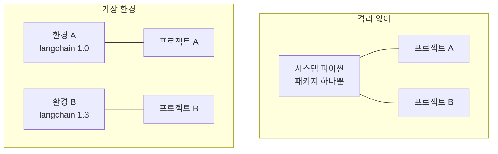

# 4.2 아나콘다 및 가상 환경 설정하기

> **공식 문서** — [uv 공식 문서](https://docs.astral.sh/uv/) · [Install LangGraph](https://docs.langchain.com/oss/python/langgraph/install)

## 왜 격리하는가

파이썬 패키지를 시스템에 그냥 깔면 **모든 프로젝트가 같은 것을 씁니다.** 처음엔 편하지만 곧 무너집니다.

```
프로젝트 A: langchain 1.0 이 필요
프로젝트 B: langchain 1.3 이 필요
→ 하나만 깔 수 있음
```

이 책에서는 더 절실합니다. [`pyproject.toml`](../pyproject.toml)을 보면 알 수 있듯이 **버전 범위가 좁게 묶여 있습니다.** `mcp<2`, `a2a-sdk<1` 같은 상한이 걸려 있고, 이걸 다른 프로젝트와 공유하면 서로 밟습니다.

**가상 환경(Virtual Environment)** 은 프로젝트마다 **독립된 패키지 폴더**를 갖게 하는 장치입니다.



## 4.2.1 [실습] 아나콘다 설치하기

교재는 **아나콘다(Anaconda)** 를 씁니다. 파이썬 본체와 패키지 관리자(`conda`)를 함께 설치해 주는 배포판입니다.

[공식 사이트](https://www.anaconda.com/download)에서 받아 설치하고, 터미널에서 확인합니다.

```powershell
conda --version
```

> **Windows에서 `conda`를 못 찾는다고 나오면** 일반 PowerShell 대신 **Anaconda Prompt**를 쓰거나, 설치 시 PATH 등록 옵션을 켰는지 확인하세요. VS Code 안의 터미널에서도 마찬가지입니다.

## 4.2.2 [실습] 아나콘다 가상 환경 구성하기

환경을 만들고, 켜고, 패키지를 깝니다.

```powershell
conda create -n langgraph python=3.12
conda activate langgraph
pip install -r requirements.txt
```

| 명령 | 하는 일 |
| :--- | :--- |
| `conda create -n <이름> python=3.12` | 그 이름으로 독립된 환경을 만듦 |
| `conda activate <이름>` | 지금 터미널이 그 환경을 보게 함 |
| `conda deactivate` | 해제 |
| `conda env list` | 만들어 둔 환경 목록 |

**활성화되면 프롬프트 앞에 환경 이름이 붙습니다.** `(langgraph) PS C:\…` 처럼요. 이게 안 보이면 활성화가 안 된 것입니다.

> **파이썬은 3.11 이상이 필요합니다.** [`pyproject.toml`](../pyproject.toml)의 `requires-python = ">=3.11"` 입니다.

### VS Code에도 알려 줘야 합니다

환경을 만들었다고 VS Code가 자동으로 쓰지 않습니다. [4.1절](04-01_%EB%B9%84%EC%A3%BC%EC%96%BC%20%EC%8A%A4%ED%8A%9C%EB%94%94%EC%98%A4%20%EC%BD%94%EB%93%9C%20%ED%99%98%EA%B2%BD%20%EC%84%A4%EC%A0%95%ED%95%98%EA%B8%B0.md)의 인터프리터 선택을 **다시** 해야 합니다.

```
Ctrl+Shift+P → Python: Select Interpreter → langgraph 환경 선택
```

**터미널과 편집기가 서로 다른 환경을 볼 수 있다**는 점을 기억하세요. 터미널에서 `conda activate`를 했어도 VS Code의 실행 버튼은 예전 인터프리터를 쓸 수 있습니다.

## uv를 써도 됩니다

이 저장소는 **uv** 기준으로도 구성돼 있습니다. [`pyproject.toml`](../pyproject.toml)과 `uv.lock`이 그것입니다.

```powershell
winget install --id=astral-sh.uv -e
```

```powershell
uv venv
.venv\Scripts\activate
uv sync
```

| | conda + requirements.txt | uv + pyproject.toml |
| :--- | :--- | :--- |
| 교재 | **이쪽** | — |
| 이 저장소 | 가능 | **이쪽이 기준** |
| 버전 고정 | `requirements.txt` (저자 원본 스냅숏) | `uv.lock` |
| 속도 | 보통 | 빠름 |

> **둘을 섞지 마세요.** conda 환경을 켜 둔 채 `uv sync`를 돌리면 어디에 깔리는지 헷갈립니다. 하나를 정해서 쓰세요.

## 공식 문서와 다른 점 (2026년 8월 기준)

- **`requirements.txt`는 저자가 만든 시점의 스냅숏**이라 `pyproject.toml`보다 오래되었습니다. `langchain==1.0.0`, `mcp==1.19.0` 같은 핀이 들어 있습니다. 최신 상태로 맞추려면 `uv sync --upgrade` 후 `uv export`로 다시 뽑는 것이 정확합니다.
- 버전 상한을 왜 걸어 뒀는지는 [CLAUDE.md](../CLAUDE.md) §6에 정리돼 있습니다. **`mcp<2`와 `a2a-sdk<1`은 풀면 9~11장 예제가 깨집니다.**

## 요약 및 비유

**프로젝트마다 따로 쓰는 도구 상자**입니다. 상자를 나누는 이유는 도구가 아까워서가 아니라, **같은 이름의 다른 규격이 섞이지 않게** 하기 위해서입니다.

| 개념 | 도구 상자 비유 | 기술적 의미 |
| :--- | :--- | :--- |
| **시스템 파이썬** | 모두가 함께 쓰는 공용 상자 | 전역 패키지 |
| **가상 환경** | 프로젝트 전용 상자 | 독립된 패키지 폴더 |
| **`conda create`** | 새 상자를 짬 | 환경 생성 |
| **`conda activate`** | 그 상자를 작업대에 올림 | 현재 터미널이 그 환경을 봄 |
| **프롬프트의 `(langgraph)`** | 어느 상자를 쓰는지 표시 | 활성 환경 표시 |
| **VS Code 인터프리터** | 편집기가 볼 상자 | 터미널과 별개로 지정 |
| **`uv`** | 더 빠른 새 상자 규격 | pyproject 기반 관리 |
| **버전 상한** | 이 상자엔 이 규격만 | `mcp<2`, `a2a-sdk<1` |

## 결론

* 가상 환경은 **프로젝트마다 독립된 패키지 폴더**를 갖게 합니다. 이 책은 버전 범위가 좁아 특히 필요합니다.
* 교재는 아나콘다 기준입니다 — `conda create -n langgraph python=3.12` → `conda activate` → `pip install -r requirements.txt`.
* **프롬프트 앞에 환경 이름이 보이는지** 확인하세요. 안 보이면 활성화가 안 된 것입니다.
* 환경을 만든 뒤 **VS Code 인터프리터를 다시 골라야** 합니다. 터미널과 편집기는 서로 다른 환경을 볼 수 있습니다.
* 이 저장소는 **uv 기준**으로도 구성돼 있습니다(`pyproject.toml` + `uv.lock`). 둘 중 하나를 정해서 쓰고 섞지 마세요.
* `requirements.txt`는 저자 원본 스냅숏이라 `pyproject.toml`보다 오래되었습니다.

---

[⬅ 4.1](04-01_%EB%B9%84%EC%A3%BC%EC%96%BC%20%EC%8A%A4%ED%8A%9C%EB%94%94%EC%98%A4%20%EC%BD%94%EB%93%9C%20%ED%99%98%EA%B2%BD%20%EC%84%A4%EC%A0%95%ED%95%98%EA%B8%B0.md) · [Chapter 04](README.md) · [4.3 ➡](04-03_%ED%99%98%EA%B2%BD%EB%B3%80%EC%88%98%20%EC%84%A4%EC%A0%95%ED%95%98%EA%B8%B0.md)
