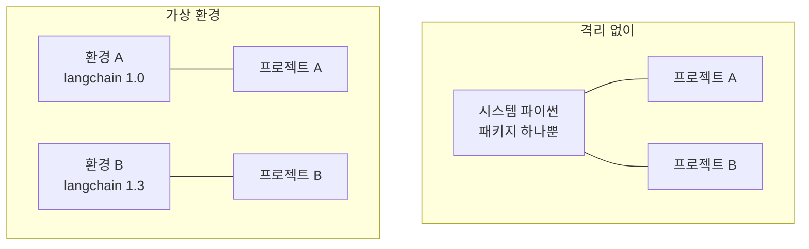

# 4.2 아나콘다 및 가상 환경 설정하기

> **공식 문서** — [uv 공식 문서](https://docs.astral.sh/uv/) · [Install LangGraph](https://docs.langchain.com/oss/python/langgraph/install)

> **여기까지** — VS Code를 깔고 **인터프리터를 골라야 한다**는 것까지 왔습니다([4.1절](04-01_%EB%B9%84%EC%A3%BC%EC%96%BC%20%EC%8A%A4%ED%8A%9C%EB%94%94%EC%98%A4%20%EC%BD%94%EB%93%9C%20%ED%99%98%EA%B2%BD%20%EC%84%A4%EC%A0%95%ED%95%98%EA%B8%B0.md)).
> **이 절의 질문** — 그 **인터프리터를 어떻게 만들지?** 그리고 왜 시스템 파이썬을 그냥 쓰면 안 되지?
> **다 읽으면** — 프로젝트마다 독립된 파이썬 환경을 만들 수 있게 됩니다.

## 왜 격리하는가

파이썬 패키지를 시스템에 그냥 깔면 **모든 프로젝트가 같은 것을 씁니다.** 처음엔 편하지만 곧 무너집니다.

```
프로젝트 A: langchain 1.0 이 필요
프로젝트 B: langchain 1.3 이 필요
→ 하나만 깔 수 있음
```

이 책에서는 더 절실합니다. [`pyproject.toml`](../pyproject.toml)을 보면 알 수 있듯이 **버전 범위가 좁게 묶여 있습니다.** `mcp<2`, `a2a-sdk<1` 같은 상한이 걸려 있고, 이걸 다른 프로젝트와 공유하면 서로 밟습니다.

**가상 환경(Virtual Environment)** 은 프로젝트마다 **독립된 패키지 폴더**를 갖게 하는 장치입니다.



## 4.2.1 [실습] 아나콘다 설치하기

교재는 **아나콘다(Anaconda)** 를 씁니다. 파이썬 본체와 패키지 관리자(`conda`)를 함께 설치해 주는 배포판입니다.

[공식 사이트](https://www.anaconda.com/download)에서 받아 설치하고, 터미널에서 확인합니다.

```powershell
conda --version
```

> **Windows에서 `conda`를 못 찾는다고 나오면** 일반 PowerShell 대신 **Anaconda Prompt**를 쓰거나, 설치 시 PATH 등록 옵션을 켰는지 확인하세요. VS Code 안의 터미널에서도 마찬가지입니다.

## 4.2.2 [실습] 아나콘다 가상 환경 구성하기

환경을 만들고, 켜고, 패키지를 깝니다.

```powershell
conda create -n langgraph python=3.12
conda activate langgraph
pip install -r requirements.txt
```

| 명령 | 하는 일 |
| :--- | :--- |
| `conda create -n <이름> python=3.12` | 그 이름으로 독립된 환경을 만듦 |
| `conda activate <이름>` | 지금 터미널이 그 환경을 보게 함 |
| `conda deactivate` | 해제 |
| `conda env list` | 만들어 둔 환경 목록 |

**활성화되면 프롬프트 앞에 환경 이름이 붙습니다.** `(langgraph) PS C:\…` 처럼요. 이게 안 보이면 활성화가 안 된 것입니다.

> **파이썬은 3.11 이상이 필요합니다.** [`pyproject.toml`](../pyproject.toml)의 `requires-python = ">=3.11"` 입니다.

### VS Code에도 알려 줘야 합니다

환경을 만들었다고 VS Code가 자동으로 쓰지 않습니다. [4.1절](04-01_%EB%B9%84%EC%A3%BC%EC%96%BC%20%EC%8A%A4%ED%8A%9C%EB%94%94%EC%98%A4%20%EC%BD%94%EB%93%9C%20%ED%99%98%EA%B2%BD%20%EC%84%A4%EC%A0%95%ED%95%98%EA%B8%B0.md)의 인터프리터 선택을 **다시** 해야 합니다.

```
Ctrl+Shift+P → Python: Select Interpreter → langgraph 환경 선택
```

**터미널과 편집기가 서로 다른 환경을 볼 수 있다**는 점을 기억하세요. 터미널에서 `conda activate`를 했어도 VS Code의 실행 버튼은 예전 인터프리터를 쓸 수 있습니다.

## uv를 써도 됩니다

이 저장소는 **uv** 기준으로도 구성돼 있습니다. [`pyproject.toml`](../pyproject.toml)과 `uv.lock`이 그것입니다.

**이 저장소는 실제로 uv로 구축돼 있습니다.** 아래는 그때 실행한 명령과 **실제 출력**입니다.

> **실측 (2026-08-31 · Windows 11 · 관리자 권한 없음)**

관리자 권한이 없어도 됩니다. `--scope user`가 사용자 폴더에만 설치합니다.

```powershell
winget install --id=astral-sh.uv -e --scope user
```

```
찾음 uv [astral-sh.uv] 버전 0.12.7
다운로드 중 https://github.com/astral-sh/uv/releases/download/0.12.7/uv-x86_64-pc-windows-msvc.zip
설치 관리자 해시를 확인했습니다.
경로 환경 변수 수정됨; 셸을 다시 시작하여 새 값을 사용합니다.
설치 성공
```

파이썬도 uv가 받아 줍니다. **시스템에 설치하지 않습니다.**

```powershell
uv python install 3.12
```

```
Downloading cpython-3.12.14-windows-x86_64-none (download) (21.0MiB)
 Downloaded cpython-3.12.14-windows-x86_64-none
Installed Python 3.12.14 in 10.01s
 + cpython-3.12.14-windows-x86_64-none (python3.12.exe)
```

이제 패키지를 맞춥니다. **`uv venv`를 따로 부르지 않아도 됩니다.** `uv sync`가 `.venv`를 알아서 만듭니다.

```powershell
uv sync
```

```
Resolved 169 packages in 0.91ms
Checked 165 packages in 12ms
```

> 처음 실행하면 169개를 내려받느라 오래 걸립니다. 위 출력은 **이미 맞춰진 뒤 다시 돌린 것**이라 확인만 하고 끝납니다.

### 격리가 실제로 됐는지 확인

```powershell
uv run python -c "import sys; print(sys.executable)"
```

```
C:\Users\dorim\Study\ai-agent\.venv\Scripts\python.exe
```

**시스템 파이썬이 아니라 `.venv` 안의 파이썬**이 잡혔습니다. 패키지도 마찬가지입니다.

```powershell
uv run python -c "import langchain; from importlib.metadata import version; print(version('langchain')); print(langchain.__file__)"
```

```
1.3.18
C:\Users\dorim\Study\ai-agent\.venv\Lib\site-packages\langchain\__init__.py
```

**`site-packages`가 프로젝트 폴더 안에 있습니다.** 이게 격리입니다. 다른 프로젝트에서 `langchain` 다른 버전을 깔아도 이 폴더는 그대로입니다.

### `activate` 는 안 해도 됩니다

```powershell
uv run python ch06_single-agent/practice/my_agent.py
```

`uv run`이 알아서 `.venv`를 쓰기 때문에 **프롬프트 앞에 `(langgraph)` 같은 표시가 없어도 정상입니다.** conda 방식과 다른 점이라 헷갈리기 쉽습니다.

| | conda + requirements.txt | uv + pyproject.toml |
| :--- | :--- | :--- |
| 교재 | **이쪽** | — |
| 이 저장소 | 가능 | **이쪽이 기준 — 실제로 이걸로 구축함** |
| 버전 고정 | `requirements.txt` (저자 원본 스냅숏) | `uv.lock` |
| 활성화 | `conda activate` 필요 | **불필요** (`uv run`) |
| 관리자 권한 | 설치 시 필요할 수 있음 | **불필요** |
| 속도 | 보통 | 빠름 |

> **둘을 섞지 마세요.** conda 환경을 켜 둔 채 `uv sync`를 돌리면 어디에 깔리는지 헷갈립니다. 하나를 정해서 쓰세요.
>
> **패키지를 추가할 때는 `pip install`이 아니라 `uv add`입니다.** `uv run` 안에서 `pip install`을 하면 `pyproject.toml`에 기록되지 않아 다음 `uv sync` 때 사라집니다.

## 모델을 내 PC에서 돌리기 — 올라마

교재는 OpenAI API를 씁니다. **유료이고 선불 충전이 필요합니다.** 대안으로 **올라마(Ollama)** 를 쓰면 모델을 내 PC에서 돌릴 수 있습니다.

> **올라마(Ollama)** — 언어 모델을 내려받아 **내 컴퓨터에서 돌려 주는 프로그램**입니다. 도커가 컨테이너를 다루듯, 올라마는 모델을 다룹니다. 서버가 하나 떠 있고 거기에 요청을 보내는 구조라 **코드에서 보면 OpenAI와 똑같이 생겼습니다.**

**관리자 권한 없이 설치됩니다.**

```powershell
winget install --id=Ollama.Ollama -e --scope user
```

모델을 받고 서버를 띄웁니다.

```powershell
ollama pull <모델 태그>
ollama serve
```

`.env`에 어떤 모델을 쓸지 적어 둡니다.

```
OLLAMA_MODEL=<모델 태그>
OLLAMA_BASE_URL=http://localhost:11434
```

### 어디까지 올라마로 되나

**이 책 예제 89개 중 36개(40%)가 도구 호출을 씁니다.** 그리고 **도구 호출은 모델마다 지원 여부가 갈립니다.**

| 장 | 도구 호출 쓰는 예제 | 올라마로 |
| :--- | ---: | :--- |
| **4 · 5** | 0개 | 문제없음 |
| **8** | 1개 | 대체로 가능 |
| 6 | 9개 | 모델을 가려야 함 |
| 7 | 13개 | 어려움 — 매 단계 판단이 흔들리면 루프가 안 끝남 |
| 9 · 10 · 11 | 13개 | 모델에 따라 |

> **4 · 5 · 8장이 랭그래프 문법의 뼈대**입니다. 여기를 올라마로 끝내고 6장부터 API를 쓰는 조합이 현실적입니다. 둘 중 하나를 고를 필요가 없습니다.

### 되는지 직접 재 보세요

**모델 이름만 보고 판단하지 마세요.** "도구 호출 지원"이라고 적혀 있어도 인자를 엉뚱하게 채우는 경우가 흔합니다.

```powershell
uv run python scripts/check-ollama.py
```

[`scripts/check-ollama.py`](../scripts/check-ollama.py)가 네 가지를 검사합니다 — **단순 호출 · 도구 호출 · 도구 두 개 중 고르기 · 구조화 출력.** 각각이 이 책 어느 부분에 필요한지도 함께 찍어 줍니다.

> **[2]와 [3]이 통과하지 못하면** 6장 이후는 이 모델로 진행하기 어렵습니다. 스크립트가 그 판단까지 출력합니다.

### 하드웨어

| | |
| :--- | :--- |
| **RAM** | 모델 크기보다 넉넉해야 합니다. 4비트 양자화 기준 대략 **파라미터 수(B) × 0.6GB** |
| **GPU** | 올라마의 가속은 **NVIDIA · AMD** 기준입니다 |
| **내장 그래픽** | 대개 **CPU로 떨어집니다.** 돌아가긴 하지만 느립니다 |

**MoE(전문가 혼합) 모델은 CPU에 유리합니다.** 전체 파라미터는 크지만 **한 번에 쓰는 건 일부(활성 파라미터)** 라, 메모리는 많이 쓰되 속도는 작은 모델에 가깝습니다. `26B A4B`처럼 표기된 모델이 그런 경우입니다 — 전체 26B, 활성 4B.

> **속도는 직접 재세요.** 위 검사 스크립트가 `tok/s`를 함께 출력합니다. 에이전트는 **한 요청에 LLM을 여러 번** 부르므로, 한 번 호출이 10초면 루프 한 바퀴에 30초가 넘습니다.

## 공식 문서와 다른 점 (2026년 8월 기준)

- **이 저장소는 아나콘다를 쓰지 않았습니다.** 회사 노트북이라 계정에 관리자 권한이 없어 uv 사용자 범위 설치를 골랐습니다. 4.2.1~4.2.2절은 **교재 내용 그대로 두었고**, 실제 환경은 [CLAUDE.md](../CLAUDE.md) §5에 있습니다.
- **파이썬은 3.13이 아니라 3.12를 골랐습니다.** `requires-python = ">=3.11"`이라 둘 다 되지만, 최신 버전용 미리 빌드된 휠(wheel)이 없는 패키지는 소스 빌드로 넘어가고 **그러려면 MSVC 빌드 도구 = 관리자 권한**이 필요합니다. 3.12가 휠 지원 범위가 가장 넓습니다. `.python-version`에 고정해 뒀습니다.
- **`requirements.txt`는 저자가 만든 시점의 스냅숏**이라 `pyproject.toml`보다 오래되었습니다. `langchain==1.0.0`, `mcp==1.19.0` 같은 핀이 들어 있습니다. 최신 상태로 맞추려면 `uv sync --upgrade` 후 `uv export`로 다시 뽑는 것이 정확합니다.
- 버전 상한을 왜 걸어 뒀는지는 [CLAUDE.md](../CLAUDE.md) §6에 정리돼 있습니다. **`mcp<2`와 `a2a-sdk<1`은 풀면 9~11장 예제가 깨집니다.**

## 요약 및 비유

**프로젝트마다 따로 쓰는 도구 상자**입니다. 상자를 나누는 이유는 도구가 아까워서가 아니라, **같은 이름의 다른 규격이 섞이지 않게** 하기 위해서입니다.

| 개념 | 도구 상자 비유 | 기술적 의미 |
| :--- | :--- | :--- |
| **시스템 파이썬** | 모두가 함께 쓰는 공용 상자 | 전역 패키지 |
| **가상 환경** | 프로젝트 전용 상자 | 독립된 패키지 폴더 |
| **`conda create`** | 새 상자를 짬 | 환경 생성 |
| **`conda activate`** | 그 상자를 작업대에 올림 | 현재 터미널이 그 환경을 봄 |
| **프롬프트의 `(langgraph)`** | 어느 상자를 쓰는지 표시 | 활성 환경 표시 |
| **VS Code 인터프리터** | 편집기가 볼 상자 | 터미널과 별개로 지정 |
| **`uv`** | 더 빠른 새 상자 규격 | pyproject 기반 관리 |
| **버전 상한** | 이 상자엔 이 규격만 | `mcp<2`, `a2a-sdk<1` |

## 결론

* 가상 환경은 **프로젝트마다 독립된 패키지 폴더**를 갖게 합니다. 이 책은 버전 범위가 좁아 특히 필요합니다.
* 교재는 아나콘다 기준입니다 — `conda create -n langgraph python=3.12` → `conda activate` → `pip install -r requirements.txt`.
* **프롬프트 앞에 환경 이름이 보이는지** 확인하세요. 안 보이면 활성화가 안 된 것입니다.
* 환경을 만든 뒤 **VS Code 인터프리터를 다시 골라야** 합니다. 터미널과 편집기는 서로 다른 환경을 볼 수 있습니다.
* 이 저장소는 **실제로 uv로 구축했습니다**(`pyproject.toml` + `uv.lock` + `.python-version`). 둘 중 하나를 정해서 쓰고 섞지 마세요.
* **uv는 `activate`가 필요 없습니다.** `uv run`이 알아서 `.venv`를 씁니다. 프롬프트에 환경 이름이 안 보여도 정상입니다.
* 격리 확인은 **`sys.executable`과 패키지의 `__file__`이 `.venv` 안을 가리키는지** 보면 됩니다.
* `requirements.txt`는 저자 원본 스냅숏이라 `pyproject.toml`보다 오래되었습니다.

---

## 다음 절로

환경이 준비됐습니다. 이제 LLM을 부르면 되는데 — **API 키**가 필요합니다.

```python
llm = ChatOpenAI(api_key="sk-proj-abc123...")
```

이렇게 코드에 적으면 될까요? **절대 안 됩니다.** 왜일까요? → **[4.3절](04-03_%ED%99%98%EA%B2%BD%EB%B3%80%EC%88%98%20%EC%84%A4%EC%A0%95%ED%95%98%EA%B8%B0.md)**

---

[⬅ 4.1](04-01_%EB%B9%84%EC%A3%BC%EC%96%BC%20%EC%8A%A4%ED%8A%9C%EB%94%94%EC%98%A4%20%EC%BD%94%EB%93%9C%20%ED%99%98%EA%B2%BD%20%EC%84%A4%EC%A0%95%ED%95%98%EA%B8%B0.md) · [Chapter 04](README.md) · [4.3 ➡](04-03_%ED%99%98%EA%B2%BD%EB%B3%80%EC%88%98%20%EC%84%A4%EC%A0%95%ED%95%98%EA%B8%B0.md)
