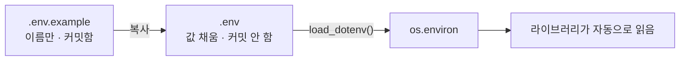

# 4.3 환경변수 설정하기

> **공식 문서** — [python-dotenv](https://saurabh-kumar.com/python-dotenv/) · [OpenAI · API keys](https://platform.openai.com/api-keys)

> **여기까지** — 파이썬 환경을 갖췄습니다([4.2절](04-02_%EC%95%84%EB%82%98%EC%BD%98%EB%8B%A4%20%EB%B0%8F%20%EA%B0%80%EC%83%81%20%ED%99%98%EA%B2%BD%20%EC%84%A4%EC%A0%95%ED%95%98%EA%B8%B0.md)).
> **이 절의 질문** — LLM을 부르려면 **API 키**가 필요한데, **어디에 둬야 하지?**
> **다 읽으면** — 키를 안전하게 두고 코드에서 꺼내 쓸 수 있게 됩니다. 4장에서 **가장 중요한 절**입니다.

## 키를 코드에 적으면 안 되는 이유

가장 빠른 방법은 이겁니다.

```python
llm = ChatOpenAI(api_key="sk-proj-abc123...")   # 절대 하지 마세요
```

이렇게 값을 **코드에 직접 박아 넣는 것**을 **하드코딩(hardcoding)** 이라고 합니다.

동작은 합니다. 문제는 **이 줄이 커밋된다**는 것입니다.

- 깃허브에 올라가는 순간 **자동 스캐너가 몇 분 안에 찾아냅니다.** 공개 저장소를 훑는 봇이 상시로 돌고 있습니다
- 나중에 지워도 **깃 히스토리에 남습니다.** 커밋을 되돌려도 이전 커밋에는 그대로 있습니다
- 남에게 코드를 보여 줄 때마다 키를 지워야 합니다

OpenAI 키는 **쓴 만큼 과금**됩니다. 유출되면 남이 쓴 요금이 청구됩니다.

> **이미 커밋했다면 지우는 것으로 끝나지 않습니다.** 반드시 **키를 폐기(revoke)하고 새로 발급**하세요. 히스토리에 남은 키는 계속 유효합니다.

## 4.3.1 [실습] .env 파일로 환경변수 저장하기

키를 **코드 밖의 파일**에 두고, 그 파일은 커밋하지 않습니다.

```
OPENAI_API_KEY=sk-proj-...
TAVILY_API_KEY=tvly-...
```

파일 이름은 `.env` 입니다. 형식은 `이름=값` 한 줄에 하나입니다.

| 규칙 | 설명 |
| :--- | :--- |
| 따옴표 | 보통 필요 없습니다. 값에 공백이 있을 때만 |
| 등호 주변 공백 | 넣지 않는 것이 안전합니다 |
| 주석 | `#` 로 시작 |
| 줄 끝 공백 | **주의** — 값에 딸려 들어가 인증 실패의 원인이 됩니다 |

### `.gitignore`에 반드시 넣습니다

```
.env
credentials.json
token.json
```

이 저장소에는 이미 등록돼 있습니다. 대신 **`.env.example`** 이 장마다 들어 있습니다.

```powershell
copy .env.example .env
```

`.env.example`은 **키 이름만 있고 값은 비어 있는 견본**입니다. 이건 커밋해도 됩니다. "이 장을 하려면 어떤 키가 필요한가"를 알려 주는 문서 역할입니다.



## 4.3.2 [실습] python-dotenv로 환경변수 불러오기

`.env`는 그냥 텍스트 파일이라 파이썬이 자동으로 읽지 않습니다. **`python-dotenv`** 가 읽어서 `os.environ`에 올려 줍니다.

```python
from dotenv import load_dotenv

load_dotenv()
```

두 줄이 전부입니다. 저자 예제 [`examples/4.4_main.py`](examples/4.4_main.py)도 이렇게 시작합니다.

### 왜 이것만으로 되는가

`load_dotenv()`가 값을 **`os.environ`에 올려 두면**, 라이브러리들이 알아서 정해진 이름을 찾아갑니다.

```python
load_dotenv()
llm = ChatOpenAI(model_name="gpt-4o")   # api_key 를 안 넘겼는데 동작함
```

`ChatOpenAI`가 내부에서 `OPENAI_API_KEY`를 찾기 때문입니다. **이름을 정확히 맞추는 것이 중요한 이유**가 이것입니다.

| 환경변수 이름 | 쓰는 곳 |
| :--- | :--- |
| `OPENAI_API_KEY` | 4~11장 전 실습 |
| `TAVILY_API_KEY` | 6, 7, 9, 10, 11장 (웹 검색) |
| `SUPABASE_URL` · `SUPABASE_KEY` | 7, 11장 |

### 못 찾을 때 — 작업 디렉터리 문제입니다

`.env`를 만들었는데 키가 없다고 나오는 일이 자주 있습니다. 원인은 대개 **`.env`를 찾는 위치**입니다.

인자 없이 `load_dotenv()`를 부르면 `.env`를 알아서 찾는데, **어디서부터 찾는지가 상황마다 다릅니다.**

| 실행 방식 | 찾기 시작하는 곳 |
| :--- | :--- |
| `python main.py` | 그 스크립트 위치를 기준으로 위로 올라가며 |
| 노트북 셀 | **그 노트북이 있는 폴더**를 기준으로 위로 |
| `langgraph dev` | 명령을 실행한 폴더 |

[4.1절](04-01_%EB%B9%84%EC%A3%BC%EC%96%BC%20%EC%8A%A4%ED%8A%9C%EB%94%94%EC%98%A4%20%EC%BD%94%EB%93%9C%20%ED%99%98%EA%B2%BD%20%EC%84%A4%EC%A0%95%ED%95%98%EA%B8%B0.md)에서 예고한 작업 디렉터리 문제가 여기서 터집니다.

> **이 저장소에서 특히 걸리는 곳** — 6장 이후 `langgraph dev`는 `langgraph.json`이 있는 `examples/`에서 실행합니다. 그래서 장 폴더에만 `.env`를 두면 못 찾습니다. **`examples/`에도 `.env`를 두세요.** 각 장 README에 같은 안내가 있습니다.

확실히 하려면 경로를 직접 줍니다.

```python
from pathlib import Path
from dotenv import load_dotenv

load_dotenv(Path(__file__).parent / ".env")
```

### 값이 들어왔는지 확인하는 법

```python
import os
print(os.getenv("OPENAI_API_KEY") is not None)   # True 면 로드된 것
```

> **키 자체를 출력하지 마세요.** 터미널 기록, 노트북 출력, 스크린샷으로 새어 나갑니다. 노트북은 **출력이 파일에 저장돼 그대로 커밋됩니다.** `is not None`으로 존재만 확인하세요.

## 요약 및 비유

**열쇠 보관함**입니다. 열쇠를 문에 테이프로 붙여 두지(하드코딩) 않고 보관함에 두되, 보관함 위치는 모두가 알아도 되고(`.env.example`) 안의 열쇠는 각자 자기 것을 넣습니다(`.env`).

| 개념 | 열쇠 보관함 비유 | 기술적 의미 |
| :--- | :--- | :--- |
| **하드코딩** | 열쇠를 문에 붙여 둠 | 코드에 키를 적음 — 커밋되면 유출 |
| **`.env`** | 보관함 안의 실제 열쇠 | 커밋하지 않는 키 파일 |
| **`.env.example`** | 보관함에 붙은 목록표 | 이름만 있는 견본 — 커밋함 |
| **`.gitignore`** | 보관함은 사진 찍지 않기 | 커밋 대상에서 제외 |
| **`load_dotenv()`** | 보관함을 열어 열쇠고리에 검 | `.env` → `os.environ` |
| **`os.environ`** | 열쇠고리 | 라이브러리가 찾아가는 자리 |
| **작업 디렉터리** | 어느 층 보관함을 여는가 | `.env` 탐색 시작 지점 |
| **키 폐기** | 자물쇠를 통째로 바꿈 | 유출 시 revoke 후 재발급 |

## 결론

* 키를 코드에 적으면 **커밋되고, 히스토리에 남고, 스캐너가 찾아냅니다.** 실수로 올렸다면 지우는 것으로 부족하고 **폐기 후 재발급**해야 합니다.
* `.env`에 `이름=값`으로 두고 **`.gitignore`에 반드시 등록**합니다. 대신 `.env.example`을 커밋해 필요한 키 목록을 남깁니다.
* `load_dotenv()` 두 줄이면 `os.environ`에 올라가고, **라이브러리가 정해진 이름을 알아서 찾습니다.** 이름을 정확히 맞추세요.
* 키를 못 찾는 문제는 대부분 **`.env`를 찾는 시작 위치**가 달라서입니다. 스크립트·노트북·`langgraph dev`가 각각 다릅니다.
* 이 저장소에서는 **`examples/`에도 `.env`를 둬야** `langgraph dev`가 찾습니다.
* 확인할 때 **키를 출력하지 마세요.** 노트북 출력은 파일에 저장돼 그대로 커밋됩니다.

---

## 다음 절로

편집기도, 환경도, 키도 준비됐습니다. **드디어 LLM을 부를 차례입니다.**

[1장](../ch01_llm-decision/01-01_AI%20%EC%97%90%EC%9D%B4%EC%A0%84%ED%8A%B8%EC%9D%98%20%EB%91%90%EB%87%8C%2C%20%EA%B1%B0%EB%8C%80%20%EC%96%B8%EC%96%B4%20%EB%AA%A8%EB%8D%B8%EC%9D%98%20%EC%9D%B4%ED%95%B4.md)에서 개념으로만 본 **역할 · 온도 · 도구 호출 자리**가 실제 코드에서 어디에 있을까요? → **[4.4절](04-04_LLM%20%EC%82%AC%EC%9A%A9%ED%95%98%EA%B8%B0.md)**

---

[⬅ 4.2](04-02_%EC%95%84%EB%82%98%EC%BD%98%EB%8B%A4%20%EB%B0%8F%20%EA%B0%80%EC%83%81%20%ED%99%98%EA%B2%BD%20%EC%84%A4%EC%A0%95%ED%95%98%EA%B8%B0.md) · [Chapter 04](README.md) · [4.4 ➡](04-04_LLM%20%EC%82%AC%EC%9A%A9%ED%95%98%EA%B8%B0.md)
