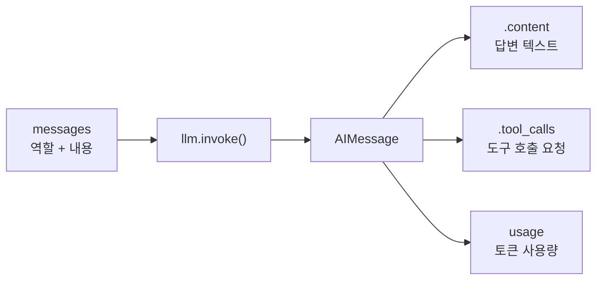

# 4.4 LLM 사용하기

> **저자 예제** — [`examples/4.4_main.py`](examples/4.4_main.py)
> **공식 문서** — [OpenAI · Quickstart](https://developers.openai.com/api/docs/quickstart) · [LangChain · Models](https://docs.langchain.com/oss/python/langchain/models)

> **여기까지** — 환경도 갖췄고 API 키도 준비했습니다([4.3절](04-03_%ED%99%98%EA%B2%BD%EB%B3%80%EC%88%98%20%EC%84%A4%EC%A0%95%ED%95%98%EA%B8%B0.md)).
> **이 절의 질문** — **드디어 LLM을 실제로 불러 봅시다.** 어떻게 부르지?
> **다 읽으면** — 1장에서 개념으로만 본 것들(역할·온도·도구 호출 자리)이 **코드 어디에 있는지** 보이게 됩니다.

드디어 [1장](../ch01_llm-decision/01-01_AI%20%EC%97%90%EC%9D%B4%EC%A0%84%ED%8A%B8%EC%9D%98%20%EB%91%90%EB%87%8C%2C%20%EA%B1%B0%EB%8C%80%20%EC%96%B8%EC%96%B4%20%EB%AA%A8%EB%8D%B8%EC%9D%98%20%EC%9D%B4%ED%95%B4.md)에서 개념으로만 본 LLM을 실제로 부릅니다.

## 4.4.1 [실습] OpenAI API 사용하기

가장 밑바닥은 OpenAI가 제공하는 **SDK**를 직접 쓰는 것입니다.

> **SDK(Software Development Kit)** — 어떤 서비스를 코드에서 쓰기 편하게 감싸 놓은 라이브러리입니다. HTTP 요청을 직접 만들지 않아도 되게 해 줍니다. [4.3절](04-03_%ED%99%98%EA%B2%BD%EB%B3%80%EC%88%98%20%EC%84%A4%EC%A0%95%ED%95%98%EA%B8%B0.md)에서 넣어 둔 `OPENAI_API_KEY`를 자동으로 읽습니다.

핵심은 **메시지 목록을 보내고 응답을 받는 것** 하나입니다. [1.2절](../ch01_llm-decision/01-02_LLM%EC%9D%84%20%EA%B8%B0%EB%B0%98%EC%9C%BC%EB%A1%9C%20%EC%9D%98%EC%82%AC%EA%B2%B0%EC%A0%95%ED%95%98%EB%8B%A4.md)에서 본 **역할(role)** 이 여기서 실제 형태로 나옵니다.

```python
messages = [
    {"role": "system", "content": "당신은 번역가입니다."},
    {"role": "user",   "content": "안녕하세요."},
]
```

| 역할 | 무엇을 담나 |
| :--- | :--- |
| `system` | 대화 내내 유지되는 규칙 |
| `user` | 이번에 처리할 입력 |
| `assistant` | 모델이 앞서 한 답변 (대화를 이어 갈 때 다시 넣음) |

[2.3절](../ch02_core-elements/02-03_%EC%97%90%EC%9D%B4%EC%A0%84%ED%8A%B8%EC%9D%98%20%EA%B8%B0%EC%96%B5%EB%A0%A5%20-%20%EB%A9%94%EB%AA%A8%EB%A6%AC.md)에서 "매번 대화 전체를 다시 보낸다"고 한 것이 **이 목록에 계속 쌓아서 보낸다**는 뜻입니다. 눈으로 확인하고 넘어가세요.

## 4.4.2 [실습] 랭체인으로 OpenAI LLM 호출하기

저자 예제 [`examples/4.4_main.py`](examples/4.4_main.py) 전문은 이렇습니다.

```python
from langchain_openai import ChatOpenAI
from dotenv import load_dotenv

load_dotenv()
llm = ChatOpenAI(model_name="gpt-4o")

messages = [
    (
        "system",
        "당신은 사용자가 한 말을 영어로 번역하는 유능한 번역가입니다.",
    ),
    ("human", "안녕하세요."),
]
ai_msg = llm.invoke(messages)
print(ai_msg)
```

### 한 줄씩

| 줄 | 하는 일 |
| :--- | :--- |
| `load_dotenv()` | `.env`의 `OPENAI_API_KEY`를 `os.environ`에 올림 (4.3절) |
| `ChatOpenAI(model_name=...)` | 모델 객체를 만듦. 키는 안 넘겨도 환경변수에서 찾음 |
| `("system", ...)` / `("human", ...)` | 역할과 내용의 튜플. 랭체인이 알아서 메시지 객체로 바꿈 |
| `llm.invoke(messages)` | 실제 호출. **여기서 네트워크 요청이 나감** |

**"알아서 바꾼다"는 것이 무엇으로 바뀌는지** 직접 확인했습니다.

> **실측 (2026-08-31 · langchain-core 1.6.1)** — 네트워크 호출 없이 변환만 본 것입니다.

```python
from langchain_core.messages import convert_to_messages

messages = [
    ("system", "당신은 사용자가 한 말을 영어로 번역하는 유능한 번역가입니다."),
    ("human", "안녕하세요."),
]
for m in convert_to_messages(messages):
    print(type(m).__name__, m.type)
```

```
SystemMessage  type='system'
HumanMessage   type='human'
```

튜플의 **첫 칸이 클래스를 정합니다.** `"system"` → `SystemMessage`, `"human"` → `HumanMessage`. 나중에 `ToolMessage`가 여기에 추가됩니다.

### 랭체인을 거치면 뭐가 다른가

같은 일을 하는데 왜 한 겹을 더 얹을까요.

| | OpenAI SDK 직접 | 랭체인 (`ChatOpenAI`) |
| :--- | :--- | :--- |
| 모델 교체 | 코드를 고쳐야 함 | 클래스만 바꾸면 됨 |
| 메시지 형식 | 제공사 형식 그대로 | 통일된 형식 |
| 도구 호출 | 직접 파싱 | `.bind_tools()` 로 통일 |
| 랭그래프 연결 | 직접 배선 | 그대로 노드에 들어감 |

**그래프의 노드 안에 그대로 들어간다**는 것이 가장 큰 이유입니다. `llm.invoke(question)`이 노드 함수 안에 그대로 쓰입니다.

> **`human` 인가 `user` 인가.** OpenAI SDK는 `user`, 랭체인은 `human`을 씁니다. 랭체인이 내부에서 변환합니다. 같은 것을 가리키는 다른 이름이니 헷갈리지 마세요. `assistant`는 랭체인에서 `ai` 입니다.

### 반환값은 문자열이 아닙니다

```python
ai_msg = llm.invoke(messages)
print(ai_msg)         # AIMessage 객체 전체가 찍힘
print(ai_msg.content) # 답변 텍스트만
```

`invoke()`가 돌려주는 것은 **`AIMessage` 객체**입니다. 텍스트만 필요하면 `.content`를 꺼냅니다. 객체에는 텍스트 말고도 **토큰 사용량, 도구 호출 요청** 같은 것이 함께 들어 있습니다.

**어떤 칸이 있는지** 빈 객체를 만들어 확인했습니다.

> **실측 (2026-08-31 · langchain-core 1.6.1)**

```
필드: additional_kwargs, content, id, invalid_tool_calls, name,
      response_metadata, tool_calls, type, usage_metadata

.content           -> 'Hello.'
.tool_calls        -> []
.response_metadata -> {}       (실제 호출하면 모델명·토큰 수가 들어옴)
```

**`tool_calls`가 빈 리스트로 이미 존재합니다.** 도구를 안 붙였을 뿐 자리는 처음부터 있습니다. `.bind_tools()`를 하면 이 칸이 채워집니다.

그 **도구 호출 요청** 자리가 [1.3절](../ch01_llm-decision/01-03_LLM%EC%9D%B4%20%EB%8B%A4%EC%9D%8C%20%ED%96%89%EB%8F%99%EC%9D%84%20%EA%B2%B0%EC%A0%95%ED%95%98%EB%8B%A4.md)에서 말한 **"이 함수를 이 인자로 불러 달라"** 가 담기는 곳입니다. 도구를 붙이면 여기가 채워집니다.



### 모델 이름을 바꿔 보기

`model_name`에 넣는 문자열이 어떤 모델을 쓸지 정합니다. 모델마다 **가격과 컨텍스트 윈도우가 다릅니다**([1.1절](../ch01_llm-decision/01-01_AI%20%EC%97%90%EC%9D%B4%EC%A0%84%ED%8A%B8%EC%9D%98%20%EB%91%90%EB%87%8C%2C%20%EA%B1%B0%EB%8C%80%20%EC%96%B8%EC%96%B4%20%EB%AA%A8%EB%8D%B8%EC%9D%98%20%EC%9D%B4%ED%95%B4.md)).

> **쓸 수 있는 모델 이름과 가격은 [OpenAI 모델 문서](https://developers.openai.com/api/docs/models)에서 확인하세요.** 모델은 자주 추가되고 이름이 바뀌므로 여기 적어 두면 금방 낡습니다.

`init_chat_model`을 쓰면 제공사까지 문자열로 지정할 수 있습니다.

```python
from langchain.chat_models import init_chat_model

llm = init_chat_model("openai:gpt-4o")
```

### 올라마로 바꿔 보기

[4.2절](04-02_%EC%95%84%EB%82%98%EC%BD%98%EB%8B%A4%20%EB%B0%8F%20%EA%B0%80%EC%83%81%20%ED%99%98%EA%B2%BD%20%EC%84%A4%EC%A0%95%ED%95%98%EA%B8%B0.md)에서 올라마를 깔았다면 **줄 하나만 바꾸면** 됩니다.

```python
# API — 유료, 키 필요
from langchain_openai import ChatOpenAI
llm = ChatOpenAI(model="gpt-4o", temperature=0)

# 올라마 — 내 PC, 키 불필요
from langchain_ollama import ChatOllama
llm = ChatOllama(model=os.getenv("OLLAMA_MODEL"), temperature=0)
```

**나머지 코드는 손대지 않습니다.** `invoke()`도, 메시지 형식도, 돌아오는 `AIMessage`도 같습니다.

> **위의 "랭체인을 거치면 뭐가 다른가" 표에서 첫 줄이 이것입니다** — *모델 교체: 클래스만 바꾸면 됨.* 지금 그 값어치를 실제로 쓰는 자리입니다.

두 방식을 오가려면 환경변수로 갈라 두면 편합니다.

```python
import os
from dotenv import load_dotenv

load_dotenv()

if os.getenv("OLLAMA_MODEL"):
    from langchain_ollama import ChatOllama
    llm = ChatOllama(model=os.getenv("OLLAMA_MODEL"), temperature=0)
else:
    from langchain_openai import ChatOpenAI
    llm = ChatOpenAI(model="gpt-4o", temperature=0)
```

> **`.env`에서 `OLLAMA_MODEL` 한 줄을 지우면 API로 돌아갑니다.** 4·5·8장은 올라마로, 6장부터는 API로 — [4.2절](04-02_%EC%95%84%EB%82%98%EC%BD%98%EB%8B%A4%20%EB%B0%8F%20%EA%B0%80%EC%83%81%20%ED%99%98%EA%B2%BD%20%EC%84%A4%EC%A0%95%ED%95%98%EA%B8%B0.md)에서 권한 조합을 이렇게 오갈 수 있습니다.

> **실측 (2026-08-31 · langchain-ollama 1.1.0)** — 패키지는 이 저장소에 설치돼 있고, `bind_tools`와 `with_structured_output` **메서드가 존재하는 것까지** 확인했습니다. **실제로 동작하는지는 모델에 달렸습니다** — `scripts/check-ollama.py`로 재세요.

### 온도 지정

[1.1절](../ch01_llm-decision/01-01_AI%20%EC%97%90%EC%9D%B4%EC%A0%84%ED%8A%B8%EC%9D%98%20%EB%91%90%EB%87%8C%2C%20%EA%B1%B0%EB%8C%80%20%EC%96%B8%EC%96%B4%20%EB%AA%A8%EB%8D%B8%EC%9D%98%20%EC%9D%B4%ED%95%B4.md)에서 에이전트는 온도를 낮게 둔다고 했습니다.

```python
llm = ChatOpenAI(model_name="gpt-4o", temperature=0)
```

## 공식 문서와 다른 점 (2026년 8월 기준)

### `model_name=` 은 아직 됩니다

교재 예제는 `model_name=`을 쓰는데 **공식 문서는 `model=`을 씁니다.** 둘 다 되는지 확인했습니다.

> **실측 (2026-08-31 · langchain-openai 1.6.0)**

```
model_name=  -> 생성 성공, llm.model_name = 'gpt-4o'
                경고: 없음
model=       -> 생성 성공, llm.model_name = 'gpt-4o'
                경고: 없음
```

**둘 다 동작하고 폐기 예정(deprecation) 경고도 나오지 않습니다.** 속성 이름은 어느 쪽으로 넣든 `llm.model_name`입니다.

> 교재를 그대로 따라 쳐도 문제없습니다. 다만 **새로 쓰는 코드는 `model=`을 쓰세요.** 공식 문서와 예제가 그쪽이라 검색이 쉽습니다.

### 실행 결과를 넣지 못한 부분

> **이 절의 `invoke()` 실제 응답은 넣지 않았습니다.** OpenAI API 키가 필요한데 이 저장소의 `.env`는 아직 비어 있습니다([4.3절](04-03_%ED%99%98%EA%B2%BD%EB%B3%80%EC%88%98%20%EC%84%A4%EC%A0%95%ED%95%98%EA%B8%B0.md)).
>
> **그럴듯한 출력을 지어내지 않습니다.** 위의 실측 블록들은 전부 **키 없이 확인 가능한 것**(메시지 변환·객체 구조·인자 이름)만 담았습니다.
>
> 키를 채운 뒤 직접 돌려 보고 채우세요. 그때 **응답 텍스트에는 `(실행할 때마다 달라집니다)`를 덧붙이세요.** 온도를 0으로 둬도 완전히 같지는 않습니다.

## 요약 및 비유

**주문서를 창구에 넣는 일**입니다. 양식(역할 구분)에 맞춰 적어 넣으면 결과가 서류(객체)로 돌아옵니다. 답만 필요하면 서류에서 해당 칸을 꺼내 봅니다.

| 개념 | 창구 주문 비유 | 기술적 의미 |
| :--- | :--- | :--- |
| **messages** | 주문서 양식 | 역할 + 내용의 목록 |
| **system** | 상단의 처리 지침 | 대화 내내 유지되는 규칙 |
| **human / user** | 이번 요청 내용 | 처리할 입력 |
| **`invoke()`** | 창구에 제출 | 실제 API 호출 |
| **`AIMessage`** | 돌아온 서류 한 장 | 텍스트 + 부가 정보 객체 |
| **`.content`** | 서류의 '결과' 칸 | 답변 텍스트 |
| **`.tool_calls`** | '추가 요청' 칸 — 지금은 빈칸 | 도구 호출 요청 |
| **랭체인 한 겹** | 어느 창구든 같은 양식 | 제공사와 무관한 통일 인터페이스 |
| **온도 0** | 튀지 않게 처리해 달라 | 판단의 일관성 |

## 결론

* LLM 호출의 본질은 **역할이 붙은 메시지 목록을 보내고 응답을 받는 것** 하나입니다.
* `load_dotenv()` 덕분에 **키를 코드에 넘기지 않아도** `ChatOpenAI`가 환경변수에서 찾아 씁니다(4.3절).
* 랭체인의 `human`/`ai`는 OpenAI의 `user`/`assistant`와 **같은 것을 가리키는 다른 이름**입니다.
* `invoke()`의 반환은 문자열이 아니라 **`AIMessage` 객체**입니다. 텍스트는 `.content`로 꺼냅니다.
* 그 객체의 **`.tool_calls`가 1.3절에서 말한 "도구를 불러 달라"는 요청이 담기는 자리**입니다. 도구를 붙이면 채워집니다.
* 랭체인을 한 겹 쓰는 가장 큰 이유는 **그래프 노드 안에 그대로 들어가기 때문**입니다.
* 튜플의 첫 칸이 클래스를 정합니다 — `"system"` → `SystemMessage`, `"human"` → `HumanMessage`.
* `model_name=`과 `model=` **둘 다 동작하고 경고도 없습니다.** 새 코드는 공식 문서에 맞춰 `model=`을 쓰세요.
* 모델 이름과 가격은 자주 바뀌니 **공식 모델 문서에서 확인**하세요.

---

## 4장을 마치며

네 개 절을 한 줄로 이으면 이렇습니다.

> **편집기를 갖추고 인터프리터를 골랐고(4.1) → 프로젝트 전용 파이썬 환경을 만들었고(4.2) → API 키를 안전하게 두는 법을 익혔고(4.3) → LLM을 실제로 불러 봤습니다(4.4).**

**5장에서는** 이 `llm.invoke()`를 **그래프의 노드 안에** 넣습니다. [2.4절](../ch02_core-elements/02-04_ReAct%20%EA%B8%B0%EB%B0%98%20LLM%20%EC%97%90%EC%9D%B4%EC%A0%84%ED%8A%B8.md)에서 "`for` 루프는 멈추면 처음부터"라고 했던 그 문제를 **랭그래프가 어떻게 푸는지** 보게 됩니다.

---

[⬅ 4.3](04-03_%ED%99%98%EA%B2%BD%EB%B3%80%EC%88%98%20%EC%84%A4%EC%A0%95%ED%95%98%EA%B8%B0.md) · [Chapter 04](README.md) · [전체 목차](../STUDY.md)
