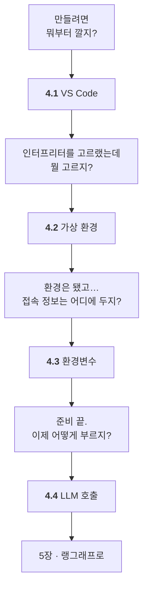

# Chapter 04 · 에이전트 개발 환경 구축

> Part 02 | 랭그래프로 구현하는 AI 에이전트

## 학습 목표

- VS Code + 파이썬 개발 환경을 **상업적으로 문제없는 구성**으로 갖출 수 있다
- `.env`와 python-dotenv로 **접속 정보(API 키·서버 주소)** 를 안전하게 관리할 수 있다
- 랭체인으로 LLM을 호출할 수 있다 — **올라마(로컬/사내 서버)와 OpenAI API 양쪽**

> **이 장의 노트는 [SETUP.md](SETUP.md) 입니다.** 절별 노트(4.1~4.4)를 나눠 두는 대신, 실제로 따라 하는 순서대로 한 문서에 정리했습니다. 모든 명령과 출력은 **실제로 실행해 얻은 것**이고, **깨끗한 상태에서 전 과정을 다시 돌려 검증**했습니다(2026-09-03).
>
> **올라마 서버가 어디서 도는지는 학습에 차이가 없습니다.** `SETUP.md` §4 는 **주소 하나**만 봅니다. 서버를 준비하는 문서(윈도우 / 쿠버네티스)는 따로 두었고, 준비가 끝나면 `.env` 에 주소만 적으면 됩니다.

> **교재의 아나콘다 대신 미니포지(Miniforge)를 씁니다.** `conda` 도구가 아니라 패키지를 받아오는 **채널**이 유료 대상이기 때문입니다. 근거와 대안은 [SETUP.md](SETUP.md) §2.1.

> **이 장은 올라마 기준으로 씁니다.** 교재는 OpenAI API를 쓰지만, 4장의 실습은 **API 키 없이 올라마만으로 전부** 됩니다. `.env`의 `OLLAMA_MODEL` 한 줄로 오갑니다.
>
> **모델은 `qwen3.5:2b`(2.3B) 입니다.** 4B 이하 여섯 개를 같은 검사로 돌려 골랐습니다 — 도구 호출·도구 선택·병렬 호출이 전부 되는 쪽입니다. 고른 근거와 탈락한 모델은 [SETUP.md](SETUP.md) §4.2.
>
> **올라마 서버가 이미 떠 있다면 설치도 필요 없습니다** — 주소만 있으면 됩니다([SETUP.md](SETUP.md) §4).
>
> 어느 장까지 올라마로 가는지는 [STUDY.md](../STUDY.md#올라마로-어디까지-되나)에 있습니다.

## 이 장의 이해 흐름

**Part 02, 실습이 시작되는 장**입니다. 순서대로 하나씩 갖춰 나갑니다.



| 절 | 이 절의 질문 | 얻는 것 |
| :--- | :--- | :--- |
| **4.1** | 뭐부터 깔지? | `ModuleNotFoundError`의 **진짜 원인** |
| **4.2** | 인터프리터를 어떻게 만들지? | 프로젝트 전용 파이썬 환경 |
| **4.3** | 접속 정보를 어디에 두지? | `.env`와 **커밋하면 안 되는 것들** |
| **4.4** | 이제 어떻게 부르지? | 1장 개념이 **코드 어디에 있는지** |

> **막히면 4.1과 4.3을 다시 보세요.** 4장에서 문제가 나는 곳은 거의 **인터프리터 선택**과 **작업 디렉터리** 둘입니다.

### 4장 전체를 한 줄로

> **편집기를 갖추고 인터프리터를 골랐고(4.1) → 파이썬 환경과 올라마를 준비했고(4.2) → 접속 정보를 안전하게 두는 법을 익혔고(4.3) → 올라마로 LLM을 실제로 불러 봤다(4.4).**

## 노트

| 문서 | 무엇이 있나 |
| :--- | :--- |
| **[SETUP.md](SETUP.md)** | **학습 경로.** VS Code · 미니포지 · 파이썬 3.12.14 · 올라마 **연결**과 테스트 |
| [ollama-windows.md](ollama-windows.md) | 올라마 서버를 **이 PC 에** 준비할 때 |
| [ollama-k8s.md](ollama-k8s.md) | 올라마 서버를 **쿠버네티스에** 준비할 때 (교재 범위 밖) |

교재 절 번호와 `SETUP.md` 의 대응은 이렇습니다.

| 교재 | SETUP.md |
| :--- | :--- |
| 4.1 비주얼 스튜디오 코드 환경 설정하기 | §1 VS Code 설치 |
| 4.2 아나콘다 및 가상 환경 설정하기 | §2 미니포지 · §3 파이썬 3.12.14 환경과 패키지 |
| 4.3 환경변수 설정하기 | §4.3 `.env` 설정 |
| 4.4 LLM 사용하기 | §4.4 연결 테스트 코드 (올라마 기준) |

<details><summary>교재 소절 구성 펼쳐보기</summary>

교재 상세 목차입니다. `SETUP.md` 는 이 순서를 따르되 아나콘다 부분만 미니포지로 바꿨습니다.

- [ ] **4.1 비주얼 스튜디오 코드 환경 설정하기**
  - [ ] 4.1.1 [실습] VS Code 설치하기
  - [ ] 4.1.2 [실습] 프로젝트 폴더 생성하기
- [ ] **4.2 아나콘다 및 가상 환경 설정하기**
  - [ ] 4.2.1 [실습] 아나콘다 설치하기
  - [ ] 4.2.2 [실습] 아나콘다 가상 환경 구성하기
- [ ] **4.3 환경변수 설정하기**
  - [ ] 4.3.1 [실습] .env 파일로 환경변수 저장하기
  - [ ] 4.3.2 [실습] python-dotenv으로 환경변수 불러오기
- [ ] **4.4 LLM 사용하기**
  - [ ] 4.4.1 [실습] OpenAI API 사용하기
  - [ ] 4.4.2 [실습] 랭체인으로 OpenAI LLM 호출하기

</details>

## 이 장의 코드

| 파일 | 내용 |
| --- | --- |
| [`check_ollama.py`](check_ollama.py) | 올라마 연결 테스트 — 단순 호출 · 도구 호출 · 구조화 출력 · 병렬 호출 |
| [`ollama-k8s.yaml`](ollama-k8s.yaml) | 쿠버네티스 매니페스트 — PVC · Deployment · Service · 모델 pull Job |

> **저자 원본 예제(`examples/`)는 이 장에서 지웠습니다.** 다른 장에는 그대로 있습니다. 원본이 필요하면 [upstream 저장소](https://github.com/gongwon-nayeon/hanbit-aiagent)에서 보세요.

## `.env` 두는 위치

**저장소 루트의 `.env` 하나로 관리합니다.** 장 폴더에는 두지 않습니다 — 템플릿은 루트 [`.env.example`](../.env.example).

올라마로 진행한다면 **채울 칸은 둘**입니다. `OPENAI_API_KEY`는 비워 둬도 됩니다.

```
OLLAMA_BASE_URL=http://localhost:11434
OLLAMA_MODEL=qwen3.5:2b
```

전체 형식과 주의사항은 [SETUP.md](SETUP.md) §4.3에 있습니다.

> **`.env`는 `.gitignore`에 있습니다.** 확인: `git check-ignore -v .env`

## 실행 방법

**PATH에 넣지 않았으므로 `conda activate` 가 그냥은 안 됩니다.** 실행 방법 셋 중 하나를 고르세요([SETUP.md](SETUP.md) §2.3).

```powershell
# 스크립트에서는 환경 파이썬을 전체 경로로 부르는 쪽이 안전합니다
C:\Users\<사용자>\miniforge3\envs\agent\python.exe check_ollama.py
```

> **`conda run` 은 쓰지 마세요.** 한글 출력이 깨지고 죽습니다(`UnicodeEncodeError: 'cp949' codec`).

## 참고 문서

| 무엇을 볼 때 | 문서 |
| --- | --- |
| 4.2 미니포지 설치 | [Miniforge](https://github.com/conda-forge/miniforge) |
| 4.2 아나콘다 라이선스 | [Anaconda ToS](https://www.anaconda.com/legal/terms/terms-of-service) |
| 4.2 conda 명령 | [conda 공식 문서](https://docs.conda.io/projects/conda/en/stable/) |
| 4.3 환경변수 | [python-dotenv](https://saurabh-kumar.com/python-dotenv/) |
| 4.2 올라마 설치·모델 받기 | [Ollama](https://ollama.com/) · [모델 목록](https://ollama.com/library) |
| 4.4 올라마 LLM 호출 | [LangChain · ChatOllama](https://docs.langchain.com/oss/python/integrations/chat/ollama) |
| 4.4 올라마 REST API | [Ollama API 문서](https://github.com/ollama/ollama/blob/main/docs/api.md) |
| 4.4 LLM 호출 첫걸음 (OpenAI) | [OpenAI · Quickstart](https://developers.openai.com/api/docs/quickstart) · [API keys](https://platform.openai.com/api-keys) |
| 모델 선택·초기화 (`init_chat_model`) | [LangChain · Models](https://docs.langchain.com/oss/python/langchain/models) |
| 설치 확인 | [Install LangGraph](https://docs.langchain.com/oss/python/langgraph/install) |

## 이 폴더 구성

- `SETUP.md` — **이 장의 학습 경로.** 올라마는 주소로만 다룹니다
- `ollama-windows.md` — 올라마 서버를 이 PC 에 준비
- `ollama-k8s.md` — 올라마 서버를 쿠버네티스에 준비
- `ollama-k8s.yaml` — 위 문서가 쓰는 매니페스트
- `check_ollama.py` — 올라마 연결 테스트 (서버 위치와 무관하게 동일)
- `.env` 는 이 폴더에 없습니다 — **저장소 루트의 [`.env.example`](../.env.example) 하나로 관리합니다**

---

[⬅ 전체 목차로](../STUDY.md)
