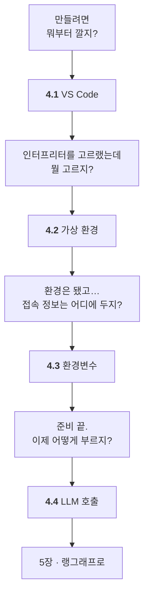

# Chapter 04 · 에이전트 개발 환경 구축

> Part 02 | 랭그래프로 구현하는 AI 에이전트

## 학습 목표

- VS Code + 파이썬 개발 환경을 **상업적으로 문제없는 구성**으로 갖출 수 있다
- `.env`와 python-dotenv로 **접속 정보(API 키·서버 주소)** 를 안전하게 관리할 수 있다
- 랭체인으로 LLM을 호출할 수 있다 — **올라마와 OpenAI API 양쪽**

> **이 장은 [SETUP.md](SETUP.md) 하나를 따라가면 됩니다.** 명령과 출력은 전부 **실제로 실행해 얻은 것**이고, 깨끗한 상태에서 재현 검증했습니다.
>
> **올라마 서버가 어디서 도는지는 학습에 차이가 없습니다.** `.env` 의 **주소 한 줄**로만 다루고, 서버를 준비하는 방법은 부록 둘로 뺐습니다.

> **교재의 아나콘다 대신 미니포지를 씁니다.** 유료 대상은 `conda` 도구가 아니라 **채널**이기 때문입니다([SETUP.md](SETUP.md) §2).
>
> **모델은 `qwen3.5:2b`.** 4B 이하 여섯 개를 같은 검사로 돌려 골랐습니다 — 도구 호출·선택·병렬 호출이 전부 되는 쪽입니다. 어느 장까지 올라마로 가는지는 [STUDY.md](../STUDY.md#올라마로-어디까지-되나).

## 이 장의 이해 흐름

| 절 | 이 절의 질문 | 얻는 것 |
| :--- | :--- | :--- |
| **4.1** | 뭐부터 깔지? | `ModuleNotFoundError`의 **진짜 원인** |
| **4.2** | 인터프리터를 어떻게 만들지? | 프로젝트 전용 파이썬 환경 |
| **4.3** | 접속 정보를 어디에 두지? | `.env`와 **커밋하면 안 되는 것들** |
| **4.4** | 이제 어떻게 부르지? | 1장 개념이 **코드 어디에 있는지** |

> **막히면 4.1과 4.3을 다시 보세요.** 4장에서 문제가 나는 곳은 거의 **인터프리터 선택**과 **작업 디렉터리** 둘입니다.

## 이 폴더

| 파일 | 무엇 |
| :--- | :--- |
| **[SETUP.md](SETUP.md)** | **이 장의 전부.** VS Code · 미니포지 · 파이썬 · 올라마 연결 |
| [`ollama/check_ollama.py`](ollama/check_ollama.py) | 연결 테스트 — 단순 호출 · 도구 호출 · 구조화 출력 · 병렬 호출 |
| [ollama/windows.md](ollama/windows.md) | 부록 · 서버를 이 PC 에 준비 |
| [ollama/k8s.md](ollama/k8s.md) · [`ollama/k8s.yaml`](ollama/k8s.yaml) | 부록 · 서버를 쿠버네티스에 준비 (교재 범위 밖) |

`.env` 는 이 폴더에 없습니다 — **저장소 루트의 [`.env.example`](../.env.example) 하나로 관리합니다.**

> 저자 원본 예제(`examples/`)는 이 장에서 지웠습니다. 필요하면 [upstream](https://github.com/gongwon-nayeon/hanbit-aiagent)에서 보세요.

교재 소절 구성 펼쳐보기

`SETUP.md` 는 이 순서를 따르되 아나콘다 부분만 미니포지로 바꿨습니다.

- [ ] **4.1 비주얼 스튜디오 코드 환경 설정하기**
  - [ ] 4.1.1 [실습] VS Code 설치하기
  - [ ] 4.1.2 [실습] 프로젝트 폴더 생성하기
- [ ] **4.2 아나콘다 및 가상 환경 설정하기**
  - [ ] 4.2.1 [실습] 아나콘다 설치하기
  - [ ] 4.2.2 [실습] 아나콘다 가상 환경 구성하기
- [ ] **4.3 환경변수 설정하기**
  - [ ] 4.3.1 [실습] .env 파일로 환경변수 저장하기
  - [ ] 4.3.2 [실습] python-dotenv으로 환경변수 불러오기
- [ ] **4.4 LLM 사용하기**
  - [ ] 4.4.1 [실습] OpenAI API 사용하기
  - [ ] 4.4.2 [실습] 랭체인으로 OpenAI LLM 호출하기

## 참고 문서

| 무엇을 볼 때 | 문서 |
| --- | --- |
| 미니포지 · 라이선스 | [Miniforge](https://github.com/conda-forge/miniforge) · [Anaconda ToS](https://www.anaconda.com/legal/terms/terms-of-service) |
| conda | [conda 공식 문서](https://docs.conda.io/projects/conda/en/stable/) |
| 환경변수 | [python-dotenv](https://saurabh-kumar.com/python-dotenv/) |
| 올라마 | [Ollama](https://ollama.com/) · [모델 목록](https://ollama.com/library) · [API](https://github.com/ollama/ollama/blob/main/docs/api.md) |
| 올라마 LLM 호출 | [LangChain · ChatOllama](https://docs.langchain.com/oss/python/integrations/chat/ollama) |
| OpenAI | [Quickstart](https://developers.openai.com/api/docs/quickstart) · [API keys](https://platform.openai.com/api-keys) |
| 모델 초기화 | [LangChain · Models](https://docs.langchain.com/oss/python/langchain/models) |

---

[⬅ 전체 목차로](../STUDY.md)
