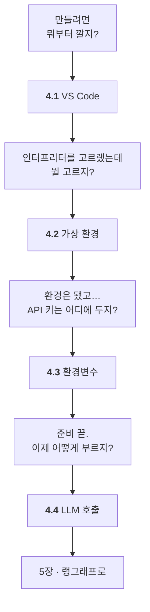

# Chapter 04 · 에이전트 개발 환경 구축

> Part 02 | 랭그래프로 구현하는 AI 에이전트

## 학습 목표

- VS Code + 아나콘다(또는 uv) 기반 파이썬 개발 환경을 구성할 수 있다
- `.env`와 python-dotenv로 API 키를 안전하게 관리할 수 있다
- OpenAI API와 랭체인으로 LLM을 호출할 수 있다

> **이 저장소는 uv로 구축돼 있습니다.** 4.1~4.4절에 **실제 실행 출력**이 들어 있습니다(관리자 권한 없이 설치한 기록). 교재의 아나콘다 절차는 그대로 두었고, 차이는 각 절의 `공식 문서와 다른 점`에 적었습니다.

> **올라마로 어디까지 되나** — **이 장은 올라마만으로 전부 됩니다.** API 키가 없어도 끝까지 진행할 수 있습니다.
>
> 전체 지도는 [STUDY.md](../STUDY.md#올라마로-어디까지-되나)에 있습니다.

## 이 장의 이해 흐름

**Part 02, 실습이 시작되는 장**입니다. 순서대로 하나씩 갖춰 나갑니다.



| 절 | 이 절의 질문 | 얻는 것 |
| :--- | :--- | :--- |
| **4.1** | 뭐부터 깔지? | `ModuleNotFoundError`의 **진짜 원인** |
| **4.2** | 인터프리터를 어떻게 만들지? | 프로젝트 전용 파이썬 환경 |
| **4.3** | API 키를 어디에 두지? | `.env`와 **커밋하면 안 되는 것들** |
| **4.4** | 이제 어떻게 부르지? | 1장 개념이 **코드 어디에 있는지** |

> **막히면 4.1과 4.3을 다시 보세요.** 4장에서 문제가 나는 곳은 거의 **인터프리터 선택**과 **작업 디렉터리** 둘입니다.

### 4장 전체를 한 줄로

> **편집기를 갖추고 인터프리터를 골랐고(4.1) → 프로젝트 전용 파이썬 환경을 만들었고(4.2) → API 키를 안전하게 두는 법을 익혔고(4.3) → LLM을 실제로 불러 봤다(4.4).**

## 절별 노트

| 절 | 노트 파일 | 진도 |
| --- | --- | --- |
| 4.1 | [`04-01_비주얼 스튜디오 코드 환경 설정하기.md`](04-01_%EB%B9%84%EC%A3%BC%EC%96%BC%20%EC%8A%A4%ED%8A%9C%EB%94%94%EC%98%A4%20%EC%BD%94%EB%93%9C%20%ED%99%98%EA%B2%BD%20%EC%84%A4%EC%A0%95%ED%95%98%EA%B8%B0.md) | ☐ |
| 4.2 | [`04-02_아나콘다 및 가상 환경 설정하기.md`](04-02_%EC%95%84%EB%82%98%EC%BD%98%EB%8B%A4%20%EB%B0%8F%20%EA%B0%80%EC%83%81%20%ED%99%98%EA%B2%BD%20%EC%84%A4%EC%A0%95%ED%95%98%EA%B8%B0.md) | ☐ |
| 4.3 | [`04-03_환경변수 설정하기.md`](04-03_%ED%99%98%EA%B2%BD%EB%B3%80%EC%88%98%20%EC%84%A4%EC%A0%95%ED%95%98%EA%B8%B0.md) | ☐ |
| 4.4 | [`04-04_LLM 사용하기.md`](04-04_LLM%20%EC%82%AC%EC%9A%A9%ED%95%98%EA%B8%B0.md) | ☐ |

<details><summary>소절까지 펼쳐보기</summary>

- [ ] **[4.1 비주얼 스튜디오 코드 환경 설정하기](04-01_%EB%B9%84%EC%A3%BC%EC%96%BC%20%EC%8A%A4%ED%8A%9C%EB%94%94%EC%98%A4%20%EC%BD%94%EB%93%9C%20%ED%99%98%EA%B2%BD%20%EC%84%A4%EC%A0%95%ED%95%98%EA%B8%B0.md)**
  - [ ] 4.1.1 [실습] VS Code 설치하기
  - [ ] 4.1.2 [실습] 프로젝트 폴더 생성하기
- [ ] **[4.2 아나콘다 및 가상 환경 설정하기](04-02_%EC%95%84%EB%82%98%EC%BD%98%EB%8B%A4%20%EB%B0%8F%20%EA%B0%80%EC%83%81%20%ED%99%98%EA%B2%BD%20%EC%84%A4%EC%A0%95%ED%95%98%EA%B8%B0.md)**
  - [ ] 4.2.1 [실습] 아나콘다 설치하기
  - [ ] 4.2.2 [실습] 아나콘다 가상 환경 구성하기
- [ ] **[4.3 환경변수 설정하기](04-03_%ED%99%98%EA%B2%BD%EB%B3%80%EC%88%98%20%EC%84%A4%EC%A0%95%ED%95%98%EA%B8%B0.md)**
  - [ ] 4.3.1 [실습] .env 파일로 환경변수 저장하기
  - [ ] 4.3.2 [실습] python-dotenv으로 환경변수 불러오기
- [ ] **[4.4 LLM 사용하기](04-04_LLM%20%EC%82%AC%EC%9A%A9%ED%95%98%EA%B8%B0.md)**
  - [ ] 4.4.1 [실습] OpenAI API 사용하기
  - [ ] 4.4.2 [실습] 랭체인으로 OpenAI LLM 호출하기

</details>

## 관련 예제 코드

| 내용 | 경로 |
| --- | --- |
| 4.4 LLM 사용하기 | [`examples/4.4_main.py`](examples/4.4_main.py) |

## `.env` 두는 위치

장 폴더(`ch04_dev-env/`)에 `.env`를 두면 됩니다. 예제가 `load_dotenv()`로 상위 폴더까지 찾아 올라갑니다.

```powershell
copy .env.example .env
```

## 참고 문서

| 무엇을 볼 때 | 문서 |
| --- | --- |
| 4.2 가상환경 (uv 사용 시) | [uv 공식 문서](https://docs.astral.sh/uv/) |
| 4.3 환경변수 | [python-dotenv](https://saurabh-kumar.com/python-dotenv/) |
| 4.4 LLM 호출 첫걸음 | [OpenAI · Quickstart](https://developers.openai.com/api/docs/quickstart) · [API keys](https://platform.openai.com/api-keys) |
| 모델 선택·초기화 (`init_chat_model`) | [LangChain · Models](https://docs.langchain.com/oss/python/langchain/models) |
| 설치 확인 | [Install LangGraph](https://docs.langchain.com/oss/python/langgraph/install) |

## 이 폴더 구성

- `04-01_…md` ~ `04-04_…md` — 절별 학습 노트
- `notes.md` — 장 전체 요약 (절 노트를 다 쓴 뒤 마지막에 정리)
- `practice/` — 예제를 보지 않고 직접 쳐보는 공간
- `.env.example` — 이 장에 필요한 API 키. `copy .env.example .env` 후 값을 채우세요

---

[⬅ 전체 목차로](../STUDY.md)
