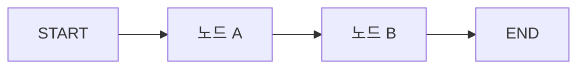
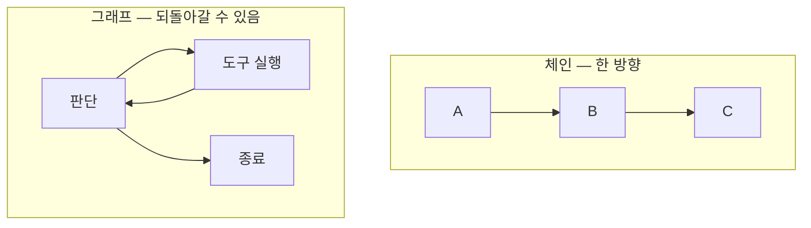

# 5.1 왜 랭그래프인가

> **공식 문서** — [LangGraph overview](https://docs.langchain.com/oss/python/langgraph/overview) · [Choosing between Graph and Functional APIs](https://docs.langchain.com/oss/python/langgraph/choosing-apis)

> **여기까지** — 환경을 갖추고 `llm.invoke()`를 불러 봤습니다([4.4절](../ch04_dev-env/04-04_LLM%20%EC%82%AC%EC%9A%A9%ED%95%98%EA%B8%B0.md)).
> **이 절의 질문** — 에이전트 루프는 [2.4절](../ch02_core-elements/02-04_ReAct%20%EA%B8%B0%EB%B0%98%20LLM%20%EC%97%90%EC%9D%B4%EC%A0%84%ED%8A%B8.md)에서 스무 줄로 짰는데, **왜 굳이 라이브러리를 배우지?**
> **다 읽으면** — 랭그래프가 **무엇을 대신 해 주는지** 알게 됩니다. 안 배우면 직접 해야 하는 것들입니다.

[2.4절](../ch02_core-elements/02-04_ReAct%20%EA%B8%B0%EB%B0%98%20LLM%20%EC%97%90%EC%9D%B4%EC%A0%84%ED%8A%B8.md)에서 에이전트 루프를 스무 줄로 짜 보고 이렇게 끝냈습니다.

> `for` 루프는 멈추면 처음부터입니다. 랭그래프가 그래프를 쓰는 이유가 여기 있습니다.

이 절이 그 약속을 회수합니다.

## 5.1.1 랭그래프의 특징

### 흐름을 그래프로 적습니다

랭그래프에서 프로그램은 **노드(Node)** 와 **엣지(Edge)** 로 표현됩니다.

| 용어 | 정체 | 하는 일 |
| :--- | :--- | :--- |
| **상태(State)** | 딕셔너리 | 그래프 전체가 공유하는 데이터 |
| **노드(Node)** | 함수 | 상태를 받아 바뀐 부분을 돌려줌 |
| **엣지(Edge)** | 연결 | 다음에 어느 노드로 갈지 |

**노드는 그냥 파이썬 함수입니다.** 특별한 클래스를 상속하지 않습니다. 5.2절에서 직접 확인합니다.

### 순환할 수 있습니다

이게 체인(chain)과의 결정적 차이입니다.

랭체인의 체인은 **한 방향으로만 흐릅니다.** A → B → C로 가고 끝입니다. 그런데 [2.1절](../ch02_core-elements/02-01_%EC%97%90%EC%9D%B4%EC%A0%84%ED%8A%B8%EC%9D%98%20%EC%B6%94%EB%A1%A0%20%EB%8A%A5%EB%A0%A5%20-%20ReAct%EC%99%80%20Reflection.md)의 ReAct 루프는 **되돌아가야** 합니다.

에이전트는 본질적으로 순환입니다. **순환을 표현할 수 없는 도구로는 에이전트를 만들 수 없습니다.**

### 지금 어디인지를 상태로 들고 있습니다

`for` 루프는 진행 상황이 **파이썬 프로세스 안에만** 있습니다. 프로세스가 죽으면 사라집니다.

랭그래프는 노드를 하나 지날 때마다 **상태를 저장**할 수 있습니다. 이것을 **체크포인트(Checkpoint)** 라고 합니다.

| | `for` 루프 | 랭그래프 |
| :--- | :--- | :--- |
| 진행 상황 | 지역 변수 | 상태 객체 |
| 중간에 멈추면 | 처음부터 | **멈춘 노드부터** |
| 사람 승인 받기 | 구현 어려움 | 노드 사이에서 멈추면 됨 |
| 무슨 일이 있었나 | 로그를 직접 심어야 | 노드 단위로 남음 |

이 체크포인트가 **8장의 단기 메모리**와 같은 장치입니다. [2.3절](../ch02_core-elements/02-03_%EC%97%90%EC%9D%B4%EC%A0%84%ED%8A%B8%EC%9D%98%20%EA%B8%B0%EC%96%B5%EB%A0%A5%20-%20%EB%A9%94%EB%AA%A8%EB%A6%AC.md)에서 "체크포인터 = 대화 하나 안의 단기 기억"이라고 한 그것입니다. **상태를 저장한다는 하나의 기능이 두 가지 문제를 동시에 푸는 것**입니다.

## 5.1.2 랭그래프를 사용해야 하는 이유

정리하면 네 가지입니다.

| 이유 | 없으면 직접 해야 하는 일 |
| :--- | :--- |
| **순환** | 되돌아가는 흐름을 루프로 직접 관리 |
| **중단·재개** | 어디까지 갔는지 기록하고 복원하는 코드 |
| **사람 개입** | 루프를 쪼개고 상태를 어딘가 저장 |
| **관측** | 어느 단계에서 무엇이 일어났는지 로그 심기 |

> **랭그래프가 LLM을 대신 불러 주지는 않습니다.** 노드 안에서 `llm.invoke()`를 부르는 건 여전히 우리입니다([4.4절](../ch04_dev-env/04-04_LLM%20%EC%82%AC%EC%9A%A9%ED%95%98%EA%B8%B0.md)). 랭그래프가 관리하는 것은 **흐름과 상태**입니다.

### 그런데 항상 필요하지는 않습니다

[1.4절](../ch01_llm-decision/01-04_LLM%20%EA%B8%B0%EB%B0%98%20%EC%97%90%EC%9D%B4%EC%A0%84%ED%8A%B8%20%EC%8B%9C%EC%8A%A4%ED%85%9C%2C%20%EC%9D%B4%EB%9F%B0%20%EA%B5%AC%EC%A1%B0%EB%A1%9C%20%EC%84%A4%EA%B3%84%EB%90%9C%EB%8B%A4.md)의 판단이 여기서도 그대로 적용됩니다.

- **한 번 부르고 끝나는 일** — 그냥 `llm.invoke()` 하면 됩니다. 그래프를 만들 이유가 없습니다
- **순서가 고정된 몇 단계** — 함수를 순서대로 부르면 됩니다
- **되돌아가거나, 멈췄다 재개하거나, 분기가 상태에 따라 달라지는 일** — 이때 랭그래프입니다

## 요약 및 비유

**보드게임 판**을 떠올리면 맞아떨어집니다. 칸(노드)이 있고, 화살표(엣지)가 있고, 말의 현재 위치와 소지품이 있습니다(상태). 게임을 중단해도 **판을 사진 찍어 두면 그 자리에서 다시 시작**할 수 있습니다.

| 개념 | 보드게임 비유 | 기술적 의미 |
| :--- | :--- | :--- |
| **노드** | 판 위의 칸 | 상태를 받아 바꾸는 함수 |
| **엣지** | 칸을 잇는 화살표 | 다음 노드 지정 |
| **상태** | 말의 위치와 소지품 | 그래프가 공유하는 딕셔너리 |
| **순환** | 되돌아가는 칸이 있음 | 체인은 못 하는 것 |
| **체크포인트** | 판을 사진 찍어 둠 | 노드마다 상태 저장 |
| **재개** | 사진 보고 그 자리부터 | 멈춘 노드부터 다시 |
| **사람 개입** | 판을 멈추고 상의 | 노드 사이에서 정지 |
| **`for` 루프** | 판 없이 머릿속으로만 | 멈추면 처음부터 |

## 결론

* 랭그래프는 흐름을 **상태 · 노드 · 엣지**로 적습니다. 노드는 특별할 것 없는 **파이썬 함수**입니다.
* 체인과의 결정적 차이는 **순환**입니다. 에이전트 루프는 되돌아가야 하는데 체인은 한 방향뿐입니다.
* 진행 상황이 **상태에 남으므로** 멈췄다가 그 자리에서 다시 시작할 수 있습니다. `for` 루프는 못 합니다.
* 이 체크포인트가 **8장 단기 메모리와 같은 장치**입니다. 하나의 기능이 두 문제를 함께 풉니다.
* 쓰는 이유는 넷 — **순환 · 중단과 재개 · 사람 개입 · 관측**.
* **한 번 부르고 끝나거나 순서가 고정된 일에는 필요 없습니다.** 그래프는 공짜가 아닙니다.

---

## 다음 절로

**상태 · 노드 · 엣지** — 이름은 나왔습니다.

그런데 **노드가 함수라면, 상태는 어떻게 생겼고 어떻게 주고받죠?** 코드로 만들어 봅시다. → **[5.2절](05-02_%EB%9E%AD%EA%B7%B8%EB%9E%98%ED%94%84%20%EA%B8%B0%EB%B3%B8%20%EA%B0%9C%EB%85%90%20%EC%9D%B4%ED%95%B4%ED%95%98%EA%B3%A0%20%EC%A0%81%EC%9A%A9%ED%95%98%EA%B8%B0.md)**

---

[Chapter 05](README.md) · [5.2 ➡](05-02_%EB%9E%AD%EA%B7%B8%EB%9E%98%ED%94%84%20%EA%B8%B0%EB%B3%B8%20%EA%B0%9C%EB%85%90%20%EC%9D%B4%ED%95%B4%ED%95%98%EA%B3%A0%20%EC%A0%81%EC%9A%A9%ED%95%98%EA%B8%B0.md)
