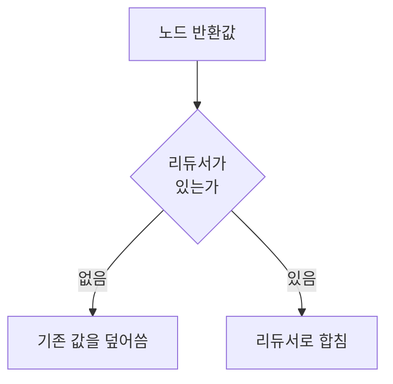
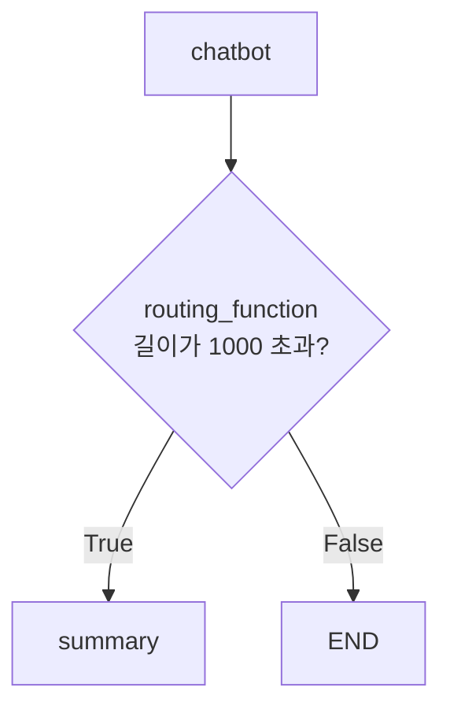

# 5.2 랭그래프 기본 개념 이해하고 적용하기

> **저자 예제** — [`examples/5.2_랭그래프 기본 개념 이해하기.ipynb`](examples/5.2_%EB%9E%AD%EA%B7%B8%EB%9E%98%ED%94%84%20%EA%B8%B0%EB%B3%B8%20%EA%B0%9C%EB%85%90%20%EC%9D%B4%ED%95%B4%ED%95%98%EA%B8%B0.ipynb)
> **공식 문서** — [Graph API overview](https://docs.langchain.com/oss/python/langgraph/graph-api) · [Use the graph API](https://docs.langchain.com/oss/python/langgraph/use-graph-api)

> **여기까지** — 랭그래프가 **상태 · 노드 · 엣지**로 흐름을 적는다는 것까지 왔습니다([5.1절](05-01_%EC%99%9C%20%EB%9E%AD%EA%B7%B8%EB%9E%98%ED%94%84%EC%9D%B8%EA%B0%80.md)).
> **이 절의 질문** — 그 셋을 **코드로 어떻게 쓰지?**
> **다 읽으면** — 그래프의 부품을 전부 만들 수 있게 됩니다. **6장부터 계속 쓰는 문법**입니다.

[5.1절](05-01_%EC%99%9C%20%EB%9E%AD%EA%B7%B8%EB%9E%98%ED%94%84%EC%9D%B8%EA%B0%80.md)에서 상태·노드·엣지라는 이름을 봤습니다. 이제 하나씩 코드로 만듭니다.

## 5.2.1 [실습] 그래프의 상태 정의하기

상태는 **그래프 전체가 공유하는 딕셔너리**입니다. 어떤 키가 있는지를 **`TypedDict`** 로 미리 선언합니다.

> **`TypedDict`** — "이 딕셔너리에는 이런 키가 이런 타입으로 들어간다"를 미리 적어 두는 것입니다. 파이썬 표준 기능이고, 딕셔너리를 클래스처럼 선언할 수 있게 해 줍니다.

```python
from typing_extensions import TypedDict

class State(TypedDict):
    messages: list[str]
```

### TypedDict는 검사하지 않습니다

여기서 저자가 짚는 함정이 있습니다. `TypedDict`는 **타입을 적어 둘 뿐 실행 중에 검사하지 않습니다.**

```python
class User(TypedDict):
    id: int
    name: str
    email: str

user1: User = {
    'id': 1,
    'name': 123,          # str 이라고 했는데 int
    'email': 'example@gmail.com'
}
print(user1)              # 그대로 통과합니다
```

편집기는 경고를 띄우지만 **파이썬은 그냥 실행합니다.**

검사가 필요하면 **Pydantic**을 씁니다.

```python
from pydantic import BaseModel

class User(BaseModel):
    id: int
    name: str
    email: str

user = User(id=1, name=123, email='example@gmail.com')   # 여기서 검증 오류가 납니다
```

| | `TypedDict` | Pydantic `BaseModel` |
| :--- | :--- | :--- |
| 실행 중 검사 | **없음** | 있음 |
| 만드는 법 | 그냥 딕셔너리 | 클래스 인스턴스 |
| 속도 | 빠름 (딕셔너리 그대로) | 검증 비용 |
| 랭그래프 상태로 | 대부분 이걸 씀 | 검증이 꼭 필요할 때 |

> **상태에는 보통 `TypedDict`를 씁니다.** 그래프 안에서 오가는 값은 우리가 만든 것이라 대개 믿을 수 있고, 노드마다 검증하면 느려집니다. 반면 **[1.2절](../ch01_llm-decision/01-02_LLM%EC%9D%84%20%EA%B8%B0%EB%B0%98%EC%9C%BC%EB%A1%9C%20%EC%9D%98%EC%82%AC%EA%B2%B0%EC%A0%95%ED%95%98%EB%8B%A4.md)의 구조화 출력처럼 LLM이 채우는 값**은 Pydantic으로 검증하는 게 맞습니다. 믿을 수 없으니까요.

## 5.2.2 [실습] 그래프의 상태에 리듀서 함수 추가하기

### 기본 동작은 덮어쓰기입니다

노드가 `{"messages": [...]}` 를 돌려주면, 그 키의 **기존 값이 통째로 대체**됩니다. 대화 이력처럼 **쌓여야 하는 값**에는 곤란합니다.

```
노드 A 가 messages: ["안녕"]     을 반환  →  상태: ["안녕"]
노드 B 가 messages: ["반가워"]   을 반환  →  상태: ["반가워"]   ← "안녕"이 사라짐
```

### 리듀서가 합치는 방법을 정합니다

**리듀서(Reducer)** 는 "기존 값과 새 값을 어떻게 합칠지" 정하는 함수입니다. `Annotated`로 키에 붙입니다.

```python
from typing import TypedDict, Annotated

def add(left, right):
    return left + right

class State(TypedDict):
    messages: Annotated[list[str], add]
```

이제 반환값이 **덮어쓰지 않고 이어 붙습니다.**

```
노드 A → ["안녕"]              상태: ["안녕"]
노드 B → ["반가워"]            상태: ["안녕", "반가워"]
```



> `operator.add`를 그대로 써도 됩니다. 저자 예제 5.2.3에서는 `from operator import add`로 가져다 씁니다.

### `add_messages` — 메시지 전용 리듀서

메시지에는 리스트 이어 붙이기만으로는 부족한 사정이 있습니다. 랭그래프가 `add_messages`를 따로 제공합니다.

```python
from langgraph.graph.message import add_messages
from langchain_core.messages import AnyMessage
from typing import TypedDict, Annotated

class State(TypedDict):
    messages: Annotated[list[AnyMessage], add_messages]
```

**보통은 이어 붙이지만, `id`가 같으면 덮어씁니다.**

```python
msgs1 = [HumanMessage(content="Hello", id="1")]
msgs2 = [AIMessage(content="Hi there!", id="2")]
add_messages(msgs1, msgs2)      # id 가 다르므로 → 두 개

msgs1 = [HumanMessage(content="Hello", id="1")]
msgs2 = [HumanMessage(content="Hello again", id="1")]
add_messages(msgs1, msgs2)      # id 가 같으므로 → 하나로 대체
```

> **이 `id` 규칙이 나중에 중요해집니다.** 8장에서 오래된 메시지를 지우거나 요약본으로 바꿀 때, 같은 `id`로 새 메시지를 보내 **교체**하는 방식을 씁니다. 단순한 이어 붙이기였다면 못 합니다.

## 5.2.3 [실습] 그래프의 실행 단위, 노드 추가하기

노드는 **상태를 받아 바뀐 부분만 딕셔너리로 돌려주는 함수**입니다.

```python
from langgraph.graph import StateGraph

class State(TypedDict):
    messages: Annotated[list[str], add]

graph = StateGraph(State)

def chatbot(state: State):                                   # [1] 상태를 받는다
    question = state["messages"]
    answer = f"…{question} 라는 질문을 받았습니다."             # [2] 일을 한다
    return {"messages": [answer]}                            # [3] 바뀐 부분만 반환

graph.add_node("chatbot", chatbot)                           # [4] 이름을 붙여 등록
```

| 번호 | 규칙 |
| :--- | :--- |
| [1] | 첫 인자로 **현재 상태 전체**를 받습니다 |
| [2] | 평범한 파이썬입니다. LLM을 부르든 DB를 조회하든 자유 |
| [3] | **바뀐 키만** 돌려줍니다. 상태 전체를 돌려줄 필요가 없습니다 |
| [4] | `add_node("이름", 함수)` — 이 **이름이 엣지에서 쓰입니다** |

> **[3]이 자주 틀리는 곳입니다.** 상태에 키가 5개여도 노드가 하나만 바꿨다면 그 하나만 반환하면 됩니다. 나머지는 그대로 유지됩니다.

## 5.2.4 [실습] 그래프의 실행 경로, 엣지 추가하기

노드를 만들었으면 **어느 순서로 갈지** 이어 줍니다.

```python
from langgraph.graph import START, END

graph.add_edge(START, "chatbot")
graph.add_edge("chatbot", END)
```

| 기호 | 의미 |
| :--- | :--- |
| `START` | 그래프의 시작점 |
| `END` | 종료점 |

노드끼리 잇는 것도 같습니다.

```python
graph.add_edge("node_a", "node_b")
```

**`add_edge`는 조건 없이 무조건 그쪽으로 갑니다.** 이것을 일반 엣지라고 합니다.

> **`START`에서 나가는 엣지가 없으면 그래프가 시작되지 않습니다.** 노드는 다 만들었는데 아무것도 안 일어난다면 여기를 확인하세요.

## 5.2.5 [실습] 그래프에 조건부 엣지 추가하기

상태를 보고 **갈 곳을 정해야** 할 때가 있습니다. 이때 **조건부 엣지**를 씁니다.

```python
def routing_function(state: State):
    if len(state["messages"][-1]) > 1000:
        return True
    return False

graph.add_conditional_edges(
    "chatbot",             # 어느 노드 다음에
    routing_function,      # 무엇을 보고 정할지
    {True: "summary", False: END}   # 반환값 → 갈 곳
)
```

세 부분으로 읽으면 쉽습니다.

| 인자 | 뜻 |
| :--- | :--- |
| 첫째 | 이 노드가 끝난 다음에 |
| 둘째 | 이 함수를 불러서 |
| 셋째 | 반환값을 이 표에서 찾아 그 노드로 |



> **라우팅 함수는 LLM을 부르지 않아도 됩니다.** 위 예처럼 그냥 `len()`을 보는 파이썬 조건문이면 충분합니다. [1.4절](../ch01_llm-decision/01-04_LLM%20%EA%B8%B0%EB%B0%98%20%EC%97%90%EC%9D%B4%EC%A0%84%ED%8A%B8%20%EC%8B%9C%EC%8A%A4%ED%85%9C%2C%20%EC%9D%B4%EB%9F%B0%20%EA%B5%AC%EC%A1%B0%EB%A1%9C%20%EC%84%A4%EA%B3%84%EB%90%9C%EB%8B%A4.md)에서 "조건 분기가 있어도 경로를 다 그려 뒀으면 워크플로"라고 한 것이 이것입니다. 조건부 엣지를 쓴다고 자율 에이전트가 되는 게 아닙니다.

**6장에서 만들 에이전트의 루프도 결국 조건부 엣지입니다** — "도구 호출이 있으면 도구 노드로, 없으면 END로". 그 되돌아가는 화살표가 [5.1절](05-01_%EC%99%9C%20%EB%9E%AD%EA%B7%B8%EB%9E%98%ED%94%84%EC%9D%B8%EA%B0%80.md)에서 말한 **순환**입니다.

## 요약 및 비유

**회의실 화이트보드**가 상태입니다. 참석자(노드)가 차례로 나와 자기 몫만 적고 들어가고, 순서표(엣지)가 누가 다음인지 정합니다. **덮어쓸지 덧붙일지**를 정해 두는 것이 리듀서입니다.

| 개념 | 화이트보드 비유 | 기술적 의미 |
| :--- | :--- | :--- |
| **상태** | 화이트보드 전체 | 공유 딕셔너리 |
| **`TypedDict`** | 어떤 칸이 있는지 적은 양식 | 키 선언 — **검사는 안 함** |
| **Pydantic** | 적을 때 형식을 확인하는 양식 | 실행 중 검증 |
| **리듀서 없음** | 그 칸을 지우고 새로 씀 | 덮어쓰기 |
| **리듀서 있음** | 아래에 이어 적음 | 병합 규칙 |
| **`add_messages`** | 같은 번호 항목은 고쳐 씀 | `id` 같으면 대체 |
| **노드** | 나와서 적고 들어가는 참석자 | 상태를 받아 일부를 반환 |
| **바뀐 키만 반환** | 자기 칸만 고침 | 나머지는 유지 |
| **엣지** | 발표 순서표 | 다음 노드 지정 |
| **조건부 엣지** | "길면 요약 담당에게" | 상태를 보고 분기 |

## 결론

* 상태는 **`TypedDict`로 선언한 공유 딕셔너리**입니다. `TypedDict`는 **실행 중에 검사하지 않습니다** — 검증이 필요하면 Pydantic입니다.
* 노드 반환값은 **기본이 덮어쓰기**입니다. 쌓이게 하려면 `Annotated[타입, 리듀서]`로 리듀서를 붙입니다.
* **`add_messages`는 `id`가 같으면 덮어씁니다.** 8장에서 메시지를 교체·삭제할 때 이 규칙을 씁니다.
* 노드는 **평범한 함수**이고, **바뀐 키만** 돌려주면 됩니다. `add_node("이름", 함수)`의 이름이 엣지에서 쓰입니다.
* `add_edge(START, ...)`가 없으면 **그래프가 시작되지 않습니다.**
* 조건부 엣지는 **(어느 노드 다음에, 무엇을 보고, 어디로)** 세 부분입니다. 라우팅 함수는 LLM 없이 평범한 조건문이어도 됩니다.
* 6장 에이전트의 루프도 결국 **조건부 엣지로 만든 순환**입니다.

---

## 다음 절로

부품은 다 만들었습니다. **상태 · 리듀서 · 노드 · 엣지 · 조건부 엣지.**

이제 이걸 **실제로 도는 그래프**로 조립하고, [4.4절](../ch04_dev-env/04-04_LLM%20%EC%82%AC%EC%9A%A9%ED%95%98%EA%B8%B0.md)에서 부른 `llm.invoke()`를 **노드 안에** 넣어 봅시다. → **[5.3절](05-03_%EB%9E%AD%EA%B7%B8%EB%9E%98%ED%94%84%EB%A1%9C%20%EC%97%90%EC%9D%B4%EC%A0%84%ED%8A%B8%20%EC%84%A4%EA%B3%84%ED%95%98%EA%B3%A0%20%EA%B5%AC%ED%98%84%ED%95%98%EA%B8%B0.md)**

---

[⬅ 5.1](05-01_%EC%99%9C%20%EB%9E%AD%EA%B7%B8%EB%9E%98%ED%94%84%EC%9D%B8%EA%B0%80.md) · [Chapter 05](README.md) · [5.3 ➡](05-03_%EB%9E%AD%EA%B7%B8%EB%9E%98%ED%94%84%EB%A1%9C%20%EC%97%90%EC%9D%B4%EC%A0%84%ED%8A%B8%20%EC%84%A4%EA%B3%84%ED%95%98%EA%B3%A0%20%EA%B5%AC%ED%98%84%ED%95%98%EA%B8%B0.md)
