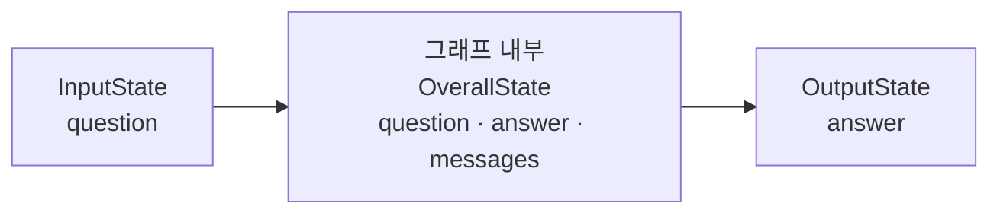
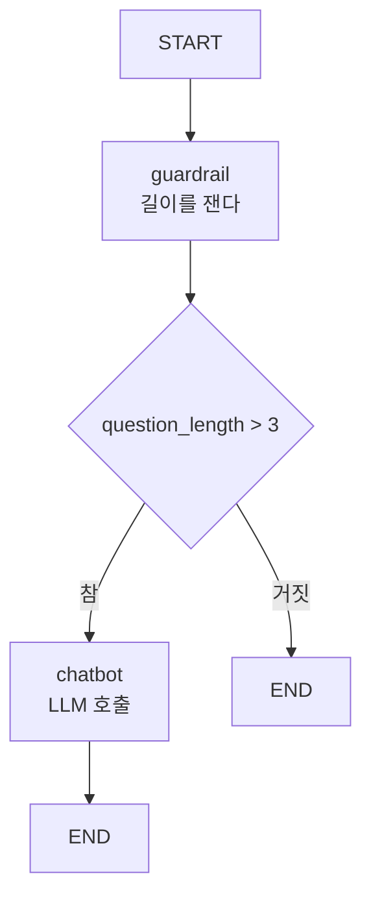

# 5.3 랭그래프로 에이전트 설계하고 구현하기

> **저자 예제** — [`examples/5.3_랭그래프로 에이전트 설계하고 구현하기.ipynb`](examples/5.3_%EB%9E%AD%EA%B7%B8%EB%9E%98%ED%94%84%EB%A1%9C%20%EC%97%90%EC%9D%B4%EC%A0%84%ED%8A%B8%20%EC%84%A4%EA%B3%84%ED%95%98%EA%B3%A0%20%EA%B5%AC%ED%98%84%ED%95%98%EA%B8%B0.ipynb)
> **공식 문서** — [Thinking in LangGraph](https://docs.langchain.com/oss/python/langgraph/thinking-in-langgraph) · [Workflows and agents](https://docs.langchain.com/oss/python/langgraph/workflows-agents)

> **여기까지** — 상태·리듀서·노드·엣지를 코드로 만들 수 있게 됐습니다([5.2절](05-02_%EB%9E%AD%EA%B7%B8%EB%9E%98%ED%94%84%20%EA%B8%B0%EB%B3%B8%20%EA%B0%9C%EB%85%90%20%EC%9D%B4%ED%95%B4%ED%95%98%EA%B3%A0%20%EC%A0%81%EC%9A%A9%ED%95%98%EA%B8%B0.md)).
> **이 절의 질문** — 부품을 **조립해서 실제로 돌리려면?**
> **다 읽으면** — 도는 그래프를 만들 수 있게 됩니다. 그리고 **왜 아직 에이전트가 아닌지**도 알게 됩니다.

[5.2절](05-02_%EB%9E%AD%EA%B7%B8%EB%9E%98%ED%94%84%20%EA%B8%B0%EB%B3%B8%20%EA%B0%9C%EB%85%90%20%EC%9D%B4%ED%95%B4%ED%95%98%EA%B3%A0%20%EC%A0%81%EC%9A%A9%ED%95%98%EA%B8%B0.md)에서 부품을 하나씩 봤습니다. 이제 **실제로 도는 그래프**를 만듭니다. [4.4절](../ch04_dev-env/04-04_LLM%20%EC%82%AC%EC%9A%A9%ED%95%98%EA%B8%B0.md)에서 부른 `llm.invoke()`가 노드 안으로 들어갑니다.

## 5.3.1 [실습] 답변을 생성하는 기본 그래프 구현하기

### 상태를 셋으로 나눕니다

저자 예제는 상태를 세 개 선언합니다.

```python
class InputState(TypedDict):
    question: str

class OutputState(TypedDict):
    answer: str

class OverallState(TypedDict):
    messages: Annotated[list[str], add]
    question: str
    answer: str
```

| 스키마 | 역할 |
| :--- | :--- |
| `InputState` | **밖에서 넣을 수 있는 것** |
| `OutputState` | **밖으로 내보낼 것** |
| `OverallState` | **그래프 안에서 실제로 오가는 전부** |

```python
graph_builder = StateGraph(
    OverallState,
    input_schema=InputState,
    output_schema=OutputState
)
```

**왜 나눌까요.** `messages`는 내부 작업용이라 호출하는 쪽이 알 필요가 없습니다. 입출력을 좁혀 두면 **그래프가 하나의 함수처럼** 보입니다 — `question`을 넣으면 `answer`가 나오는.



> **안 나눠도 동작합니다.** `StateGraph(State)` 하나만 줘도 됩니다. 5.3.2절 예제가 그렇게 합니다. 나누는 것은 **경계를 분명히 하려는 설계 선택**입니다.

### 노드 안에서 LLM을 부릅니다

```python
llm = ChatOpenAI(model="gpt-4o")

def chatbot(state: InputState) -> OverallState:
    question = state["question"]
    response = llm.invoke(question)
    return {
        "answer": response.content,
        "messages": [question, response.content]
    }

graph_builder.add_node("chatbot", chatbot)
```

[4.4절](../ch04_dev-env/04-04_LLM%20%EC%82%AC%EC%9A%A9%ED%95%98%EA%B8%B0.md)에서 본 `.content`가 여기서 쓰입니다. `invoke()`가 돌려주는 것은 객체이므로 텍스트를 꺼내 상태에 넣습니다.

**`messages`에는 리듀서가 붙어 있으므로**([5.2.2](05-02_%EB%9E%AD%EA%B7%B8%EB%9E%98%ED%94%84%20%EA%B8%B0%EB%B3%B8%20%EA%B0%9C%EB%85%90%20%EC%9D%B4%ED%95%B4%ED%95%98%EA%B3%A0%20%EC%A0%81%EC%9A%A9%ED%95%98%EA%B8%B0.md)) 반환한 두 개가 기존 목록에 이어 붙습니다. 반면 `answer`는 리듀서가 없어 덮어씁니다.

### 엣지를 잇고 컴파일합니다

```python
graph_builder.add_edge(START, "chatbot")
graph_builder.add_edge("chatbot", END)
graph = graph_builder.compile()
```

**`compile()`이 새로 나온 단계입니다.** 지금까지 `add_node`·`add_edge`로 **설계도**를 그렸고, `compile()`이 그것을 **실행 가능한 객체**로 바꿉니다.

| 단계 | 하는 일 |
| :--- | :--- |
| `StateGraph(...)` | 빈 설계도 |
| `add_node` / `add_edge` | 설계도에 그리기 |
| `compile()` | 검사하고 실행 가능한 그래프로 |
| `invoke()` | 실제 실행 |

> **`compile()`에서 오류가 나면 설계도가 잘못된 것입니다.** 존재하지 않는 노드로 가는 엣지, `START`에서 나가는 엣지 없음 같은 문제를 여기서 잡아 줍니다. 실행하기 전에 걸러 주는 셈입니다.

### 그림으로 확인하기

```python
from IPython.display import Image, display
display(Image(graph.get_graph().draw_mermaid_png()))
```

**만든 그래프를 그림으로 뽑아 볼 수 있습니다.** 노드가 늘어나면 머릿속으로 흐름을 좇기 어려워지니 자주 쓰게 됩니다.

**`draw_mermaid_png()`는 이미지라 노트북에서만 보입니다.** 터미널에서는 `draw_mermaid()`로 **텍스트**를 뽑는 편이 낫습니다.

```python
print(graph.get_graph().draw_mermaid())
```

> **실측 (2026-08-31 · langgraph 1.2.11)** — [5.1절](05-01_%EC%99%9C%20%EB%9E%AD%EA%B7%B8%EB%9E%98%ED%94%84%EC%9D%B8%EA%B0%80.md)의 순환 그래프를 뽑은 것입니다.

```
---
config:
  flowchart:
    curve: linear
---
graph TD;
	__start__([<p>__start__</p>]):::first
	work(work)
	__end__([<p>__end__</p>]):::last
	__start__ --> work;
	work -.-> __end__;
	work -.-> work;
	classDef default fill:#f2f0ff,line-height:1.2
	classDef first fill-opacity:0
	classDef last fill:#bfb6fc
```

읽는 법이 있습니다.

| 표기 | 뜻 |
| :--- | :--- |
| `-->` 실선 | 무조건 가는 엣지 (`add_edge`) |
| `-.->` 점선 | **조건부 엣지** (`add_conditional_edges`) |
| `__start__` · `__end__` | `START` · `END` — 직접 만들지 않아도 자동으로 붙습니다 |

**점선이 둘인 것에 주목하세요.** `work → __end__`와 `work → work`. 라우터가 어디로 갈 수 있는지가 그림에 그대로 나옵니다. **내가 의도한 경로가 안 보이면 배선이 틀린 것입니다.**

> **이 출력은 그대로 마크다운에 붙여 넣으면 GitHub이 렌더링합니다.** ` ```mermaid ` 로 감싸기만 하면 됩니다. 노트에 그래프를 그릴 때 손으로 그리지 말고 이걸 뽑아 쓰세요.

### 실행

```python
graph.invoke({"question": "대한민국의 수도는 어디인가요?"})
```

`InputState`에 선언한 `question`만 넣으면 되고, `OutputState`에 선언한 `answer`만 돌아옵니다.

> 실제 응답 내용은 실행할 때마다 달라집니다([1.1절](../ch01_llm-decision/01-01_AI%20%EC%97%90%EC%9D%B4%EC%A0%84%ED%8A%B8%EC%9D%98%20%EB%91%90%EB%87%8C%2C%20%EA%B1%B0%EB%8C%80%20%EC%96%B8%EC%96%B4%20%EB%AA%A8%EB%8D%B8%EC%9D%98%20%EC%9D%B4%ED%95%B4.md)의 온도). 이 노트에는 실행 결과를 싣지 않았습니다.

## 5.3.2 [실습] 조건이 추가된 그래프 구현하기

이번엔 **가드레일**을 붙입니다. 질문이 너무 짧으면 LLM을 부르지 않고 끝냅니다.

### 상태와 노드

```python
class State(TypedDict):
    messages: Annotated[list[str], add]
    question_length: int
```

```python
def guardrail(state: State) -> State:
    question_length = len(state["messages"][-1])
    return {"question_length": question_length}

def chatbot(state: State) -> State:
    question = state["messages"][-1]
    response = llm.invoke(question)
    return {"messages": [response.content]}
```

`guardrail`은 **LLM을 부르지 않습니다.** 길이만 재서 상태에 적어 둡니다. **판단에 쓸 재료를 만드는 노드**입니다.

### 라우팅

```python
def routing_function(state: State) -> str:
    if state["question_length"] > 3:
        return "chatbot"
    else:
        return END

graph_builder.add_conditional_edges(
    "guardrail",
    routing_function,
    {"chatbot": "chatbot", END: END}
)

graph_builder.add_edge(START, "guardrail")
graph_builder.add_edge("chatbot", END)
graph = graph_builder.compile()
```



`graph.invoke({"messages": ["ㅇ"]})` 는 길이가 1이라 `chatbot`을 건너뛰고, `graph.invoke({"messages": ["안녕하세요"]})` 는 LLM까지 갑니다.

### 이 구조가 왜 중요한가

가드레일은 실무에서 계속 나오는 패턴입니다.

| 쓰임 | 무엇을 거르나 |
| :--- | :--- |
| 길이·형식 검사 | 의미 없는 입력 |
| 금칙어·주제 검사 | 다루면 안 되는 요청 |
| 권한 검사 | 이 사용자가 할 수 없는 작업 |
| 비용 차단 | 불필요한 LLM 호출 |

마지막이 실질적입니다. **LLM 호출은 돈입니다.** 부르기 전에 걸러낼 수 있으면 거르는 게 맞습니다.

> **이 그래프는 [1.4절](../ch01_llm-decision/01-04_LLM%20%EA%B8%B0%EB%B0%98%20%EC%97%90%EC%9D%B4%EC%A0%84%ED%8A%B8%20%EC%8B%9C%EC%8A%A4%ED%85%9C%2C%20%EC%9D%B4%EB%9F%B0%20%EA%B5%AC%EC%A1%B0%EB%A1%9C%20%EC%84%A4%EA%B3%84%EB%90%9C%EB%8B%A4.md)의 기준으로 워크플로입니다.** 분기가 있지만 경로를 개발자가 다 그려 뒀고, 분기 판단도 LLM이 아니라 `len()`이 합니다. 아직 에이전트가 아닙니다.
>
> **에이전트가 되려면 순환이 필요합니다** — `chatbot`에서 도구를 부르고, 결과를 보고 다시 `chatbot`으로 돌아오는 화살표입니다.

## 요약 및 비유

**공장 라인**입니다. 설계도를 그리고(`add_node`/`add_edge`), 검수를 통과해야 가동되고(`compile`), 원료를 넣으면 제품이 나옵니다(`invoke`). 검사대(`guardrail`)를 앞에 두면 불량을 비싼 공정 전에 걸러냅니다.

| 개념 | 공장 라인 비유 | 기술적 의미 |
| :--- | :--- | :--- |
| **`StateGraph`** | 빈 설계도 | 그래프 빌더 |
| **`add_node` / `add_edge`** | 설계도에 그리기 | 노드·엣지 등록 |
| **`compile()`** | 가동 전 검수 | 설계 검증 후 실행 객체 생성 |
| **`invoke()`** | 원료 투입 | 실제 실행 |
| **`InputState`** | 투입구 규격 | 밖에서 넣을 수 있는 것 |
| **`OutputState`** | 출고 규격 | 밖으로 내보낼 것 |
| **`OverallState`** | 라인 내부의 모든 자재 | 내부에서 오가는 전부 |
| **`guardrail`** | 앞단 검사대 | 비싼 공정 전 차단 |
| **라우팅 함수** | 검사 결과에 따른 분기 | 상태를 보고 다음 노드 결정 |
| **`draw_mermaid_png()`** | 설계도 인쇄 | 그래프 시각화 |

## 결론

* 상태를 **`InputState` / `OutputState` / `OverallState`로 나누면** 그래프가 하나의 함수처럼 보입니다. 필수는 아니고 경계를 분명히 하려는 선택입니다.
* 노드 안에서 `llm.invoke()`를 부르고 **`.content`를 꺼내 상태에 넣습니다**(4.4절).
* **`compile()`이 설계도를 실행 가능한 그래프로 바꿉니다.** 존재하지 않는 노드로 가는 엣지 같은 문제를 실행 전에 잡아 줍니다.
* `draw_mermaid_png()`로 **만든 그래프를 그림으로 확인**할 수 있습니다. 노드가 늘면 필수입니다.
* 가드레일은 **LLM을 부르지 않고 판단 재료만 만드는 노드**입니다. 비싼 호출 전에 거르는 실무 패턴입니다.
* 5.3의 그래프는 분기가 있어도 **아직 워크플로**입니다. 경로를 다 그려 뒀고 분기 판단도 `len()`이 합니다.
* **순환이 들어가야 에이전트**가 됩니다.

---

## 5장을 마치며

세 개 절을 한 줄로 이으면 이렇습니다.

> **`for` 루프의 한계 때문에 그래프를 쓴다는 걸 알았고(5.1) → 상태·리듀서·노드·엣지를 코드로 만들었고(5.2) → 조립해서 실제로 도는 그래프를 만들었습니다(5.3).**

**그런데 아직 에이전트가 아닙니다.** [1.4절](../ch01_llm-decision/01-04_LLM%20%EA%B8%B0%EB%B0%98%20%EC%97%90%EC%9D%B4%EC%A0%84%ED%8A%B8%20%EC%8B%9C%EC%8A%A4%ED%85%9C%2C%20%EC%9D%B4%EB%9F%B0%20%EA%B5%AC%EC%A1%B0%EB%A1%9C%20%EC%84%A4%EA%B3%84%EB%90%9C%EB%8B%A4.md)의 기준으로 **워크플로**입니다. 경로를 개발자가 다 그려 뒀고, 분기 판단도 `len()`이 하니까요.

**6장에서 화살표 하나를 추가하면** 이게 에이전트가 됩니다. 그 화살표가 무엇인지가 **6.1절의 주제**입니다.

---

[⬅ 5.2](05-02_%EB%9E%AD%EA%B7%B8%EB%9E%98%ED%94%84%20%EA%B8%B0%EB%B3%B8%20%EA%B0%9C%EB%85%90%20%EC%9D%B4%ED%95%B4%ED%95%98%EA%B3%A0%20%EC%A0%81%EC%9A%A9%ED%95%98%EA%B8%B0.md) · [Chapter 05](README.md) · [전체 목차](../STUDY.md)
