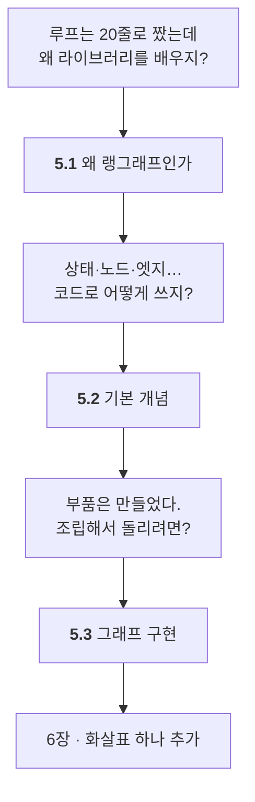

# Chapter 05 · 랭그래프 기반 에이전트 설계

> Part 02 | 랭그래프로 구현하는 AI 에이전트

## 학습 목표

- 랭그래프를 쓰는 이유와 특징을 설명할 수 있다
- State, Reducer, Node, Edge, Conditional Edge를 직접 정의해 그래프를 만들 수 있다
- 조건 분기가 있는 기본 에이전트 그래프를 구현하고 실행할 수 있다

> **올라마로 어디까지 되나** — **이 장은 올라마만으로 전부 됩니다.** 5.2절은 LLM조차 거의 안 씁니다 — 그래프 문법이 주제입니다.
>
> 전체 지도는 [STUDY.md](../STUDY.md#올라마로-어디까지-되나)에 있습니다.

## 이 장의 이해 흐름

**6장부터 계속 쓰는 문법**을 익히는 장입니다. 여기가 손에 안 붙으면 6장이 힘듭니다.



| 절 | 이 절의 질문 | 얻는 것 |
| :--- | :--- | :--- |
| **5.1** | 왜 굳이 라이브러리를 배우지? | **`for` 루프는 멈추면 처음부터** — 그래프를 쓰는 이유 |
| **5.2** | 상태·노드·엣지를 코드로 어떻게? | **리듀서**와 **조건부 엣지** |
| **5.3** | 조립해서 돌리려면? | `compile()`과 **"아직 워크플로"** 라는 선긋기 |

> **5.3을 다 읽고도 "에이전트 아니야?" 싶다면 제대로 이해한 겁니다.** 6.1절에서 **화살표 하나**를 추가하면 그때 에이전트가 됩니다.

### 5장 전체를 한 줄로

> **`for` 루프의 한계 때문에 그래프를 쓴다는 걸 알았고(5.1) → 상태·리듀서·노드·엣지를 코드로 만들었고(5.2) → 조립해서 실제로 도는 그래프를 만들었다(5.3).**

## 절별 노트

| 절 | 노트 파일 | 진도 |
| --- | --- | --- |
| 5.1 | [`05-01_왜 랭그래프인가.md`](05-01_%EC%99%9C%20%EB%9E%AD%EA%B7%B8%EB%9E%98%ED%94%84%EC%9D%B8%EA%B0%80.md) | ☐ |
| 5.2 | [`05-02_랭그래프 기본 개념 이해하고 적용하기.md`](05-02_%EB%9E%AD%EA%B7%B8%EB%9E%98%ED%94%84%20%EA%B8%B0%EB%B3%B8%20%EA%B0%9C%EB%85%90%20%EC%9D%B4%ED%95%B4%ED%95%98%EA%B3%A0%20%EC%A0%81%EC%9A%A9%ED%95%98%EA%B8%B0.md) | ☐ |
| 5.3 | [`05-03_랭그래프로 에이전트 설계하고 구현하기.md`](05-03_%EB%9E%AD%EA%B7%B8%EB%9E%98%ED%94%84%EB%A1%9C%20%EC%97%90%EC%9D%B4%EC%A0%84%ED%8A%B8%20%EC%84%A4%EA%B3%84%ED%95%98%EA%B3%A0%20%EA%B5%AC%ED%98%84%ED%95%98%EA%B8%B0.md) | ☐ |

<details><summary>소절까지 펼쳐보기</summary>

- [ ] **[5.1 왜 랭그래프인가](05-01_%EC%99%9C%20%EB%9E%AD%EA%B7%B8%EB%9E%98%ED%94%84%EC%9D%B8%EA%B0%80.md)**
  - [ ] 5.1.1 랭그래프의 특징
  - [ ] 5.1.2 랭그래프를 사용해야 하는 이유
- [ ] **[5.2 랭그래프 기본 개념 이해하고 적용하기](05-02_%EB%9E%AD%EA%B7%B8%EB%9E%98%ED%94%84%20%EA%B8%B0%EB%B3%B8%20%EA%B0%9C%EB%85%90%20%EC%9D%B4%ED%95%B4%ED%95%98%EA%B3%A0%20%EC%A0%81%EC%9A%A9%ED%95%98%EA%B8%B0.md)**
  - [ ] 5.2.1 [실습] 그래프의 상태 정의하기
  - [ ] 5.2.2 [실습] 그래프의 상태에 리듀서 함수 추가하기
  - [ ] 5.2.3 [실습] 그래프의 실행 단위, 노드 추가하기
  - [ ] 5.2.4 [실습] 그래프의 실행 경로, 엣지 추가하기
  - [ ] 5.2.5 [실습] 그래프에 조건부 엣지 추가하기
- [ ] **[5.3 랭그래프로 에이전트 설계하고 구현하기](05-03_%EB%9E%AD%EA%B7%B8%EB%9E%98%ED%94%84%EB%A1%9C%20%EC%97%90%EC%9D%B4%EC%A0%84%ED%8A%B8%20%EC%84%A4%EA%B3%84%ED%95%98%EA%B3%A0%20%EA%B5%AC%ED%98%84%ED%95%98%EA%B8%B0.md)**
  - [ ] 5.3.1 [실습] 답변을 생성하는 기본 그래프 구현하기
  - [ ] 5.3.2 [실습] 조건이 추가된 그래프 구현하기

</details>

## 관련 예제 코드

| 내용 | 경로 |
| --- | --- |
| 5.2 랭그래프 기본 개념 | [`examples/5.2_랭그래프 기본 개념 이해하기.ipynb`](examples/5.2_%EB%9E%AD%EA%B7%B8%EB%9E%98%ED%94%84%20%EA%B8%B0%EB%B3%B8%20%EA%B0%9C%EB%85%90%20%EC%9D%B4%ED%95%B4%ED%95%98%EA%B8%B0.ipynb) |
| 5.3 에이전트 설계·구현 | [`examples/5.3_랭그래프로 에이전트 설계하고 구현하기.ipynb`](examples/5.3_%EB%9E%AD%EA%B7%B8%EB%9E%98%ED%94%84%EB%A1%9C%20%EC%97%90%EC%9D%B4%EC%A0%84%ED%8A%B8%20%EC%84%A4%EA%B3%84%ED%95%98%EA%B3%A0%20%EA%B5%AC%ED%98%84%ED%95%98%EA%B8%B0.ipynb) |

## `.env` 두는 위치

**저장소 루트의 `.env` 하나로 관리합니다.** 장 폴더에는 두지 않습니다. 노트북은 실행 위치 기준으로 탐색합니다.

```powershell
# 저장소 루트에서 한 번만
copy .env.example .env
```

## 참고 문서

| 무엇을 볼 때 | 문서 |
| --- | --- |
| 5.1 왜 랭그래프인가 | [LangGraph overview](https://docs.langchain.com/oss/python/langgraph/overview) |
| 5.2 State·Node·Edge 개념 | [Graph API overview](https://docs.langchain.com/oss/python/langgraph/graph-api) |
| 5.2 손으로 따라가며 익히기 | [Use the graph API](https://docs.langchain.com/oss/python/langgraph/use-graph-api) |
| 5.3 에이전트 설계 사고법 | [Thinking in LangGraph](https://docs.langchain.com/oss/python/langgraph/thinking-in-langgraph) |
| 상태 저장 (8장 예고) | [Persistence](https://docs.langchain.com/oss/python/langgraph/persistence) |
| 그래프 API vs 함수형 API | [Choosing between Graph and Functional APIs](https://docs.langchain.com/oss/python/langgraph/choosing-apis) |

> [Quickstart](https://docs.langchain.com/oss/python/langgraph/quickstart)를 먼저 한 번 훑고 오면 훨씬 수월합니다.

## 이 폴더 구성

- `05-01_…md` ~ `05-03_…md` — 절별 학습 노트
- `notes.md` — 장 전체 요약 (절 노트를 다 쓴 뒤 마지막에 정리)
- `practice/` — 예제를 보지 않고 직접 쳐보는 공간
- `.env.example` — 이 장에 필요한 API 키. `# 저장소 루트에서 한 번만
copy .env.example .env` 후 값을 채우세요

---

[⬅ 전체 목차로](../STUDY.md)
