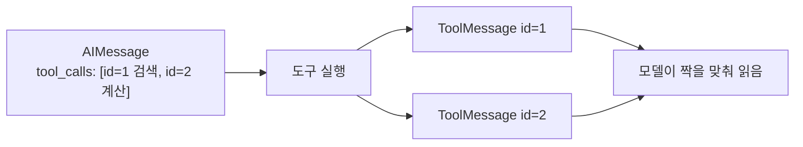
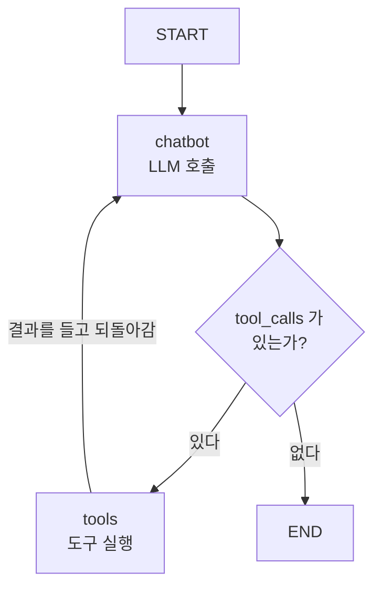

# 6.1 도구를 호출하는 에이전트 이해하기

> **저자 예제** — [`examples/web_agent/agent.py`](examples/web_agent/agent.py)
> **공식 문서** — [LangChain · Agents](https://docs.langchain.com/oss/python/langchain/agents) · [LangChain · Tools](https://docs.langchain.com/oss/python/langchain/tools)

> **여기까지** — 도는 그래프를 만들었지만 **아직 워크플로**였습니다([5.3절](../ch05_langgraph-basics/05-03_%EB%9E%AD%EA%B7%B8%EB%9E%98%ED%94%84%EB%A1%9C%20%EC%97%90%EC%9D%B4%EC%A0%84%ED%8A%B8%20%EC%84%A4%EA%B3%84%ED%95%98%EA%B3%A0%20%EA%B5%AC%ED%98%84%ED%95%98%EA%B8%B0.md)).
> **이 절의 질문** — **어떤 화살표 하나**를 더하면 에이전트가 되지?
> **다 읽으면** — **이 책의 분수령**을 넘습니다. 여기서 만드는 순환이 앞으로 만들 모든 것의 기본형입니다.

[5.3절](../ch05_langgraph-basics/05-03_%EB%9E%AD%EA%B7%B8%EB%9E%98%ED%94%84%EB%A1%9C%20%EC%97%90%EC%9D%B4%EC%A0%84%ED%8A%B8%20%EC%84%A4%EA%B3%84%ED%95%98%EA%B3%A0%20%EA%B5%AC%ED%98%84%ED%95%98%EA%B8%B0.md)을 이렇게 끝냈습니다.

> 이 그래프는 아직 워크플로입니다. **순환이 들어가야 에이전트**가 됩니다.

이 절에서 그 순환을 만듭니다. 화살표 하나가 추가되면 워크플로가 에이전트가 됩니다.

## 모델에 도구를 붙입니다 — `bind_tools`

[2.2절](../ch02_core-elements/02-02_%EC%97%90%EC%9D%B4%EC%A0%84%ED%8A%B8%EC%9D%98%20%EC%99%B8%EB%B6%80%20%EC%A7%80%EC%8B%9D%20%ED%99%9C%EC%9A%A9%20-%20%EB%8F%84%EA%B5%AC%20%ED%98%B8%EC%B6%9C.md)에서 "모델에게 가는 것은 이름·설명·인자 스키마"라고 했습니다. 그 일을 하는 것이 `bind_tools`입니다.

```python
llm = ChatOpenAI(model="gpt-4o")
llm_with_tools = llm.bind_tools(tools)
```

**원래 모델은 그대로 두고 도구가 붙은 새 객체를 돌려줍니다.** 이제 `llm_with_tools.invoke(...)`를 부르면 요청에 도구 명세가 함께 실려 갑니다.

## 응답이 두 갈래가 됩니다

도구를 붙이기 전에는 [4.4절](../ch04_dev-env/04-04_LLM%20%EC%82%AC%EC%9A%A9%ED%95%98%EA%B8%B0.md)처럼 `.content`에 답이 왔습니다. 도구를 붙이면 **응답이 둘 중 하나**가 됩니다.

| 응답 | `.content` | `.tool_calls` | 의미 |
| :--- | :--- | :--- | :--- |
| 그냥 답변 | 텍스트 | 비어 있음 | 도구 없이 답할 수 있다 |
| 도구 호출 요청 | 대개 비어 있음 | **채워짐** | "이 도구를 이 인자로 불러 달라" |

[4.4절](../ch04_dev-env/04-04_LLM%20%EC%82%AC%EC%9A%A9%ED%95%98%EA%B8%B0.md)에서 "`.tool_calls`는 6장에서 채워집니다"라고 한 그 자리입니다.

**모델은 여전히 실행하지 않습니다**([1.3절](../ch01_llm-decision/01-03_LLM%EC%9D%B4%20%EB%8B%A4%EC%9D%8C%20%ED%96%89%EB%8F%99%EC%9D%84%20%EA%B2%B0%EC%A0%95%ED%95%98%EB%8B%A4.md)). 요청만 낼 뿐입니다.

## 실행하는 노드를 만듭니다

저자 예제 [`web_agent/agent.py`](examples/web_agent/agent.py)의 `BasicToolNode`가 그 일을 합니다. 뼈대만 보면 이렇습니다.

```python
class BasicToolNode:
    def __init__(self, tools: list) -> None:
        self.tools_by_name = {tool.name: tool for tool in tools}

    def __call__(self, inputs: dict):
        message = inputs["messages"][-1]          # [1] 마지막 AI 메시지
        outputs = []
        for tool_call in message.tool_calls:      # [2] 요청된 도구마다
            tool_result = self.tools_by_name[tool_call["name"]].invoke(
                tool_call["args"]
            )
            outputs.append(
                ToolMessage(                      # [3] 결과를 메시지로
                    content=json.dumps(tool_result, ensure_ascii=False),
                    name=tool_call["name"],
                    tool_call_id=tool_call["id"],
                )
            )
        return {"messages": outputs}
```

| 번호 | 하는 일 |
| :--- | :--- |
| [1] | 방금 모델이 낸 요청을 꺼냅니다 |
| [2] | **이름으로 실제 함수를 찾아** 인자를 넣어 실행합니다 |
| [3] | 결과를 `ToolMessage`로 감싸 상태에 넣습니다 |

### `tool_call_id`가 왜 필요한가

`ToolMessage`에 `tool_call_id`를 넣는 게 형식적으로 보이지만 **필수**입니다.

모델은 **한 번에 도구를 여러 개 요청할 수 있습니다.** 그러면 결과도 여러 개 돌아갑니다. 이때 **어느 결과가 어느 요청에 대한 것인지** 짝을 지어 줘야 합니다. 그 짝짓기 열쇠가 `tool_call_id`입니다.



> **`tool_call_id`가 안 맞으면 오류가 납니다.** 도구 노드를 직접 만들 때 가장 자주 걸리는 곳입니다.

## 화살표 하나로 순환을 만듭니다

이제 [5.2.5절](../ch05_langgraph-basics/05-02_%EB%9E%AD%EA%B7%B8%EB%9E%98%ED%94%84%20%EA%B8%B0%EB%B3%B8%20%EA%B0%9C%EB%85%90%20%EC%9D%B4%ED%95%B4%ED%95%98%EA%B3%A0%20%EC%A0%81%EC%9A%A9%ED%95%98%EA%B8%B0.md)의 조건부 엣지를 씁니다.

```python
def route_tools(state: State):
    ai_message = state["messages"][-1]
    if hasattr(ai_message, "tool_calls") and len(ai_message.tool_calls) > 0:
        return "tools"
    return END

graph_builder.add_conditional_edges(
    "chatbot", route_tools, {"tools": "tools", END: END},
)

graph_builder.add_edge("tools", "chatbot")     # ← 이 한 줄이 순환입니다
graph_builder.add_edge(START, "chatbot")
```

**`add_edge("tools", "chatbot")`** — 도구를 실행한 다음 다시 챗봇으로 돌아갑니다. 이 줄이 없으면 도구를 한 번 부르고 끝납니다.



**이 그림이 [2.1절](../ch02_core-elements/02-01_%EC%97%90%EC%9D%B4%EC%A0%84%ED%8A%B8%EC%9D%98%20%EC%B6%94%EB%A1%A0%20%EB%8A%A5%EB%A0%A5%20-%20ReAct%EC%99%80%20Reflection.md)의 ReAct 루프입니다.** Thought는 `chatbot` 노드가, Action은 `tools` 노드가, Observation은 `ToolMessage`가 맡습니다.

| ReAct 용어 | 이 그래프에서 |
| :--- | :--- |
| Thought | `chatbot` 노드의 판단 |
| Action | `tools` 노드의 실행 |
| Observation | `ToolMessage` |
| 종료 | `tool_calls`가 비면 `END` |

## 종료 조건은 모델이 정합니다

[1.3절](../ch01_llm-decision/01-03_LLM%EC%9D%B4%20%EB%8B%A4%EC%9D%8C%20%ED%96%89%EB%8F%99%EC%9D%84%20%EA%B2%B0%EC%A0%95%ED%95%98%EB%8B%A4.md)에서 예고한 문제가 여기서 실제가 됩니다. **루프가 언제 끝날지는 모델이 도구를 그만 부를 때**입니다. 개발자가 정하지 않습니다.

모델이 판단을 잘못하면 계속 돕니다. 랭그래프는 재귀 한도를 두고, 넘으면 `GRAPH_RECURSION_LIMIT` 오류를 냅니다.

> **무한 루프가 났다면 한도를 올리기 전에 도구 설명부터 보세요.** [2.2절](../ch02_core-elements/02-02_%EC%97%90%EC%9D%B4%EC%A0%84%ED%8A%B8%EC%9D%98%20%EC%99%B8%EB%B6%80%20%EC%A7%80%EC%8B%9D%20%ED%99%9C%EC%9A%A9%20-%20%EB%8F%84%EA%B5%AC%20%ED%98%B8%EC%B6%9C.md)대로 "언제 쓰면 안 되는가"가 빠져 있으면 모델이 그만둘 근거를 못 찾습니다.

## 직접 만들 필요는 없습니다

위의 `BasicToolNode`와 `route_tools`는 **구조를 이해하려고 손으로 만든 것**입니다. 실제로는 랭그래프가 같은 것을 제공합니다.

```python
from langgraph.prebuilt import tools_condition
```

6.5절 RAG 예제([`rag_agent/agent.py`](examples/rag_agent/agent.py))가 `tools_condition`을 그대로 씁니다. 그리고 **6.4절의 `create_agent`는 이 그래프 전체를 한 줄로 만들어 줍니다.**

**그래도 여기서 손으로 만들어 보는 이유**는, `create_agent`가 안에서 무엇을 하는지 모르면 문제가 생겼을 때 손댈 수 없기 때문입니다.

## 요약 및 비유

**주치의와 검사실**입니다. 의사는 검사를 **지시**할 뿐 직접 하지 않고, 검사실이 결과를 회신하면 그것을 보고 다시 판단합니다. 검사를 더 시킬 수도, 진단을 내릴 수도 있습니다.

| 개념 | 진료 비유 | 기술적 의미 |
| :--- | :--- | :--- |
| **`bind_tools`** | 이 병원에서 가능한 검사 목록을 의사에게 줌 | 도구 명세를 요청에 실음 |
| **`.tool_calls`** | 검사 지시서 | 도구 호출 요청 |
| **도구 노드** | 검사실 | 실제 실행 주체 |
| **`ToolMessage`** | 검사 결과지 | 실행 결과 메시지 |
| **`tool_call_id`** | 지시서 번호 | 요청과 결과의 짝짓기 |
| **조건부 엣지** | 지시서가 있나 확인 | `tool_calls` 유무로 분기 |
| **`tools → chatbot`** | 결과지를 들고 진료실로 | **순환을 만드는 한 줄** |
| **종료** | 진단을 내림 | `tool_calls`가 빔 |
| **재귀 한도** | 검사를 무한정 못 시킴 | `GRAPH_RECURSION_LIMIT` |

## 결론

* `bind_tools`는 **도구 명세를 요청에 실어 보냅니다.** 모델 객체를 바꾸지 않고 새 객체를 돌려줍니다.
* 도구를 붙이면 응답이 **`.content`(그냥 답변)** 또는 **`.tool_calls`(호출 요청)** 두 갈래가 됩니다.
* 도구 노드는 **이름으로 함수를 찾아 실행하고 `ToolMessage`로 감싸** 상태에 넣습니다.
* **`tool_call_id`는 필수**입니다. 한 번에 여러 도구를 부를 수 있어서 요청과 결과를 짝지어야 합니다.
* **`add_edge("tools", "chatbot")` 한 줄이 순환을 만듭니다.** 이 줄이 워크플로를 에이전트로 바꿉니다.
* 이 그래프가 곧 [2.1절](../ch02_core-elements/02-01_%EC%97%90%EC%9D%B4%EC%A0%84%ED%8A%B8%EC%9D%98%20%EC%B6%94%EB%A1%A0%20%EB%8A%A5%EB%A0%A5%20-%20ReAct%EC%99%80%20Reflection.md)의 ReAct입니다 — `chatbot`이 Thought, `tools`가 Action, `ToolMessage`가 Observation.
* **종료 시점은 모델이 정합니다.** 무한 루프가 나면 한도보다 도구 설명을 먼저 의심하세요.
* 실무에서는 `tools_condition`이나 `create_agent`(6.4절)를 씁니다. 손으로 만들어 보는 건 **안을 알기 위해서**입니다.

---

## 다음 절로

순환은 만들었습니다. **그런데 붙인 도구가 아직 없습니다.**

[1.1절](../ch01_llm-decision/01-01_AI%20%EC%97%90%EC%9D%B4%EC%A0%84%ED%8A%B8%EC%9D%98%20%EB%91%90%EB%87%8C%2C%20%EA%B1%B0%EB%8C%80%20%EC%96%B8%EC%96%B4%20%EB%AA%A8%EB%8D%B8%EC%9D%98%20%EC%9D%B4%ED%95%B4.md)의 **지식 컷오프**를 메우는 가장 직접적인 도구 — **웹 검색**부터 붙여 봅시다. → **[6.2절](06-02_%EC%9B%B9%20%EA%B2%80%EC%83%89%20%EC%97%90%EC%9D%B4%EC%A0%84%ED%8A%B8%20%EB%A7%8C%EB%93%A4%EA%B8%B0.md)**

---

[Chapter 06](README.md) · [6.2 ➡](06-02_%EC%9B%B9%20%EA%B2%80%EC%83%89%20%EC%97%90%EC%9D%B4%EC%A0%84%ED%8A%B8%20%EB%A7%8C%EB%93%A4%EA%B8%B0.md)
