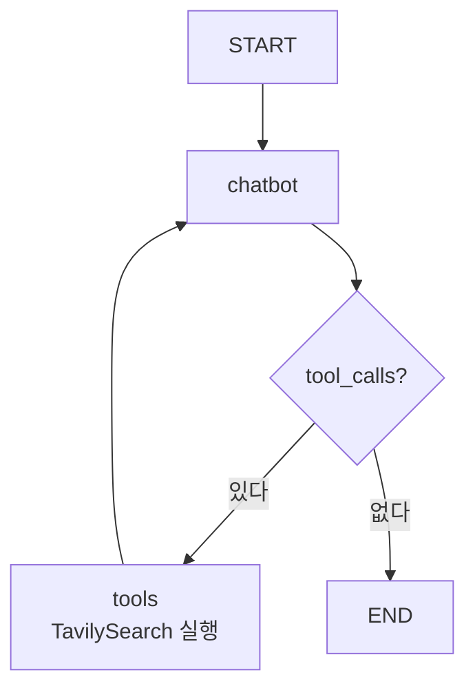

# 6.2 웹 검색 에이전트 만들기

> **저자 예제** — [`examples/web_agent/agent.py`](examples/web_agent/agent.py) · [`examples/langgraph.json`](examples/langgraph.json)
> **공식 문서** — [Tavily 문서](https://docs.tavily.com/) · [Run a local server](https://docs.langchain.com/oss/python/langgraph/local-server) · [LangSmith Studio](https://docs.langchain.com/oss/python/langgraph/studio)

[1.1절](../ch01_llm-decision/01-01_AI%20%EC%97%90%EC%9D%B4%EC%A0%84%ED%8A%B8%EC%9D%98%20%EB%91%90%EB%87%8C%2C%20%EA%B1%B0%EB%8C%80%20%EC%96%B8%EC%96%B4%20%EB%AA%A8%EB%8D%B8%EC%9D%98%20%EC%9D%B4%ED%95%B4.md)의 **지식 컷오프**를 기억하시나요. 모델은 학습 시점 이후를 모르면서 모른다고 말하지 않습니다. 그 구멍을 검색 도구로 메웁니다.

[6.1절](06-01_%EB%8F%84%EA%B5%AC%EB%A5%BC%20%ED%98%B8%EC%B6%9C%ED%95%98%EB%8A%94%20%EC%97%90%EC%9D%B4%EC%A0%84%ED%8A%B8%20%EC%9D%B4%ED%95%B4%ED%95%98%EA%B8%B0.md)에서 만든 순환에 **진짜 도구**를 끼웁니다.

## 6.2.1 [실습] 타빌리 서치 사용법 익히기

**타빌리(Tavily)** 는 LLM에 넣을 것을 전제로 만든 검색 서비스입니다.

일반 검색 API와 무엇이 다른가가 중요합니다.

| | 일반 검색 API | Tavily |
| :--- | :--- | :--- |
| 돌려주는 것 | 링크 목록 | **본문을 추려서 정리한 텍스트** |
| 그다음 할 일 | 페이지를 열어 긁어내야 함 | 바로 프롬프트에 넣을 수 있음 |
| 분량 | 조절 불가 | `max_results`로 조절 |

`max_results`가 왜 파라미터로 있는지 생각해 보세요. [2.3절](../ch02_core-elements/02-03_%EC%97%90%EC%9D%B4%EC%A0%84%ED%8A%B8%EC%9D%98%20%EA%B8%B0%EC%96%B5%EB%A0%A5%20-%20%EB%A9%94%EB%AA%A8%EB%A6%AC.md)에서 본 대로 **검색 결과는 컨텍스트를 가장 크게 잡아먹는 것**입니다.

```python
from langchain_tavily import TavilySearch

tool = TavilySearch(max_results=3)
tools = [tool]
```

> **API 키가 필요합니다.** [`.env`](.env.example)에 `TAVILY_API_KEY`를 넣습니다([4.3절](../ch04_dev-env/04-03_%ED%99%98%EA%B2%BD%EB%B3%80%EC%88%98%20%EC%84%A4%EC%A0%95%ED%95%98%EA%B8%B0.md)).

여기서 하나 짚고 갑니다. **`TavilySearch`는 이미 도구입니다.** [2.2절](../ch02_core-elements/02-02_%EC%97%90%EC%9D%B4%EC%A0%84%ED%8A%B8%EC%9D%98%20%EC%99%B8%EB%B6%80%20%EC%A7%80%EC%8B%9D%20%ED%99%9C%EC%9A%A9%20-%20%EB%8F%84%EA%B5%AC%20%ED%98%B8%EC%B6%9C.md)에서 말한 이름·설명·인자 스키마를 라이브러리가 이미 갖춰 뒀습니다. 그래서 우리가 독스트링을 쓸 필요가 없습니다. 직접 만드는 것은 [6.3절](06-03_%EC%BD%94%EB%94%A9%20%EC%97%90%EC%9D%B4%EC%A0%84%ED%8A%B8%20%EB%A7%8C%EB%93%A4%EA%B8%B0.md)에서 합니다.

## 6.2.2 [실습] 랭체인에서 도구 호출 사용하기

[6.1절](06-01_%EB%8F%84%EA%B5%AC%EB%A5%BC%20%ED%98%B8%EC%B6%9C%ED%95%98%EB%8A%94%20%EC%97%90%EC%9D%B4%EC%A0%84%ED%8A%B8%20%EC%9D%B4%ED%95%B4%ED%95%98%EA%B8%B0.md)의 `bind_tools`입니다.

```python
llm = ChatOpenAI(model="gpt-4o")
llm_with_tools = llm.bind_tools(tools)
```

이 상태로 호출하면 응답의 `.tool_calls`에 **검색어까지 채워져** 돌아옵니다. 검색어를 우리가 만들지 않는다는 점이 중요합니다. 사용자 질문을 보고 **모델이 검색어를 정합니다.**

## 6.2.3 [실습] 랭그래프로 에이전트 그래프 생성하기

상태는 메시지 하나면 충분합니다.

```python
class State(TypedDict):
    messages: Annotated[list, add_messages]
```

[5.2.2절](../ch05_langgraph-basics/05-02_%EB%9E%AD%EA%B7%B8%EB%9E%98%ED%94%84%20%EA%B8%B0%EB%B3%B8%20%EA%B0%9C%EB%85%90%20%EC%9D%B4%ED%95%B4%ED%95%98%EA%B3%A0%20%EC%A0%81%EC%9A%A9%ED%95%98%EA%B8%B0.md)의 `add_messages` 리듀서입니다. 대화·도구 요청·도구 결과가 **한 목록에 순서대로 쌓입니다.**

노드는 둘입니다.

```python
def chatbot(state: State):
    response = llm_with_tools.invoke(state["messages"])
    return {"messages": [response]}

graph_builder.add_node("chatbot", chatbot)
graph_builder.add_node("tools", BasicToolNode(tools=[tool]))
```

그리고 [6.1절](06-01_%EB%8F%84%EA%B5%AC%EB%A5%BC%20%ED%98%B8%EC%B6%9C%ED%95%98%EB%8A%94%20%EC%97%90%EC%9D%B4%EC%A0%84%ED%8A%B8%20%EC%9D%B4%ED%95%B4%ED%95%98%EA%B8%B0.md)에서 본 순환을 잇습니다.



**노드 두 개와 엣지 네 개.** 웹 검색 에이전트는 이게 전부입니다.

## 6.2.4 [실습] 최신 정보 검색하고 답변 받아보기

### 실행 방식이 여러 가지입니다

저자 예제 [`web_agent/agent.py`](examples/web_agent/agent.py) 아래쪽에 실행 함수가 여러 개 정의돼 있습니다. **하나씩 바꿔 가며 돌려 보라는 뜻**입니다.

| 함수 | 방식 | 언제 |
| :--- | :--- | :--- |
| `invoke()` | 끝날 때까지 기다렸다 한 번에 | 결과만 필요할 때 |
| `ainvoke()` | 위의 비동기판 | 서버에서 동시 요청 처리 |
| `stream()` | **노드가 끝날 때마다** 조각을 받음 | 진행 상황을 보고 싶을 때 |
| `astream()` | 위의 비동기판 | |

### 스트리밍 모드가 세 가지입니다

`stream()`에 `stream_mode`를 주면 **무엇을 흘려보낼지**가 달라집니다. 저자 예제가 세 가지를 다 보여 줍니다.

| `stream_mode` | 받는 것 | 쓰임 |
| :--- | :--- | :--- |
| 기본(`updates`) | **그 노드가 바꾼 부분만** | 어느 노드가 무엇을 했는지 추적 |
| `values` | **매 단계의 상태 전체** | 상태가 어떻게 쌓이는지 관찰 |
| `messages` | **토큰 단위** | 챗봇 UI처럼 글자가 흐르게 |

```python
response = graph.stream({"messages": ["…"]}, stream_mode="messages")
for token, metadata in response:
    print(token.content)
```

> **`messages` 모드가 챗봇 UI에서 글자가 한 자씩 나오는 그 방식입니다.** `metadata["langgraph_node"]`를 보면 **어느 노드가 낸 토큰인지** 알 수 있어서, 도구 실행 중에는 안 보여 주고 최종 답변만 흘려보내는 식으로 쓸 수 있습니다.

### 메시지를 읽기 좋게 출력하기

```python
for msg in response["messages"]:
    msg.pretty_print()
```

`pretty_print()`는 메시지 종류(Human / AI / Tool)와 내용을 보기 좋게 찍어 줍니다. **도구 요청과 결과가 어떤 순서로 쌓였는지** 눈으로 확인하는 용도입니다.

> 실행 결과는 검색 시점과 모델에 따라 매번 달라지므로 이 노트에는 싣지 않았습니다. 직접 돌려 보고 [`practice/`](practice/)에 남기세요.

## 6.2.5 [실습] 랭그래프 서버 실행하고 랭그래프 스튜디오 사용하기

지금까지는 파이썬 파일을 직접 돌렸습니다. **랭그래프 서버**로 띄우면 그래프를 API로 부르고 **스튜디오**에서 눈으로 볼 수 있습니다.

### `langgraph.json`이 진입점을 지정합니다

저자 예제 [`examples/langgraph.json`](examples/langgraph.json)은 이렇게 생겼습니다.

```json
{
  "dependencies": ["./rag_agent"],
  "graphs": {
    "agent": "./rag_agent/agent.py:graph"
  },
  "env": ".env"
}
```

| 키 | 뜻 |
| :--- | :--- |
| `graphs` | **`파일경로:변수명`** — 어느 파일의 어느 변수가 그래프인지 |
| `dependencies` | 함께 읽어야 할 코드 위치 |
| `env` | 환경변수 파일 위치 |

**`agent.py:graph`의 `graph`가 `compile()`의 결과여야 합니다**([5.3절](../ch05_langgraph-basics/05-03_%EB%9E%AD%EA%B7%B8%EB%9E%98%ED%94%84%EB%A1%9C%20%EC%97%90%EC%9D%B4%EC%A0%84%ED%8A%B8%20%EC%84%A4%EA%B3%84%ED%95%98%EA%B3%A0%20%EA%B5%AC%ED%98%84%ED%95%98%EA%B8%B0.md)). 빌더가 아니라 컴파일된 그래프입니다.

> **이 파일은 지금 RAG 에이전트(6.5절)를 가리키고 있습니다.** 웹 검색 에이전트를 스튜디오로 보려면 `./web_agent/agent.py:graph`로 바꾸세요.

### 서버 띄우기

```powershell
cd examples
langgraph dev
```

> **`langgraph.json`이 있는 디렉터리에서 실행해야 합니다.** 그래서 [4.3절](../ch04_dev-env/04-03_%ED%99%98%EA%B2%BD%EB%B3%80%EC%88%98%20%EC%84%A4%EC%A0%95%ED%95%98%EA%B8%B0.md)에서 말한 대로 **`examples/`에도 `.env`가 있어야** 합니다. `env` 키가 `.env`를 상대 경로로 가리키고 있습니다.
>
> `langgraph` 명령은 `langgraph-cli[inmem]`가 깔려 있어야 씁니다. [`pyproject.toml`](../pyproject.toml)에 들어 있습니다.

### 스튜디오에서 보는 것

스튜디오는 **그래프를 그림으로 보여 주고, 실행을 단계별로 따라갈 수 있게** 해 줍니다.

- 어느 노드를 지났는지
- 각 단계에서 **상태가 어떻게 바뀌었는지**
- 도구에 어떤 인자가 들어갔고 무엇이 돌아왔는지

**직접 만든 도구가 왜 안 불리는지** 확인할 때 특히 유용합니다. [2.2절](../ch02_core-elements/02-02_%EC%97%90%EC%9D%B4%EC%A0%84%ED%8A%B8%EC%9D%98%20%EC%99%B8%EB%B6%80%20%EC%A7%80%EC%8B%9D%20%ED%99%9C%EC%9A%A9%20-%20%EB%8F%84%EA%B5%AC%20%ED%98%B8%EC%B6%9C.md)의 도구 설명 문제인지, 인자 형식 문제인지가 눈에 보입니다.

## 요약 및 비유

**취재 기자**입니다. 무엇을 취재할지 스스로 정하고(검색어 생성), 취재하고(도구 실행), 자료를 보고 더 알아볼지 기사를 쓸지 판단합니다(순환).

| 개념 | 취재 비유 | 기술적 의미 |
| :--- | :--- | :--- |
| **지식 컷오프** | 오래된 자료만 갖고 있음 | 학습 시점 이후를 모름 |
| **Tavily** | 정리된 취재 자료를 주는 통신사 | LLM용으로 추린 검색 결과 |
| **`max_results`** | 자료를 몇 건까지 받을지 | 컨텍스트 소비 조절 |
| **검색어 생성** | 무엇을 취재할지 기자가 정함 | 모델이 `args`를 채움 |
| **순환** | 자료 보고 더 취재할지 판단 | `tools → chatbot` |
| **`stream()`** | 취재 진행을 중계 | 노드마다 조각 방출 |
| **`stream_mode="messages"`** | 기사가 한 줄씩 타이핑됨 | 토큰 단위 스트리밍 |
| **`langgraph.json`** | 어느 기사를 낼지 지정 | 그래프 진입점 |
| **스튜디오** | 취재 경로를 지도에 표시 | 실행 시각화 |

## 결론

* Tavily는 **본문을 추려서 주는 LLM용 검색**입니다. 링크만 주는 일반 검색과 달라 바로 프롬프트에 넣을 수 있습니다.
* **`max_results`는 컨텍스트 예산입니다.** 검색 결과가 컨텍스트를 가장 크게 잡아먹습니다.
* `TavilySearch`는 **이미 도구 형태**라 독스트링을 쓸 필요가 없습니다. 직접 만드는 것은 6.3절입니다.
* **검색어는 모델이 정합니다.** 우리는 도구만 붙입니다.
* 웹 검색 에이전트는 **노드 둘, 엣지 넷**이 전부입니다.
* `stream_mode`는 셋 — **`updates`**(노드가 바꾼 것), **`values`**(상태 전체), **`messages`**(토큰). 챗봇 UI는 세 번째입니다.
* `langgraph.json`의 `graphs`는 **`파일:변수`** 형식이고, 변수는 **컴파일된 그래프**여야 합니다.
* `langgraph dev`는 **`langgraph.json`이 있는 폴더에서** 실행하고, 그 폴더에 `.env`가 있어야 합니다.

---

[⬅ 6.1](06-01_%EB%8F%84%EA%B5%AC%EB%A5%BC%20%ED%98%B8%EC%B6%9C%ED%95%98%EB%8A%94%20%EC%97%90%EC%9D%B4%EC%A0%84%ED%8A%B8%20%EC%9D%B4%ED%95%B4%ED%95%98%EA%B8%B0.md) · [Chapter 06](README.md) · [6.3 ➡](06-03_%EC%BD%94%EB%94%A9%20%EC%97%90%EC%9D%B4%EC%A0%84%ED%8A%B8%20%EB%A7%8C%EB%93%A4%EA%B8%B0.md)
