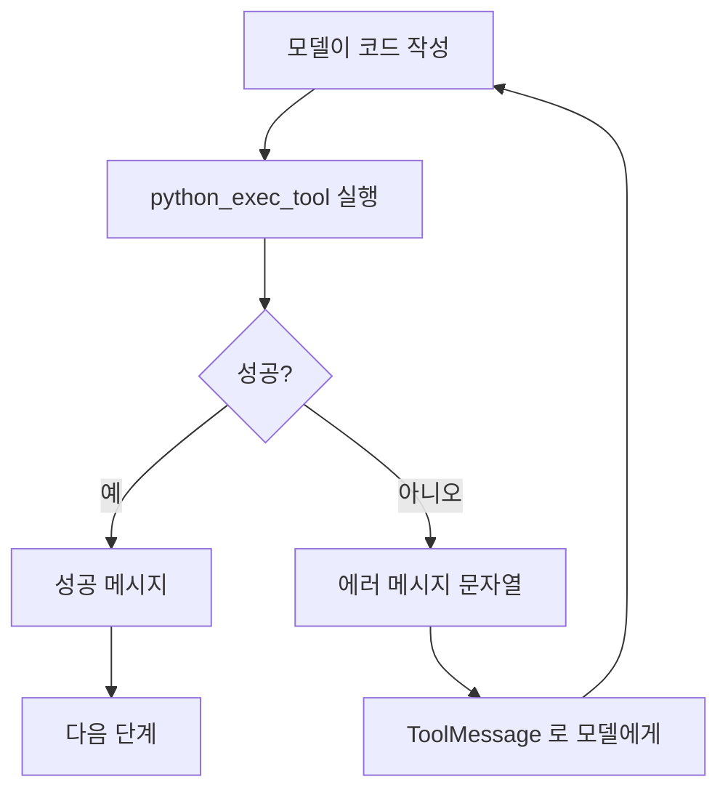

# 6.3 코딩 에이전트 만들기

> **저자 예제** — [`examples/coding_agent/tools.py`](examples/coding_agent/tools.py) · [`examples/coding_agent/agent.py`](examples/coding_agent/agent.py) · [`examples/coding_agent/custom_tools.ipynb`](examples/coding_agent/custom_tools.ipynb)
> **공식 문서** — [LangChain · Tools](https://docs.langchain.com/oss/python/langchain/tools)

> **여기까지** — 라이브러리가 만들어 준 도구(Tavily)를 붙여 봤습니다([6.2절](06-02_%EC%9B%B9%20%EA%B2%80%EC%83%89%20%EC%97%90%EC%9D%B4%EC%A0%84%ED%8A%B8%20%EB%A7%8C%EB%93%A4%EA%B8%B0.md)).
> **이 절의 질문** — **내가 원하는 도구는 어떻게 만들지?**
> **다 읽으면** — [2.2절](../ch02_core-elements/02-02_%EC%97%90%EC%9D%B4%EC%A0%84%ED%8A%B8%EC%9D%98%20%EC%99%B8%EB%B6%80%20%EC%A7%80%EC%8B%9D%20%ED%99%9C%EC%9A%A9%20-%20%EB%8F%84%EA%B5%AC%20%ED%98%B8%EC%B6%9C.md)의 **"독스트링은 프롬프트"** 를 몸으로 알게 됩니다. 그리고 `exec` 의 위험도 함께 봅니다.

[6.2절](06-02_%EC%9B%B9%20%EA%B2%80%EC%83%89%20%EC%97%90%EC%9D%B4%EC%A0%84%ED%8A%B8%20%EB%A7%8C%EB%93%A4%EA%B8%B0.md)의 Tavily는 라이브러리가 만들어 준 도구였습니다. 이번엔 **직접 만듭니다.**

그리고 코딩 에이전트는 [2.1절](../ch02_core-elements/02-01_%EC%97%90%EC%9D%B4%EC%A0%84%ED%8A%B8%EC%9D%98%20%EC%B6%94%EB%A1%A0%20%EB%8A%A5%EB%A0%A5%20-%20ReAct%EC%99%80%20Reflection.md)의 ReAct 루프가 가장 선명하게 보이는 예입니다. **에러 메시지가 그대로 Observation이 되어** 모델이 코드를 고쳐 다시 시도하니까요.

## 6.3.1 [실습] 사용자 도구 정의하기

### `@tool` 데코레이터

함수 위에 `@tool`을 붙이면 도구가 됩니다.

```python
from langchain.tools import tool

@tool
def my_tool(x: str) -> str:
    """이 도구가 무엇을 하는지 적는 자리."""
    ...
```

[2.2절](../ch02_core-elements/02-02_%EC%97%90%EC%9D%B4%EC%A0%84%ED%8A%B8%EC%9D%98%20%EC%99%B8%EB%B6%80%20%EC%A7%80%EC%8B%9D%20%ED%99%9C%EC%9A%A9%20-%20%EB%8F%84%EA%B5%AC%20%ED%98%B8%EC%B6%9C.md)에서 본 대로 이 데코레이터가 **함수에서 명세를 뽑아냅니다.**

| 함수의 것 | 명세의 것 |
| :--- | :--- |
| 함수 이름 | `name` |
| **독스트링** | `description` |
| 타입 힌트 | `parameters` |

### `Field`로 인자를 설명합니다

저자 예제는 인자마다 설명을 붙입니다.

```python
from pydantic import Field
from langchain.tools import tool

@tool
def python_exec_tool(
    imports: str = Field(description="임포트 구문"),
    code: str = Field(description="임포트 구문을 제외한 코드 블록"),
) -> str:
    """
    파이썬 코드를 실행하는 도구입니다. 만약 코드 실행에 실패하면 에러 메시지를 반환합니다.
    실행 결과를 확인하고 싶다면 `print(...)`를 사용하여 출력해야 합니다.
    """
```

**인자가 여러 개일 때 `Field(description=...)`가 특히 중요합니다.** 모델은 `imports`와 `code`에 각각 무엇을 넣어야 할지 이 설명으로 판단합니다. 없으면 이름만 보고 짐작해야 합니다.

> **독스트링의 두 번째 줄을 보세요** — "실행 결과를 확인하고 싶다면 `print(...)`를 사용해야 한다". 이건 함수 사용법이 아니라 **모델에게 주는 지시**입니다. 이 문장이 없으면 모델이 `print` 없이 코드를 짜고 결과가 안 보인다고 헤맵니다. [2.2절](../ch02_core-elements/02-02_%EC%97%90%EC%9D%B4%EC%A0%84%ED%8A%B8%EC%9D%98%20%EC%99%B8%EB%B6%80%20%EC%A7%80%EC%8B%9D%20%ED%99%9C%EC%9A%A9%20-%20%EB%8F%84%EA%B5%AC%20%ED%98%B8%EC%B6%9C.md)에서 "독스트링은 프롬프트"라고 한 것이 이 뜻입니다.

## 6.3.2 [실습] 코드 실행 도구 만들기

### 왜 임포트와 코드를 나눠 받는가

저자 예제 [`coding_agent/tools.py`](examples/coding_agent/tools.py)는 두 단계로 검사합니다.

```python
    # 임포트만 먼저 실행
    try:
        exec(imports)
    except Exception as e:
        return f"모듈을 임포트하는 데 실패했습니다. ERROR: {repr(e)}"

    # 임포트 + 코드 실행
    try:
        exec(imports + "\n" + code)
    except Exception as e:
        return f"코드 실행에 실패했습니다. ERROR: {repr(e)}"
```

나눠 받는 이유는 **실패 원인을 구분해서 알려 주기 위해서**입니다.

| 반환 메시지 | 모델이 할 일 |
| :--- | :--- |
| "모듈을 임포트하는 데 실패" | 없는 라이브러리를 썼구나 → 다른 방법으로 |
| "코드 실행에 실패" | 로직이 틀렸구나 → 코드를 고치자 |

**에러 메시지를 그냥 던지지 않고 분류해서 돌려주는 것**이 설계입니다. [2.2절](../ch02_core-elements/02-02_%EC%97%90%EC%9D%B4%EC%A0%84%ED%8A%B8%EC%9D%98%20%EC%99%B8%EB%B6%80%20%EC%A7%80%EC%8B%9D%20%ED%99%9C%EC%9A%A9%20-%20%EB%8F%84%EA%B5%AC%20%ED%98%B8%EC%B6%9C.md)에서 말한 "에러를 Observation으로 돌려준다"의 좋은 예입니다.

### 예외를 잡아서 문자열로 돌려줍니다

```python
except Exception as e:
    return f"코드 실행에 실패했습니다. ERROR: {repr(e)}"
```

**예외를 밖으로 던지지 않습니다.** 던지면 그래프가 통째로 멈춥니다. 문자열로 돌려주면 `ToolMessage`가 되어 모델이 읽고 고칠 수 있습니다.



**이 되돌아가는 화살표가 [2.1절](../ch02_core-elements/02-01_%EC%97%90%EC%9D%B4%EC%A0%84%ED%8A%B8%EC%9D%98%20%EC%B6%94%EB%A1%A0%20%EB%8A%A5%EB%A0%A5%20-%20ReAct%EC%99%80%20Reflection.md) ReAct의 Observation → Thought**입니다.

### `exec`의 위험

> **`exec()`는 받은 문자열을 그대로 실행합니다.** 모델이 만든 코드가 파일을 지우거나 네트워크로 뭔가 보내도 그대로 실행됩니다.
>
> 학습용으로는 괜찮지만 **실제 서비스에 이 코드를 그대로 쓰면 안 됩니다.** 실무에서는 격리된 환경(컨테이너·샌드박스)에서 실행하고, 시간·메모리·네트워크에 제한을 겁니다.
>
> 이 예제를 돌릴 때도 **모델이 무슨 코드를 실행하는지 확인**하세요. 스튜디오([6.2.5절](06-02_%EC%9B%B9%20%EA%B2%80%EC%83%89%20%EC%97%90%EC%9D%B4%EC%A0%84%ED%8A%B8%20%EB%A7%8C%EB%93%A4%EA%B8%B0.md))에서 도구 인자를 볼 수 있습니다.

## 6.3.3 [실습] 파일을 저장하는 도구 만들기

```python
@tool
def file_write_tool(
    file_path: str = Field(description="생성/수정할 파일의 경로"),
    content: str = Field(description="파일에 작성할 내용")
) -> str:
    """파일을 생성하거나 내용을 작성하는 도구입니다."""
    try:
        with open(file_path, 'w', encoding='utf-8') as f:
            f.write(content)
        return f"파일 '{file_path}'에 성공적으로 작성했습니다."
    except Exception as e:
        return f"파일 작성 실패: {repr(e)}"
```

앞의 도구와 **같은 틀**입니다 — `Field`로 인자 설명, `try/except`로 에러를 문자열 반환.

주의할 점 두 가지가 있습니다.

- **`encoding='utf-8'`** — 없으면 윈도우에서 한글이 깨집니다
- **`'w'` 모드는 기존 파일을 덮어씁니다** — 경로를 모델이 정하므로 중요한 파일을 지목하면 그대로 날아갑니다. 실무라면 쓰기 가능한 디렉터리를 제한해야 합니다

### 도구 두 개를 함께 주면 순서가 생깁니다

저자 예제 [`coding_agent/agent.py`](examples/coding_agent/agent.py)의 요청을 보세요.

```
"첫번째 항이 1인 피보나치 수열을 출력하는 파이썬 코드를 작성해주세요.
 정상적으로 실행되는 지 확인도 해주세요."
"확인했다면 그 코드는 .py 파일로 저장하세요."
```

**"확인했다면"** 이 한 마디로 순서가 정해집니다. 모델은 `python_exec_tool`로 먼저 검증하고, 성공한 뒤에 `file_write_tool`을 부릅니다.

**개발자가 순서를 코드로 적지 않았습니다.** [1.4절](../ch01_llm-decision/01-04_LLM%20%EA%B8%B0%EB%B0%98%20%EC%97%90%EC%9D%B4%EC%A0%84%ED%8A%B8%20%EC%8B%9C%EC%8A%A4%ED%85%9C%2C%20%EC%9D%B4%EB%9F%B0%20%EA%B5%AC%EC%A1%B0%EB%A1%9C%20%EC%84%A4%EA%B3%84%EB%90%9C%EB%8B%A4.md)에서 말한 **자율 에이전트**가 이것입니다. 순서가 코드가 아니라 요청 문장에 있습니다.

## 에이전트는 한 줄입니다

```python
from langchain.agents import create_agent

graph = create_agent(model=llm, tools=tools)
```

[6.1절](06-01_%EB%8F%84%EA%B5%AC%EB%A5%BC%20%ED%98%B8%EC%B6%9C%ED%95%98%EB%8A%94%20%EC%97%90%EC%9D%B4%EC%A0%84%ED%8A%B8%20%EC%9D%B4%ED%95%B4%ED%95%98%EA%B8%B0.md)에서 손으로 만든 그래프(노드 둘 + 조건부 엣지 + 순환)를 **`create_agent`가 한 줄로 만들어 줍니다.** 상세 구조는 [6.4절](06-04_create_agent%20%EC%83%81%EC%84%B8%20%EA%B5%AC%EC%A1%B0%20%EC%9D%B4%ED%95%B4%ED%95%98%EA%B8%B0.md)에서 봅니다.

> **저자 예제에 주석 처리된 줄이 있습니다.**
> ```python
> # llm = ChatAnthropic(model="claude-opus-4-1-20250805")
> # 책의 실행 결과는 본 클로드 모델을 사용하여 나온 결과입니다.
> ```
> **책에 실린 출력은 클로드 모델로 낸 것**이라는 뜻입니다. `gpt-4o`로 돌리면 책과 다른 결과가 나오는 게 정상입니다. 모델을 바꾸려면 `langchain-anthropic`을 따로 설치해야 합니다([`pyproject.toml`](../pyproject.toml)에는 없습니다).

## 요약 및 비유

**실험실**입니다. 시약을 섞어 보고(코드 실행), 실패하면 기록을 남겨 다시 조정하고(에러 메시지), 성공한 것만 정식 기록으로 옮깁니다(파일 저장). 그리고 실험실에는 **안전 장치가 필요합니다**(`exec`의 위험).

| 개념 | 실험실 비유 | 기술적 의미 |
| :--- | :--- | :--- |
| **`@tool`** | 장비를 사용 목록에 등록 | 함수에서 명세 추출 |
| **독스트링** | 장비 사용 안내문 | 모델이 읽는 판단 근거 |
| **`Field(description=…)`** | 각 눈금의 의미 표시 | 인자별 설명 |
| **임포트/코드 분리** | 시약 확인과 반응 확인을 나눔 | 실패 원인 구분 |
| **에러를 문자열로 반환** | 실패도 기록에 남김 | Observation 이 됨 |
| **예외를 안 던짐** | 실험을 중단하지 않음 | 그래프가 멈추지 않음 |
| **`exec` 위험** | 무엇을 섞는지 모르고 태움 | 임의 코드 실행 |
| **`encoding='utf-8'`** | 라벨을 읽을 수 있게 | 한글 깨짐 방지 |
| **"확인했다면 저장하세요"** | 검증 후 정식 기록 | 순서를 문장으로 지시 |

## 결론

* `@tool`이 함수에서 **이름·독스트링·타입 힌트**를 뽑아 명세를 만듭니다.
* 인자가 여럿이면 **`Field(description=…)`** 를 붙이세요. 모델이 각 칸에 무엇을 넣을지 판단하는 근거입니다.
* 독스트링에 **모델에게 주는 지시**를 넣을 수 있습니다 — "결과를 보려면 `print`를 쓰라"처럼요.
* 임포트와 코드를 나눠 실행하는 이유는 **실패 원인을 구분해서 알려 주기 위해서**입니다.
* **예외를 던지지 말고 문자열로 돌려주세요.** 던지면 그래프가 멈추고, 돌려주면 모델이 고칩니다.
* **`exec`는 위험합니다.** 학습용이지 서비스용이 아닙니다. 실무는 격리 환경에서 제한을 걸고 실행합니다.
* 파일 쓰기는 **`encoding='utf-8'`** 을 빼먹지 말고, `'w'`가 덮어쓴다는 점을 기억하세요.
* 도구 사용 순서를 **코드가 아니라 요청 문장이 정합니다.** 이것이 자율 에이전트입니다.
* **책의 실행 결과는 클로드 모델 기준**입니다. `gpt-4o`로는 다르게 나옵니다.

---

## 다음 절로

이 절에서 `create_agent(model=llm, tools=tools)` **한 줄**로 에이전트를 만들었습니다.

그런데 [6.1절](06-01_%EB%8F%84%EA%B5%AC%EB%A5%BC%20%ED%98%B8%EC%B6%9C%ED%95%98%EB%8A%94%20%EC%97%90%EC%9D%B4%EC%A0%84%ED%8A%B8%20%EC%9D%B4%ED%95%B4%ED%95%98%EA%B8%B0.md)에서는 노드와 엣지를 손으로 다 그렸죠. **그 한 줄 안에서 무슨 일이 일어나는 걸까요?**

그리고 편한 만큼 **손댈 자리가 없어 보이는데**, 중간에 끼어들려면 어떻게 하죠? → **[6.4절](06-04_create_agent%20%EC%83%81%EC%84%B8%20%EA%B5%AC%EC%A1%B0%20%EC%9D%B4%ED%95%B4%ED%95%98%EA%B8%B0.md)**

---

[⬅ 6.2](06-02_%EC%9B%B9%20%EA%B2%80%EC%83%89%20%EC%97%90%EC%9D%B4%EC%A0%84%ED%8A%B8%20%EB%A7%8C%EB%93%A4%EA%B8%B0.md) · [Chapter 06](README.md) · [6.4 ➡](06-04_create_agent%20%EC%83%81%EC%84%B8%20%EA%B5%AC%EC%A1%B0%20%EC%9D%B4%ED%95%B4%ED%95%98%EA%B8%B0.md)
