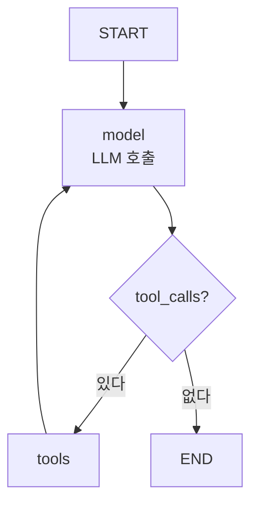
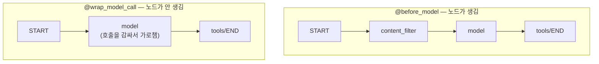

# 6.4 create_agent 상세 구조 이해하기

> **저자 예제** — [`examples/create_agent/`](examples/create_agent) (`tools.py` · `middleware.py` · `middleware_with_node.py`)
> **공식 문서** — [Agents](https://docs.langchain.com/oss/python/langchain/agents) · [Middleware overview](https://docs.langchain.com/oss/python/langchain/middleware/overview) · [Built-in](https://docs.langchain.com/oss/python/langchain/middleware/built-in) · [Custom](https://docs.langchain.com/oss/python/langchain/middleware/custom) · [Structured output](https://docs.langchain.com/oss/python/langchain/structured-output)

> **여기까지** — 도구를 직접 만들고 `create_agent` 한 줄로 에이전트를 만들었습니다([6.3절](06-03_%EC%BD%94%EB%94%A9%20%EC%97%90%EC%9D%B4%EC%A0%84%ED%8A%B8%20%EB%A7%8C%EB%93%A4%EA%B8%B0.md)).
> **이 절의 질문** — **그 한 줄 안에서 무슨 일이 일어나지?** 그리고 중간에 끼어들려면?
> **다 읽으면** — `create_agent`가 블랙박스가 아니게 됩니다. **미들웨어**로 원하는 자리에 손을 넣을 수 있습니다.

> **버전 주의** — 이 절은 LangChain **v1**의 `create_agent` 기준입니다. 구버전 자료의 `create_react_agent`(`langgraph.prebuilt`)나 `AgentExecutor`는 다른 API입니다. 자세한 것은 [CLAUDE.md](../CLAUDE.md) §6.

## 6.4.1 create_agent 개요 이해하기

[6.1절](06-01_%EB%8F%84%EA%B5%AC%EB%A5%BC%20%ED%98%B8%EC%B6%9C%ED%95%98%EB%8A%94%20%EC%97%90%EC%9D%B4%EC%A0%84%ED%8A%B8%20%EC%9D%B4%ED%95%B4%ED%95%98%EA%B8%B0.md)에서 손으로 만든 것을 떠올려 보세요.

- 상태 정의
- `chatbot` 노드
- `BasicToolNode`
- `route_tools` 조건부 엣지
- `tools → chatbot` 순환
- `compile()`

`create_agent`는 **이 전부를 한 줄로** 만듭니다.

```python
from langchain.agents import create_agent

graph = create_agent(model=llm, tools=tools)
```

돌려주는 것은 **컴파일된 랭그래프 그래프**입니다. 그래서 `invoke`·`stream`이 그대로 되고([6.2.4절](06-02_%EC%9B%B9%20%EA%B2%80%EC%83%89%20%EC%97%90%EC%9D%B4%EC%A0%84%ED%8A%B8%20%EB%A7%8C%EB%93%A4%EA%B8%B0.md)), `get_graph().draw_mermaid_png()`로 그림도 뽑을 수 있습니다.



**6.1절에서 그린 것과 같은 그림**입니다. 안에서 벌어지는 일이 다르지 않습니다.

위 그림은 설명용으로 그린 것입니다. **랭그래프가 실제로 만든 것을 뽑아 보면** 이렇습니다.

```python
agent = create_agent(llm, [multiply, search_docs])
print(agent.get_graph().draw_mermaid())
```

> **실측 (2026-08-31 · langchain 1.3.18 · langgraph 1.2.11)** — 모델 객체만 만들고 호출은 하지 않았습니다.

```
graph TD;
	__start__([<p>__start__</p>]):::first
	model(model)
	tools(tools)
	__end__([<p>__end__</p>]):::last
	__start__ --> model;
	model -.-> __end__;
	model -.-> tools;
	tools -.-> model;
```

```
노드: ['__start__', 'model', 'tools', '__end__']
```

**노드가 딱 둘입니다 — `model`과 `tools`.** 도구를 두 개 줬는데도 `tools` 노드는 하나입니다. 도구 개수는 노드 수와 무관합니다.

엣지를 읽어 보면([5.3절](../ch05_langgraph-basics/05-03_%EB%9E%AD%EA%B7%B8%EB%9E%98%ED%94%84%EB%A1%9C%20%EC%97%90%EC%9D%B4%EC%A0%84%ED%8A%B8%20%EC%84%A4%EA%B3%84%ED%95%98%EA%B3%A0%20%EA%B5%AC%ED%98%84%ED%95%98%EA%B8%B0.md)의 읽는 법):

| 엣지 | 뜻 |
| :--- | :--- |
| `__start__ --> model` | 실선 — 무조건 모델부터 |
| `model -.-> __end__` | 점선 — 도구 호출이 없으면 끝 |
| `model -.-> tools` | 점선 — 도구 호출이 있으면 실행 |
| `tools -.-> model` | **되돌아옵니다** — 결과를 들고 다시 판단 |

**마지막 줄이 순환입니다.** [2.4절](../ch02_core-elements/02-04_ReAct%20%EA%B8%B0%EB%B0%98%20LLM%20%EC%97%90%EC%9D%B4%EC%A0%84%ED%8A%B8.md)에서 손으로 짠 `while` 루프가 여기서는 **엣지 한 줄**입니다. `create_agent`가 감춰 준 것의 정체가 이 네 줄입니다.

> **그래서 6.1절을 손으로 만들어 본 것입니다.** `create_agent`가 블랙박스가 아니라는 걸 알면, 이상하게 동작할 때 어디를 볼지 알 수 있습니다.

## 6.4.2 주요 파라미터 이해하기

| 파라미터 | 하는 일 | 관련 절 |
| :--- | :--- | :--- |
| `model` | 쓸 LLM | [4.4절](../ch04_dev-env/04-04_LLM%20%EC%82%AC%EC%9A%A9%ED%95%98%EA%B8%B0.md) |
| `tools` | 도구 목록 | [6.3절](06-03_%EC%BD%94%EB%94%A9%20%EC%97%90%EC%9D%B4%EC%A0%84%ED%8A%B8%20%EB%A7%8C%EB%93%A4%EA%B8%B0.md) |
| `system_prompt` | 시스템 프롬프트 | [1.2절](../ch01_llm-decision/01-02_LLM%EC%9D%84%20%EA%B8%B0%EB%B0%98%EC%9C%BC%EB%A1%9C%20%EC%9D%98%EC%82%AC%EA%B2%B0%EC%A0%95%ED%95%98%EB%8B%A4.md) |
| `checkpointer` | 대화를 이어 가게 함 | [5.1절](../ch05_langgraph-basics/05-01_%EC%99%9C%20%EB%9E%AD%EA%B7%B8%EB%9E%98%ED%94%84%EC%9D%B8%EA%B0%80.md) |
| `middleware` | 루프 중간에 끼어들기 | 6.4.3 |
| `response_format` | 구조화 출력 | 6.4.4 |

### `checkpointer` — 대화를 이어 가려면 필요합니다

저자 예제 [`middleware.py`](examples/create_agent/middleware.py) 아래쪽이 이걸 보여 줍니다.

```python
from langgraph.checkpoint.memory import MemorySaver

agent_with_memory = create_agent(
    model=basic_model,
    tools=tools,
    middleware=[dynamic_model_selection],
    checkpointer=MemorySaver()
)

config = {"configurable": {"thread_id": "test-thread"}}

response = agent_with_memory.invoke({"messages": [question]}, config=config)
```

두 가지가 짝을 이룹니다.

| 요소 | 역할 |
| :--- | :--- |
| `checkpointer=MemorySaver()` | 상태를 **어디에 저장할지** |
| `config={"configurable": {"thread_id": …}}` | **어느 대화인지** 구분하는 열쇠 |

**`thread_id`가 같으면 같은 대화로 이어집니다.** 다르면 새 대화입니다. [2.3절](../ch02_core-elements/02-03_%EC%97%90%EC%9D%B4%EC%A0%84%ED%8A%B8%EC%9D%98%20%EA%B8%B0%EC%96%B5%EB%A0%A5%20-%20%EB%A9%94%EB%AA%A8%EB%A6%AC.md)에서 "체크포인터 = 대화 하나 안의 단기 기억"이라고 한 것이 이 형태입니다.

> **`MemorySaver`는 프로세스 메모리에 저장합니다.** 프로그램이 꺼지면 사라집니다. 실제 서비스에서는 DB 기반 체크포인터를 씁니다.
>
> 저자 예제가 질문 6개를 같은 `thread_id`로 던지는 이유는 **메시지를 10개 넘게 쌓아서** 아래 미들웨어를 발동시키기 위해서입니다.

## 6.4.3 [실습] 미들웨어 추가하기

**미들웨어(Middleware)** 는 에이전트 루프 중간에 **끼어드는 장치**입니다.

`create_agent`는 편하지만 그만큼 손댈 자리가 없습니다. 미들웨어가 그 자리를 열어 줍니다.

### 두 종류가 있습니다 — 노드가 생기는 것과 아닌 것

저자 예제가 이 구분을 정면으로 다룹니다.

| 데코레이터 | 그래프에 노드가 | 하는 일 |
| :--- | :--- | :--- |
| `@before_model` | **추가됨** | 모델 호출 **전에** 별도 단계로 실행 |
| `@wrap_model_call` | 추가 안 됨 | 모델 호출을 **감쌈** |
| `@dynamic_prompt` | 추가 안 됨 | `wrap_model_call` 기반 — 프롬프트만 바꿈 |



**이 차이가 왜 중요한가.** 노드가 생기면 스튜디오에서 별도 단계로 보이고 체크포인트도 그 자리에서 찍힙니다. 반대로 `wrap_model_call`은 **모델 호출 자체를 바꾸는** 것이라 그래프 모양은 그대로입니다.

### `@wrap_model_call` — 모델을 바꿔치기

```python
@wrap_model_call
def dynamic_model_selection(request: ModelRequest, handler) -> ModelResponse:
    message_count = len(request.state["messages"])

    if message_count > 10:
        model = advanced_model      # gpt-4o
    else:
        model = basic_model         # gpt-4o-mini

    return handler(request.override(model=model))
```

읽는 법이 정해져 있습니다.

| 요소 | 뜻 |
| :--- | :--- |
| `request` | 지금 모델에 보내려는 것 (상태 포함) |
| `handler` | **실제 호출을 진행시키는 함수** |
| `request.override(...)` | 보낼 내용을 바꿈 |
| `return handler(...)` | 바꾼 내용으로 진행 |

**`handler`를 안 부르면 모델이 호출되지 않습니다.** 그래서 캐시를 만들거나 요청을 아예 막을 수도 있습니다.

여기서는 **대화가 길어지면 비싼 모델로 갈아탑니다.** 짧은 대화는 싼 모델로 처리하니 비용이 줄어듭니다.

### `@before_model` — 검사해서 막기

```python
@before_model
def content_filter_middleware(state: AgentState, runtime: Runtime):
    last_msg = state["messages"][-1]
    content = getattr(last_msg, 'content', str(last_msg))

    for word in BLOCKED_WORDS:
        if word in content:
            raise ValueError(f"부적절한 표현이 감지되었습니다: '{word}'")

    return None      # 정상 진행
```

`None`을 돌려주면 그대로 진행하고, **예외를 던지면 멈춥니다.**

[5.3.2절](../ch05_langgraph-basics/05-03_%EB%9E%AD%EA%B7%B8%EB%9E%98%ED%94%84%EB%A1%9C%20%EC%97%90%EC%9D%B4%EC%A0%84%ED%8A%B8%20%EC%84%A4%EA%B3%84%ED%95%98%EA%B3%A0%20%EA%B5%AC%ED%98%84%ED%95%98%EA%B8%B0.md)에서 직접 만든 **가드레일 노드와 같은 일**입니다. 차이는 그래프를 직접 그리지 않아도 된다는 것뿐입니다.

> **[6.3절](06-03_%EC%BD%94%EB%94%A9%20%EC%97%90%EC%9D%B4%EC%A0%84%ED%8A%B8%20%EB%A7%8C%EB%93%A4%EA%B8%B0.md)에서는 "예외를 던지지 말라"고 했는데 여기서는 던집니다.** 모순이 아닙니다. 도구 실패는 **모델이 고칠 수 있으니** 돌려주는 것이고, 금지어는 **모델이 고칠 수 없고 애초에 진행하면 안 되니** 끊는 것입니다. [2.2절](../ch02_core-elements/02-02_%EC%97%90%EC%9D%B4%EC%A0%84%ED%8A%B8%EC%9D%98%20%EC%99%B8%EB%B6%80%20%EC%A7%80%EC%8B%9D%20%ED%99%9C%EC%9A%A9%20-%20%EB%8F%84%EA%B5%AC%20%ED%98%B8%EC%B6%9C.md)의 기준 그대로입니다.

### `@dynamic_prompt` — 시스템 프롬프트를 매번 바꾸기

```python
@dynamic_prompt
def random_tone_prompt(request: ModelRequest) -> str:
    if random.choice([True, False]):
        return "당신은 친절한 AI입니다. 항상 존댓말로 정중하게 답변하세요."
    else:
        return "너는 친근한 AI야. 항상 반말로 편하게 답변해."
```

**돌려준 문자열이 시스템 프롬프트가 됩니다.** 예제는 말투를 랜덤으로 고르지만, 실제로는 **사용자 등급·언어·시간대에 따라 프롬프트를 바꾸는** 데 씁니다.

### 여러 개를 겹쳐 씁니다

```python
agent = create_agent(
    model=model,
    tools=tools,
    middleware=[
        content_filter_middleware,  # 노드 추가 O
        random_tone_prompt,         # 노드 추가 X
    ]
)
```

**목록에 적은 순서가 적용 순서**입니다. 검사를 먼저 하고 프롬프트를 정하는 것이 자연스럽습니다.

## 6.4.4 [실습] 구조화 출력 정의하기

[1.2절](../ch01_llm-decision/01-02_LLM%EC%9D%84%20%EA%B8%B0%EB%B0%98%EC%9C%BC%EB%A1%9C%20%EC%9D%98%EC%82%AC%EA%B2%B0%EC%A0%95%ED%95%98%EB%8B%A4.md)에서 미룬 것을 회수합니다. **자연어 응답은 프로그램이 못 씁니다.** 모양을 강제해야 합니다.

`create_agent`에는 `response_format`을 줍니다.

```python
from pydantic import BaseModel, Field

class SearchResult(BaseModel):
    answer: str = Field(description="질문에 대한 답변")
    sources: list[str] = Field(description="참고한 출처 URL 목록")
    confidence: float = Field(description="확신도 0~1")

agent = create_agent(model=llm, tools=tools, response_format=SearchResult)
```

**여기서 Pydantic을 쓰는 이유**가 [5.2.1절](../ch05_langgraph-basics/05-02_%EB%9E%AD%EA%B7%B8%EB%9E%98%ED%94%84%20%EA%B8%B0%EB%B3%B8%20%EA%B0%9C%EB%85%90%20%EC%9D%B4%ED%95%B4%ED%95%98%EA%B3%A0%20%EC%A0%81%EC%9A%A9%ED%95%98%EA%B8%B0.md)에서 말한 그것입니다 — **LLM이 채우는 값은 믿을 수 없으니 검증합니다.** 상태에는 `TypedDict`를 쓰고 여기엔 Pydantic을 쓰는 이유입니다.

`Field(description=...)`는 [6.3절](06-03_%EC%BD%94%EB%94%A9%20%EC%97%90%EC%9D%B4%EC%A0%84%ED%8A%B8%20%EB%A7%8C%EB%93%A4%EA%B8%B0.md)의 도구 인자 설명과 같은 역할입니다 — **모델에게 각 칸에 무엇을 넣을지 알려 줍니다.**

### 6.5절 예제에서 미리 볼 수 있습니다

[`rag_agent/edges.py`](examples/rag_agent/edges.py)가 같은 방식을 씁니다.

```python
class Grade(BaseModel):
    binary_score: str = Field(description="문서가 질문과 관련이 있는지 여부, 'yes' 또는 'no'")

grader = llm.with_structured_output(Grade)
```

`with_structured_output`은 **에이전트가 아니라 모델 하나에** 형식을 강제할 때 씁니다. 판단 결과를 코드가 `if`로 읽어야 하니 형식이 고정돼야 합니다.

| 방법 | 대상 | 언제 |
| :--- | :--- | :--- |
| `response_format=` | `create_agent` 전체 | 에이전트의 **최종 답변** 형식 |
| `.with_structured_output()` | 모델 하나 | 중간 판단·분류 |

## 요약 및 비유

**자동변속기**입니다. `create_agent`는 기어를 대신 바꿔 주고, 미들웨어는 그 안에 손을 넣는 자리입니다. `@before_model`은 **주행 전 점검 단계를 추가**하는 것이고, `@wrap_model_call`은 **변속기 자체를 바꿔 끼우는** 것입니다.

| 개념 | 자동차 비유 | 기술적 의미 |
| :--- | :--- | :--- |
| **`create_agent`** | 자동변속기 | 루프 그래프를 한 줄로 |
| **6.1의 수동 그래프** | 수동변속기 | 같은 일을 손으로 |
| **`checkpointer`** | 주행 기록계 | 상태 저장 |
| **`thread_id`** | 어느 차량의 기록인지 | 대화 구분 열쇠 |
| **`@before_model`** | 출발 전 점검 단계 추가 | 노드가 생김 |
| **`@wrap_model_call`** | 변속기를 바꿔 끼움 | 노드 없이 호출을 감쌈 |
| **`handler` 미호출** | 시동을 안 걸음 | 모델 호출 자체를 막음 |
| **`@dynamic_prompt`** | 주행 모드 선택 | 시스템 프롬프트 교체 |
| **`response_format`** | 정해진 서식의 운행일지 | 최종 답변 형식 강제 |
| **`with_structured_output`** | 계기판 한 칸의 규격 | 개별 모델 호출의 형식 |

## 결론

* `create_agent`는 **6.1절에서 손으로 만든 그래프를 한 줄로** 만들어 줍니다. 결과물은 평범한 랭그래프 그래프입니다.
* **`checkpointer`와 `thread_id`는 짝**입니다. 전자는 어디에 저장할지, 후자는 어느 대화인지를 정합니다.
* `MemorySaver`는 **프로세스가 꺼지면 사라집니다.** 실서비스는 DB 기반을 씁니다.
* 미들웨어는 두 갈래입니다 — **`@before_model`은 노드가 생기고**, **`@wrap_model_call`은 안 생깁니다.**
* `@wrap_model_call`에서 **`handler`를 안 부르면 모델 호출 자체가 막힙니다.** 캐시·차단에 쓸 수 있습니다.
* **도구 실패는 돌려주고, 금지어는 예외로 끊습니다.** 모델이 고칠 수 있는 문제인지가 기준입니다.
* 미들웨어는 **목록에 적은 순서대로** 적용됩니다.
* 구조화 출력은 **Pydantic으로 검증**합니다. LLM이 채우는 값은 믿을 수 없기 때문입니다.
* 에이전트 전체의 최종 답변은 **`response_format`**, 중간 판단은 **`with_structured_output`** 입니다.

---

## 다음 절로

웹 검색으로 **인터넷에 있는 것**은 가져올 수 있게 됐습니다.

**그런데 회사 내부 규정이나 우리 제품 매뉴얼은 웹에 없습니다.** 검색해도 안 나옵니다.

모델이 모르는 **내 문서**를 다루려면? → **[6.5절](06-05_RAG%EB%A5%BC%20%EC%9C%84%ED%95%9C%20%EC%97%90%EC%9D%B4%EC%A0%84%ED%8A%B8%20%EB%A7%8C%EB%93%A4%EA%B8%B0.md)**

---

[⬅ 6.3](06-03_%EC%BD%94%EB%94%A9%20%EC%97%90%EC%9D%B4%EC%A0%84%ED%8A%B8%20%EB%A7%8C%EB%93%A4%EA%B8%B0.md) · [Chapter 06](README.md) · [6.5 ➡](06-05_RAG%EB%A5%BC%20%EC%9C%84%ED%95%9C%20%EC%97%90%EC%9D%B4%EC%A0%84%ED%8A%B8%20%EB%A7%8C%EB%93%A4%EA%B8%B0.md)
