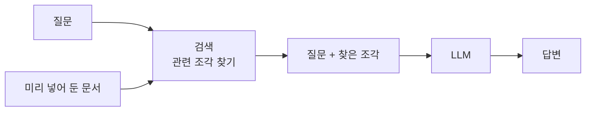
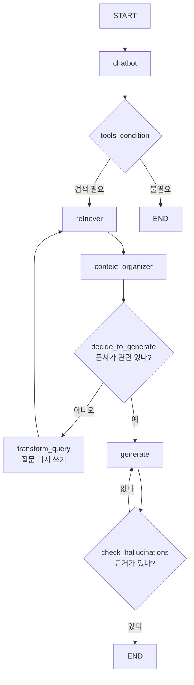

# 6.5 RAG를 위한 에이전트 만들기

> **저자 예제** — [`examples/rag_agent/`](examples/rag_agent) (`retriever.py` · `state.py` · `nodes.py` · `edges.py` · `agent.py`) · [`vector_retriever.ipynb`](examples/rag_agent/vector_retriever.ipynb)
> **공식 문서** — [Build a custom RAG agent](https://docs.langchain.com/oss/python/langgraph/agentic-rag)

> **여기까지** — `create_agent`의 안을 들여다보고 미들웨어까지 봤습니다([6.4절](06-04_create_agent%20%EC%83%81%EC%84%B8%20%EA%B5%AC%EC%A1%B0%20%EC%9D%B4%ED%95%B4%ED%95%98%EA%B8%B0.md)).
> **이 절의 질문** — 웹에 없는 **내 문서**는 어떻게 다루지?
> **다 읽으면** — 6장에서 **가장 복잡한 그래프**를 읽을 수 있게 됩니다. [2.1절](../ch02_core-elements/02-01_%EC%97%90%EC%9D%B4%EC%A0%84%ED%8A%B8%EC%9D%98%20%EC%B6%94%EB%A1%A0%20%EB%8A%A5%EB%A0%A5%20-%20ReAct%EC%99%80%20Reflection.md)의 **Reflection**이 실제 코드로 나옵니다.

## 6.5.1 RAG란

[1.1절](../ch01_llm-decision/01-01_AI%20%EC%97%90%EC%9D%B4%EC%A0%84%ED%8A%B8%EC%9D%98%20%EB%91%90%EB%87%8C%2C%20%EA%B1%B0%EB%8C%80%20%EC%96%B8%EC%96%B4%20%EB%AA%A8%EB%8D%B8%EC%9D%98%20%EC%9D%B4%ED%95%B4.md)의 지식 컷오프 문제를 [6.2절](06-02_%EC%9B%B9%20%EA%B2%80%EC%83%89%20%EC%97%90%EC%9D%B4%EC%A0%84%ED%8A%B8%20%EB%A7%8C%EB%93%A4%EA%B8%B0.md)에서는 웹 검색으로 메웠습니다. 그런데 이런 건 웹에 없습니다.

- 회사 내부 규정
- 우리 제품 매뉴얼
- 아직 공개하지 않은 문서

**RAG(Retrieval-Augmented Generation, 검색 증강 생성)** 는 이런 문서를 미리 넣어 두고, 질문이 오면 **관련 조각만 찾아 프롬프트에 넣어 주는** 방식입니다.



**모델을 다시 학습시키는 게 아닙니다.** 그냥 프롬프트에 넣어 주는 겁니다. 그래서 문서가 바뀌면 다시 넣기만 하면 됩니다.

| | 웹 검색 (6.2절) | RAG |
| :--- | :--- | :--- |
| 어디서 | 인터넷 | 내가 넣어 둔 문서 |
| 최신성 | 실시간 | 넣은 시점 |
| 비공개 자료 | 불가 | **가능** |
| 준비 작업 | 없음 | 문서를 쪼개고 색인해야 함 |

## 6.5.2 [실습] 벡터 데이터베이스의 이해와 사용하기

### 왜 벡터인가

"구개음화가 뭐야?"라고 물었을 때, 문서에 "구개음화"라는 단어가 없고 "ㄷ, ㅌ이 ㅣ 앞에서 ㅈ, ㅊ으로 바뀌는 현상"이라고만 적혀 있으면 어떻게 찾을까요.

**단어가 겹치지 않아도 의미가 가까우면 찾아야 합니다.** 그래서 문장을 **숫자 벡터**로 바꿉니다. 이걸 **임베딩(Embedding)** 이라고 합니다.

의미가 비슷한 문장은 벡터 공간에서 가까이 놓입니다. 그러면 **질문 벡터와 가까운 문서 벡터**를 찾는 문제가 됩니다.

### 저자 예제의 구성

[`rag_agent/retriever.py`](examples/rag_agent/retriever.py)입니다.

```python
DB_PATH = "./rag_agent/chroma_db"

vectorstore = Chroma(
    persist_directory=DB_PATH,
    embedding_function=OpenAIEmbeddings(model="text-embedding-3-small"),
    collection_name="korean_pdf",
)

retriever = vectorstore.as_retriever(search_kwargs={"k": 3})
```

| 요소 | 역할 |
| :--- | :--- |
| `Chroma` | 벡터를 저장하고 검색하는 DB |
| `persist_directory` | **디스크에 저장** — 껐다 켜도 남음 |
| `OpenAIEmbeddings` | 문장을 벡터로 바꾸는 모델 |
| `as_retriever(k=3)` | 가장 가까운 **3개**를 꺼냄 |

> **`k=3`도 컨텍스트 예산입니다.** [6.2절](06-02_%EC%9B%B9%20%EA%B2%80%EC%83%89%20%EC%97%90%EC%9D%B4%EC%A0%84%ED%8A%B8%20%EB%A7%8C%EB%93%A4%EA%B8%B0.md)의 `max_results=3`과 같은 판단입니다. 많이 가져올수록 답이 좋아질 것 같지만, 관련 없는 조각이 섞이면 오히려 답이 흐려집니다.

> **`DB_PATH`가 `./rag_agent/…` 로 시작합니다.** [4.1절](../ch04_dev-env/04-01_%EB%B9%84%EC%A3%BC%EC%96%BC%20%EC%8A%A4%ED%8A%9C%EB%94%94%EC%98%A4%20%EC%BD%94%EB%93%9C%20%ED%99%98%EA%B2%BD%20%EC%84%A4%EC%A0%95%ED%95%98%EA%B8%B0.md)의 작업 디렉터리 문제입니다. **`examples/`에서 실행하는 것을 전제로 한 경로**라, `rag_agent/` 안에서 직접 돌리면 DB를 못 찾습니다.

**문서를 넣는 과정**(PDF를 읽고 쪼개서 임베딩)은 [`vector_retriever.ipynb`](examples/rag_agent/vector_retriever.ipynb)에 있습니다. 노트북에 `### 6.5.2` 셀로 표시돼 있습니다.

## 6.5.3 [실습] 문서 검색과 답변을 위한 도구 정의하기

검색기를 **도구로** 만듭니다.

```python
from langchain_core.tools import create_retriever_tool

retriever_tool = create_retriever_tool(
    retriever,
    name="pdf_search",
    description="use this tool to search information from the Korean Spelling Rules PDF document",
)
```

`create_retriever_tool`이 검색기를 [2.2절](../ch02_core-elements/02-02_%EC%97%90%EC%9D%B4%EC%A0%84%ED%8A%B8%EC%9D%98%20%EC%99%B8%EB%B6%80%20%EC%A7%80%EC%8B%9D%20%ED%99%9C%EC%9A%A9%20-%20%EB%8F%84%EA%B5%AC%20%ED%98%B8%EC%B6%9C.md)의 도구 형태로 감싸 줍니다.

> **`description`에 "Korean Spelling Rules PDF"라고 문서 내용을 밝힌 것**에 주목하세요. 모델은 이 설명만 보고 이 도구를 쓸지 정합니다. "문서를 검색한다"고만 적으면 **어떤 질문에 써야 할지 알 수 없습니다.**

## 6.5.4 [실습] 랭그래프로 에이전트 생성하기

여기서부터가 이 장의 절정입니다. **6.1~6.4의 단순한 루프와 전혀 다른 그래프**가 나옵니다.

### 상태에 칸이 늘어납니다

[`state.py`](examples/rag_agent/state.py)

```python
from langgraph.graph import MessagesState

class AgentState(MessagesState):
    question: str
    context: str
    answer: str
    retry_num: int
```

`MessagesState`는 랭그래프가 제공하는 **`messages` 키가 이미 들어 있는 상태**입니다([5.2.2절](../ch05_langgraph-basics/05-02_%EB%9E%AD%EA%B7%B8%EB%9E%98%ED%94%84%20%EA%B8%B0%EB%B3%B8%20%EA%B0%9C%EB%85%90%20%EC%9D%B4%ED%95%B4%ED%95%98%EA%B3%A0%20%EC%A0%81%EC%9A%A9%ED%95%98%EA%B8%B0.md)의 `add_messages` 리듀서가 붙어 있습니다). 상속해서 칸을 더합니다.

| 키 | 무엇을 담나 |
| :--- | :--- |
| `question` | 지금 검색에 쓸 질문 (**바뀔 수 있음**) |
| `context` | 검색된 문서 |
| `answer` | 생성된 답변 |
| `retry_num` | **몇 번 다시 시도했는지** |

**`retry_num`이 핵심입니다.** 이 그래프는 루프가 여러 개라 무한 반복을 막을 장치가 필요합니다.

### 노드가 다섯 개입니다

[`nodes.py`](examples/rag_agent/nodes.py)

| 노드 | 하는 일 |
| :--- | :--- |
| `chatbot` | 검색 도구를 붙인 LLM 호출 — **검색할지 그냥 답할지 결정** |
| `retrieve` | 실제 검색 실행, `ToolMessage` 생성 |
| `context_organizer` | 검색 결과를 LLM으로 **정리** |
| `transform_query` | 질문을 **검색에 유리하게 다시 씀** |
| `generate` | 최종 답변 생성 |

`context_organizer`와 `transform_query`가 낯선 노드입니다.

**`context_organizer`** — 검색 결과에는 공백·줄바꿈이 지저분하게 섞여 있습니다. LLM에게 정리를 시킵니다. 프롬프트에 **"페이지 번호 정보를 절대 삭제하지 마세요"** 가 들어 있는데, 출처를 밝히기 위해서입니다.

**`transform_query`** — 검색이 실패했을 때 **질문 자체를 고쳐서** 다시 검색합니다. 사용자가 던진 말이 검색에 좋은 형태가 아닐 수 있으니까요.

### 판단하는 엣지가 둘입니다

[`edges.py`](examples/rag_agent/edges.py)가 이 그래프의 두뇌입니다. **둘 다 LLM으로 판단하고, [6.4.4절](06-04_create_agent%20%EC%83%81%EC%84%B8%20%EA%B5%AC%EC%A1%B0%20%EC%9D%B4%ED%95%B4%ED%95%98%EA%B8%B0.md)의 구조화 출력을 씁니다.**

```python
class Grade(BaseModel):
    binary_score: str = Field(description="문서가 질문과 관련이 있는지 여부, 'yes' 또는 'no'")

grader = llm.with_structured_output(Grade)
```

| 엣지 함수 | 무엇을 판단 | 결과 |
| :--- | :--- | :--- |
| `decide_to_generate` | 검색된 문서가 질문과 **관련 있나** | 없으면 `transform_query`로 되돌림 |
| `check_hallucinations` | 생성된 답이 문서에 **근거하나** | 아니면 `generate`를 다시 |

**`binary_score`를 `'yes'/'no'`로 좁혀 둔 것**이 [1.2절](../ch01_llm-decision/01-02_LLM%EC%9D%84%20%EA%B8%B0%EB%B0%98%EC%9C%BC%EB%A1%9C%20%EC%9D%98%EC%82%AC%EA%B2%B0%EC%A0%95%ED%95%98%EB%8B%A4.md)의 "선택지를 좁혀 흔들림을 막는다"입니다. 코드가 `if grade == "no"`로 읽어야 하니까요.

### `retry_num`으로 빠져나옵니다

```python
def decide_to_generate(state):
    if state.get("retry_num", 0) >= 3:
        return "generate"          # 3번 넘게 시도했으면 그냥 답을 만든다
```

그리고 `generate`도 `retry_num`을 봅니다.

```python
    if retry_num >= 3:
        # "답변하지 못함을 양해 구하고, 답할 수 있는 다른 질문을 제안하는" 프롬프트
    else:
        # 평범한 RAG 답변 프롬프트
```

**3번 실패하면 프롬프트를 바꿔서 "못 찾았습니다"라고 정직하게 말하게 합니다.** 억지로 답을 지어내지 않도록 하는 설계입니다. [1.1절](../ch01_llm-decision/01-01_AI%20%EC%97%90%EC%9D%B4%EC%A0%84%ED%8A%B8%EC%9D%98%20%EB%91%90%EB%87%8C%2C%20%EA%B1%B0%EB%8C%80%20%EC%96%B8%EC%96%B4%20%EB%AA%A8%EB%8D%B8%EC%9D%98%20%EC%9D%B4%ED%95%B4.md)의 환각 문제에 대한 대응입니다.

### 전체 그래프

[`agent.py`](examples/rag_agent/agent.py)



**루프가 두 개**입니다.

- `retriever → context_organizer → transform_query → retriever` — 검색이 나쁘면 질문을 고쳐 다시 검색
- `generate → generate` — 답이 문서에 근거하지 않으면 다시 생성

`tools_condition`은 [6.1절](06-01_%EB%8F%84%EA%B5%AC%EB%A5%BC%20%ED%98%B8%EC%B6%9C%ED%95%98%EB%8A%94%20%EC%97%90%EC%9D%B4%EC%A0%84%ED%8A%B8%20%EC%9D%B4%ED%95%B4%ED%95%98%EA%B8%B0.md)에서 손으로 만든 `route_tools`를 랭그래프가 제공하는 것입니다.

> **이 그래프는 [2.1절](../ch02_core-elements/02-01_%EC%97%90%EC%9D%B4%EC%A0%84%ED%8A%B8%EC%9D%98%20%EC%B6%94%EB%A1%A0%20%EB%8A%A5%EB%A0%A5%20-%20ReAct%EC%99%80%20Reflection.md)의 Reflection 패턴입니다.** 만든 결과를 스스로 평가하고 다시 만듭니다. `decide_to_generate`와 `check_hallucinations`가 "방금 한 게 괜찮은가"를 묻는 비평자입니다.
>
> 그리고 2.1절에서 경고한 대로 **비용이 몇 배로 듭니다.** 한 번의 질문에 LLM이 최소 5~6번 불립니다 — chatbot, context_organizer, grader, generate, hallucination checker. 재시도가 붙으면 더 늘어납니다.

## 6.5.5 [실습] 문서를 기반으로 질문하고 답변 받아보기

```python
response = graph.stream({"messages": ["구개음화가 뭐야?"]})

for chunk in response:
    for node, value in chunk.items():
        print("---", node, "---")
```

노드마다 `print("----- [CHATBOT] -----")` 같은 표시가 박혀 있어서 **어느 경로로 갔는지 콘솔에서 따라갈 수 있습니다.** 재검색이 일어났는지, 환각 검사에서 되돌아갔는지가 보입니다.

**스튜디오로 보면 더 명확합니다.** [`examples/langgraph.json`](examples/langgraph.json)이 이 RAG 에이전트를 가리키고 있으므로, `examples/`에서 `langgraph dev`를 실행하면 바로 이 그래프가 뜹니다([6.2.5절](06-02_%EC%9B%B9%20%EA%B2%80%EC%83%89%20%EC%97%90%EC%9D%B4%EC%A0%84%ED%8A%B8%20%EB%A7%8C%EB%93%A4%EA%B8%B0.md)).

> 실행 결과는 문서·모델·검색 결과에 따라 달라지므로 이 노트에는 싣지 않았습니다.

## 요약 및 비유

**오픈북 시험**입니다. 문제를 보고 책을 찾아보되(검색), 펼친 쪽이 엉뚱하면 다시 찾고(질문 재작성), 답을 쓴 뒤 **책에 실제로 있는 내용인지 검토**합니다(환각 검사). 그리고 계속 못 찾으면 **모른다고 쓰는 것이 맞습니다**(`retry_num >= 3`).

| 개념 | 오픈북 시험 비유 | 기술적 의미 |
| :--- | :--- | :--- |
| **RAG** | 책을 펴 놓고 답하기 | 문서를 프롬프트에 넣어 생성 |
| **임베딩** | 뜻이 비슷한 쪽을 찾는 감각 | 문장을 벡터로 |
| **벡터 DB** | 색인이 달린 책 | Chroma |
| **`k=3`** | 세 쪽만 펼침 | 컨텍스트 예산 |
| **검색 도구** | "이 책에서 찾아봐" | `create_retriever_tool` |
| **`context_organizer`** | 찾은 내용을 옮겨 적으며 정리 | 검색 결과 정돈 |
| **`decide_to_generate`** | 이 쪽이 문제와 맞나 확인 | 관련성 평가 |
| **`transform_query`** | 검색어를 바꿔 다시 찾기 | 질문 재작성 |
| **`check_hallucinations`** | 내가 쓴 답이 책에 있나 검토 | 근거 검증 |
| **`retry_num >= 3`** | 못 찾으면 모른다고 쓰기 | 무한 루프 차단 + 정직한 답 |

## 결론

* RAG는 **모델을 학습시키는 게 아니라 프롬프트에 문서를 넣어 주는 것**입니다. 문서가 바뀌면 다시 넣기만 하면 됩니다.
* 단어가 겹치지 않아도 찾으려고 **임베딩(벡터)** 을 씁니다. 질문 벡터와 가까운 문서를 꺼냅니다.
* **`k`는 컨텍스트 예산**입니다. 많이 가져온다고 답이 좋아지지 않습니다.
* 검색 도구의 `description`에는 **어떤 문서인지 밝혀야** 모델이 언제 쓸지 압니다.
* 저자의 RAG 그래프는 **노드 5개 · 판단 엣지 2개 · 루프 2개**입니다. 6.1~6.4의 단순 루프와 다릅니다.
* 두 판단 엣지는 **관련성 평가**와 **환각 검사**이고, 둘 다 구조화 출력으로 `'yes'/'no'`를 받습니다.
* **`retry_num`이 안전장치**입니다. 3번 실패하면 프롬프트를 바꿔 "못 찾았다"고 정직하게 답하게 합니다.
* 이 구조가 [2.1절](../ch02_core-elements/02-01_%EC%97%90%EC%9D%B4%EC%A0%84%ED%8A%B8%EC%9D%98%20%EC%B6%94%EB%A1%A0%20%EB%8A%A5%EB%A0%A5%20-%20ReAct%EC%99%80%20Reflection.md)의 **Reflection**입니다. 대가는 **LLM 호출이 한 질문에 5~6번** 드는 비용입니다.

---

## 6장을 마치며

다섯 개 절을 한 줄로 이으면 이렇습니다.

> **화살표 하나로 순환을 만들어 에이전트가 됐고(6.1) → 웹 검색을 붙였고(6.2) → 도구를 직접 만들었고(6.3) → `create_agent`의 안을 들여다봤고(6.4) → 내 문서를 다루는 RAG를 만들었습니다(6.5).**

**여기까지가 [3.1절](../ch03_architecture/03-01_%EC%8B%B1%EA%B8%80%20%EC%97%90%EC%9D%B4%EC%A0%84%ED%8A%B8.md)에서 예고한 싱글 에이전트 3종**입니다. 웹 검색 · 코딩 · RAG — 전부 **판단 주체가 하나**입니다.

**7장에서는** [3.2절](../ch03_architecture/03-02_%EB%A9%80%ED%8B%B0%20%EC%97%90%EC%9D%B4%EC%A0%84%ED%8A%B8.md)에서 이름만 본 **멀티 에이전트**를 만듭니다. 6.5절의 RAG 그래프가 벌써 복잡했는데, 여기에 **에이전트를 여러 개 얹으면** 어떻게 될까요?

> **6장을 넘겼으면 큰 고비를 넘긴 겁니다.** 7장 이후는 이 장에서 배운 것의 **조합**입니다.

---

[⬅ 6.4](06-04_create_agent%20%EC%83%81%EC%84%B8%20%EA%B5%AC%EC%A1%B0%20%EC%9D%B4%ED%95%B4%ED%95%98%EA%B8%B0.md) · [Chapter 06](README.md) · [전체 목차](../STUDY.md)
