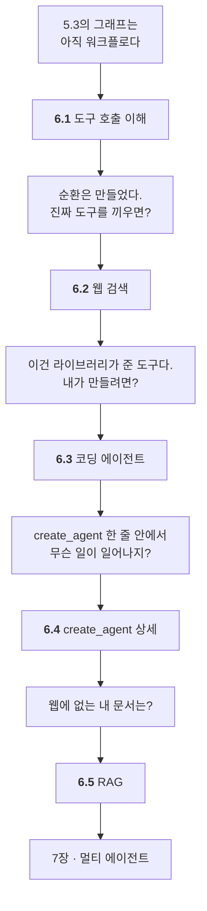

# Chapter 06 · 싱글 에이전트 구현

> Part 02 | 랭그래프로 구현하는 AI 에이전트

## 학습 목표

- 도구를 호출하는 에이전트의 동작 루프를 이해한다
- Tavily 검색 도구를 붙인 웹 검색 에이전트를 만들고 LangGraph Studio로 확인할 수 있다
- 사용자 정의 도구(코드 실행·파일 저장)를 만들어 코딩 에이전트를 구성할 수 있다
- `create_agent`의 주요 파라미터와 미들웨어·구조화 출력을 활용할 수 있다
- 벡터 DB를 구축하고 RAG 에이전트를 구현할 수 있다

> **올라마로 어디까지 되나** — **올라마로 6.1 · 6.3 · 6.4 · 6.5가 됩니다.** 6.5는 임베딩 모델을 따로 받아야 하고, 한국어라면 다국어 모델이어야 합니다([6.5절](06-05_RAG%EB%A5%BC%20%EC%9C%84%ED%95%9C%20%EC%97%90%EC%9D%B4%EC%A0%84%ED%8A%B8%20%EB%A7%8C%EB%93%A4%EA%B8%B0.md)). **6.2는 Tavily 키가 필요합니다.**
>
> 전체 지도는 [STUDY.md](../STUDY.md#올라마로-어디까지-되나)에 있습니다.

## 이 장의 이해 흐름

**이 책의 분수령입니다.** 5장까지는 "워크플로"였는데 6.1에서 **화살표 하나**가 추가되면서 에이전트가 됩니다.



| 절 | 이 절의 질문 | 얻는 것 |
| :--- | :--- | :--- |
| **6.1** | 어떤 화살표 하나면 에이전트가 되지? | **순환** — `add_edge("tools","chatbot")` |
| **6.2** | 진짜 도구를 끼우면? | 돌아가는 첫 에이전트 · **스튜디오** |
| **6.3** | 내가 원하는 도구는 어떻게 만들지? | `@tool` 과 **"독스트링은 프롬프트"** |
| **6.4** | 그 한 줄 안에서 무슨 일이? | **미들웨어**로 끼어드는 법 |
| **6.5** | 웹에 없는 내 문서는? | RAG · **Reflection이 코드로** |

> **6.1이 이 장의 핵심입니다.** 나머지 넷은 6.1의 순환에 **무엇을 끼우느냐**의 차이입니다.

### 6장 전체를 한 줄로

> **화살표 하나로 순환을 만들어 에이전트가 됐고(6.1) → 웹 검색을 붙였고(6.2) → 도구를 직접 만들었고(6.3) → `create_agent`의 안을 들여다봤고(6.4) → 내 문서를 다루는 RAG를 만들었다(6.5).**

## 절별 노트

| 절 | 노트 파일 | 진도 |
| --- | --- | --- |
| 6.1 | [`06-01_도구를 호출하는 에이전트 이해하기.md`](06-01_%EB%8F%84%EA%B5%AC%EB%A5%BC%20%ED%98%B8%EC%B6%9C%ED%95%98%EB%8A%94%20%EC%97%90%EC%9D%B4%EC%A0%84%ED%8A%B8%20%EC%9D%B4%ED%95%B4%ED%95%98%EA%B8%B0.md) | ☐ |
| 6.2 | [`06-02_웹 검색 에이전트 만들기.md`](06-02_%EC%9B%B9%20%EA%B2%80%EC%83%89%20%EC%97%90%EC%9D%B4%EC%A0%84%ED%8A%B8%20%EB%A7%8C%EB%93%A4%EA%B8%B0.md) | ☐ |
| 6.3 | [`06-03_코딩 에이전트 만들기.md`](06-03_%EC%BD%94%EB%94%A9%20%EC%97%90%EC%9D%B4%EC%A0%84%ED%8A%B8%20%EB%A7%8C%EB%93%A4%EA%B8%B0.md) | ☐ |
| 6.4 | [`06-04_create_agent 상세 구조 이해하기.md`](06-04_create_agent%20%EC%83%81%EC%84%B8%20%EA%B5%AC%EC%A1%B0%20%EC%9D%B4%ED%95%B4%ED%95%98%EA%B8%B0.md) | ☐ |
| 6.5 | [`06-05_RAG를 위한 에이전트 만들기.md`](06-05_RAG%EB%A5%BC%20%EC%9C%84%ED%95%9C%20%EC%97%90%EC%9D%B4%EC%A0%84%ED%8A%B8%20%EB%A7%8C%EB%93%A4%EA%B8%B0.md) | ☐ |

<details><summary>소절까지 펼쳐보기</summary>

- [ ] **[6.1 도구를 호출하는 에이전트 이해하기](06-01_%EB%8F%84%EA%B5%AC%EB%A5%BC%20%ED%98%B8%EC%B6%9C%ED%95%98%EB%8A%94%20%EC%97%90%EC%9D%B4%EC%A0%84%ED%8A%B8%20%EC%9D%B4%ED%95%B4%ED%95%98%EA%B8%B0.md)**
- [ ] **[6.2 웹 검색 에이전트 만들기](06-02_%EC%9B%B9%20%EA%B2%80%EC%83%89%20%EC%97%90%EC%9D%B4%EC%A0%84%ED%8A%B8%20%EB%A7%8C%EB%93%A4%EA%B8%B0.md)**
  - [ ] 6.2.1 [실습] 타빌리 서치 사용법 익히기
  - [ ] 6.2.2 [실습] 랭체인에서 도구 호출 사용하기
  - [ ] 6.2.3 [실습] 랭그래프로 에이전트 그래프 생성하기
  - [ ] 6.2.4 [실습] 최신 정보 검색하고 답변 받아보기
  - [ ] 6.2.5 [실습] 랭그래프 서버 실행하고 랭그래프 스튜디오 사용하기
- [ ] **[6.3 코딩 에이전트 만들기](06-03_%EC%BD%94%EB%94%A9%20%EC%97%90%EC%9D%B4%EC%A0%84%ED%8A%B8%20%EB%A7%8C%EB%93%A4%EA%B8%B0.md)**
  - [ ] 6.3.1 [실습] 사용자 도구 정의하기
  - [ ] 6.3.2 [실습] 코드 실행 도구 만들기
  - [ ] 6.3.3 [실습] 파일을 저장하는 도구 만들기
- [ ] **[6.4 create_agent 상세 구조 이해하기](06-04_create_agent%20%EC%83%81%EC%84%B8%20%EA%B5%AC%EC%A1%B0%20%EC%9D%B4%ED%95%B4%ED%95%98%EA%B8%B0.md)**
  - [ ] 6.4.1 create_agent 개요 이해하기
  - [ ] 6.4.2 주요 파라미터 이해하기
  - [ ] 6.4.3 [실습] 미들웨어 추가하기
  - [ ] 6.4.4 [실습] 구조화 출력 정의하기
- [ ] **[6.5 RAG를 위한 에이전트 만들기](06-05_RAG%EB%A5%BC%20%EC%9C%84%ED%95%9C%20%EC%97%90%EC%9D%B4%EC%A0%84%ED%8A%B8%20%EB%A7%8C%EB%93%A4%EA%B8%B0.md)**
  - [ ] 6.5.1 RAG란
  - [ ] 6.5.2 [실습] 벡터 데이터베이스의 이해와 사용하기
  - [ ] 6.5.3 [실습] 문서 검색과 답변을 위한 도구 정의하기
  - [ ] 6.5.4 [실습] 랭그래프로 에이전트 생성하기
  - [ ] 6.5.5 [실습] 문서를 기반으로 질문하고 답변 받아보기

</details>

## 관련 예제 코드

| 내용 | 경로 |
| --- | --- |
| 6.2 웹 검색 에이전트 | [`examples/web_agent`](examples/web_agent) |
| 6.3 코딩 에이전트 | [`examples/coding_agent`](examples/coding_agent) |
| 6.4 create_agent / 미들웨어 | [`examples/create_agent`](examples/create_agent) |
| 6.5 RAG 에이전트 | [`examples/rag_agent`](examples/rag_agent) |
| LangGraph Studio 설정 | [`examples/langgraph.json`](examples/langgraph.json) |

## `.env` 두는 위치

**저장소 루트의 `.env` 하나로 관리합니다.** 단 `langgraph dev`는 `examples/`에서 실행하므로, 스튜디오를 쓸 때는 `examples/.env`도 함께 두세요(`langgraph.json`의 `env` 설정이 그 위치를 가리킵니다).

```powershell
# 저장소 루트에서 한 번만
copy .env.example .env
```

## 참고 문서

| 무엇을 볼 때 | 문서 |
| --- | --- |
| 6.1 / 6.4 `create_agent` | [LangChain · Agents](https://docs.langchain.com/oss/python/langchain/agents) |
| 6.2~6.3 도구 정의 | [LangChain · Tools](https://docs.langchain.com/oss/python/langchain/tools) |
| 6.2 타빌리 검색 | [Tavily 문서](https://docs.tavily.com/) |
| 6.2.5 스튜디오 띄우기 | [Run a local server](https://docs.langchain.com/oss/python/langgraph/local-server) · [LangSmith Studio](https://docs.langchain.com/oss/python/langgraph/studio) |
| 6.4.3 미들웨어 | [Overview](https://docs.langchain.com/oss/python/langchain/middleware/overview) · [Built-in](https://docs.langchain.com/oss/python/langchain/middleware/built-in) · [Custom](https://docs.langchain.com/oss/python/langchain/middleware/custom) |
| 6.4.4 구조화 출력 | [Structured output](https://docs.langchain.com/oss/python/langchain/structured-output) |
| 6.5 RAG 에이전트 | [Build a custom RAG agent](https://docs.langchain.com/oss/python/langgraph/agentic-rag) |
| 디버깅이 막힐 때 | [LangSmith Observability](https://docs.langchain.com/oss/python/langgraph/observability) |

> **버전 주의** — 이 저장소는 LangChain **v1**입니다. 예제는 `from langchain.agents import create_agent`를 씁니다.
> 검색으로 나오는 구버전 자료의 `create_react_agent`(`langgraph.prebuilt`)·`AgentExecutor`·LCEL 체인 코드는 그대로 돌아가지 않습니다.

## 이 폴더 구성

- `06-01_…md` ~ `06-05_…md` — 절별 학습 노트
- `notes.md` — 장 전체 요약 (절 노트를 다 쓴 뒤 마지막에 정리)
- `practice/` — 예제를 보지 않고 직접 쳐보는 공간
- `.env` 는 이 폴더에 없습니다 — **저장소 루트의 [`.env.example`](../.env.example) 하나로 관리합니다**

> **메모**  
> `langgraph dev`는 `langgraph.json`이 있는 디렉터리에서 실행합니다. 직접 만든 에이전트를 스튜디오로 띄우려면 `practice/`에 `langgraph.json`을 하나 만들어두세요.

---

[⬅ 전체 목차로](../STUDY.md)
