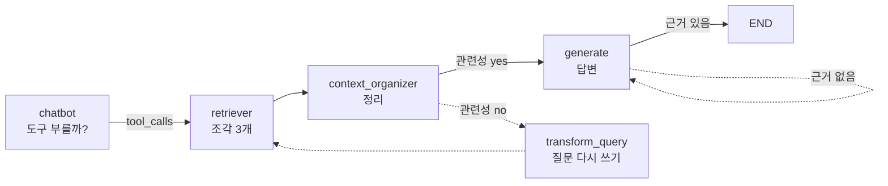

# Chapter 06 장 요약 — 싱글 에이전트 구현

절별 상세 노트는 아래 파일에 있습니다. 이 파일은 **장을 다 읽은 뒤 한 번에 정리**하는 용도입니다.

- [6.1 도구를 호출하는 에이전트 이해하기](06-01_%EB%8F%84%EA%B5%AC%EB%A5%BC%20%ED%98%B8%EC%B6%9C%ED%95%98%EB%8A%94%20%EC%97%90%EC%9D%B4%EC%A0%84%ED%8A%B8%20%EC%9D%B4%ED%95%B4%ED%95%98%EA%B8%B0.md)
- [6.2 웹 검색 에이전트 만들기](06-02_%EC%9B%B9%20%EA%B2%80%EC%83%89%20%EC%97%90%EC%9D%B4%EC%A0%84%ED%8A%B8%20%EB%A7%8C%EB%93%A4%EA%B8%B0.md)
- [6.3 코딩 에이전트 만들기](06-03_%EC%BD%94%EB%94%A9%20%EC%97%90%EC%9D%B4%EC%A0%84%ED%8A%B8%20%EB%A7%8C%EB%93%A4%EA%B8%B0.md)
- [6.4 create_agent 상세 구조 이해하기](06-04_create_agent%20%EC%83%81%EC%84%B8%20%EA%B5%AC%EC%A1%B0%20%EC%9D%B4%ED%95%B4%ED%95%98%EA%B8%B0.md)
- [6.5 RAG를 위한 에이전트 만들기](06-05_RAG%EB%A5%BC%20%EC%9C%84%ED%95%9C%20%EC%97%90%EC%9D%B4%EC%A0%84%ED%8A%B8%20%EB%A7%8C%EB%93%A4%EA%B8%B0.md)

| 학습 시작일 | 학습 완료일 | 소요 시간 |
| --- | --- | --- |
|  |  |  |

## 이 장의 핵심 3가지

1. 
2. 
3. 

## 다시 볼 부분

- [ ] 

---

## 6.5 RAG 실습 기록 (2026-09-03)

**API 키 없이 로컬 올라마만으로 6.5절 그래프를 끝까지 돌렸습니다.** 코드는
[`practice/rag_agent/`](practice/rag_agent)에 있습니다. `examples/`는 저자 원본이라 건드리지 않았습니다.

### 교재와 다른 점 셋

| | 교재 | 실습본 | 왜 |
| :--- | :--- | :--- | :--- |
| 지식 문서 | `한글맞춤법 표준어규정 해설.pdf` (264쪽) | **5·6장 학습 노트 10개** | **PDF가 저장소에 없습니다.** 저작권 자료라 저자가 뺐습니다 |
| 임베딩 | `OpenAIEmbeddings` (1536차원) | `OllamaEmbeddings` **bge-m3** (1024차원) | 키 없이 돌리려고 |
| LLM | `ChatOpenAI("gpt-4o")` | `ChatOllama` **qwen3.5:2b** | 〃 |

분할(`chunk_size=500, chunk_overlap=50`) · 검색 · 평가 · 생성 파이프라인은 교재와 같습니다.

### 실제로 돈 경로



**점선은 이번 실행에서 타지 않은 길입니다.** 2B 모델이 관련성 판정과 환각 판정을 **둘 다 한 번에** 맞혀 재질의 없이 끝났습니다.

> **실측 (2026-09-03 · qwen3.5:2b + bge-m3 · CPU)**
>
> ```
> ----- [CHATBOT] -----
> ----- [RETRIEVER] -----
> ----- [CONTEXT ORGANIZER] -----
> ----- ASSESS GRADED DOCUMENTS -----
> ---DECISION: GENERATE---
> ----- [GENERATE] -----
> ----- CHECK HALLUCINATIONS -----
> ---DECISION: GENERATION IS GROUNDED IN DOCUMENTS---
> ```
>
> 질문 *"랭그래프에서 State 가 뭐야?"* 에 대한 답변 (실행할 때마다 달라집니다)
>
> > 랭그래프에서 **State**는 에이전트가 작업을 수행하며 지속적으로 관리해야 하는 정보 구조입니다. (…)
> > `[06-05_RAG를 위한 에이전트 만들기.md 조각187]`
>
> | 항목 | 값 |
> | :--- | :--- |
> | 인덱싱 | 노트 10개 → **209조각** · 7.3분 |
> | 임베딩 속도 | **약 0.4조각/초** (CPU) |
> | 그래프 1회 실행 | **4.1분** |

### 재현

```powershell
ollama pull bge-m3
cd ch06_single-agent\practice\rag_agent
python build_index.py          # 5·6장 노트 (209조각 · 약 7분)
python build_index.py --all    # 전체 노트 (1,225조각 · 약 50분)
python agent.py
```

### 배운 것

- **RAG는 두 모델이 필요합니다.** 대화 모델과 **임베딩 전용 모델**은 별개입니다. `qwen3.5:2b` 로는 임베딩을 못 합니다
- **한국어에는 다국어 임베딩 모델이어야 합니다.** `bge-m3` 는 한국어 질의로 정확히 찾았습니다
- **저장할 때와 찾을 때의 임베딩 모델이 같아야 합니다.** 차원이 다르면(1536 vs 1024) 저장소를 통째로 다시 만들어야 합니다 — [11.3절](../ch11_final-project/11-03_%EB%AC%B8%EC%84%9C%20%EC%A0%80%EC%9E%A5%C2%B7%EA%B2%80%EC%83%89%20%EC%97%90%EC%9D%B4%EC%A0%84%ED%8A%B8.md)에서 예고한 함정이 여기서 실제로 걸립니다
- **작은 모델도 판정 노드를 감당합니다.** 관련성·환각 판정은 `yes`/`no` 이진 출력이라 2B로도 됐습니다. 다만 **`method` 를 맞춰야** 합니다(아래)

## 막혔던 에러 모음

| 증상 | 원인 | 해결 |
| --- | --- | --- |
| `openai.OpenAIError: Missing credentials` — **import만 해도** 죽음 | `retriever.py`가 `OpenAIEmbeddings()` 를 **모듈 최상단**에서 생성. 함수 호출 전에 터진다 | `practice/` 로 복사해 `OllamaEmbeddings(bge-m3)` 로 교체 |
| `AttributeError: 'NoneType' object has no attribute 'binary_score'` | `with_structured_output` 기본 `method="function_calling"` 이 `qwen3.5:2b` 에서 `None` 을 반환 | `method="json_schema"` 를 **명시**. [SETUP.md §4.6](../ch04_dev-env/SETUP.md) |
| `chroma_db` 없음 · 검색 결과 0건 | 교재가 쓰는 PDF와 벡터 저장소가 **저장소에 포함돼 있지 않음** | `build_index.py` 로 노트에서 직접 생성 |
| 인덱싱이 10분 넘게 안 끝남 | 전체 노트 1,225조각 × CPU 0.4조각/초 ≈ **50분** | 기본 범위를 5·6장(209조각)으로 축소. 전체는 `--all` |
| `NameError: name 'sys' is not defined` | `--all` 플래그를 넣으면서 `import sys` 를 빠뜨림 | import 추가 |

---

[⬅ Chapter 06](README.md) · [전체 목차](../STUDY.md)
