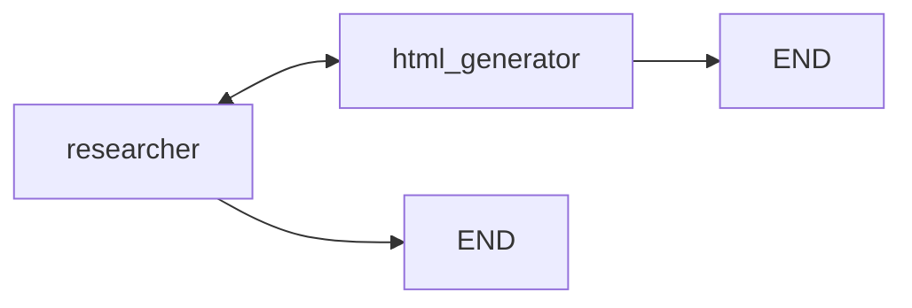
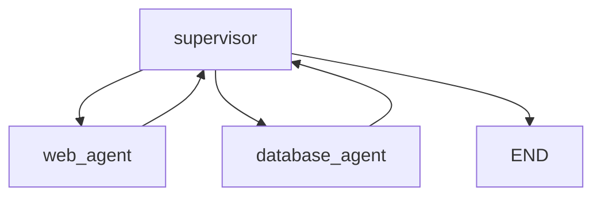
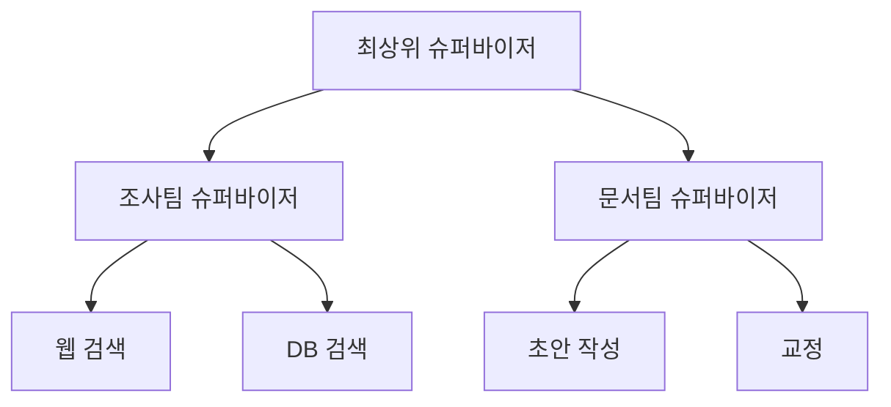
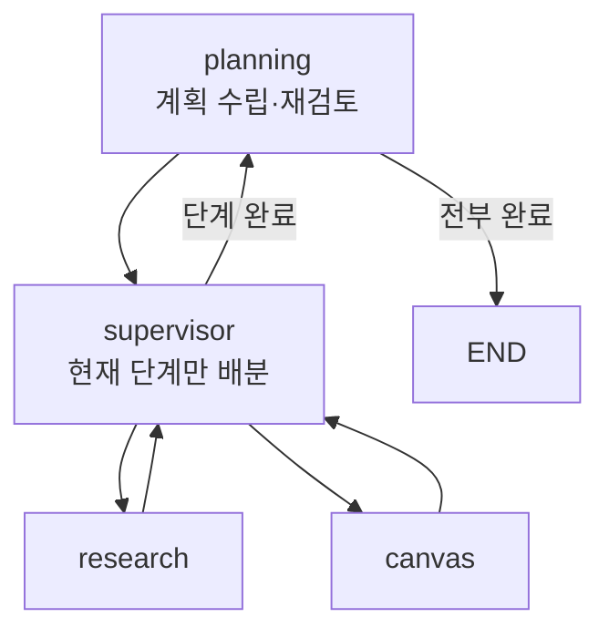

# 7.1 멀티 에이전트 유형 소개

> **공식 문서** — [Workflows and agents](https://docs.langchain.com/oss/python/langgraph/workflows-agents) · [LangChain · Subagents](https://docs.langchain.com/oss/python/langchain/multi-agent/subagents)

> **여기까지** — 6장에서 **싱글 에이전트 3종**을 만들었습니다. 판단 주체가 하나인 구조입니다.
> **이 절의 질문** — 여러 개로 나눌 때 **어떤 모양들이 있지?**
> **다 읽으면** — 7.3~7.6에서 만들 네 가지 예제가 **각각 어떤 패턴인지** 알고 들어가게 됩니다.

[3.2절](../ch03_architecture/03-02_%EB%A9%80%ED%8B%B0%20%EC%97%90%EC%9D%B4%EC%A0%84%ED%8A%B8.md)에서 멀티 에이전트의 개념과 세 가지 유형을 개괄했습니다. 이 절은 **거기에 두 가지를 더하고**, 각 유형을 만들 때 실제로 결정해야 할 것을 짚습니다.

핵심 질문은 하나입니다.

> **다음에 누가 일할지를 누가 정하는가?**

유형의 차이는 전부 이 질문의 답에서 나옵니다.

## 7.1.1 네트워크 패턴 아키텍처

**각 에이전트가 스스로 다음 사람을 정합니다.** 관리자가 없습니다.

| 항목 | 내용 |
| :--- | :--- |
| 누가 정하나 | **일을 마친 에이전트 자신** |
| 필요한 것 | 각 에이전트가 "내 일이 아니면 누구에게 넘길지" 알아야 함 |
| 장점 | 구조가 단순. 중간 경유가 없어 호출이 적음 |
| 단점 | 에이전트가 늘면 **서로 떠넘기는 핑퐁**이 생김 |

**끝내는 방법을 따로 정해야 합니다.** 아무도 관리하지 않으니 "이제 끝"이라고 할 사람이 없습니다. [7.3절](07-03_%EC%A0%95%EB%B3%B4%20%EA%B2%80%EC%83%89%EC%9D%84%20%EA%B8%B0%EB%B0%98%EC%9C%BC%EB%A1%9C%20%EC%B0%A8%ED%8A%B8%EB%A5%BC%20%EA%B7%B8%EB%A0%A4%EC%A3%BC%EB%8A%94%20%EC%97%90%EC%9D%B4%EC%A0%84%ED%8A%B8%20%23%EB%84%A4%ED%8A%B8%EC%9B%8C%ED%81%AC%20%ED%8C%A8%ED%84%B4.md) 예제는 **"최종 답변"이라는 약속어**를 정해서 해결합니다.

> **에이전트가 2~3개일 때만 쓸 만합니다.** 5개가 되면 각 에이전트가 나머지 4개를 다 알아야 하고, 서로가 서로에게 미루는 경로가 생깁니다.

## 7.1.2 슈퍼바이저 패턴 아키텍처

**관리자 에이전트가 정합니다.** 작업자들은 서로 직접 대화하지 않습니다.

| 항목 | 내용 |
| :--- | :--- |
| 누가 정하나 | **슈퍼바이저** |
| 작업자가 아는 것 | 자기 일만. 다른 에이전트를 몰라도 됨 |
| 장점 | 흐름이 한 점을 지나므로 **추적·통제가 쉬움** |
| 단점 | 매 단계 슈퍼바이저를 거치므로 **LLM 호출이 늘어남** |

**작업자를 추가하기 쉬운 것**이 실질적인 장점입니다. 슈퍼바이저의 프롬프트에 한 줄 더하고 노드를 붙이면 끝입니다. 네트워크였다면 기존 에이전트들의 프롬프트를 전부 고쳐야 합니다.

### 슈퍼바이저가 라우팅하는 방법도 두 가지입니다

같은 슈퍼바이저 패턴 안에서도 구현이 갈립니다. 이 책은 둘 다 보여 줍니다.

| 방식 | 어떻게 | 예제 |
| :--- | :--- | :--- |
| **Router 스키마** | 다음 담당자 이름을 구조화 출력으로 받음 | [7.4절](07-04_%EC%9B%B9%ED%8E%98%EC%9D%B4%EC%A7%80%EB%A5%BC%20%EC%9A%94%EC%95%BD%ED%95%B4%EC%84%9C%20%EB%8D%B0%EC%9D%B4%ED%84%B0%EB%B2%A0%EC%9D%B4%EC%8A%A4%EC%97%90%20%EC%A0%80%EC%9E%A5%ED%95%98%EB%8A%94%20%EC%97%90%EC%9D%B4%EC%A0%84%ED%8A%B8%20%23%EC%8A%88%ED%8D%BC%EB%B0%94%EC%9D%B4%EC%A0%80.md) |
| **핸드오프 도구** | 에이전트마다 `transfer_to_○○` 도구를 만들어 붙임 | [7.5절](07-05_%EC%B5%9C%EC%8B%A0%20%EB%AC%B8%EC%84%9C%20%EA%B2%80%EC%83%89%20%2B%20%EB%82%B4%EB%B6%80%20DB%20%EA%B2%80%EC%83%89%20%2B%20%ED%85%9C%ED%94%8C%EB%A6%BF%20%EB%8B%B5%EB%B3%80%203%EC%A4%91%20%EB%A9%80%ED%8B%B0%20%EC%97%90%EC%9D%B4%EC%A0%84%ED%8A%B8%20%23%EC%8A%88%ED%8D%BC%EB%B0%94%EC%9D%B4%EC%A0%80.md) |

두 번째가 흥미롭습니다. **에이전트를 도구처럼 다루는 것**이라, [2.2절](../ch02_core-elements/02-02_%EC%97%90%EC%9D%B4%EC%A0%84%ED%8A%B8%EC%9D%98%20%EC%99%B8%EB%B6%80%20%EC%A7%80%EC%8B%9D%20%ED%99%9C%EC%9A%A9%20-%20%EB%8F%84%EA%B5%AC%20%ED%98%B8%EC%B6%9C.md)에서 배운 도구 호출이 그대로 적용됩니다. 도구 설명이 곧 "언제 이 에이전트에게 넘길지"가 됩니다.

## 7.1.3 계층형 패턴 아키텍처

슈퍼바이저를 **여러 층으로 쌓은 것**입니다. 슈퍼바이저 밑에 또 슈퍼바이저가 있습니다.

**언제 필요한가.** 작업자가 10개를 넘어가면 슈퍼바이저 하나가 감당하지 못합니다. [2.2절](../ch02_core-elements/02-02_%EC%97%90%EC%9D%B4%EC%A0%84%ED%8A%B8%EC%9D%98%20%EC%99%B8%EB%B6%80%20%EC%A7%80%EC%8B%9D%20%ED%99%9C%EC%9A%A9%20-%20%EB%8F%84%EA%B5%AC%20%ED%98%B8%EC%B6%9C.md)의 "도구가 많아지면 선택 정확도가 떨어진다"가 **슈퍼바이저에게도 그대로 일어납니다.** 선택지를 층으로 나눠 좁히는 것입니다.

랭그래프에서는 **서브그래프**로 만듭니다. 하위 팀 하나가 그래프이고, 그 그래프를 상위 그래프의 노드로 넣습니다.

> **처음부터 계층형으로 시작하지 마세요.** [3.3절](../ch03_architecture/03-03_%EC%96%B4%EB%96%A4%20%EC%97%90%EC%9D%B4%EC%A0%84%ED%8A%B8%EB%A5%BC%20%EC%84%A4%EA%B3%84%ED%95%B4%EC%95%BC%20%ED%95%A0%EA%B9%8C.md)의 원칙대로, 슈퍼바이저 하나가 실제로 헷갈리는 것을 확인한 뒤에 나눕니다. 층이 늘 때마다 LLM 호출이 한 겹씩 더 붙습니다.

## 7.1.4 사용자 커스텀

**정해진 유형을 그대로 쓸 필요는 없습니다.** 랭그래프는 노드와 엣지일 뿐이라 원하는 모양을 만들 수 있습니다.

[7.6절](07-06_%EC%9E%90%EB%A3%8C%20%EC%A1%B0%EC%82%AC%20%EC%A0%84%EB%AC%B8%EA%B0%80%20%2B%20%EB%AC%B8%EC%84%9C%20%EC%9E%91%EC%84%B1%20%EC%A0%84%EB%AC%B8%EA%B0%80%20%EC%97%90%EC%9D%B4%EC%A0%84%ED%8A%B8%20%23%ED%94%8C%EB%9E%98%EB%8B%9D%20%EA%B8%B0%EB%B0%98%20%EC%8A%88%ED%8D%BC%EB%B0%94%EC%9D%B4%EC%A0%80.md)의 **플래닝 기반 슈퍼바이저**가 그 예입니다. 슈퍼바이저 위에 **계획 담당**을 하나 더 두어, 일을 배분하기 전에 전체 계획을 먼저 세웁니다.

**계획과 배분을 나눈 이유**가 있습니다. 슈퍼바이저 하나가 "전체 계획"과 "지금 누가 할지"를 동시에 판단하면 긴 작업에서 길을 잃습니다. 역할을 나누면 슈퍼바이저는 **눈앞의 한 단계만** 보면 됩니다.

## 무엇을 고를 것인가

| 상황 | 유형 |
| :--- | :--- |
| 에이전트 2~3개, 역할이 명확히 갈림 | **네트워크** (7.3) |
| 작업자가 여럿, 통제와 추적이 중요 | **슈퍼바이저** (7.4 · 7.5) |
| 작업자가 10개 이상 | **계층형** |
| 단계가 많고 긴 작업 | **플래닝 기반** (7.6) |

> **어떤 유형이든 [3.2절](../ch03_architecture/03-02_%EB%A9%80%ED%8B%B0%20%EC%97%90%EC%9D%B4%EC%A0%84%ED%8A%B8.md)의 대가는 그대로 따라옵니다** — 호출 증가, 지연, 추적 난이도, 오류 전파. 유형을 바꾼다고 사라지지 않고 **모양만 달라집니다.**

## 요약 및 비유

**주방 조직**으로 보면 유형 차이가 선명합니다.

| 개념 | 주방 비유 | 기술적 의미 |
| :--- | :--- | :--- |
| **네트워크** | 요리사끼리 "이건 네가 해" | 에이전트가 직접 다음을 지정 |
| **약속어로 종료** | "서빙 나갑니다" 외치기 | "최종 답변" 같은 종료 신호 |
| **핑퐁** | 서로 미루다 음식이 식음 | 떠넘기기 루프 |
| **슈퍼바이저** | 헤드 셰프가 지시 | 관리자가 배분 |
| **Router 스키마** | 지시서에 담당자 이름 | 구조화 출력으로 다음 노드 |
| **핸드오프 도구** | 담당자별 호출 벨 | `transfer_to_○○` 도구 |
| **계층형** | 파트별 부주방장 | 슈퍼바이저의 슈퍼바이저 |
| **플래닝** | 코스 순서를 먼저 짜는 사람 | 계획과 배분을 분리 |

## 결론

* 유형의 차이는 **"다음에 누가 일할지를 누가 정하는가"** 하나에서 갈립니다.
* **네트워크**는 에이전트가 스스로 정합니다. 단순하지만 **종료 조건을 따로 정해야** 하고, 늘어나면 핑퐁이 생깁니다.
* **슈퍼바이저**는 관리자가 정합니다. 호출은 늘지만 **추적이 쉽고 작업자 추가가 간단**합니다.
* 슈퍼바이저의 라우팅도 두 갈래입니다 — **Router 스키마**(7.4)와 **핸드오프 도구**(7.5).
* **계층형**은 작업자가 너무 많아 슈퍼바이저가 헷갈릴 때 씁니다. 도구가 많을 때 생기는 문제가 슈퍼바이저에게도 똑같이 일어납니다.
* **커스텀**도 가능합니다. 7.6절의 플래닝 기반은 계획과 배분을 나눠 **슈퍼바이저가 한 단계만 보게** 만든 것입니다.
* 유형을 바꿔도 [3.2절](../ch03_architecture/03-02_%EB%A9%80%ED%8B%B0%20%EC%97%90%EC%9D%B4%EC%A0%84%ED%8A%B8.md)의 대가는 사라지지 않고 **모양만 바뀝니다.**

---

## 다음 절로

유형은 알았습니다. 네트워크든 슈퍼바이저든 **일을 넘기는 동작**이 있어야 하죠.

**그 "넘김"을 코드로 어떻게 쓰죠?** → **[7.2절](07-02_%ED%95%B8%EB%93%9C%EC%98%A4%ED%94%84%EB%A5%BC%20%EC%9C%84%ED%95%9C%20%EA%B8%B0%EB%8A%A5%20%EC%82%B4%ED%8E%B4%EB%B3%B4%EA%B8%B0.md)**

---

[Chapter 07](README.md) · [7.2 ➡](07-02_%ED%95%B8%EB%93%9C%EC%98%A4%ED%94%84%EB%A5%BC%20%EC%9C%84%ED%95%9C%20%EA%B8%B0%EB%8A%A5%20%EC%82%B4%ED%8E%B4%EB%B3%B4%EA%B8%B0.md)
