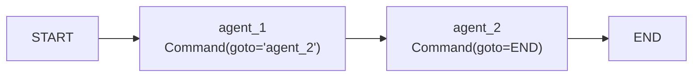
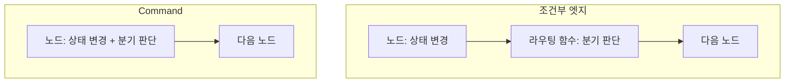

# 7.2 핸드오프를 위한 기능 살펴보기

> **저자 예제** — [`examples/how_to_use_command.ipynb`](examples/how_to_use_command.ipynb)
> **공식 문서** — [Graph API overview](https://docs.langchain.com/oss/python/langgraph/graph-api)의 Command 절

> **여기까지** — 멀티 에이전트의 **유형 네 가지**를 봤습니다([7.1절](07-01_%EB%A9%80%ED%8B%B0%20%EC%97%90%EC%9D%B4%EC%A0%84%ED%8A%B8%20%EC%9C%A0%ED%98%95%20%EC%86%8C%EA%B0%9C.md)).
> **이 절의 질문** — 에이전트끼리 **일을 넘기는 코드**가 뭐지?
> **다 읽으면** — **`Command`** 를 읽고 쓸 수 있게 됩니다. 7장 예제에서 **가장 많이 나오는 코드**입니다.

[3.2절](../ch03_architecture/03-02_%EB%A9%80%ED%8B%B0%20%EC%97%90%EC%9D%B4%EC%A0%84%ED%8A%B8.md)에서 **핸드오프**라는 이름만 붙여 두고 넘어갔습니다. 이 절이 그 실물인 **`Command`** 를 다룹니다.

7장 예제 전체에서 가장 많이 나오는 코드이니 여기서 확실히 잡고 가세요.

## 7.2.1 [실습] 핸드오프의 개념과 Command 사용법 익히기

### 노드가 갈 곳을 직접 정합니다

[5.2절](../ch05_langgraph-basics/05-02_%EB%9E%AD%EA%B7%B8%EB%9E%98%ED%94%84%20%EA%B8%B0%EB%B3%B8%20%EA%B0%9C%EB%85%90%20%EC%9D%B4%ED%95%B4%ED%95%98%EA%B3%A0%20%EC%A0%81%EC%9A%A9%ED%95%98%EA%B8%B0.md)까지 배운 방식은 이랬습니다.

```
노드는 상태만 바꾼다  →  엣지가 다음 노드를 정한다
```

`Command`는 이 둘을 **한 번에** 합니다.

```python
from langgraph.types import Command

def agent_1(state: MessagesState) -> Command[Literal["agent_2"]]:
    messages = AIMessage(content="1번 에이전트 메시지입니다.")
    return Command(
        goto="agent_2",                    # 어디로 갈지
        update={"messages": [messages]}    # 무엇을 바꿀지
    )
```

| 인자 | 하는 일 | 원래는 |
| :--- | :--- | :--- |
| `update` | 상태를 바꿈 | 노드의 반환값 |
| `goto` | 다음 노드를 지정 | 엣지 |

### 엣지를 안 그려도 됩니다

저자 예제의 그래프 조립을 보세요.

```python
graph_builder = StateGraph(MessagesState)
graph_builder.add_node("agent_1", agent_1)
graph_builder.add_node("agent_2", agent_2)

graph_builder.add_edge(START, "agent_1")     # 이것 하나뿐

graph = graph_builder.compile()
```

**`agent_1 → agent_2` 엣지가 없습니다.** `Command`의 `goto`가 그 자리를 대신합니다.

### 타입 힌트가 그림을 그립니다

```python
def agent_1(state: MessagesState) -> Command[Literal["agent_2"]]:
```

**`Command[Literal["agent_2"]]`** 는 파이썬 문법일 뿐 아니라 **랭그래프가 읽는 정보**입니다. 이 힌트로 "이 노드는 `agent_2`로 갈 수 있다"를 알아내 그래프 그림을 그립니다.

> **타입 힌트를 빼면 동작은 하지만 그림에 화살표가 안 나옵니다.** 스튜디오에서 흐름이 끊겨 보이면 여기를 확인하세요. 노드가 많아지면 이 그림이 유일한 지도가 됩니다.

정말 그런지 확인했습니다. **`add_edge`는 `START`와 `END`쪽 두 줄만 썼고**, 나머지는 전부 `Command`로만 이동합니다.

```python
def start_node(state) -> Command[Literal["researcher", "writer"]]: ...
def researcher(state) -> Command[Literal["writer"]]: ...
```

> **실측 (2026-08-31 · langgraph 1.2.11)**

```
graph TD;
	__start__ --> start_node;
	researcher -.-> writer;
	start_node -.-> researcher;
	start_node -.-> writer;
	writer --> __end__;
```

**`add_edge`로 안 그린 화살표 셋이 그림에 있습니다.** 전부 타입 힌트에서 나온 것이고, 조건부를 뜻하는 **점선**입니다.

같은 그래프에서 **힌트만 지우면** 이렇게 됩니다.

```
실행은 됩니다: ['start', 'writer 마무리']
그런데 엣지:
    __start__ -> start_node
    start_node -> __end__
```

**`start_node -> writer`가 사라졌습니다.** 그뿐 아니라 랭그래프는 `start_node`를 **끝나는 노드로 착각해 `__end__`를 붙였습니다.** 실행은 멀쩡한데 그림은 거짓말을 합니다.

> **힌트는 주석이 아니라 배선입니다.** 없어도 돌아가니 빼먹기 쉬운데, 그 순간부터 그림이 실제와 달라집니다. 노드가 열 개쯤 되면 이 차이가 치명적입니다.



## 7.2.2 [실습] 조건에 따른 Command 사용법 알아보기

### 갈 곳이 여러 개일 때

`Command`의 진짜 쓸모는 **조건에 따라 다른 곳으로 보낼 때**입니다.

```python
class State(MessagesState):
    foo: str

def agent_1(state: State) -> Command[Literal["agent_2", "agent_3"]]:
    messages = AIMessage(content="1번 에이전트 메시지입니다.")
    if state["foo"] == "bar":
        return Command(
            goto="agent_3",
            update={"messages": [messages], "foo": "baz"}
        )
    return Command(
        goto="agent_2",
        update={"messages": [messages]}
    )
```

`Literal["agent_2", "agent_3"]` — **갈 수 있는 곳을 전부 적습니다.**

### 조건부 엣지와 무엇이 다른가

[5.2.5절](../ch05_langgraph-basics/05-02_%EB%9E%AD%EA%B7%B8%EB%9E%98%ED%94%84%20%EA%B8%B0%EB%B3%B8%20%EA%B0%9C%EB%85%90%20%EC%9D%B4%ED%95%B4%ED%95%98%EA%B3%A0%20%EC%A0%81%EC%9A%A9%ED%95%98%EA%B8%B0.md)의 `add_conditional_edges`로도 같은 일을 할 수 있습니다. 차이는 이렇습니다.

| | 조건부 엣지 | `Command` |
| :--- | :--- | :--- |
| 판단하는 곳 | **노드 밖의 라우팅 함수** | **노드 안** |
| 상태 변경과 분기 | 따로 (노드가 바꾸고, 함수가 정함) | **한 번에** |
| 라우팅 함수가 보는 것 | 노드가 바꾼 뒤의 상태 | — |
| 어울리는 곳 | 흐름 제어가 노드와 분리될 때 | **에이전트가 스스로 다음을 정할 때** |

**멀티 에이전트에서 `Command`가 자연스러운 이유**가 여기 있습니다. 에이전트는 "내가 일하고, 내가 다음 사람을 정한다"가 자연스럽습니다. 그 판단 근거가 **자기가 방금 한 일의 결과**라서, 노드 밖으로 빼면 오히려 어색해집니다.



### 부모 그래프로 보내기

[7.5절](07-05_%EC%B5%9C%EC%8B%A0%20%EB%AC%B8%EC%84%9C%20%EA%B2%80%EC%83%89%20%2B%20%EB%82%B4%EB%B6%80%20DB%20%EA%B2%80%EC%83%89%20%2B%20%ED%85%9C%ED%94%8C%EB%A6%BF%20%EB%8B%B5%EB%B3%80%203%EC%A4%91%20%EB%A9%80%ED%8B%B0%20%EC%97%90%EC%9D%B4%EC%A0%84%ED%8A%B8%20%23%EC%8A%88%ED%8D%BC%EB%B0%94%EC%9D%B4%EC%A0%80.md)에서 쓰이는 형태를 미리 봐 둡니다.

```python
return Command(
    goto=agent_name,
    graph=Command.PARENT,     # ← 이것
    update={...}
)
```

**`graph=Command.PARENT`** 는 "이 그래프 말고 **한 층 위 그래프**의 노드로 가라"는 뜻입니다.

7.5절에서는 도구 안에서 이걸 씁니다. 도구는 에이전트 그래프 안에서 실행되는데, **가려는 곳은 그 에이전트를 담고 있는 바깥 그래프의 다른 에이전트**이기 때문입니다.

작은 부모·자식 그래프로 실제로 넘어가는지 확인했습니다. **여기서 함정을 하나 만났습니다.**

자식 노드에 **평소처럼 타입 힌트를 달면** 컴파일이 막힙니다.

```python
def child_node(state) -> Command[Literal["parent_next"]]:      # ← 힌트를 달면
    return Command(goto="parent_next", graph=Command.PARENT)
```

> **실측 (2026-08-31 · langgraph 1.2.11)**

```
ValueError: Found edge ending at unknown node `parent_next`
```

**힌트가 자식 그래프 안의 엣지로 해석됩니다.** 그런데 `parent_next`는 부모에 있는 노드라 자식은 모릅니다.

힌트를 빼면 정상입니다.

```python
def child_node(state):                                          # ← 힌트 없음
    return Command(goto="parent_next", graph=Command.PARENT)
```

```
결과: ['child 가 부모를 지목', 'parent_next 실행됨']
```

**서브그래프 안에서 부모 그래프의 노드로 건너뛰었습니다.**

> **위에서 "힌트는 배선이니 꼭 달라"고 했는데, `Command.PARENT`일 때는 반대입니다.** 힌트가 가리키는 노드는 **같은 그래프 안에 있어야** 합니다. 밖으로 나가는 이동은 힌트로 표현할 수 없습니다. 그래서 이 경우엔 그림에도 안 나옵니다 — 어쩔 수 없는 부분입니다.

> 지금은 "이런 게 있다"만 알고 넘어가세요. 7.5절에서 실제 쓰임과 함께 다시 봅니다.

## 무엇을 넘길지가 진짜 문제입니다

`Command`의 문법은 단순합니다. 어려운 건 **`update`에 무엇을 담을지**입니다.

[3.2절](../ch03_architecture/03-02_%EB%A9%80%ED%8B%B0%20%EC%97%90%EC%9D%B4%EC%A0%84%ED%8A%B8.md)에서 말한 그대로입니다.

| 넘기는 양 | 문제 |
| :--- | :--- |
| 대화 전체 | **컨텍스트를 나눈 의미가 사라짐** |
| 너무 적게 | 받는 쪽이 맥락을 몰라 엉뚱한 일을 함 |

이 책의 예제들은 대부분 **메시지 전체를 넘깁니다.** 학습용으로는 이해하기 쉽지만, 에이전트가 많아지고 대화가 길어지면 [2.3절](../ch02_core-elements/02-03_%EC%97%90%EC%9D%B4%EC%A0%84%ED%8A%B8%EC%9D%98%20%EA%B8%B0%EC%96%B5%EB%A0%A5%20-%20%EB%A9%94%EB%AA%A8%EB%A6%AC.md)의 컨텍스트 문제가 그대로 터집니다.

**실무에서는 요약본이나 필요한 값만 넘기는 쪽으로 갑니다.** 7.5절의 핸드오프 도구가 `query` 하나만 따로 받는 것도 그런 시도입니다.

## 요약 및 비유

**바통 터치**입니다. 달리기를 마치면서 **바통을 넘기는 동작 하나에** "내가 여기까지 왔다"(`update`)와 "다음은 너다"(`goto`)가 함께 들어 있습니다.

| 개념 | 이어달리기 비유 | 기술적 의미 |
| :--- | :--- | :--- |
| **`Command`** | 바통을 건네는 동작 | 상태 변경 + 다음 노드 지정 |
| **`update`** | 여기까지 뛴 거리 | 상태 변경 |
| **`goto`** | 다음 주자 지목 | 다음 노드 |
| **엣지 불필요** | 트랙에 선을 안 그려도 됨 | `add_edge` 없이 이동 |
| **타입 힌트** | 인계 가능한 주자 명단 | 그래프 그림의 근거 |
| **조건부 `goto`** | 상황 보고 다른 주자에게 | 노드 안에서 분기 |
| **`Command.PARENT`** | 옆 트랙 주자에게 넘김 | 상위 그래프의 노드로 |
| **무엇을 넘길지** | 바통에 뭘 적어 줄지 | 핸드오프 설계의 핵심 |

## 결론

* **`Command`는 상태 변경(`update`)과 다음 노드 지정(`goto`)을 한 번에** 합니다.
* `goto`가 엣지 역할을 하므로 **`add_edge`를 그리지 않아도** 됩니다.
* 반환 타입 힌트 **`Command[Literal["…"]]`** 는 랭그래프가 그래프 그림을 그리는 근거입니다. 빼면 동작은 해도 화살표가 안 보입니다.
* 조건부 엣지와의 차이는 **판단이 노드 안에 있느냐 밖에 있느냐**입니다.
* 멀티 에이전트에는 `Command`가 자연스럽습니다. **판단 근거가 자기가 방금 한 일**이기 때문입니다.
* **`graph=Command.PARENT`** 는 한 층 위 그래프의 노드로 보냅니다(7.5절).
* 문법보다 어려운 것은 **`update`에 무엇을 담을지**입니다. 전부 넘기면 나눈 의미가 사라집니다.

---

## 다음 절로

`Command` 로 일을 넘길 수 있게 됐습니다. **이제 실제로 만들어 봅시다.**

가장 단순한 것부터 — **관리자 없이 둘이 주고받는** 네트워크 패턴입니다. 그런데 관리자가 없으면 **누가 "끝"이라고 하죠?** → **[7.3절](07-03_%EC%A0%95%EB%B3%B4%20%EA%B2%80%EC%83%89%EC%9D%84%20%EA%B8%B0%EB%B0%98%EC%9C%BC%EB%A1%9C%20%EC%B0%A8%ED%8A%B8%EB%A5%BC%20%EA%B7%B8%EB%A0%A4%EC%A3%BC%EB%8A%94%20%EC%97%90%EC%9D%B4%EC%A0%84%ED%8A%B8%20%23%EB%84%A4%ED%8A%B8%EC%9B%8C%ED%81%AC%20%ED%8C%A8%ED%84%B4.md)**

---

[⬅ 7.1](07-01_%EB%A9%80%ED%8B%B0%20%EC%97%90%EC%9D%B4%EC%A0%84%ED%8A%B8%20%EC%9C%A0%ED%98%95%20%EC%86%8C%EA%B0%9C.md) · [Chapter 07](README.md) · [7.3 ➡](07-03_%EC%A0%95%EB%B3%B4%20%EA%B2%80%EC%83%89%EC%9D%84%20%EA%B8%B0%EB%B0%98%EC%9C%BC%EB%A1%9C%20%EC%B0%A8%ED%8A%B8%EB%A5%BC%20%EA%B7%B8%EB%A0%A4%EC%A3%BC%EB%8A%94%20%EC%97%90%EC%9D%B4%EC%A0%84%ED%8A%B8%20%23%EB%84%A4%ED%8A%B8%EC%9B%8C%ED%81%AC%20%ED%8C%A8%ED%84%B4.md)
