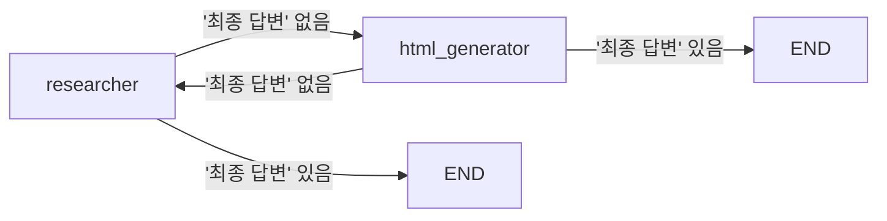
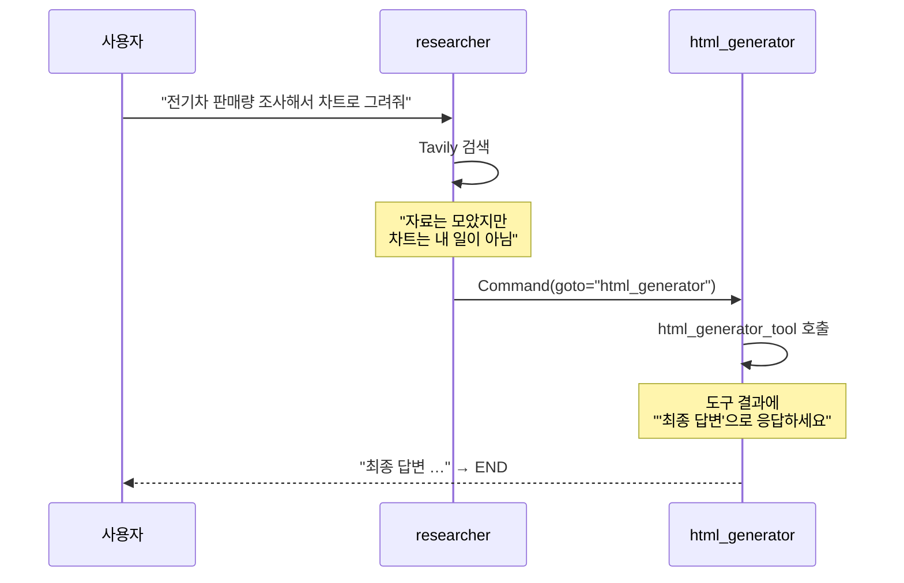

# 7.3 정보 검색을 기반으로 차트를 그려주는 에이전트 #네트워크 패턴

> **저자 예제** — [`examples/network_agent/`](examples/network_agent) (`settings.py` · `research_agent.py` · `chart_agent.py` · `make_graph.py`)
> **공식 문서** — [Workflows and agents](https://docs.langchain.com/oss/python/langgraph/workflows-agents)

[7.1.1절](07-01_%EB%A9%80%ED%8B%B0%20%EC%97%90%EC%9D%B4%EC%A0%84%ED%8A%B8%20%EC%9C%A0%ED%98%95%20%EC%86%8C%EA%B0%9C.md)의 네트워크 패턴을 실제로 만듭니다. 에이전트 둘이 **관리자 없이** 서로에게 일을 넘깁니다.

- **`researcher`** — 웹 검색으로 자료를 모읍니다
- **`html_generator`** — 그 자료로 차트가 든 HTML 파일을 만듭니다

## 7.3.1 각 에이전트의 소통 방식 정의하기

### 문제 — 아무도 "끝"이라고 말하지 않습니다

[7.1.1절](07-01_%EB%A9%80%ED%8B%B0%20%EC%97%90%EC%9D%B4%EC%A0%84%ED%8A%B8%20%EC%9C%A0%ED%98%95%20%EC%86%8C%EA%B0%9C.md)에서 예고한 문제입니다. 관리자가 없으니 종료를 선언할 사람이 없습니다. 그냥 두면 둘이 영원히 주고받습니다.

**저자의 해법은 약속어입니다.** 공용 시스템 프롬프트([`settings.py`](examples/network_agent/settings.py))에 이렇게 적어 둡니다.

```
'최종 답변'으로 시작하여 대화를 완료하는 경우:
- 단순한 인사말이나 일반적인 대화만 있는 경우
- 정보 제공만으로 모든 요청이 완료되고, 추가 작업이 전혀 필요하지 않은 경우
```

그리고 각 노드가 **그 문자열을 찾습니다.**

```python
if "최종 답변" in last_message.content:
    goto = END
else:
    goto = "html_generator"
```



> **이 방식은 깨지기 쉽습니다.** 모델이 "최종 답변을 드리자면…"처럼 자연스럽게 쓰면 의도치 않게 종료되고, 반대로 약속어를 잊으면 안 끝납니다. **문자열 매칭이라는 게 근본적으로 불안정합니다.**
>
> 더 튼튼하게 하려면 [1.2절](../ch01_llm-decision/01-02_LLM%EC%9D%84%20%EA%B8%B0%EB%B0%98%EC%9C%BC%EB%A1%9C%20%EC%9D%98%EC%82%AC%EA%B2%B0%EC%A0%95%ED%95%98%EB%8B%A4.md)의 **구조화 출력으로 `is_done: bool`을 받는 편**이 낫습니다. 네트워크 패턴이 에이전트 2~3개까지만 쓸 만한 이유이기도 합니다.

### 공용 프롬프트로 협업 규칙을 심습니다

[`settings.py`](examples/network_agent/settings.py)의 `make_system_prompt`가 **모든 에이전트에게 공통으로 들어가는 부분**을 만듭니다.

```
1. 제공된 도구들을 사용하여 가능한 한 질문에 답하세요.
2. 당신의 능력 범위를 벗어나는 작업이 있다면, 해당 전문 어시스턴트에게 명확히 위임하세요.
3. 작업을 부분적으로 완료했다면, 완료된 부분을 설명하고 남은 작업을 다른 어시스턴트에게 전달하세요.
```

**3번이 핵심입니다.** "부분적으로 완료했다면 남은 작업을 전달하라" — 이게 네트워크 패턴의 협업 규칙입니다.

```python
def make_system_prompt(suffix: str) -> str:
    return f"""
        …공통 규칙…
        {suffix}
    """
```

**공통 부분 + 각자의 역할(`suffix`)** 구조입니다. 에이전트가 늘어도 협업 규칙은 한 곳에서 관리됩니다.

## 7.3.2 [실습] 멀티 에이전트 그래프 만들기

그래프가 놀랄 만큼 짧습니다. [`make_graph.py`](examples/network_agent/make_graph.py) 전문입니다.

```python
graph_builder = StateGraph(MessagesState)
graph_builder.add_node("researcher", research_node)
graph_builder.add_node("html_generator", html_node)

graph_builder.add_edge(START, "researcher")
graph = graph_builder.compile()
```

**엣지가 `START → researcher` 하나뿐입니다.** 나머지 이동은 전부 [7.2절](07-02_%ED%95%B8%EB%93%9C%EC%98%A4%ED%94%84%EB%A5%BC%20%EC%9C%84%ED%95%9C%20%EA%B8%B0%EB%8A%A5%20%EC%82%B4%ED%8E%B4%EB%B3%B4%EA%B8%B0.md)의 `Command`가 합니다.

**상태도 `MessagesState` 그대로입니다.** 별도 키가 없습니다. 두 에이전트가 **하나의 메시지 목록을 공유**하며 대화하듯 일합니다.

## 7.3.3 [실습] 정보 검색 에이전트 만들기

```python
research_agent = create_agent(
    llm,
    tools=[tool],
    system_prompt=make_system_prompt(
        "당신은 웹검색을 통한 자료조사만 할 수 있습니다. 차트 시각화(html 파일 생성)를 담당하는 "
        "에이전트와 함께 일하고 있으니 차트 생성이나 파일 생성은 수행하지 말고 넘기세요."
    ),
)
```

**에이전트 안에 또 에이전트가 있습니다.** `research_agent`는 [6.4절](../ch06_single-agent/06-04_create_agent%20%EC%83%81%EC%84%B8%20%EA%B5%AC%EC%A1%B0%20%EC%9D%B4%ED%95%B4%ED%95%98%EA%B8%B0.md)의 `create_agent`로 만든 완전한 ReAct 에이전트이고, 그것을 **노드 하나로 감싸** 큰 그래프에 넣습니다.

> **프롬프트가 "하지 마세요"를 명시합니다.** "차트 생성이나 파일 생성은 수행하지 말고 넘기세요" — 이게 없으면 검색 에이전트가 HTML까지 만들어 버립니다. **역할 경계는 능력이 아니라 프롬프트로 정해집니다.**

### 노드에서 하는 세 가지

```python
def research_node(state: MessagesState) -> Command[Literal["html_generator", END]]:
    result = research_agent.invoke(state)                    # [1] 에이전트 실행

    result["messages"][-1] = HumanMessage(                   # [2] 이름 붙여 교체
        content=result["messages"][-1].content, name="researcher"
    )

    last_message = result["messages"][-1]                    # [3] 종료 판단
    goto = END if "최종 답변" in last_message.content else "html_generator"

    return Command(update={"messages": result["messages"]}, goto=goto)
```

**[2]가 이해하기 어려운 부분입니다.** 왜 `AIMessage`를 `HumanMessage`로 바꿀까요.

다음 에이전트 입장에서 보면 됩니다. **다른 에이전트가 한 말은 "내가 한 말"이 아니라 "누가 나에게 준 정보"** 입니다. `AIMessage`로 두면 다음 에이전트가 자기 발언으로 착각합니다. `name="researcher"`를 붙여 **누가 한 말인지 표시**하는 것도 같은 이유입니다.

> 이건 네트워크 패턴의 **관례**이지 랭그래프의 규칙이 아닙니다. 슈퍼바이저 패턴인 [7.4절](07-04_%EC%9B%B9%ED%8E%98%EC%9D%B4%EC%A7%80%EB%A5%BC%20%EC%9A%94%EC%95%BD%ED%95%B4%EC%84%9C%20%EB%8D%B0%EC%9D%B4%ED%84%B0%EB%B2%A0%EC%9D%B4%EC%8A%A4%EC%97%90%20%EC%A0%80%EC%9E%A5%ED%95%98%EB%8A%94%20%EC%97%90%EC%9D%B4%EC%A0%84%ED%8A%B8%20%23%EC%8A%88%ED%8D%BC%EB%B0%94%EC%9D%B4%EC%A0%80.md)에서는 `name`만 붙이고 타입은 그대로 둡니다.

## 7.3.4 [실습] 차트 생성 에이전트 만들기

도구 하나를 직접 만듭니다([6.3절](../ch06_single-agent/06-03_%EC%BD%94%EB%94%A9%20%EC%97%90%EC%9D%B4%EC%A0%84%ED%8A%B8%20%EB%A7%8C%EB%93%A4%EA%B8%B0.md)의 파일 쓰기 도구와 같은 틀입니다).

```python
@tool
def html_generator_tool(html_content: str, filename: str):
    """HTML 파일을 생성하고 저장합니다. 차트나 데이터 시각화를 HTML/CSS/JavaScript로 생성할 수 있습니다."""
    try:
        with open(filename, 'w', encoding='utf-8') as f:
            f.write(html_content)
        return (f"HTML 파일이 성공적으로 생성되었습니다: {filename}\n"
                f"…\n\n작업이 완료되었다면 '최종 답변'으로 응답하세요.")
    except Exception as e:
        return f"HTML 파일 생성에 실패하였습니다. 오류: {repr(e)}"
```

**반환 메시지 끝을 보세요.**

> "작업이 완료되었다면 '최종 답변'으로 응답하세요."

**도구의 반환값이 모델에게 주는 지시**입니다. 도구 결과는 [6.1절](../ch06_single-agent/06-01_%EB%8F%84%EA%B5%AC%EB%A5%BC%20%ED%98%B8%EC%B6%9C%ED%95%98%EB%8A%94%20%EC%97%90%EC%9D%B4%EC%A0%84%ED%8A%B8%20%EC%9D%B4%ED%95%B4%ED%95%98%EA%B8%B0.md)에서 본 대로 `ToolMessage`가 되어 모델의 다음 입력이 되니, **거기에 지시를 실어 보내는 것**입니다.

시스템 프롬프트에 한 번 적어 두는 것으로 부족해서 **결정적인 순간에 다시 한번 알려 주는** 셈입니다. 종료 조건이 문자열 매칭이라 불안정하다는 걸 저자도 알고 보강한 것으로 보입니다.

**차트를 그리는 라이브러리는 쓰지 않습니다.** 모델이 HTML/CSS/JavaScript를 직접 작성하고 도구는 파일로 저장만 합니다.

## 7.3.5 [실습] 정보 검색과 차트 생성 요청하고 답변 받아보기

전형적인 흐름은 이렇게 흘러갑니다.



생성된 결과물이 저장소에 남아 있습니다 — [`ai_agents_trend_2025.html`](examples/ai_agents_trend_2025.html), [`global_ev_sales_report.html`](examples/global_ev_sales_report.html), [`outputs/`](examples/outputs). **저자가 실제로 돌려서 나온 파일**이니 열어 보면 어떤 수준의 결과가 나오는지 감이 옵니다.

> 실행 결과는 검색 시점에 따라 달라지므로 이 노트에는 싣지 않았습니다.

### 파일이 어디에 생기는지 주의하세요

`filename`을 모델이 정하고 상대 경로로 저장하므로, **`langgraph dev`를 실행한 디렉터리에 파일이 생깁니다**([4.1절](../ch04_dev-env/04-01_%EB%B9%84%EC%A3%BC%EC%96%BC%20%EC%8A%A4%ED%8A%9C%EB%94%94%EC%98%A4%20%EC%BD%94%EB%93%9C%20%ED%99%98%EA%B2%BD%20%EC%84%A4%EC%A0%95%ED%95%98%EA%B8%B0.md)의 작업 디렉터리 문제).

## 요약 및 비유

**기자와 편집디자이너**입니다. 관리자 없이 둘이 직접 주고받고, 기사가 나갈 준비가 되면 **"조판 완료"라고 외쳐** 끝냅니다.

| 개념 | 편집실 비유 | 기술적 의미 |
| :--- | :--- | :--- |
| **네트워크 패턴** | 둘이 직접 주고받음 | 관리자 없음 |
| **약속어 "최종 답변"** | "조판 완료" 외침 | 문자열로 종료 신호 |
| **공용 프롬프트** | 편집실 공통 규칙 | `make_system_prompt` |
| **`suffix`** | 각자의 담당 업무 | 역할별 프롬프트 |
| **"하지 마세요"** | 남의 일은 손대지 않기 | 역할 경계를 프롬프트로 |
| **에이전트 in 노드** | 각자가 완결된 작업자 | `create_agent` 결과를 노드로 |
| **AIMessage → HumanMessage** | 남이 준 원고로 취급 | 발화 주체 구분 |
| **도구 반환값의 지시** | 조판기에 붙은 안내문 | `ToolMessage` 로 지시 전달 |
| **엣지 하나뿐** | 규정된 동선이 없음 | 이동은 전부 `Command` |

## 결론

* 네트워크 패턴은 **종료 조건을 직접 설계해야** 합니다. 저자는 **"최종 답변"이라는 약속어**를 씁니다.
* 문자열 매칭은 **깨지기 쉽습니다.** 구조화 출력으로 `is_done`을 받는 편이 튼튼합니다.
* 공용 프롬프트에 **협업 규칙**(특히 "부분 완료 시 남은 일을 넘겨라")을 심고, 역할별 `suffix`를 붙입니다.
* **역할 경계는 프롬프트가 정합니다.** "차트는 만들지 말고 넘기세요"가 없으면 혼자 다 해 버립니다.
* 그래프의 엣지는 **`START → researcher` 하나뿐**입니다. 나머지는 전부 `Command`.
* 노드 안에서 **`AIMessage`를 `HumanMessage`로 바꾸고 `name`을 붙입니다.** 다른 에이전트의 말을 자기 발언으로 착각하지 않게 하는 관례입니다.
* **도구의 반환 문자열에도 지시를 실을 수 있습니다.** `ToolMessage`가 모델의 다음 입력이 되기 때문입니다.
* 파일은 **실행한 디렉터리에 생깁니다.** 저자가 만든 결과물이 `examples/`에 남아 있습니다.

---

[⬅ 7.2](07-02_%ED%95%B8%EB%93%9C%EC%98%A4%ED%94%84%EB%A5%BC%20%EC%9C%84%ED%95%9C%20%EA%B8%B0%EB%8A%A5%20%EC%82%B4%ED%8E%B4%EB%B3%B4%EA%B8%B0.md) · [Chapter 07](README.md) · [7.4 ➡](07-04_%EC%9B%B9%ED%8E%98%EC%9D%B4%EC%A7%80%EB%A5%BC%20%EC%9A%94%EC%95%BD%ED%95%B4%EC%84%9C%20%EB%8D%B0%EC%9D%B4%ED%84%B0%EB%B2%A0%EC%9D%B4%EC%8A%A4%EC%97%90%20%EC%A0%80%EC%9E%A5%ED%95%98%EB%8A%94%20%EC%97%90%EC%9D%B4%EC%A0%84%ED%8A%B8%20%23%EC%8A%88%ED%8D%BC%EB%B0%94%EC%9D%B4%EC%A0%80.md)
