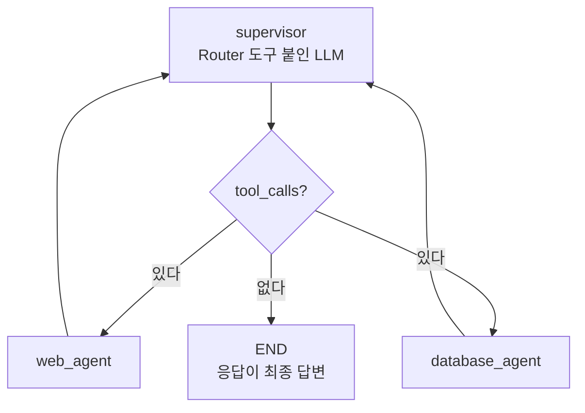
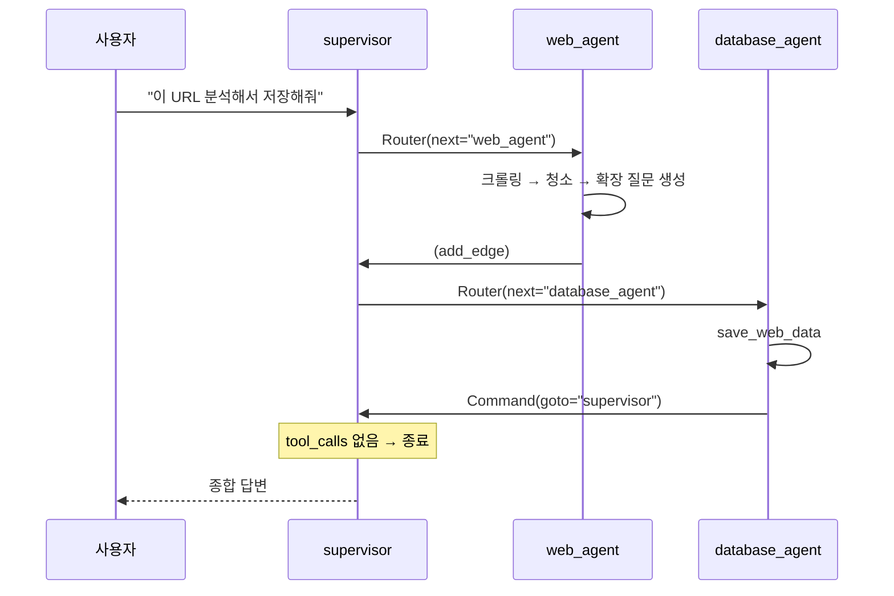

# 7.4 웹페이지를 요약해서 데이터베이스에 저장하는 에이전트 #슈퍼바이저

> **저자 예제** — [`examples/supervisor_agent_web/`](examples/supervisor_agent_web) (`settings.py` · `supervisor_agent.py` · `web_agent.py` · `database_agent.py` · `make_graph.py`)
> **공식 문서** — [LangChain · Subagents](https://docs.langchain.com/oss/python/langchain/multi-agent/subagents) · [Supabase · AI & Vectors](https://supabase.com/docs/guides/ai)

> **여기까지** — 네트워크 패턴을 만들었는데 **종료를 문자열로 판단**해야 했습니다([7.3절](07-03_%EC%A0%95%EB%B3%B4%20%EA%B2%80%EC%83%89%EC%9D%84%20%EA%B8%B0%EB%B0%98%EC%9C%BC%EB%A1%9C%20%EC%B0%A8%ED%8A%B8%EB%A5%BC%20%EA%B7%B8%EB%A0%A4%EC%A3%BC%EB%8A%94%20%EC%97%90%EC%9D%B4%EC%A0%84%ED%8A%B8%20%23%EB%84%A4%ED%8A%B8%EC%9B%8C%ED%81%AC%20%ED%8C%A8%ED%84%B4.md)).
> **이 절의 질문** — **관리자를 두면** 그 문제가 풀릴까?
> **다 읽으면** — 슈퍼바이저 패턴을 만들 수 있고, **작업자가 에이전트가 아니어도 된다**는 것도 알게 됩니다.

[7.3절](07-03_%EC%A0%95%EB%B3%B4%20%EA%B2%80%EC%83%89%EC%9D%84%20%EA%B8%B0%EB%B0%98%EC%9C%BC%EB%A1%9C%20%EC%B0%A8%ED%8A%B8%EB%A5%BC%20%EA%B7%B8%EB%A0%A4%EC%A3%BC%EB%8A%94%20%EC%97%90%EC%9D%B4%EC%A0%84%ED%8A%B8%20%23%EB%84%A4%ED%8A%B8%EC%9B%8C%ED%81%AC%20%ED%8C%A8%ED%84%B4.md)의 네트워크 패턴은 **종료를 문자열로 판단**해야 했습니다. 관리자를 두면 그 문제가 사라집니다.

## 7.4.1 슈퍼바이저 패턴 멀티 에이전트 적용하기

### 라우팅을 도구 호출로 합니다

[`supervisor_agent.py`](examples/supervisor_agent_web/supervisor_agent.py)의 핵심은 이 세 줄입니다.

```python
class Router(TypedDict):
    """다음으로 라우팅 할 작업자"""
    next: Literal["web_agent", "database_agent"]

response = llm.bind_tools([Router]).invoke(messages)
```

**`Router`라는 "도구"를 만들어 붙입니다.** 실제로 실행할 함수가 아니라 **다음 담당자 이름을 받아 내기 위한 껍데기**입니다.

`Literal["web_agent", "database_agent"]`로 **선택지를 좁혀 둔 것**이 [1.2절](../ch01_llm-decision/01-02_LLM%EC%9D%84%20%EA%B8%B0%EB%B0%98%EC%9C%BC%EB%A1%9C%20%EC%9D%98%EC%82%AC%EA%B2%B0%EC%A0%95%ED%95%98%EB%8B%A4.md)의 구조화 출력 그대로입니다. 자유 서술로 "웹 에이전트가 좋겠네요"라고 답할 자리가 없습니다.

### 종료 판단이 자연스럽게 나옵니다

```python
if hasattr(response, "tool_calls") and len(response.tool_calls) > 0:
    goto = response.tool_calls[0]["args"]["next"]
    return Command(goto=goto, update={"next": goto})
else:
    final_message = AIMessage(content=response.content, name="supervisor")
    return Command(goto=END, update={"messages": [final_message]})
```

| 응답 | 뜻 |
| :--- | :--- |
| **`tool_calls`가 있음** | 아직 시킬 일이 있다 → 그 에이전트로 |
| **`tool_calls`가 없음** | 더 시킬 일이 없다 → **그 응답이 곧 최종 답변** |

[6.1절](../ch06_single-agent/06-01_%EB%8F%84%EA%B5%AC%EB%A5%BC%20%ED%98%B8%EC%B6%9C%ED%95%98%EB%8A%94%20%EC%97%90%EC%9D%B4%EC%A0%84%ED%8A%B8%20%EC%9D%B4%ED%95%B4%ED%95%98%EA%B8%B0.md)의 `route_tools`와 **똑같은 구조**입니다. 거기서는 도구 호출 여부로 "도구를 부를까 끝낼까"를 정했고, 여기서는 "에이전트를 부를까 끝낼까"를 정합니다.

**7.3절의 약속어 문제가 사라졌습니다.** 문자열을 찾지 않고 도구 호출 유무로 판단하니 훨씬 튼튼합니다.



### 슈퍼바이저 프롬프트가 최종 답변 형식까지 정합니다

[`settings.py`](examples/supervisor_agent_web/settings.py)의 시스템 프롬프트를 보면 절반 이상이 **최종 응답 작성 가이드라인**입니다.

```
- 마치 하나의 AI 어시스턴트가 모든 작업을 직접 수행한 것처럼 자연스럽고 대화체로 답변
- 각 질문은 앞에 목록기호(*)와 '💬' 이모지 붙이기
```

**"마치 하나가 한 것처럼"** 이 문장이 중요합니다. 사용자는 에이전트가 몇 개인지 알 필요가 없습니다. 슈퍼바이저는 **배분자이자 대변인**입니다.

## 7.4.2 [실습] 웹 분석 에이전트 만들기

여기서 재미있는 점 — **`web_agent`는 `create_agent`로 만들지 않았습니다.** 직접 짠 랭그래프 그래프입니다.

```python
def create_workflow() -> CompiledStateGraph:
    graph_builder = StateGraph(MessagesState)
    graph_builder.add_node("chatbot", chatbot)
    graph_builder.add_node("url_extractor", ToolNode(tools=[web_content_loader]))
    graph_builder.add_node("question_generator", question_generator_node)

    graph_builder.add_edge(START, "chatbot")
    graph_builder.add_conditional_edges("chatbot", tools_condition,
                                        {"tools": "url_extractor", END: END})
    graph_builder.add_edge("url_extractor", "question_generator")
    graph_builder.add_edge("question_generator", END)
    return graph_builder.compile()

web_node = create_workflow()
```

**왜 `create_agent`를 안 썼을까요.** `create_agent`는 [6.4절](../ch06_single-agent/06-04_create_agent%20%EC%83%81%EC%84%B8%20%EA%B5%AC%EC%A1%B0%20%EC%9D%B4%ED%95%B4%ED%95%98%EA%B8%B0.md)에서 본 대로 **도구 호출 루프**를 만듭니다. 그런데 여기서 원하는 건 "크롤링 후 **반드시** 질문 생성"이라는 고정 순서입니다.

`url_extractor → question_generator → END` 는 **분기가 없는 직선**입니다. [1.4절](../ch01_llm-decision/01-04_LLM%20%EA%B8%B0%EB%B0%98%20%EC%97%90%EC%9D%B4%EC%A0%84%ED%8A%B8%20%EC%8B%9C%EC%8A%A4%ED%85%9C%2C%20%EC%9D%B4%EB%9F%B0%20%EA%B5%AC%EC%A1%B0%EB%A1%9C%20%EC%84%A4%EA%B3%84%EB%90%9C%EB%8B%A4.md)의 기준으로 **워크플로**입니다.

> **멀티 에이전트의 작업자가 반드시 에이전트일 필요는 없습니다.** 단계가 고정돼 있으면 워크플로로 짜는 게 맞습니다. 3.3절의 "순서로 나누지 말라"와 같은 판단입니다.

**`ToolNode`** 는 [6.1절](../ch06_single-agent/06-01_%EB%8F%84%EA%B5%AC%EB%A5%BC%20%ED%98%B8%EC%B6%9C%ED%95%98%EB%8A%94%20%EC%97%90%EC%9D%B4%EC%A0%84%ED%8A%B8%20%EC%9D%B4%ED%95%B4%ED%95%98%EA%B8%B0.md)에서 손으로 만든 `BasicToolNode`를 랭그래프가 제공하는 것입니다.

### 크롤링 결과를 LLM으로 청소합니다

```python
def _clean_content(content: str) -> str:
    llm = get_model("gpt-4o-mini")
    cleaning_prompt = f"""…
    2. 광고 텍스트, 네비게이션 메뉴, 푸터 정보 등 본문과 무관한 내용 삭제
    …"""
```

`WebBaseLoader`가 가져온 것에는 메뉴·광고·푸터가 잔뜩 섞여 있습니다. 그대로 두면 [2.3절](../ch02_core-elements/02-03_%EC%97%90%EC%9D%B4%EC%A0%84%ED%8A%B8%EC%9D%98%20%EA%B8%B0%EC%96%B5%EB%A0%A5%20-%20%EB%A9%94%EB%AA%A8%EB%A6%AC.md)의 컨텍스트를 낭비합니다.

**청소에는 싼 모델(`gpt-4o-mini`)을 씁니다.** 판단이 아니라 정리라서 비싼 모델이 필요 없습니다. [6.4.3절](../ch06_single-agent/06-04_create_agent%20%EC%83%81%EC%84%B8%20%EA%B5%AC%EC%A1%B0%20%EC%9D%B4%ED%95%B4%ED%95%98%EA%B8%B0.md)의 미들웨어가 대화 길이에 따라 모델을 바꾸던 것과 같은 발상입니다.

### 전역 변수를 쓰는 부분은 주의하세요

```python
_loaded_web_content = []
…
global _loaded_web_content
_loaded_web_content = result
```

도구가 크롤링 결과를 **모듈 전역 변수에 담아 두고**, `question_generator_node`가 그걸 꺼내 씁니다.

> **이건 학습용 편의이지 좋은 설계가 아닙니다.** 상태(`State`)에 담아야 할 것을 전역에 둔 것입니다. 요청이 동시에 들어오면 서로 덮어씁니다. [5.2절](../ch05_langgraph-basics/05-02_%EB%9E%AD%EA%B7%B8%EB%9E%98%ED%94%84%20%EA%B8%B0%EB%B3%B8%20%EA%B0%9C%EB%85%90%20%EC%9D%B4%ED%95%B4%ED%95%98%EA%B3%A0%20%EC%A0%81%EC%9A%A9%ED%95%98%EA%B8%B0.md)에서 상태를 배운 이유가 이런 걸 피하기 위해서입니다.
>
> **직접 만들 때는 `State`에 키를 하나 더 두세요.** [`practice/`](practice)에서 고쳐 보기 좋은 지점입니다.

## 7.4.3 [실습] DB 관리를 위한 환경 설정하기

**Supabase**를 씁니다. PostgreSQL을 관리형으로 제공하는 서비스입니다.

```python
def get_supabase_client():
    url = os.getenv("SUPABASE_URL")
    key = os.getenv("SUPABASE_KEY")
    return create_client(url, key)
```

[4.3절](../ch04_dev-env/SETUP.md)의 환경변수입니다. `.env`에 두 값을 넣어야 합니다.

테이블 하나(`web_content`)만 씁니다. 컬럼은 시스템 프롬프트에 적혀 있습니다 — `id` · `created_at` · `url` · `title` · `content` · `content_length` · `questions`.

> **테이블은 Supabase 콘솔에서 미리 만들어 둬야 합니다.** 코드가 만들어 주지 않습니다.

## 7.4.4 [실습] DB 관리 에이전트 만들기

도구 두 개를 만들고 `create_agent`로 감쌉니다.

| 도구 | 하는 일 |
| :--- | :--- |
| `save_web_data` | `web_content` 테이블에 삽입 |
| `search_web_data` | `title` 컬럼에서 전문 검색 |

```python
response = supabase.table("web_content").select("*").text_search("title", f"'{keyword}'").execute()
```

**`text_search`는 PostgreSQL의 전문 검색(Full Text Search)** 입니다. [6.5절](../ch06_single-agent/06-05_RAG%EB%A5%BC%20%EC%9C%84%ED%95%9C%20%EC%97%90%EC%9D%B4%EC%A0%84%ED%8A%B8%20%EB%A7%8C%EB%93%A4%EA%B8%B0.md)의 벡터 검색과 다릅니다.

| | 전문 검색 (여기) | 벡터 검색 (6.5절) |
| :--- | :--- | :--- |
| 찾는 방식 | **단어가 겹치는지** | **의미가 가까운지** |
| 준비 | 없음 | 임베딩 필요 |
| 비용 | 쌈 | 임베딩 비용 |
| 못 찾는 경우 | 다른 말로 쓰면 못 찾음 | — |

**용도에 따라 고르는 것**이지 벡터가 항상 낫지는 않습니다. 여기서는 제목으로 찾는 것이라 전문 검색으로 충분합니다.

### 슈퍼바이저로 돌아가는 방법

```python
def database_node(state: MessagesState) -> Command[Literal["supervisor"]]:
    result = database_agent.invoke(state)
    result["messages"][-1].name = "database_agent"
    return Command(update={"messages": result["messages"]}, goto="supervisor")
```

[7.3절](07-03_%EC%A0%95%EB%B3%B4%20%EA%B2%80%EC%83%89%EC%9D%84%20%EA%B8%B0%EB%B0%98%EC%9C%BC%EB%A1%9C%20%EC%B0%A8%ED%8A%B8%EB%A5%BC%20%EA%B7%B8%EB%A0%A4%EC%A3%BC%EB%8A%94%20%EC%97%90%EC%9D%B4%EC%A0%84%ED%8A%B8%20%23%EB%84%A4%ED%8A%B8%EC%9B%8C%ED%81%AC%20%ED%8C%A8%ED%84%B4.md)과 달리 **메시지 타입을 바꾸지 않고 `name`만 붙입니다.** 갈 곳도 고민할 필요가 없습니다 — 무조건 `supervisor`입니다. **작업자가 단순해지는 것**이 슈퍼바이저 패턴의 이득입니다.

## 7.4.5 [실습] 슈퍼바이저 에이전트 그래프 구축하기

[`make_graph.py`](examples/supervisor_agent_web/make_graph.py)

```python
graph_builder = StateGraph(MessagesState)
graph_builder.add_edge(START, "supervisor")
graph_builder.add_node("supervisor", supervisor_node)
graph_builder.add_node("web_agent", web_node)
graph_builder.add_edge("web_agent", "supervisor")
graph_builder.add_node("database_agent", database_node)
graph = graph_builder.compile()
```

**두 작업자가 돌아오는 방식이 다릅니다.**

| 작업자 | 돌아가는 법 |
| :--- | :--- |
| `web_agent` | **`add_edge`** — 컴파일된 그래프라 `Command`를 못 씀 |
| `database_agent` | **`Command(goto="supervisor")`** — 노드 함수라 가능 |

`web_node`는 `create_workflow()`가 돌려준 **컴파일된 그래프**를 그대로 노드로 넣은 것입니다. 그래프 자체는 `Command`를 반환하지 않으니 엣지로 이어 줘야 합니다.

## 7.4.6 [실습] 웹페이지 분석·저장·검색하기



**슈퍼바이저가 세 번 불립니다.** 작업자는 두 번 일했는데요. 이것이 [3.2절](../ch03_architecture/03-02_%EB%A9%80%ED%8B%B0%20%EC%97%90%EC%9D%B4%EC%A0%84%ED%8A%B8.md)에서 말한 **"매번 거쳐 가니 호출이 늘어난다"** 는 대가입니다.

> 실행 결과는 대상 웹페이지와 DB 상태에 따라 달라지므로 이 노트에는 싣지 않았습니다.

## 요약 및 비유

**팀장과 팀원**입니다. 팀원은 자기 일만 하고 팀장에게 보고하면 끝이고, **팀장이 다음 사람을 정하고 마지막에 하나의 목소리로 정리**합니다.

| 개념 | 팀 조직 비유 | 기술적 의미 |
| :--- | :--- | :--- |
| **`Router` 스키마** | 배정표의 담당자 칸 | 선택지를 좁힌 구조화 출력 |
| **`tool_calls` 유무** | 배정할 일이 남았나 | 라우팅 vs 종료 |
| **"하나가 한 것처럼"** | 팀장이 대표로 보고 | 최종 답변 통합 |
| **작업자가 단순해짐** | 팀원은 팀장만 보면 됨 | 다른 에이전트를 몰라도 됨 |
| **워크플로 작업자** | 정해진 절차만 밟는 부서 | `create_agent` 대신 그래프 |
| **싼 모델로 청소** | 잡무는 인턴에게 | `gpt-4o-mini` |
| **전역 변수** | 공용 게시판에 메모 | 상태에 둬야 할 것을 밖에 |
| **전문 검색** | 제목 색인 훑기 | 단어 일치 |
| **슈퍼바이저 재호출** | 매번 팀장에게 보고 | 호출 횟수 증가 |

## 결론

* 슈퍼바이저는 **`Router` 스키마를 도구처럼 붙여** 다음 담당자를 받아 냅니다. 선택지가 `Literal`로 좁혀져 있습니다.
* **`tool_calls`가 없으면 그 응답이 곧 최종 답변**입니다. 7.3절의 약속어 문제가 사라집니다.
* 슈퍼바이저는 배분자이자 **대변인**입니다. "마치 하나가 한 것처럼" 답하도록 프롬프트가 지시합니다.
* **작업자가 반드시 에이전트일 필요는 없습니다.** `web_agent`는 단계가 고정된 **워크플로**입니다.
* 크롤링 결과 청소처럼 **판단이 아닌 일에는 싼 모델**을 씁니다.
* 저자 예제의 **전역 변수 사용은 학습용 편의**입니다. 실제로는 `State`에 담아야 합니다.
* **전문 검색과 벡터 검색은 용도가 다릅니다.** 제목으로 찾는 데는 전문 검색이 맞습니다.
* 작업자는 **무조건 슈퍼바이저로 돌아갑니다.** 갈 곳을 고민할 필요가 없는 것이 이 패턴의 이득입니다.
* 대가는 **슈퍼바이저 재호출**입니다. 작업자가 두 번 일하면 슈퍼바이저는 세 번 불립니다.

---

## 다음 절로

슈퍼바이저 패턴을 만들었습니다. **그런데 이게 유일한 방법은 아닙니다.**

여기서는 `Router` 라는 **가짜 도구**를 붙여 담당자 이름을 받아 냈습니다. 그런데 [2.2절](../ch02_core-elements/02-02_%EC%97%90%EC%9D%B4%EC%A0%84%ED%8A%B8%EC%9D%98%20%EC%99%B8%EB%B6%80%20%EC%A7%80%EC%8B%9D%20%ED%99%9C%EC%9A%A9%20-%20%EB%8F%84%EA%B5%AC%20%ED%98%B8%EC%B6%9C.md)에서 배운 대로라면 — **에이전트마다 도구를 하나씩** 만들 수도 있지 않을까요? → **[7.5절](07-05_%EC%B5%9C%EC%8B%A0%20%EB%AC%B8%EC%84%9C%20%EA%B2%80%EC%83%89%20%2B%20%EB%82%B4%EB%B6%80%20DB%20%EA%B2%80%EC%83%89%20%2B%20%ED%85%9C%ED%94%8C%EB%A6%BF%20%EB%8B%B5%EB%B3%80%203%EC%A4%91%20%EB%A9%80%ED%8B%B0%20%EC%97%90%EC%9D%B4%EC%A0%84%ED%8A%B8%20%23%EC%8A%88%ED%8D%BC%EB%B0%94%EC%9D%B4%EC%A0%80.md)**

---

[⬅ 7.3](07-03_%EC%A0%95%EB%B3%B4%20%EA%B2%80%EC%83%89%EC%9D%84%20%EA%B8%B0%EB%B0%98%EC%9C%BC%EB%A1%9C%20%EC%B0%A8%ED%8A%B8%EB%A5%BC%20%EA%B7%B8%EB%A0%A4%EC%A3%BC%EB%8A%94%20%EC%97%90%EC%9D%B4%EC%A0%84%ED%8A%B8%20%23%EB%84%A4%ED%8A%B8%EC%9B%8C%ED%81%AC%20%ED%8C%A8%ED%84%B4.md) · [Chapter 07](README.md) · [7.5 ➡](07-05_%EC%B5%9C%EC%8B%A0%20%EB%AC%B8%EC%84%9C%20%EA%B2%80%EC%83%89%20%2B%20%EB%82%B4%EB%B6%80%20DB%20%EA%B2%80%EC%83%89%20%2B%20%ED%85%9C%ED%94%8C%EB%A6%BF%20%EB%8B%B5%EB%B3%80%203%EC%A4%91%20%EB%A9%80%ED%8B%B0%20%EC%97%90%EC%9D%B4%EC%A0%84%ED%8A%B8%20%23%EC%8A%88%ED%8D%BC%EB%B0%94%EC%9D%B4%EC%A0%80.md)
