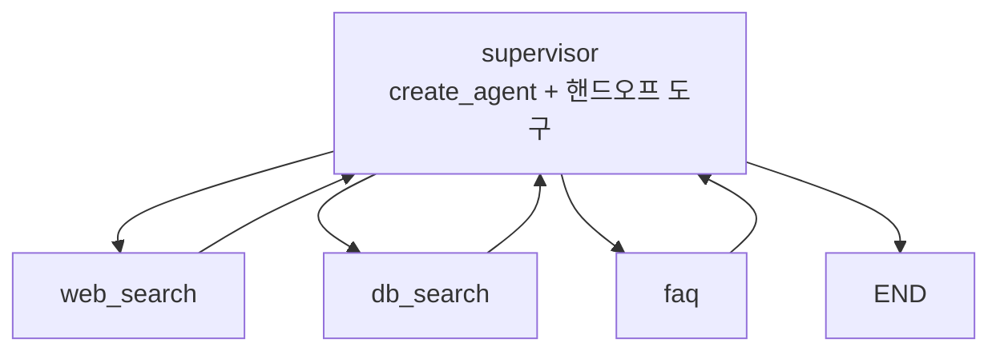
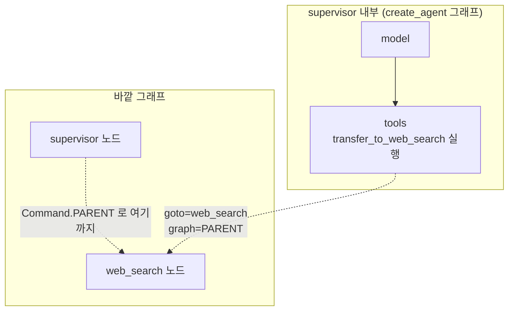

# 7.5 최신 문서 검색 + 내부 DB 검색 + 템플릿 답변 3중 멀티 에이전트 #슈퍼바이저

> **저자 예제** — [`examples/supervisor_agent_triple/`](examples/supervisor_agent_triple) (`handoff_tools.py` · `supervisor_agent.py` · `web_agent.py` · `db_agent.py` · `faq_agent.py` · `make_graph.py` · `setup_documents.py`)
> **공식 문서** — [LangChain · Subagents](https://docs.langchain.com/oss/python/langchain/multi-agent/subagents)

> **여기까지** — `Router` 스키마로 배분하는 슈퍼바이저를 만들었습니다([7.4절](07-04_%EC%9B%B9%ED%8E%98%EC%9D%B4%EC%A7%80%EB%A5%BC%20%EC%9A%94%EC%95%BD%ED%95%B4%EC%84%9C%20%EB%8D%B0%EC%9D%B4%ED%84%B0%EB%B2%A0%EC%9D%B4%EC%8A%A4%EC%97%90%20%EC%A0%80%EC%9E%A5%ED%95%98%EB%8A%94%20%EC%97%90%EC%9D%B4%EC%A0%84%ED%8A%B8%20%23%EC%8A%88%ED%8D%BC%EB%B0%94%EC%9D%B4%EC%A0%80.md)).
> **이 절의 질문** — **에이전트를 도구처럼** 부르면 어떻게 될까?
> **다 읽으면** — [2.2절](../ch02_core-elements/02-02_%EC%97%90%EC%9D%B4%EC%A0%84%ED%8A%B8%EC%9D%98%20%EC%99%B8%EB%B6%80%20%EC%A7%80%EC%8B%9D%20%ED%99%9C%EC%9A%A9%20-%20%EB%8F%84%EA%B5%AC%20%ED%98%B8%EC%B6%9C.md)의 도구 지식이 **에이전트 배분에 그대로 쓰인다**는 걸 알게 됩니다. **동시 실행**도 여기서 나옵니다.

[7.4절](07-04_%EC%9B%B9%ED%8E%98%EC%9D%B4%EC%A7%80%EB%A5%BC%20%EC%9A%94%EC%95%BD%ED%95%B4%EC%84%9C%20%EB%8D%B0%EC%9D%B4%ED%84%B0%EB%B2%A0%EC%9D%B4%EC%8A%A4%EC%97%90%20%EC%A0%80%EC%9E%A5%ED%95%98%EB%8A%94%20%EC%97%90%EC%9D%B4%EC%A0%84%ED%8A%B8%20%23%EC%8A%88%ED%8D%BC%EB%B0%94%EC%9D%B4%EC%A0%80.md)도 슈퍼바이저였습니다. 이 절은 **같은 패턴을 다른 방식으로** 구현합니다. 그 차이가 이 절의 전부입니다.

## 7.5.1 각 에이전트를 도구로 호출하는 슈퍼바이저 패턴

### Router 스키마 대신 핸드오프 도구

[7.4절](07-04_%EC%9B%B9%ED%8E%98%EC%9D%B4%EC%A7%80%EB%A5%BC%20%EC%9A%94%EC%95%BD%ED%95%B4%EC%84%9C%20%EB%8D%B0%EC%9D%B4%ED%84%B0%EB%B2%A0%EC%9D%B4%EC%8A%A4%EC%97%90%20%EC%A0%80%EC%9E%A5%ED%95%98%EB%8A%94%20%EC%97%90%EC%9D%B4%EC%A0%84%ED%8A%B8%20%23%EC%8A%88%ED%8D%BC%EB%B0%94%EC%9D%B4%EC%A0%80.md)에서는 `Router` 하나에 `next: Literal[...]`로 담당자 이름을 받았습니다. 여기서는 **에이전트마다 도구를 하나씩** 만듭니다.

```python
handoff_tools = [
    create_handoff_tool(
        agent_name="web_search",
        description="웹에서 최신 정보를 검색해야 할 때 사용합니다."
    ),
    create_handoff_tool(
        agent_name="db_search",
        description="내부 데이터베이스에서 문서 정보를 검색해야 할 때 사용합니다."
    ),
    create_handoff_tool(
        agent_name="faq",
        description="자주 묻는 질문에 대해 답변해야 할 때 사용합니다."
    )
]

supervisor = create_agent(model=model, tools=handoff_tools, system_prompt=get_system_prompt())
```

**슈퍼바이저가 그냥 `create_agent`입니다.** 도구가 함수가 아니라 에이전트일 뿐, [6.4절](../ch06_single-agent/06-04_create_agent%20%EC%83%81%EC%84%B8%20%EA%B5%AC%EC%A1%B0%20%EC%9D%B4%ED%95%B4%ED%95%98%EA%B8%B0.md)에서 만든 것과 구조가 같습니다.

| | 7.4 Router 방식 | 7.5 핸드오프 도구 방식 |
| :--- | :--- | :--- |
| 슈퍼바이저 | 직접 짠 노드 함수 | **`create_agent` 그대로** |
| 담당자 선택 | `next` 필드 값 | **어느 도구를 부르는가** |
| 넘기는 내용 | 상태 전체 | **`query` 인자로 따로** |
| 동시에 여러 명 | 불가 | **가능** (아래) |
| 에이전트 추가 | 프롬프트 + `Literal` 수정 | **도구 하나 추가** |

**[2.2절](../ch02_core-elements/02-02_%EC%97%90%EC%9D%B4%EC%A0%84%ED%8A%B8%EC%9D%98%20%EC%99%B8%EB%B6%80%20%EC%A7%80%EC%8B%9D%20%ED%99%9C%EC%9A%A9%20-%20%EB%8F%84%EA%B5%AC%20%ED%98%B8%EC%B6%9C.md)에서 배운 것이 그대로 재사용됩니다.** 도구 설명이 곧 "언제 이 에이전트에게 넘길지"입니다. 도구를 잘 설명하는 법을 알면 에이전트 배분도 잘하게 됩니다.

### `query`를 따로 받는 것이 중요합니다

```python
def handoff_to_agent(query: str, runtime: ToolRuntime) -> Command:
    """
    Args:
        query: 에이전트에게 전달할 쿼리 (최대한 원본 쿼리를 유지)
    """
```

[7.2절](07-02_%ED%95%B8%EB%93%9C%EC%98%A4%ED%94%84%EB%A5%BC%20%EC%9C%84%ED%95%9C%20%EA%B8%B0%EB%8A%A5%20%EC%82%B4%ED%8E%B4%EB%B3%B4%EA%B8%B0.md) 마지막에서 "무엇을 넘길지가 진짜 문제"라고 했습니다. 여기서는 **슈퍼바이저가 넘길 질문을 직접 써서** 넘깁니다.

그리고 실제로 받는 쪽은 **그 `query` 하나만** 씁니다.

```python
def create_faq_agent(state: AgentState) -> Command:
    query = state.get("query", "")
    agent_state = {"messages": [HumanMessage(content=query)]}   # 대화 전체가 아님
    result = faq_agent.invoke(agent_state)
```

**대화 이력 전체를 넘기지 않습니다.** [3.2절](../ch03_architecture/03-02_%EB%A9%80%ED%8B%B0%20%EC%97%90%EC%9D%B4%EC%A0%84%ED%8A%B8.md)에서 말한 "컨텍스트를 나눈다"가 여기서 실제로 일어납니다. FAQ 에이전트는 웹 검색 결과를 볼 필요가 없습니다.

> **`(최대한 원본 쿼리를 유지)`** 라는 괄호에 주목하세요. 슈퍼바이저가 질문을 너무 많이 고쳐 쓰면 원래 의도가 사라집니다. 이 한 줄이 그걸 막습니다.

## 7.5.2 [실습] 슈퍼바이저 에이전트 그래프 생성하기

[`make_graph.py`](examples/supervisor_agent_triple/make_graph.py)

```python
graph_builder = StateGraph(MessagesState)

agent_names = list(agents.keys())
graph_builder.add_node(
    "supervisor",
    supervisor,
    destinations=tuple(agent_names) + (END,)     # ← 갈 수 있는 곳 명시
)
graph_builder.add_node("web_search", agents["web_search"])
graph_builder.add_node("db_search", agents["db_search"])
graph_builder.add_node("faq", agents["faq"])

graph_builder.set_entry_point("supervisor")

for agent_name in agents.keys():
    graph_builder.add_edge(agent_name, "supervisor")     # 전부 슈퍼바이저로 복귀
```

**`destinations=`** 는 [7.2절](07-02_%ED%95%B8%EB%93%9C%EC%98%A4%ED%94%84%EB%A5%BC%20%EC%9C%84%ED%95%9C%20%EA%B8%B0%EB%8A%A5%20%EC%82%B4%ED%8E%B4%EB%B3%B4%EA%B8%B0.md)의 타입 힌트와 같은 역할입니다. `supervisor`는 `create_agent`가 만든 그래프라 타입 힌트를 붙일 수 없으니, **인자로 갈 곳을 알려 줍니다.** 그래야 스튜디오에 화살표가 그려집니다.

`set_entry_point("supervisor")`는 `add_edge(START, "supervisor")`와 같습니다.



## 7.5.3 [실습] 에이전트로 작업을 핸드오프하는 도구 생성하기

[`handoff_tools.py`](examples/supervisor_agent_triple/handoff_tools.py)가 이 절에서 가장 어려운 부분입니다. 세 가지를 이해하면 됩니다.

### ① 도구를 찍어 내는 함수

```python
def create_handoff_tool(agent_name: str, description: str):
    tool_name = f"transfer_to_{agent_name}"

    @tool(tool_name, description=description)
    def handoff_to_agent(query: str, runtime: ToolRuntime) -> Command:
        ...
    return handoff_to_agent
```

**함수 안에서 도구를 만들어 돌려줍니다.** 에이전트가 늘어도 `create_handoff_tool("새이름", "설명")` 한 줄이면 됩니다. 이름 규칙이 `transfer_to_○○`로 고정된 것도 뒤에서 쓰입니다.

### ② `Command.PARENT` — 한 층 위로 나갑니다

```python
return Command(
    goto=agent_name,
    graph=Command.PARENT,
    update={**state, "messages": handoff_messages, "query": query}
)
```

[7.2절](07-02_%ED%95%B8%EB%93%9C%EC%98%A4%ED%94%84%EB%A5%BC%20%EC%9C%84%ED%95%9C%20%EA%B8%B0%EB%8A%A5%20%EC%82%B4%ED%8E%B4%EB%B3%B4%EA%B8%B0.md)에서 예고한 것입니다. **이 도구는 슈퍼바이저 에이전트 그래프 "안"에서 실행됩니다.** 그런데 가려는 곳(`web_search` 노드)은 **바깥 그래프**에 있습니다.



**`graph=Command.PARENT`가 없으면** 슈퍼바이저 내부 그래프에서 `web_search`라는 노드를 찾다가 실패합니다.

### ③ 여러 명에게 동시에 — `Send`

```python
if len(last_ai_message.tool_calls) > 1:
    send_list = []
    for tool_call in last_ai_message.tool_calls:
        if tool_call["name"].startswith("transfer_to_"):
            target_agent = tool_call["name"].replace("transfer_to_", "")
            ...
            send_list.append(Send(target_agent, {...}))

    return Command(graph=Command.PARENT, goto=send_list)
```

**슈퍼바이저가 도구를 여러 개 한 번에 부르면 여러 에이전트를 동시에 돌립니다.**

"우리 회사 휴가 정책 알려 주고, 관련 최신 법 개정도 찾아 줘" 같은 요청이면 `faq`와 `web_search`를 **동시에** 보낼 수 있습니다. 순서대로 하면 두 배 걸립니다.

작은 예제로 확인했습니다. **`worker` 노드는 하나뿐**인데 `Send`를 세 개 만들어 넘겼습니다.

```python
def dispatch(state):
    return [Send("worker", {"item": it}) for it in state["items"]]

b.add_conditional_edges(START, dispatch, ["worker"])
```

> **실측 (2026-08-31 · langgraph 1.2.11)**

```
입력 3개 -> ['A 처리됨', 'B 처리됨', 'C 처리됨']
```

**노드 하나가 세 번 실행되고 결과가 리듀서로 합쳐졌습니다.** `Send`의 두 번째 인자는 **그 실행에만 주는 입력**이라, 각 worker는 자기 몫(`{"item": "A"}`)만 봅니다.

> **결과를 받을 칸에는 리듀서가 반드시 필요합니다.** 위 예제의 `results`는 `Annotated[list, add]`입니다. 리듀서가 없으면 [5.2절](../ch05_langgraph-basics/05-02_%EB%9E%AD%EA%B7%B8%EB%9E%98%ED%94%84%20%EA%B8%B0%EB%B3%B8%20%EA%B0%9C%EB%85%90%20%EC%9D%B4%ED%95%B4%ED%95%98%EA%B3%A0%20%EC%A0%81%EC%9A%A9%ED%95%98%EA%B8%B0.md)에서 본 대로 **마지막 하나만 남습니다.** 병렬로 돌린 보람이 사라집니다.

| | `Command(goto="…")` | `Send(...)` |
| :--- | :--- | :--- |
| 보내는 대상 | 한 곳 | **여러 곳 동시** |
| 전달하는 상태 | 공유 상태 | **각자에게 다른 상태** |

`Send`는 대상마다 **다른 입력을 만들어 보낼 수 있습니다.** 그래서 각 에이전트가 자기 `query`만 받습니다.

> **[6.1절](../ch06_single-agent/06-01_%EB%8F%84%EA%B5%AC%EB%A5%BC%20%ED%98%B8%EC%B6%9C%ED%95%98%EB%8A%94%20%EC%97%90%EC%9D%B4%EC%A0%84%ED%8A%B8%20%EC%9D%B4%ED%95%B4%ED%95%98%EA%B8%B0.md)의 `tool_call_id` 짝짓기 규칙 때문에** 코드가 복잡해집니다. 도구 호출이 여러 개인데 하나만 처리하면 나머지 요청에 대한 `ToolMessage`가 없어서 오류가 납니다. 그래서 각 `tool_call`마다 짝이 되는 `ToolMessage`를 만들어 붙입니다.

### 돌아올 때도 메시지를 만듭니다

```python
def create_handoff_messages(agent_name: str):
    ai_message = AIMessage(
        content=f"Supervisor로 이동합니다.",
        name=agent_name,
        tool_calls=[{"name": "transfer_back_to_supervisor", "args": {}, "id": tool_call_id}]
    )
    tool_message = ToolMessage(
        content=f"supervisor로 성공적으로 작업을 전달했습니다.",
        name="transfer_back_to_supervisor",
        tool_call_id=tool_call_id,
    )
    return ai_message, tool_message
```

**실제로 도구를 부른 적이 없는데 도구 호출 메시지를 지어내 붙입니다.** 왜일까요.

슈퍼바이저 시스템 프롬프트를 보면 답이 있습니다.

```
- 대화 기록에서 "Supervisor로 이동합니다."라는 메시지를 찾으세요.
- 이 메시지의 **바로 직전 메시지**가 해당 에이전트가 제공한 실제 결과입니다.
```

**"Supervisor로 이동합니다"가 구분선 역할**을 합니다. 여러 에이전트의 결과가 한 목록에 섞여 쌓이니, 어디까지가 누구 결과인지 표시가 필요합니다.

> **7.3절의 "최종 답변" 약속어와 같은 발상**입니다. 문자열로 경계를 표시하는 것이고, 같은 이유로 깨지기 쉽습니다. 에이전트가 우연히 저 문장을 쓰면 꼬입니다.

## 7.5.4 ~ 7.5.6 세 에이전트 만들기

셋 다 **같은 틀**입니다.

```python
xxx_agent = create_agent(model=model, tools=[...], system_prompt="...")

def create_xxx_agent(state: AgentState) -> Command:
    query = state.get("query", "")
    result = xxx_agent.invoke({"messages": [HumanMessage(content=query)]})
    ai_message, tool_message = create_handoff_messages("xxx")
    result["messages"].extend([ai_message, tool_message])
    return Command(update={"messages": result["messages"]}, goto=END)
```

| 에이전트 | 도구 | 성격 |
| :--- | :--- | :--- |
| **web_search** | Tavily | 외부 최신 정보 ([6.2절](../ch06_single-agent/06-02_%EC%9B%B9%20%EA%B2%80%EC%83%89%20%EC%97%90%EC%9D%B4%EC%A0%84%ED%8A%B8%20%EB%A7%8C%EB%93%A4%EA%B8%B0.md)) |
| **db_search** | 벡터 검색 | 내부 문서 ([6.5절](../ch06_single-agent/06-05_RAG%EB%A5%BC%20%EC%9C%84%ED%95%9C%20%EC%97%90%EC%9D%B4%EC%A0%84%ED%8A%B8%20%EB%A7%8C%EB%93%A4%EA%B8%B0.md)) |
| **faq** | **하드코딩된 문자열 반환** | 고정 답변 |

### FAQ 에이전트가 흥미롭습니다

```python
@tool
def get_vacation_policy() -> str:
    """휴가 정책 정보를 제공합니다."""
    return """
    **휴가 정책**
    1. 연차 휴가: 입사 1년 후 15일 부여
    …
    """
```

**LLM도 검색도 없습니다.** 정해진 문자열을 그대로 돌려줍니다.

이게 좋은 설계입니다. 사규처럼 **답이 정해진 것을 LLM에게 생성시키면 환각이 납니다.** 휴가 일수를 지어내면 큰일이죠. 고정된 답은 고정으로 두고, **LLM은 "어느 답을 꺼낼지" 고르는 일만** 합니다.

> [1.4절](../ch01_llm-decision/01-04_LLM%20%EA%B8%B0%EB%B0%98%20%EC%97%90%EC%9D%B4%EC%A0%84%ED%8A%B8%20%EC%8B%9C%EC%8A%A4%ED%85%9C%2C%20%EC%9D%B4%EB%9F%B0%20%EA%B5%AC%EC%A1%B0%EB%A1%9C%20%EC%84%A4%EA%B3%84%EB%90%9C%EB%8B%A4.md)에서 "LLM을 안 쓰는 게 아니라 판단만 맡긴다"고 한 것의 극단적인 예입니다.

`db_search`용 문서는 [`setup_documents.py`](examples/supervisor_agent_triple/setup_documents.py)로 미리 넣어 둡니다([`documents/`](examples/supervisor_agent_triple/documents) 폴더에 샘플 `.docx`가 있습니다).

## 7.5.7 [실습] 다양한 케이스에 대응하는 멀티 에이전트 챗봇 테스트하기

**세 가지 경로를 다 시험해 보는 것**이 이 절의 목적입니다.

| 질문 유형 | 기대 경로 |
| :--- | :--- |
| "연차 며칠이야?" | `faq` 하나만 |
| "최근 AI 규제 동향은?" | `web_search` 하나만 |
| "우리 계약서에 있는 조항 찾아줘" | `db_search` 하나만 |
| "휴가 정책이랑 관련 법 개정 같이 알려줘" | **`faq` + `web_search` 동시** |

마지막이 `Send` 경로입니다. 도구 호출이 두 개 나오는지 스튜디오에서 확인해 보세요.

> **최종 답변 규칙이 유별납니다.** 시스템 프롬프트가 "에이전트 결과를 **요약·축약·편집 없이 그대로 복사**"하라고 지시합니다. [7.4절](07-04_%EC%9B%B9%ED%8E%98%EC%9D%B4%EC%A7%80%EB%A5%BC%20%EC%9A%94%EC%95%BD%ED%95%B4%EC%84%9C%20%EB%8D%B0%EC%9D%B4%ED%84%B0%EB%B2%A0%EC%9D%B4%EC%8A%A4%EC%97%90%20%EC%A0%80%EC%9E%A5%ED%95%98%EB%8A%94%20%EC%97%90%EC%9D%B4%EC%A0%84%ED%8A%B8%20%23%EC%8A%88%ED%8D%BC%EB%B0%94%EC%9D%B4%EC%A0%80.md)이 "자연스럽게 종합하라"고 한 것과 정반대입니다.
>
> 이유는 **출처 보존**입니다. PDF 파일명·페이지 번호를 슈퍼바이저가 다시 쓰면서 날려 버리면 근거를 잃습니다. [3.2절](../ch03_architecture/03-02_%EB%A9%80%ED%8B%B0%20%EC%97%90%EC%9D%B4%EC%A0%84%ED%8A%B8.md)의 **오류 전파**를 막는 방법이기도 합니다. 다시 쓰지 않으면 왜곡될 일도 없으니까요.

## 요약 및 비유

**전화 교환대**입니다. 교환원은 상대를 **번호로 지정해 연결**하고(핸드오프 도구), 용건을 요약해 전달하며(`query`), 여러 곳에 동시에 연결할 수도 있습니다(`Send`). 통화가 끝나면 **"교환대로 돌아갑니다"라는 신호**로 구간을 표시합니다.

| 개념 | 교환대 비유 | 기술적 의미 |
| :--- | :--- | :--- |
| **핸드오프 도구** | 부서별 단축번호 | `transfer_to_○○` |
| **도구 설명** | 어떤 용건에 어느 번호인지 | 배분 판단 근거 |
| **`query`** | 용건만 요약해 전달 | 대화 전체를 안 넘김 |
| **`Command.PARENT`** | 내선이 아니라 외선으로 | 상위 그래프의 노드로 |
| **`Send`** | 3자 통화 연결 | 여러 에이전트 동시 실행 |
| **`tool_call_id` 짝** | 요청 건마다 접수증 | 짝이 없으면 오류 |
| **"Supervisor로 이동합니다"** | 통화 종료 신호음 | 결과 경계 표시 |
| **FAQ 하드코딩** | 안내 멘트 녹음 재생 | 고정 답변, 환각 차단 |
| **원문 그대로 복사** | 녹취를 그대로 전달 | 출처 보존 |

## 결론

* 같은 슈퍼바이저 패턴이라도 **Router 스키마(7.4)** 와 **핸드오프 도구(7.5)** 두 방식이 있습니다.
* 핸드오프 도구 방식은 슈퍼바이저가 **`create_agent` 그대로**입니다. 도구가 함수 대신 에이전트일 뿐입니다.
* **`query`를 따로 받아 그것만 넘깁니다.** 대화 전체를 안 넘기므로 컨텍스트가 실제로 나뉩니다.
* **`graph=Command.PARENT`** 는 도구가 슈퍼바이저 내부에서 실행되기 때문에 필요합니다. 가려는 노드는 바깥 그래프에 있습니다.
* **`Send`로 여러 에이전트를 동시에** 돌릴 수 있습니다. `Command`는 한 곳, `Send`는 여러 곳입니다.
* 도구 호출이 여러 개면 **각각에 짝이 되는 `ToolMessage`를 만들어야** 합니다(6.1절의 `tool_call_id` 규칙).
* **"Supervisor로 이동합니다"는 결과 경계 표시**입니다. 7.3절의 약속어와 같은 발상이고 같은 약점이 있습니다.
* **FAQ 에이전트는 문자열을 하드코딩합니다.** 답이 정해진 것을 LLM에게 생성시키면 환각이 납니다.
* 7.5의 최종 답변은 **원문 그대로 복사**입니다. 출처를 지키고 오류 전파를 막기 위해서입니다.

---

## 다음 절로

슈퍼바이저 두 방식을 다 봤습니다. **짧은 작업에는 잘 돕니다.**

**그런데 이런 걸 시키면 어떨까요?**

> "AI 에이전트 시장 보고서를 써 줘."

조사도 하고, 목차도 잡고, 글도 써야 합니다. **단계가 많습니다.** 슈퍼바이저가 매번 "지금 누가 할까"만 보면 **중간에 길을 잃습니다.** → **[7.6절](07-06_%EC%9E%90%EB%A3%8C%20%EC%A1%B0%EC%82%AC%20%EC%A0%84%EB%AC%B8%EA%B0%80%20%2B%20%EB%AC%B8%EC%84%9C%20%EC%9E%91%EC%84%B1%20%EC%A0%84%EB%AC%B8%EA%B0%80%20%EC%97%90%EC%9D%B4%EC%A0%84%ED%8A%B8%20%23%ED%94%8C%EB%9E%98%EB%8B%9D%20%EA%B8%B0%EB%B0%98%20%EC%8A%88%ED%8D%BC%EB%B0%94%EC%9D%B4%EC%A0%80.md)**

---

[⬅ 7.4](07-04_%EC%9B%B9%ED%8E%98%EC%9D%B4%EC%A7%80%EB%A5%BC%20%EC%9A%94%EC%95%BD%ED%95%B4%EC%84%9C%20%EB%8D%B0%EC%9D%B4%ED%84%B0%EB%B2%A0%EC%9D%B4%EC%8A%A4%EC%97%90%20%EC%A0%80%EC%9E%A5%ED%95%98%EB%8A%94%20%EC%97%90%EC%9D%B4%EC%A0%84%ED%8A%B8%20%23%EC%8A%88%ED%8D%BC%EB%B0%94%EC%9D%B4%EC%A0%80.md) · [Chapter 07](README.md) · [7.6 ➡](07-06_%EC%9E%90%EB%A3%8C%20%EC%A1%B0%EC%82%AC%20%EC%A0%84%EB%AC%B8%EA%B0%80%20%2B%20%EB%AC%B8%EC%84%9C%20%EC%9E%91%EC%84%B1%20%EC%A0%84%EB%AC%B8%EA%B0%80%20%EC%97%90%EC%9D%B4%EC%A0%84%ED%8A%B8%20%23%ED%94%8C%EB%9E%98%EB%8B%9D%20%EA%B8%B0%EB%B0%98%20%EC%8A%88%ED%8D%BC%EB%B0%94%EC%9D%B4%EC%A0%80.md)
