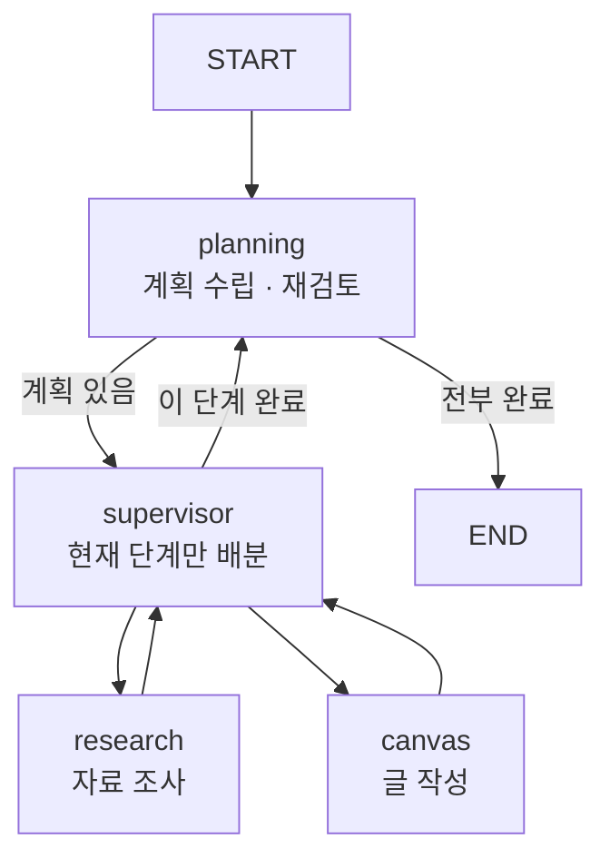
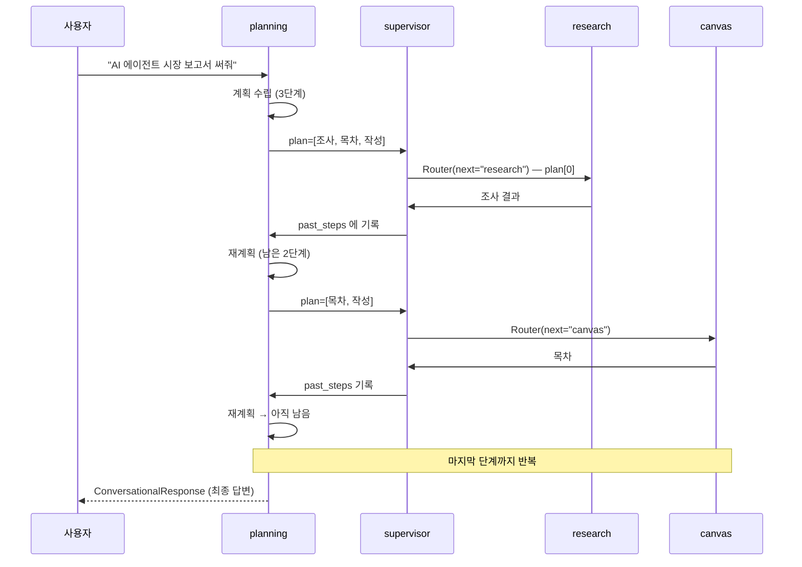

# 7.6 자료 조사 전문가 + 문서 작성 전문가 에이전트 #플래닝 기반 슈퍼바이저

> **저자 예제** — [`examples/supervisor_planning_agent/`](examples/supervisor_planning_agent) (`settings.py` · `planning_agent.py` · `supervisor_agent.py` · `research_agent.py` · `canvas_agent.py` · `make_graph.py`)
> **공식 문서** — [LangChain · Subagents](https://docs.langchain.com/oss/python/langchain/multi-agent/subagents) · [Subgraphs](https://docs.langchain.com/oss/python/langgraph/use-subgraphs)

> **여기까지** — 슈퍼바이저를 두 가지 방식으로 만들어 봤습니다(7.4 · 7.5절).
> **이 절의 질문** — **긴 작업**에서 슈퍼바이저가 길을 잃는다면?
> **다 읽으면** — 7장에서 **가장 복잡한 구조**를 읽게 됩니다. 11장 최종 프로젝트의 원형입니다.

[7.4절](07-04_%EC%9B%B9%ED%8E%98%EC%9D%B4%EC%A7%80%EB%A5%BC%20%EC%9A%94%EC%95%BD%ED%95%B4%EC%84%9C%20%EB%8D%B0%EC%9D%B4%ED%84%B0%EB%B2%A0%EC%9D%B4%EC%8A%A4%EC%97%90%20%EC%A0%80%EC%9E%A5%ED%95%98%EB%8A%94%20%EC%97%90%EC%9D%B4%EC%A0%84%ED%8A%B8%20%23%EC%8A%88%ED%8D%BC%EB%B0%94%EC%9D%B4%EC%A0%80.md)·[7.5절](07-05_%EC%B5%9C%EC%8B%A0%20%EB%AC%B8%EC%84%9C%20%EA%B2%80%EC%83%89%20%2B%20%EB%82%B4%EB%B6%80%20DB%20%EA%B2%80%EC%83%89%20%2B%20%ED%85%9C%ED%94%8C%EB%A6%BF%20%EB%8B%B5%EB%B3%80%203%EC%A4%91%20%EB%A9%80%ED%8B%B0%20%EC%97%90%EC%9D%B4%EC%A0%84%ED%8A%B8%20%23%EC%8A%88%ED%8D%BC%EB%B0%94%EC%9D%B4%EC%A0%80.md)의 슈퍼바이저는 매번 **"지금 누가 할까"** 만 생각했습니다. 짧은 작업에는 충분하지만, **"보고서를 써 줘"** 같은 긴 작업에서는 문제가 생깁니다.

> 조사만 계속하다 글을 안 쓰거나, 글을 쓰다 자료가 부족해 되돌아가거나, **지금 어디까지 왔는지 잊어버립니다.**

원인은 하나입니다. **슈퍼바이저가 "전체 계획"과 "지금 누가 할지"를 동시에 판단**하려니 감당이 안 되는 것입니다.

**둘을 나눕니다.**

## 7.6.1 [실습] 전체 에이전트 구조 이해하고 구현하기



**층이 하나 더 생겼습니다.**

| 노드 | 책임 | 안 하는 일 |
| :--- | :--- | :--- |
| `planning` | **전체 계획**을 세우고, 끝날 때마다 다시 검토 | 누가 할지는 안 정함 |
| `supervisor` | **지금 이 단계**를 누가 할지 | 전체 진행은 안 봄 |
| `research` / `canvas` | 실제 작업 | |

[`make_graph.py`](examples/supervisor_planning_agent/make_graph.py)를 보면 이 관계가 그대로 적혀 있습니다.

```python
graph_builder = StateGraph(State, input_schema=MessagesState, output_schema=State)

graph_builder.add_node("planning", planning_node, destinations=["supervisor", END])
graph_builder.add_node("supervisor", supervisor_node, destinations=["canvas", "research", "planning"])
graph_builder.add_node("canvas", canvas_node, destinations=["supervisor"])
graph_builder.add_node("research", research_node, destinations=["supervisor"])

graph_builder.add_edge(START, "planning")
```

**엣지가 `START → planning` 하나뿐입니다.** 나머지는 전부 [7.2절](07-02_%ED%95%B8%EB%93%9C%EC%98%A4%ED%94%84%EB%A5%BC%20%EC%9C%84%ED%95%9C%20%EA%B8%B0%EB%8A%A5%20%EC%82%B4%ED%8E%B4%EB%B3%B4%EA%B8%B0.md)의 `Command`이고, `destinations=`가 그림을 그려 줍니다.

### 상태에 두 칸이 늘었습니다

[`settings.py`](examples/supervisor_planning_agent/settings.py)

```python
class State(MessagesState):
    plan: List[str]              # 남은 단계들
    past_steps: List[tuple]      # (완료한 작업, 그 결과)
```

**이 두 칸이 이 구조의 전부**라고 해도 됩니다.

| 키 | 무엇을 담나 | 누가 쓰나 |
| :--- | :--- | :--- |
| `plan` | 아직 안 한 단계 목록 | `planning`이 만들고, `supervisor`가 `plan[0]`만 봄 |
| `past_steps` | 완료한 작업과 결과 | `supervisor`가 채우고, `planning`이 재검토에 씀 |

[2.3절](../ch02_core-elements/02-03_%EC%97%90%EC%9D%B4%EC%A0%84%ED%8A%B8%EC%9D%98%20%EA%B8%B0%EC%96%B5%EB%A0%A5%20-%20%EB%A9%94%EB%AA%A8%EB%A6%AC.md)에서 말한 "메모리는 무엇을 다시 넣을지의 문제"가 여기서 잘 보입니다. **메시지를 전부 다시 읽는 대신 `past_steps` 요약본을 봅니다.**

## 7.6.2 [실습] 작업의 계획을 수립하는 에이전트 만들기

[`planning_agent.py`](examples/supervisor_planning_agent/planning_agent.py)의 `planning_node`는 **두 가지 일을 상황에 따라** 합니다.

```python
if not plan:
    # 첫 진입 — 계획 수립
else:
    # 작업 완료 후 복귀 — 계획 재검토
```

**같은 노드가 처음과 나중에 다른 일을 합니다.** `plan`이 비어 있는지로 구분합니다.

### 계획이거나, 그냥 답변이거나

```python
class Plan(BaseModel):
    steps: List[str] = Field(description="따라야 할 단계들, 정렬된 순서여야 함")

class ConversationalResponse(BaseModel):
    response: str = Field(description="사용자의 질문에 대한 대화형 응답")

class PlanningResponse(BaseModel):
    final_output: Union[Plan, ConversationalResponse]
```

**`Union`이 핵심입니다.** [6.4.4절](../ch06_single-agent/06-04_create_agent%20%EC%83%81%EC%84%B8%20%EA%B5%AC%EC%A1%B0%20%EC%9D%B4%ED%95%B4%ED%95%98%EA%B8%B0.md)의 구조화 출력인데, **둘 중 하나를 고르게** 합니다.

```python
if isinstance(result.final_output, ConversationalResponse):
    return Command(goto=END, update={"messages": [response_message]})
```

"안녕하세요" 같은 인사에까지 계획을 세우면 낭비입니다. **간단한 입력은 바로 답하고 끝냅니다.** 프롬프트에도 명시돼 있습니다.

```
여러 단계의 작업이 필요없는 간단한 입력의 경우, 바로 답변할 수 있습니다.
```

> [5.3.2절](../ch05_langgraph-basics/05-03_%EB%9E%AD%EA%B7%B8%EB%9E%98%ED%94%84%EB%A1%9C%20%EC%97%90%EC%9D%B4%EC%A0%84%ED%8A%B8%20%EC%84%A4%EA%B3%84%ED%95%98%EA%B3%A0%20%EA%B5%AC%ED%98%84%ED%95%98%EA%B8%B0.md)의 **가드레일과 같은 발상**입니다. 비싼 경로에 들어가기 전에 걸러 냅니다.

### 계획 프롬프트가 제약을 겁니다

```
단계의 개수는 2~5개 사이로 유지하세요.
하나의 태스크에 너무 많은 양의 작업이 몰리지 않도록 주의하세요.
각 단계가 독립적으로 실행 가능하도록 구성하세요.
불필요한 단계는 추가하지 말고, 최종 단계의 결과가 사용자가 원하는 최종 답변이 되도록 하세요.
```

**"2~5개"** 라는 숫자가 중요합니다. 상한이 없으면 모델이 20단계짜리 계획을 세웁니다. 단계마다 LLM 호출이 최소 3번(supervisor → agent → supervisor)이니 **20단계면 60번**입니다.

**"최종 단계의 결과가 최종 답변이 되도록"** 도 실용적입니다. 마지막에 따로 종합하는 단계를 안 만들어도 되게 합니다.

### 재계획 — 매번 계획을 다시 씁니다

```python
replanner_prompt = ChatPromptTemplate.from_template(
    """…
    현재 계획: {plan}
    현재까지 완료한 작업들: {past_steps}
    …
    **만약 아직 더 수행해야 할 작업이 있다면:**
    - Plan으로 **남은 작업들만** 포함한 계획을 제공하세요
    - 이미 완료된 작업은 포함하지 마세요"""
)
```

**단순히 `plan.pop(0)`을 하지 않습니다.** 매번 LLM에게 남은 계획을 다시 쓰게 합니다.

| | 단순 pop | 재계획 |
| :--- | :--- | :--- |
| 비용 | 없음 | LLM 호출 1회 |
| 중간에 상황이 바뀌면 | 대응 못 함 | **계획을 고칠 수 있음** |
| 조사 결과가 예상과 다르면 | 그대로 진행 | 남은 단계를 다시 설계 |

**이것이 플래닝 패턴의 값어치입니다.** 계획을 세워 두되 **고정하지 않습니다.**

> [2.1절](../ch02_core-elements/02-01_%EC%97%90%EC%9D%B4%EC%A0%84%ED%8A%B8%EC%9D%98%20%EC%B6%94%EB%A1%A0%20%EB%8A%A5%EB%A0%A5%20-%20ReAct%EC%99%80%20Reflection.md)의 **Reflection**이 여기서도 보입니다. "지금까지 한 것이 충분한가"를 매 단계 묻고 있습니다. 다만 대상이 결과물이 아니라 **계획**입니다.

## 7.6.3 [실습] 슈퍼바이저 에이전트 만들기

[`supervisor_agent.py`](examples/supervisor_planning_agent/supervisor_agent.py)의 슈퍼바이저는 **눈앞의 한 단계만** 봅니다.

```python
try:
    task_description = plan[0]
except IndexError:
    return Command(goto="planning", update={})
```

**`plan[0]` 하나만 꺼냅니다.** 비어 있으면 계획 담당에게 돌려보냅니다.

시스템 프롬프트도 그렇게 만들어져 있습니다.

```
당신은 멀티 에이전트 시스템의 수퍼바이저입니다. **오직 현재 작업만 관리**하세요.

## 현재 작업 (이것만 처리하세요):
{task_description}
```

**프롬프트에 지금 할 일 하나만 넣습니다.** 전체 계획을 안 보여 줍니다. [3.2절](../ch03_architecture/03-02_%EB%A9%80%ED%8B%B0%20%EC%97%90%EC%9D%B4%EC%A0%84%ED%8A%B8.md)에서 말한 "컨텍스트를 나눈다"가 **역할 분리로 자연스럽게 달성**됩니다.

라우팅은 [7.4절](07-04_%EC%9B%B9%ED%8E%98%EC%9D%B4%EC%A7%80%EB%A5%BC%20%EC%9A%94%EC%95%BD%ED%95%B4%EC%84%9C%20%EB%8D%B0%EC%9D%B4%ED%84%B0%EB%B2%A0%EC%9D%B4%EC%8A%A4%EC%97%90%20%EC%A0%80%EC%9E%A5%ED%95%98%EB%8A%94%20%EC%97%90%EC%9D%B4%EC%A0%84%ED%8A%B8%20%23%EC%8A%88%ED%8D%BC%EB%B0%94%EC%9D%B4%EC%A0%80.md)과 같은 `Router` 스키마입니다.

```python
class Router(TypedDict):
    """작업을 수행할 에이전트를 라우팅합니다."""
    next: Literal["canvas", "research"]
```

### 완료 판단과 `past_steps` 기록

```python
else:   # tool_calls 가 없음 = 이 단계는 끝났다
    for msg in reversed(messages):
        if hasattr(msg, 'name') and msg.name in ["canvas_agent", "research_agent"]:
            supervisor_final_message = f"작업 '{task_description}'이 완료되었습니다.\n\n작업 결과:\n{msg.content}"
            break

    updated_past_steps = past_steps + [(task_description, supervisor_final_message)]
    return Command(goto="planning", update={"past_steps": updated_past_steps, ...})
```

**`tool_calls`가 없으면 이 단계가 끝난 것**입니다([7.4절](07-04_%EC%9B%B9%ED%8E%98%EC%9D%B4%EC%A7%80%EB%A5%BC%20%EC%9A%94%EC%95%BD%ED%95%B4%EC%84%9C%20%EB%8D%B0%EC%9D%B4%ED%84%B0%EB%B2%A0%EC%9D%B4%EC%8A%A4%EC%97%90%20%EC%A0%80%EC%9E%A5%ED%95%98%EB%8A%94%20%EC%97%90%EC%9D%B4%EC%A0%84%ED%8A%B8%20%23%EC%8A%88%ED%8D%BC%EB%B0%94%EC%9D%B4%EC%A0%80.md)과 같은 규칙). 뒤에서부터 훑어 **작업자가 남긴 마지막 메시지**를 찾아 `past_steps`에 쌓고 계획 담당에게 돌아갑니다.

> **프롬프트에 중복 실행 방지 문구가 있습니다.**
> ```
> **research_agent 혹은 canvas_agent가 이미 현재 작업을 완료했는지 판단**하고,
> 완료된 경우 또 다시 에이전트를 호출하지 말고 planning으로 돌아가세요.
> ```
> 같은 단계를 두 번 시키는 사고가 실제로 나서 넣은 방어책으로 보입니다. **`supervisor → agent → supervisor` 순환에서 흔한 문제**입니다.

## 7.6.4 · 7.6.5 자료 조사 / 보고서 작성 에이전트

둘 다 `create_agent` 기반이고 **끝나면 `supervisor`로 돌아갑니다.**

| 에이전트 | 담당 | 도구 |
| :--- | :--- | :--- |
| `research` | 웹 검색 기반 조사 | Tavily ([6.2절](../ch06_single-agent/06-02_%EC%9B%B9%20%EA%B2%80%EC%83%89%20%EC%97%90%EC%9D%B4%EC%A0%84%ED%8A%B8%20%EB%A7%8C%EB%93%A4%EA%B8%B0.md)) |
| `canvas` | 글·목차 작성, 파일 저장 | 파일 쓰기 ([6.3절](../ch06_single-agent/06-03_%EC%BD%94%EB%94%A9%20%EC%97%90%EC%9D%B4%EC%A0%84%ED%8A%B8%20%EB%A7%8C%EB%93%A4%EA%B8%B0.md)) |

**전문성으로 나눈 것**이 [3.3절](../ch03_architecture/03-03_%EC%96%B4%EB%96%A4%20%EC%97%90%EC%9D%B4%EC%A0%84%ED%8A%B8%EB%A5%BC%20%EC%84%A4%EA%B3%84%ED%95%B4%EC%95%BC%20%ED%95%A0%EA%B9%8C.md)의 좋은 분리 기준에 해당합니다. 조사와 작성은 잘하는 방식이 다릅니다 — 조사는 넓게 훑고, 작성은 깊게 다듬습니다.

## 7.6.6 [실습] 알아서 자료 조사하고 보고서 자동 작성하기



**한 단계마다 LLM이 최소 4번 불립니다** — planning(재계획) → supervisor(배분) → agent(작업) → supervisor(완료 판단). 3단계 계획이면 12번이 넘습니다.

> **이것이 [3.2절](../ch03_architecture/03-02_%EB%A9%80%ED%8B%B0%20%EC%97%90%EC%9D%B4%EC%A0%84%ED%8A%B8.md)에서 말한 대가의 최대치**입니다. 플래닝 층을 얹으면 긴 작업에서 길을 잃지 않는 대신 호출이 크게 늘어납니다. **짧은 작업에 이 구조를 쓰면 손해**입니다. 그래서 `ConversationalResponse` 분기로 간단한 입력을 먼저 걸러 내는 것입니다.

> 실행 결과는 검색 시점과 모델에 따라 달라지므로 이 노트에는 싣지 않았습니다.

## 요약 및 비유

**프로젝트 매니저(PM)와 팀장**입니다. PM은 일정표를 들고 **"다음은 무엇"** 을 관리하고, 팀장은 **"이번 건은 누가"** 만 봅니다. 한 사람이 둘 다 하면 긴 프로젝트에서 길을 잃습니다.

| 개념 | 프로젝트 조직 비유 | 기술적 의미 |
| :--- | :--- | :--- |
| **`planning`** | PM — 일정표 관리 | 계획 수립·재검토 |
| **`supervisor`** | 팀장 — 이번 건 배분 | `plan[0]`만 처리 |
| **`plan`** | 남은 일정표 | 미완료 단계 목록 |
| **`past_steps`** | 완료 보고서철 | (작업, 결과) 기록 |
| **`Union[Plan, Conversational]`** | 회의가 필요한 일인가 | 계획 vs 즉답 분기 |
| **"2~5개"** | 일정을 잘게 쪼개지 않기 | 단계 수 상한 |
| **재계획** | 중간에 일정 조정 | 매번 남은 계획을 다시 씀 |
| **"현재 작업만"** | 팀장에게 이번 건만 전달 | 컨텍스트 분리 |
| **중복 실행 방지** | 같은 일 두 번 시키지 않기 | 프롬프트 방어책 |
| **호출 폭증** | 회의가 많아짐 | 단계당 LLM 4회 이상 |

## 결론

* 플래닝 패턴은 **"전체 계획"과 "지금 누가"를 다른 노드로 나눈 것**입니다. 슈퍼바이저 하나가 둘 다 하면 긴 작업에서 길을 잃습니다.
* 상태의 **`plan`(남은 단계)과 `past_steps`(완료 기록)** 두 칸이 이 구조의 핵심입니다.
* `planning` 노드는 **`plan`이 비었는지로 "수립"과 "재검토"를 구분**합니다.
* **`Union[Plan, ConversationalResponse]`** 로 간단한 입력은 계획 없이 바로 답합니다. 가드레일과 같은 발상입니다.
* 계획 단계 수에 **"2~5개" 상한**을 겁니다. 없으면 20단계 계획이 나오고 호출이 폭증합니다.
* **`plan.pop(0)`이 아니라 매번 재계획**합니다. 비용이 들지만 중간에 상황이 바뀌면 계획을 고칠 수 있습니다.
* 슈퍼바이저 프롬프트에는 **`plan[0]` 하나만** 넣습니다. 역할 분리가 곧 컨텍스트 분리가 됩니다.
* **중복 실행 방지 문구**가 프롬프트에 들어 있습니다. `supervisor → agent → supervisor` 순환에서 흔한 사고입니다.
* 대가는 **한 단계당 LLM 4회 이상**입니다. 짧은 작업에 이 구조를 쓰면 손해입니다.

---

## 7장을 마치며

여섯 개 절을 한 줄로 이으면 이렇습니다.

> **유형 네 가지를 알았고(7.1) → `Command` 로 넘기는 법을 배웠고(7.2) → 관리자 없이(7.3) → 관리자를 두고(7.4) → 에이전트를 도구로(7.5) → 계획을 먼저 세우는(7.6) 순으로 만들어 봤습니다.**

**7.3 → 7.6으로 갈수록 구조가 복잡해집니다.** 그런데 그건 **더 좋아지는 게 아니라 다른 문제를 푸는 것**입니다.

| 절 | 무엇을 풀었나 | 대신 치른 값 |
| :--- | :--- | :--- |
| 7.3 네트워크 | 가장 단순 | 종료 판단이 불안 |
| 7.4 슈퍼바이저 | 종료 판단이 튼튼 | 호출 증가 |
| 7.5 핸드오프 도구 | 컨텍스트 분리 · 동시 실행 | 코드 복잡도 |
| 7.6 플래닝 | 긴 작업에서 안 헤맴 | **단계당 LLM 4회 이상** |

**[3.3절](../ch03_architecture/03-03_%EC%96%B4%EB%96%A4%20%EC%97%90%EC%9D%B4%EC%A0%84%ED%8A%B8%EB%A5%BC%20%EC%84%A4%EA%B3%84%ED%95%B4%EC%95%BC%20%ED%95%A0%EA%B9%8C.md)의 원칙이 여기서 확인됩니다** — 단순한 것부터 쓰고, 실제로 막혔을 때 올라가세요.

**8장에서는** 잠시 멀티를 내려놓고 [2.3절](../ch02_core-elements/02-03_%EC%97%90%EC%9D%B4%EC%A0%84%ED%8A%B8%EC%9D%98%20%EA%B8%B0%EC%96%B5%EB%A0%A5%20-%20%EB%A9%94%EB%AA%A8%EB%A6%AC.md)에서 이름만 잡아 둔 **메모리**를 구현합니다. 체크포인터와 스토어입니다.

---

[⬅ 7.5](07-05_%EC%B5%9C%EC%8B%A0%20%EB%AC%B8%EC%84%9C%20%EA%B2%80%EC%83%89%20%2B%20%EB%82%B4%EB%B6%80%20DB%20%EA%B2%80%EC%83%89%20%2B%20%ED%85%9C%ED%94%8C%EB%A6%BF%20%EB%8B%B5%EB%B3%80%203%EC%A4%91%20%EB%A9%80%ED%8B%B0%20%EC%97%90%EC%9D%B4%EC%A0%84%ED%8A%B8%20%23%EC%8A%88%ED%8D%BC%EB%B0%94%EC%9D%B4%EC%A0%80.md) · [Chapter 07](README.md) · [전체 목차](../STUDY.md)
