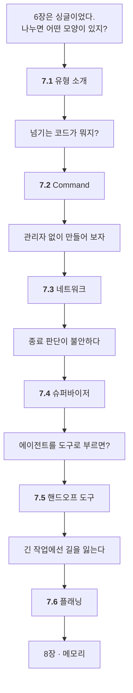

# Chapter 07 · 멀티 에이전트 구현

> Part 03 | 멀티 에이전트 설계와 메모리 시스템 구현

## 학습 목표

- 네트워크·슈퍼바이저·계층형 멀티 에이전트 패턴의 구조와 차이를 설명할 수 있다
- `Command`를 이용한 핸드오프로 에이전트 간 제어를 넘길 수 있다
- 네트워크 패턴(검색+차트), 슈퍼바이저 패턴(웹 요약+DB), 3중 슈퍼바이저, 플래닝 기반 슈퍼바이저를 각각 구현할 수 있다

> **올라마로 어디까지 되나** — **올라마로 7.1 · 7.2가 됩니다.** 7.3~7.6은 Tavily 또는 Supabase가 필요합니다. **구조를 읽는 것은 키 없이도 가능**하니, 코드를 따라 읽으며 `Command`와 `Send`의 모양을 잡아 두세요.
>
> 전체 지도는 [STUDY.md](../STUDY.md#올라마로-어디까지-되나)에 있습니다.

## 이 장의 이해 흐름

**앞 절의 약점이 다음 절의 이유가 되는** 구조입니다. 7.3부터 7.6까지 순서대로 복잡해지는데, **더 좋아지는 게 아니라 다른 문제를 푸는 것**입니다.



| 절 | 이 절의 질문 | 무엇을 풀었나 | 대신 치른 값 |
| :--- | :--- | :--- | :--- |
| **7.1** | 어떤 모양들이 있지? | 유형 네 가지 | — |
| **7.2** | 넘기는 코드가 뭐지? | `Command` | — |
| **7.3** | 관리자 없이 되나? | 가장 단순 | **종료 판단이 불안** |
| **7.4** | 관리자를 두면? | 종료 판단이 튼튼 | 호출 증가 |
| **7.5** | 에이전트를 도구로? | 컨텍스트 분리 · 동시 실행 | 코드 복잡도 |
| **7.6** | 긴 작업은? | 안 헤맴 | **단계당 LLM 4회 이상** |

> **7.2가 손에 안 붙으면 7.3부터가 힘듭니다.** `Command` 는 7장 예제 전체에서 가장 많이 나오는 코드입니다.

### 7장 전체를 한 줄로

> **유형 네 가지를 알았고(7.1) → `Command` 로 넘기는 법을 배웠고(7.2) → 관리자 없이(7.3) → 관리자를 두고(7.4) → 에이전트를 도구로(7.5) → 계획을 먼저 세우는(7.6) 순으로 만들어 봤다.**

## 공식 문서의 워크플로 패턴 다섯 개

[1.4절](../ch01_llm-decision/01-04_LLM%20%EA%B8%B0%EB%B0%98%20%EC%97%90%EC%9D%B4%EC%A0%84%ED%8A%B8%20%EC%8B%9C%EC%8A%A4%ED%85%9C%2C%20%EC%9D%B4%EB%9F%B0%20%EA%B5%AC%EC%A1%B0%EB%A1%9C%20%EC%84%A4%EA%B3%84%EB%90%9C%EB%8B%A4.md)에서 **Routing** 하나를 배우며 "나머지 넷이 있다"고만 적어 뒀습니다. **그 넷이 전부 이 장에 있습니다.** 여기서 한 번에 맞춰 보세요.

| 공식 문서 패턴 | 한 줄로 | 이 책에서 | 교재 표현 |
| :--- | :--- | :--- | :--- |
| **Routing** | 갈림길에서 **어디로 갈지** 고름 | [1.4절](../ch01_llm-decision/01-04_LLM%20%EA%B8%B0%EB%B0%98%20%EC%97%90%EC%9D%B4%EC%A0%84%ED%8A%B8%20%EC%8B%9C%EC%8A%A4%ED%85%9C%2C%20%EC%9D%B4%EB%9F%B0%20%EA%B5%AC%EC%A1%B0%EB%A1%9C%20%EC%84%A4%EA%B3%84%EB%90%9C%EB%8B%A4.md) · [7.4절](07-04_%EC%9B%B9%ED%8E%98%EC%9D%B4%EC%A7%80%EB%A5%BC%20%EC%9A%94%EC%95%BD%ED%95%B4%EC%84%9C%20%EB%8D%B0%EC%9D%B4%ED%84%B0%EB%B2%A0%EC%9D%B4%EC%8A%A4%EC%97%90%20%EC%A0%80%EC%9E%A5%ED%95%98%EB%8A%94%20%EC%97%90%EC%9D%B4%EC%A0%84%ED%8A%B8%20%23%EC%8A%88%ED%8D%BC%EB%B0%94%EC%9D%B4%EC%A0%80.md)의 `Router` | 라우터 기반 에이전트 |
| **Prompt chaining** | **정해진 순서**로 이어서 실행 | [7.4절](07-04_%EC%9B%B9%ED%8E%98%EC%9D%B4%EC%A7%80%EB%A5%BC%20%EC%9A%94%EC%95%BD%ED%95%B4%EC%84%9C%20%EB%8D%B0%EC%9D%B4%ED%84%B0%EB%B2%A0%EC%9D%B4%EC%8A%A4%EC%97%90%20%EC%A0%80%EC%9E%A5%ED%95%98%EB%8A%94%20%EC%97%90%EC%9D%B4%EC%A0%84%ED%8A%B8%20%23%EC%8A%88%ED%8D%BC%EB%B0%94%EC%9D%B4%EC%A0%80.md) 크롤링 → 요약 → 저장 | — |
| **Parallelization** | 여러 개를 **동시에** | [7.5절](07-05_%EC%B5%9C%EC%8B%A0%20%EB%AC%B8%EC%84%9C%20%EA%B2%80%EC%83%89%20%2B%20%EB%82%B4%EB%B6%80%20DB%20%EA%B2%80%EC%83%89%20%2B%20%ED%85%9C%ED%94%8C%EB%A6%BF%20%EB%8B%B5%EB%B3%80%203%EC%A4%91%20%EB%A9%80%ED%8B%B0%20%EC%97%90%EC%9D%B4%EC%A0%84%ED%8A%B8%20%23%EC%8A%88%ED%8D%BC%EB%B0%94%EC%9D%B4%EC%A0%80.md)의 **`Send`** | — |
| **Orchestrator-worker** | 관리자가 **일을 나눠 줌** | [7.4](07-04_%EC%9B%B9%ED%8E%98%EC%9D%B4%EC%A7%80%EB%A5%BC%20%EC%9A%94%EC%95%BD%ED%95%B4%EC%84%9C%20%EB%8D%B0%EC%9D%B4%ED%84%B0%EB%B2%A0%EC%9D%B4%EC%8A%A4%EC%97%90%20%EC%A0%80%EC%9E%A5%ED%95%98%EB%8A%94%20%EC%97%90%EC%9D%B4%EC%A0%84%ED%8A%B8%20%23%EC%8A%88%ED%8D%BC%EB%B0%94%EC%9D%B4%EC%A0%80.md) · [7.5](07-05_%EC%B5%9C%EC%8B%A0%20%EB%AC%B8%EC%84%9C%20%EA%B2%80%EC%83%89%20%2B%20%EB%82%B4%EB%B6%80%20DB%20%EA%B2%80%EC%83%89%20%2B%20%ED%85%9C%ED%94%8C%EB%A6%BF%20%EB%8B%B5%EB%B3%80%203%EC%A4%91%20%EB%A9%80%ED%8B%B0%20%EC%97%90%EC%9D%B4%EC%A0%84%ED%8A%B8%20%23%EC%8A%88%ED%8D%BC%EB%B0%94%EC%9D%B4%EC%A0%80.md) · [7.6](07-06_%EC%9E%90%EB%A3%8C%20%EC%A1%B0%EC%82%AC%20%EC%A0%84%EB%AC%B8%EA%B0%80%20%2B%20%EB%AC%B8%EC%84%9C%20%EC%9E%91%EC%84%B1%20%EC%A0%84%EB%AC%B8%EA%B0%80%20%EC%97%90%EC%9D%B4%EC%A0%84%ED%8A%B8%20%23%ED%94%8C%EB%9E%98%EB%8B%9D%20%EA%B8%B0%EB%B0%98%20%EC%8A%88%ED%8D%BC%EB%B0%94%EC%9D%B4%EC%A0%80.md) | 슈퍼바이저 |
| **Evaluator-optimizer** | 결과를 **평가하고 다시 만듦** | [2.1절](../ch02_core-elements/02-01_%EC%97%90%EC%9D%B4%EC%A0%84%ED%8A%B8%EC%9D%98%20%EC%B6%94%EB%A1%A0%20%EB%8A%A5%EB%A0%A5%20-%20ReAct%EC%99%80%20Reflection.md) · [7.6절](07-06_%EC%9E%90%EB%A3%8C%20%EC%A1%B0%EC%82%AC%20%EC%A0%84%EB%AC%B8%EA%B0%80%20%2B%20%EB%AC%B8%EC%84%9C%20%EC%9E%91%EC%84%B1%20%EC%A0%84%EB%AC%B8%EA%B0%80%20%EC%97%90%EC%9D%B4%EC%A0%84%ED%8A%B8%20%23%ED%94%8C%EB%9E%98%EB%8B%9D%20%EA%B8%B0%EB%B0%98%20%EC%8A%88%ED%8D%BC%EB%B0%94%EC%9D%B4%EC%A0%80.md)의 재계획 | Reflection |

### 짚어 둘 것 셋

**① 교재의 세 유형과 다섯 패턴은 축이 다릅니다.** 겹치는 것끼리 세면 헷갈립니다.

| | 교재 (7.1절) | 공식 문서 |
| :--- | :--- | :--- |
| 나누는 기준 | **에이전트끼리 어떻게 연결되나** | **일을 어떤 모양으로 처리하나** |
| 항목 | 네트워크 · 슈퍼바이저 · 플래닝 | 위의 다섯 |

**한 예제가 두 이름을 동시에 가집니다.** 7.4절은 교재로는 *슈퍼바이저*, 공식 문서로는 *Orchestrator-worker* + *Routing* + *Prompt chaining*입니다.

**② 한 절이 패턴 하나에 대응하지 않습니다.** 실제 시스템은 섞어 씁니다. [1.4절](../ch01_llm-decision/01-04_LLM%20%EA%B8%B0%EB%B0%98%20%EC%97%90%EC%9D%B4%EC%A0%84%ED%8A%B8%20%EC%8B%9C%EC%8A%A4%ED%85%9C%2C%20%EC%9D%B4%EB%9F%B0%20%EA%B5%AC%EC%A1%B0%EB%A1%9C%20%EC%84%A4%EA%B3%84%EB%90%9C%EB%8B%A4.md)의 *"둘은 배타적이지 않습니다"* 가 여기서도 그대로입니다.

**③ Evaluator-optimizer만 이 장 밖에서 먼저 나옵니다.** 2.1절 Reflection이 그것이고, 7.6절에서 **계획을 다시 쓰는 형태**로 돌아옵니다. 대상이 *결과물*에서 *계획*으로 바뀐 것뿐입니다.

> **검색할 때는 공식 문서 이름을 쓰세요.** "슈퍼바이저"로 찾으면 이 교재가 나오고, `Orchestrator-worker`로 찾으면 프레임워크 문서가 나옵니다.

## 절별 노트

| 절 | 노트 파일 | 진도 |
| --- | --- | --- |
| 7.1 | [`07-01_멀티 에이전트 유형 소개.md`](07-01_%EB%A9%80%ED%8B%B0%20%EC%97%90%EC%9D%B4%EC%A0%84%ED%8A%B8%20%EC%9C%A0%ED%98%95%20%EC%86%8C%EA%B0%9C.md) | ☐ |
| 7.2 | [`07-02_핸드오프를 위한 기능 살펴보기.md`](07-02_%ED%95%B8%EB%93%9C%EC%98%A4%ED%94%84%EB%A5%BC%20%EC%9C%84%ED%95%9C%20%EA%B8%B0%EB%8A%A5%20%EC%82%B4%ED%8E%B4%EB%B3%B4%EA%B8%B0.md) | ☐ |
| 7.3 | [`07-03_정보 검색을 기반으로 차트를 그려주는 에이전트 #네트워크 패턴.md`](07-03_%EC%A0%95%EB%B3%B4%20%EA%B2%80%EC%83%89%EC%9D%84%20%EA%B8%B0%EB%B0%98%EC%9C%BC%EB%A1%9C%20%EC%B0%A8%ED%8A%B8%EB%A5%BC%20%EA%B7%B8%EB%A0%A4%EC%A3%BC%EB%8A%94%20%EC%97%90%EC%9D%B4%EC%A0%84%ED%8A%B8%20%23%EB%84%A4%ED%8A%B8%EC%9B%8C%ED%81%AC%20%ED%8C%A8%ED%84%B4.md) | ☐ |
| 7.4 | [`07-04_웹페이지를 요약해서 데이터베이스에 저장하는 에이전트 #슈퍼바이저.md`](07-04_%EC%9B%B9%ED%8E%98%EC%9D%B4%EC%A7%80%EB%A5%BC%20%EC%9A%94%EC%95%BD%ED%95%B4%EC%84%9C%20%EB%8D%B0%EC%9D%B4%ED%84%B0%EB%B2%A0%EC%9D%B4%EC%8A%A4%EC%97%90%20%EC%A0%80%EC%9E%A5%ED%95%98%EB%8A%94%20%EC%97%90%EC%9D%B4%EC%A0%84%ED%8A%B8%20%23%EC%8A%88%ED%8D%BC%EB%B0%94%EC%9D%B4%EC%A0%80.md) | ☐ |
| 7.5 | [`07-05_최신 문서 검색 + 내부 DB 검색 + 템플릿 답변 3중 멀티 에이전트 #슈퍼바이저.md`](07-05_%EC%B5%9C%EC%8B%A0%20%EB%AC%B8%EC%84%9C%20%EA%B2%80%EC%83%89%20%2B%20%EB%82%B4%EB%B6%80%20DB%20%EA%B2%80%EC%83%89%20%2B%20%ED%85%9C%ED%94%8C%EB%A6%BF%20%EB%8B%B5%EB%B3%80%203%EC%A4%91%20%EB%A9%80%ED%8B%B0%20%EC%97%90%EC%9D%B4%EC%A0%84%ED%8A%B8%20%23%EC%8A%88%ED%8D%BC%EB%B0%94%EC%9D%B4%EC%A0%80.md) | ☐ |
| 7.6 | [`07-06_자료 조사 전문가 + 문서 작성 전문가 에이전트 #플래닝 기반 슈퍼바이저.md`](07-06_%EC%9E%90%EB%A3%8C%20%EC%A1%B0%EC%82%AC%20%EC%A0%84%EB%AC%B8%EA%B0%80%20%2B%20%EB%AC%B8%EC%84%9C%20%EC%9E%91%EC%84%B1%20%EC%A0%84%EB%AC%B8%EA%B0%80%20%EC%97%90%EC%9D%B4%EC%A0%84%ED%8A%B8%20%23%ED%94%8C%EB%9E%98%EB%8B%9D%20%EA%B8%B0%EB%B0%98%20%EC%8A%88%ED%8D%BC%EB%B0%94%EC%9D%B4%EC%A0%80.md) | ☐ |

<details><summary>소절까지 펼쳐보기</summary>

- [ ] **[7.1 멀티 에이전트 유형 소개](07-01_%EB%A9%80%ED%8B%B0%20%EC%97%90%EC%9D%B4%EC%A0%84%ED%8A%B8%20%EC%9C%A0%ED%98%95%20%EC%86%8C%EA%B0%9C.md)**
  - [ ] 7.1.1 네트워크 패턴 아키텍처
  - [ ] 7.1.2 슈퍼바이저 패턴 아키텍처
  - [ ] 7.1.3 계층형 패턴 아키텍처
  - [ ] 7.1.4 사용자 커스텀
- [ ] **[7.2 핸드오프를 위한 기능 살펴보기](07-02_%ED%95%B8%EB%93%9C%EC%98%A4%ED%94%84%EB%A5%BC%20%EC%9C%84%ED%95%9C%20%EA%B8%B0%EB%8A%A5%20%EC%82%B4%ED%8E%B4%EB%B3%B4%EA%B8%B0.md)**
  - [ ] 7.2.1 [실습] 핸드오프의 개념과 Command 사용법 익히기
  - [ ] 7.2.2 [실습] 조건에 따른 Command 사용법 알아보기
- [ ] **[7.3 정보 검색을 기반으로 차트를 그려주는 에이전트 #네트워크 패턴](07-03_%EC%A0%95%EB%B3%B4%20%EA%B2%80%EC%83%89%EC%9D%84%20%EA%B8%B0%EB%B0%98%EC%9C%BC%EB%A1%9C%20%EC%B0%A8%ED%8A%B8%EB%A5%BC%20%EA%B7%B8%EB%A0%A4%EC%A3%BC%EB%8A%94%20%EC%97%90%EC%9D%B4%EC%A0%84%ED%8A%B8%20%23%EB%84%A4%ED%8A%B8%EC%9B%8C%ED%81%AC%20%ED%8C%A8%ED%84%B4.md)**
  - [ ] 7.3.1 각 에이전트의 소통 방식 정의하기
  - [ ] 7.3.2 [실습] 멀티 에이전트 그래프 만들기
  - [ ] 7.3.3 [실습] 정보 검색 에이전트 만들기
  - [ ] 7.3.4 [실습] 차트 생성 에이전트 만들기
  - [ ] 7.3.5 [실습] 정보 검색과 차트 생성 요청하고 답변 받아보기
- [ ] **[7.4 웹페이지를 요약해서 데이터베이스에 저장하는 에이전트 #슈퍼바이저](07-04_%EC%9B%B9%ED%8E%98%EC%9D%B4%EC%A7%80%EB%A5%BC%20%EC%9A%94%EC%95%BD%ED%95%B4%EC%84%9C%20%EB%8D%B0%EC%9D%B4%ED%84%B0%EB%B2%A0%EC%9D%B4%EC%8A%A4%EC%97%90%20%EC%A0%80%EC%9E%A5%ED%95%98%EB%8A%94%20%EC%97%90%EC%9D%B4%EC%A0%84%ED%8A%B8%20%23%EC%8A%88%ED%8D%BC%EB%B0%94%EC%9D%B4%EC%A0%80.md)**
  - [ ] 7.4.1 슈퍼바이저 패턴 멀티 에이전트 적용하기
  - [ ] 7.4.2 [실습] 웹 분석 에이전트 만들기
  - [ ] 7.4.3 [실습] DB 관리를 위한 환경 설정하기
  - [ ] 7.4.4 [실습] DB 관리 에이전트 만들기
  - [ ] 7.4.5 [실습] 슈퍼바이저 에이전트 그래프 구축하기
  - [ ] 7.4.6 [실습] 웹페이지 분석·저장·검색하기
- [ ] **[7.5 최신 문서 검색 + 내부 DB 검색 + 템플릿 답변 3중 멀티 에이전트 #슈퍼바이저](07-05_%EC%B5%9C%EC%8B%A0%20%EB%AC%B8%EC%84%9C%20%EA%B2%80%EC%83%89%20%2B%20%EB%82%B4%EB%B6%80%20DB%20%EA%B2%80%EC%83%89%20%2B%20%ED%85%9C%ED%94%8C%EB%A6%BF%20%EB%8B%B5%EB%B3%80%203%EC%A4%91%20%EB%A9%80%ED%8B%B0%20%EC%97%90%EC%9D%B4%EC%A0%84%ED%8A%B8%20%23%EC%8A%88%ED%8D%BC%EB%B0%94%EC%9D%B4%EC%A0%80.md)**
  - [ ] 7.5.1 각 에이전트를 도구로 호출하는 슈퍼바이저 패턴
  - [ ] 7.5.2 [실습] 슈퍼바이저 에이전트 그래프 생성하기
  - [ ] 7.5.3 [실습] 에이전트로 작업을 핸드오프하는 도구 생성하기
  - [ ] 7.5.4 [실습] 최신 검색 에이전트 만들기
  - [ ] 7.5.5 [실습] 내부 검색 에이전트 만들기
  - [ ] 7.5.6 [실습] FAQ 답변 에이전트 만들기
  - [ ] 7.5.7 [실습] 다양한 케이스에 대응하는 멀티 에이전트 챗봇 테스트하기
- [ ] **[7.6 자료 조사 전문가 + 문서 작성 전문가 에이전트 #플래닝 기반 슈퍼바이저](07-06_%EC%9E%90%EB%A3%8C%20%EC%A1%B0%EC%82%AC%20%EC%A0%84%EB%AC%B8%EA%B0%80%20%2B%20%EB%AC%B8%EC%84%9C%20%EC%9E%91%EC%84%B1%20%EC%A0%84%EB%AC%B8%EA%B0%80%20%EC%97%90%EC%9D%B4%EC%A0%84%ED%8A%B8%20%23%ED%94%8C%EB%9E%98%EB%8B%9D%20%EA%B8%B0%EB%B0%98%20%EC%8A%88%ED%8D%BC%EB%B0%94%EC%9D%B4%EC%A0%80.md)**
  - [ ] 7.6.1 [실습] 전체 에이전트 구조 이해하고 구현하기
  - [ ] 7.6.2 [실습] 작업의 계획을 수립하는 에이전트 만들기
  - [ ] 7.6.3 [실습] 슈퍼바이저 에이전트 만들기
  - [ ] 7.6.4 [실습] 자료 조사 에이전트 만들기
  - [ ] 7.6.5 [실습] 보고서 작성 에이전트 만들기
  - [ ] 7.6.6 [실습] 알아서 자료 조사하고 보고서 자동 작성하기

</details>

## 관련 예제 코드

| 내용 | 경로 |
| --- | --- |
| 7.2 Command / 핸드오프 | [`examples/how_to_use_command.ipynb`](examples/how_to_use_command.ipynb) |
| 7.3 네트워크 패턴 | [`examples/network_agent`](examples/network_agent) |
| 7.4 슈퍼바이저(웹+DB) | [`examples/supervisor_agent_web`](examples/supervisor_agent_web) |
| 7.5 3중 슈퍼바이저 | [`examples/supervisor_agent_triple`](examples/supervisor_agent_triple) |
| 7.6 플래닝 슈퍼바이저 | [`examples/supervisor_planning_agent`](examples/supervisor_planning_agent) |
| 결과물 예시 | [`examples/outputs`](examples/outputs) |

## `.env` 두는 위치

장 폴더에 `.env` 하나면 충분합니다. `langgraph dev`를 쓸 때는 `examples/.env`도 함께 두세요.

```powershell
copy .env.example .env
```

## 참고 문서

| 무엇을 볼 때 | 문서 |
| --- | --- |
| 7.1 멀티 에이전트 유형 | [Workflows and agents](https://docs.langchain.com/oss/python/langgraph/workflows-agents) |
| 7.2 핸드오프 (`Command`) | [Graph API overview](https://docs.langchain.com/oss/python/langgraph/graph-api) 의 Command 절 |
| 7.2 위임·서브에이전트 | [LangChain · Subagents](https://docs.langchain.com/oss/python/langchain/multi-agent/subagents) |
| 에이전트를 그래프로 합치기 | [Subgraphs](https://docs.langchain.com/oss/python/langgraph/use-subgraphs) |
| 슈퍼바이저 흐름 추적 | [LangSmith Observability](https://docs.langchain.com/oss/python/langgraph/observability) |

> 예제가 `from langgraph.types import Command`를 저장소 전체에서 가장 많이 씁니다(14곳).
> 핸드오프가 곧 `Command`라고 보면 7장 전체가 한 번에 풀립니다.

## 이 폴더 구성

- `07-01_…md` ~ `07-06_…md` — 절별 학습 노트
- `notes.md` — 장 전체 요약 (절 노트를 다 쓴 뒤 마지막에 정리)
- `practice/` — 예제를 보지 않고 직접 쳐보는 공간
- `.env.example` — 이 장에 필요한 API 키. `copy .env.example .env` 후 값을 채우세요

> **메모**  
> 7.4부터 수파베이스(Supabase) 프로젝트가 필요합니다. 미리 계정을 만들고 URL/KEY를 `.env`에 넣어두면 흐름이 끊기지 않습니다.

---

[⬅ 전체 목차로](../STUDY.md)
