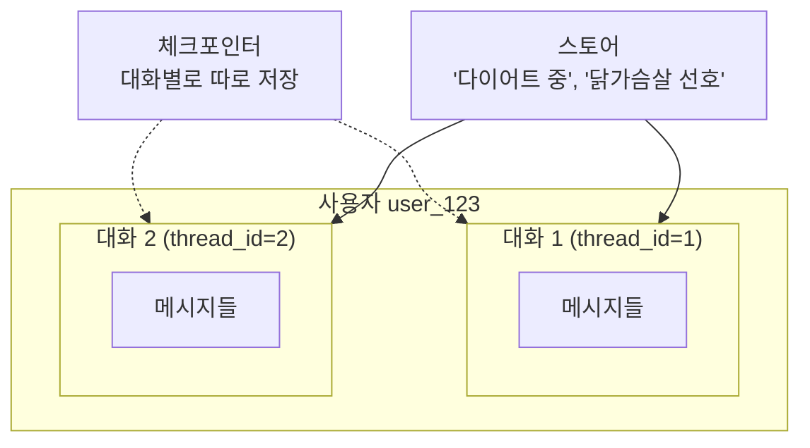

# 8.1 AI 에이전트에서 메모리의 역할

> **공식 문서** — [LangGraph · Memory](https://docs.langchain.com/oss/python/langgraph/add-memory)

> **여기까지** — 7장에서 에이전트를 여러 개 엮어 봤습니다. 그런데 **하나 미뤄 둔 게 있습니다.**
> **이 절의 질문** — [2.3절](../ch02_core-elements/02-03_%EC%97%90%EC%9D%B4%EC%A0%84%ED%8A%B8%EC%9D%98%20%EA%B8%B0%EC%96%B5%EB%A0%A5%20-%20%EB%A9%94%EB%AA%A8%EB%A6%AC.md)에서 이름만 잡아 둔 **메모리**, 실제로 어떻게 생겼지?
> **다 읽으면** — **체크포인터**와 **스토어**의 자리가 나뉩니다. 8장 전체가 이 두 단어 위에 있습니다.

[2.3절](../ch02_core-elements/02-03_%EC%97%90%EC%9D%B4%EC%A0%84%ED%8A%B8%EC%9D%98%20%EA%B8%B0%EC%96%B5%EB%A0%A5%20-%20%EB%A9%94%EB%AA%A8%EB%A6%AC.md)에서 개념으로 잡아 둔 것을 이 장에서 구현합니다. 먼저 그때의 결론을 다시 세워 두겠습니다.

> **LLM에는 기억이 없습니다.** 기억처럼 보이는 것은 매 요청에 이전 대화를 다시 넣어 주기 때문입니다.

그러니 "메모리를 붙인다"는 것은 **"무엇을 얼마나 다시 넣어 줄지 관리하는 장치를 붙인다"** 는 뜻입니다.

## 8.1.1 단기 메모리와 장기 메모리

### 두 층의 경계는 "대화"입니다

| | 단기 메모리 | 장기 메모리 |
| :--- | :--- | :--- |
| 범위 | **대화 하나 안** | **대화를 넘어서** |
| 랭그래프 이름 | **체크포인터(Checkpointer)** | **스토어(Store)** |
| 구현 클래스 | `InMemorySaver` | `InMemoryStore` |
| 붙이는 곳 | `compile(checkpointer=…)` | `create_agent(store=…)` |
| 구분 열쇠 | **`thread_id`** | **`user_id`** (직접 정함) |
| 담기는 것 | 그 대화의 메시지·상태 전체 | 사용자에 대해 알아낸 사실 |
| 실습 | [8.2절](08-02_%EB%8C%80%ED%99%94%20%EB%A7%A5%EB%9D%BD%EC%9D%84%20%EC%9D%B4%ED%95%B4%ED%95%98%EB%8A%94%20%EC%97%90%EC%9D%B4%EC%A0%84%ED%8A%B8.md) · [8.3절](08-03_%EB%8B%A8%EA%B8%B0%20%EB%A9%94%EB%AA%A8%EB%A6%AC%EB%A5%BC%20%EA%B4%80%EB%A6%AC%ED%95%98%EB%8A%94%20%EB%B0%A9%EB%B2%95.md) | [8.4절](08-04_%EB%88%84%EC%A0%81%EB%90%9C%20%EC%82%AC%EC%9A%A9%EC%9E%90%20%EB%A9%94%EB%AA%A8%EB%A6%AC%EB%A5%BC%20%EA%B8%B0%EB%B0%98%EC%9C%BC%EB%A1%9C%20%EB%A7%9E%EC%B6%A4%20%EC%A1%B0%EC%96%B8%EC%9D%84%20%EC%A0%9C%EA%B3%B5%ED%95%98%EB%8A%94%20%EC%97%90%EC%9D%B4%EC%A0%84%ED%8A%B8.md) |



**체크포인터는 대화마다 칸이 나뉘고, 스토어는 대화를 가로질러 하나입니다.** 이 그림이 8장 전체의 지도입니다.

### 왜 하나로 안 되나

"그냥 전부 한 곳에 저장하면 안 되나?" 싶습니다. 안 되는 이유가 둘입니다.

**첫째, 넣는 방식이 다릅니다.** 대화 이력은 **자동으로** 쌓입니다. 노드가 실행될 때마다 랭그래프가 저장합니다. 반면 "이 사용자는 다이어트 중"이라는 사실은 **누군가 판단해서 골라 넣어야** 합니다. 8.4절에서 **저장하는 도구**를 따로 만드는 이유입니다.

**둘째, 꺼내는 방식이 다릅니다.** 대화 이력은 **순서대로 전부** 꺼냅니다. 반면 사용자 정보는 수백 개가 쌓이므로 **관련된 것만 찾아** 꺼내야 합니다. 그래서 스토어에는 **검색 기능**이 붙습니다([6.5절](../ch06_single-agent/06-05_RAG%EB%A5%BC%20%EC%9C%84%ED%95%9C%20%EC%97%90%EC%9D%B4%EC%A0%84%ED%8A%B8%20%EB%A7%8C%EB%93%A4%EA%B8%B0.md)의 벡터 검색과 같은 방식입니다).

| | 단기 | 장기 |
| :--- | :--- | :--- |
| 저장 | 자동 | **도구로 직접** |
| 조회 | 전부, 순서대로 | **검색해서 관련된 것만** |
| 커지면 | 잘라내거나 요약 (8.3절) | 검색으로 걸러짐 |

### 단기 메모리는 왜 관리해야 하나

[2.3절](../ch02_core-elements/02-03_%EC%97%90%EC%9D%B4%EC%A0%84%ED%8A%B8%EC%9D%98%20%EA%B8%B0%EC%96%B5%EB%A0%A5%20-%20%EB%A9%94%EB%AA%A8%EB%A6%AC.md)에서 본 대로 에이전트는 대화가 빨리 찹니다.

```
사용자 질문                    (작음)
도구 호출 요청                  (작음)
도구 결과 — 검색 결과 3건        (큼!)
도구 호출 요청                  (작음)
도구 결과 — 웹페이지 전문        (큼!)
```

[6.2절](../ch06_single-agent/06-02_%EC%9B%B9%20%EA%B2%80%EC%83%89%20%EC%97%90%EC%9D%B4%EC%A0%84%ED%8A%B8%20%EB%A7%8C%EB%93%A4%EA%B8%B0.md)에서 `max_results=3`으로 제한한 것도, [7.4절](../ch07_multi-agent/07-04_%EC%9B%B9%ED%8E%98%EC%9D%B4%EC%A7%80%EB%A5%BC%20%EC%9A%94%EC%95%BD%ED%95%B4%EC%84%9C%20%EB%8D%B0%EC%9D%B4%ED%84%B0%EB%B2%A0%EC%9D%B4%EC%8A%A4%EC%97%90%20%EC%A0%80%EC%9E%A5%ED%95%98%EB%8A%94%20%EC%97%90%EC%9D%B4%EC%A0%84%ED%8A%B8%20%23%EC%8A%88%ED%8D%BC%EB%B0%94%EC%9D%B4%EC%A0%80.md)에서 크롤링 결과를 청소한 것도 전부 이 문제 때문이었습니다.

[8.3절](08-03_%EB%8B%A8%EA%B8%B0%20%EB%A9%94%EB%AA%A8%EB%A6%AC%EB%A5%BC%20%EA%B4%80%EB%A6%AC%ED%95%98%EB%8A%94%20%EB%B0%A9%EB%B2%95.md)에서 두 가지 대응을 배웁니다 — **잘라내기(트리밍)** 와 **요약**.

### 이미 여러 번 만났습니다

체크포인터는 8장이 처음이 아닙니다.

| 절 | 어떻게 나왔나 |
| :--- | :--- |
| [5.1절](../ch05_langgraph-basics/05-01_%EC%99%9C%20%EB%9E%AD%EA%B7%B8%EB%9E%98%ED%94%84%EC%9D%B8%EA%B0%80.md) | "멈춘 자리에서 재개"를 가능하게 하는 장치 |
| [6.4.2절](../ch06_single-agent/06-04_create_agent%20%EC%83%81%EC%84%B8%20%EA%B5%AC%EC%A1%B0%20%EC%9D%B4%ED%95%B4%ED%95%98%EA%B8%B0.md) | `create_agent(checkpointer=MemorySaver())` |

**같은 장치가 두 가지 문제를 함께 풉니다.** 상태를 저장한다는 하나의 기능이, 5장에서는 "재개"로 6·8장에서는 "기억"으로 쓰입니다.

> **`InMemorySaver`와 `InMemoryStore`는 이름 그대로 메모리에만 둡니다.** 프로그램이 꺼지면 사라집니다. 실제 서비스에서는 DB 기반(예: PostgreSQL)을 씁니다. 학습 중에는 껐다 켜면 다 날아간다는 점만 기억하세요.

## 요약 및 비유

**병원 진료**로 보면 두 층이 선명합니다. 오늘 진료 기록은 **이번 방문 차트**(단기)이고, 알레르기·기저질환은 **환자 파일**(장기)입니다. 다음에 와도 파일은 남아 있습니다.

| 개념 | 병원 비유 | 기술적 의미 |
| :--- | :--- | :--- |
| **단기 메모리** | 오늘 진료 차트 | 체크포인터 — 대화 하나 |
| **장기 메모리** | 환자 파일 | 스토어 — 대화를 넘어 |
| **`thread_id`** | 오늘 접수번호 | 대화 구분 |
| **`user_id`** | 환자 번호 | 사용자 구분 |
| **자동 저장** | 진료 중 자동 기록 | 노드마다 체크포인트 |
| **골라서 저장** | 의사가 판단해 파일에 기입 | 저장 도구 (8.4절) |
| **검색해서 조회** | 파일에서 관련 항목만 | 스토어 벡터 검색 |
| **차트가 길어짐** | 요약본을 앞에 붙임 | 트리밍·요약 (8.3절) |
| **`InMemory…`** | 퇴근하면 지워지는 메모 | 프로세스 종료 시 소멸 |

## 결론

* 메모리를 붙인다는 것은 **"무엇을 얼마나 다시 넣어 줄지 관리하는 장치"** 를 붙인다는 뜻입니다.
* 두 층의 경계는 **대화**입니다 — 단기는 대화 하나 안(**체크포인터**), 장기는 대화를 넘어(**스토어**).
* 구분 열쇠도 다릅니다 — 단기는 **`thread_id`**, 장기는 **`user_id`**.
* 하나로 합칠 수 없는 이유는 **저장 방식**(자동 vs 골라서)과 **조회 방식**(전부 vs 검색)이 다르기 때문입니다.
* 에이전트는 **도구 결과 때문에** 대화가 빨리 찹니다. 8.3절의 트리밍·요약이 필요한 이유입니다.
* 체크포인터는 5장의 **재개**와 8장의 **기억**을 동시에 해결하는 **하나의 장치**입니다.
* `InMemory…` 계열은 **프로그램이 꺼지면 사라집니다.**

---

## 다음 절로

두 층의 이름은 잡았습니다. **체크포인터**와 **스토어**.

**먼저 쉬운 쪽부터** — 대화 하나 안에서 이어지게 하는 **단기 메모리**를 붙여 봅시다. → **[8.2절](08-02_%EB%8C%80%ED%99%94%20%EB%A7%A5%EB%9D%BD%EC%9D%84%20%EC%9D%B4%ED%95%B4%ED%95%98%EB%8A%94%20%EC%97%90%EC%9D%B4%EC%A0%84%ED%8A%B8.md)**

---

[Chapter 08](README.md) · [8.2 ➡](08-02_%EB%8C%80%ED%99%94%20%EB%A7%A5%EB%9D%BD%EC%9D%84%20%EC%9D%B4%ED%95%B4%ED%95%98%EB%8A%94%20%EC%97%90%EC%9D%B4%EC%A0%84%ED%8A%B8.md)
