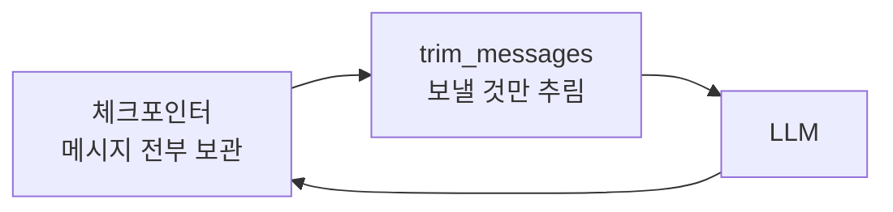
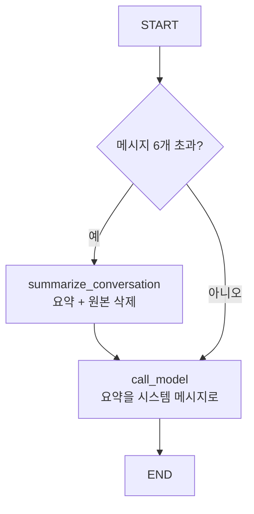

# 8.3 단기 메모리를 관리하는 방법

> **저자 예제** — [`examples/short-term memory.ipynb`](examples/short-term%20memory.ipynb)
> **공식 문서** — [Persistence](https://docs.langchain.com/oss/python/langgraph/persistence) · [Checkpointers](https://docs.langchain.com/oss/python/langgraph/checkpointers)

> **여기까지** — 체크포인터로 대화가 이어지게 만들었습니다([8.2절](08-02_%EB%8C%80%ED%99%94%20%EB%A7%A5%EB%9D%BD%EC%9D%84%20%EC%9D%B4%ED%95%B4%ED%95%98%EB%8A%94%20%EC%97%90%EC%9D%B4%EC%A0%84%ED%8A%B8.md)).
> **이 절의 질문** — 계속 쌓이면 **컨텍스트가 터지는데** 어떻게 관리하지?
> **다 읽으면** — [2.3절](../ch02_core-elements/02-03_%EC%97%90%EC%9D%B4%EC%A0%84%ED%8A%B8%EC%9D%98%20%EA%B8%B0%EC%96%B5%EB%A0%A5%20-%20%EB%A9%94%EB%AA%A8%EB%A6%AC.md)에서 예고한 **자르기와 요약**을 코드로 만들 수 있게 됩니다.

[8.2절](08-02_%EB%8C%80%ED%99%94%20%EB%A7%A5%EB%9D%BD%EC%9D%84%20%EC%9D%B4%ED%95%B4%ED%95%98%EB%8A%94%20%EC%97%90%EC%9D%B4%EC%A0%84%ED%8A%B8.md)에서 대화가 이어지게 만들었습니다. 그런데 **이어지기만 하면 언젠가 터집니다.**

[1.1절](../ch01_llm-decision/01-01_AI%20%EC%97%90%EC%9D%B4%EC%A0%84%ED%8A%B8%EC%9D%98%20%EB%91%90%EB%87%8C%2C%20%EA%B1%B0%EB%8C%80%20%EC%96%B8%EC%96%B4%20%EB%AA%A8%EB%8D%B8%EC%9D%98%20%EC%9D%B4%ED%95%B4.md)의 컨텍스트 윈도우가 상한이고, 그 전에 **비용이 먼저 문제가 됩니다.** 대화가 길어질수록 매 요청이 비싸집니다.

[2.3절](../ch02_core-elements/02-03_%EC%97%90%EC%9D%B4%EC%A0%84%ED%8A%B8%EC%9D%98%20%EA%B8%B0%EC%96%B5%EB%A0%A5%20-%20%EB%A9%94%EB%AA%A8%EB%A6%AC.md)에서 세 가지 대응을 예고했습니다. 이 절에서 **자르기**와 **요약**을 만듭니다.

## 8.3.1 [실습] 메시지 트리밍 활용하기

### 저장은 그대로 두고, 보낼 때만 자릅니다

이게 핵심입니다. **체크포인터에는 전부 남아 있고**, 모델에 보내기 직전에만 잘라 냅니다.

```python
def call_model(state: MessagesState):
    messages = trim_messages(
        state["messages"],                          # 저장된 전체
        strategy="last",
        token_counter=count_tokens_approximately,
        max_tokens=128,
        start_on="human",
        end_on=("human", "tool"),
    )
    response = model.invoke(messages)               # 잘라낸 것만 전송
    return {"messages": [response]}
```

**정말 원본이 남는지** 확인했습니다. 시스템 메시지 1개 + 질문/답변 6쌍 = **13개**로 시작합니다.

> **실측 (2026-08-31 · langchain-core 1.6.1)** — `token_counter=len`으로 두어 **메시지 개수**로 셌습니다. 실제로는 토큰 수를 세지만, 자르는 방식을 보기에는 이쪽이 명확합니다.

```
원본 13개

max_tokens=5 -> 5개
  SystemMessage 너는 비서다.
  HumanMessage  질문5
  AIMessage     답변5
  HumanMessage  질문6
  AIMessage     답변6

max_tokens=3 -> 3개
  SystemMessage 너는 비서다.
  HumanMessage  질문6
  AIMessage     답변6

원본은 그대로 13개
```

세 가지가 보입니다.

- **뒤에서부터 남깁니다** (`strategy="last"`). 최근 대화가 살아남습니다
- **`SystemMessage`는 잘려도 살아남습니다** (`include_system=True`). 역할 지시가 사라지면 곤란하니까요
- **원본은 13개 그대로입니다.** `trim_messages`는 새 리스트를 만들 뿐 상태를 건드리지 않습니다



### 인자 하나씩

| 인자 | 뜻 |
| :--- | :--- |
| `strategy="last"` | **뒤쪽부터** 남김 (최근 대화 우선) |
| `token_counter` | 토큰을 세는 방법 |
| `max_tokens=128` | 이 한도까지만 |
| `start_on="human"` | 잘린 결과가 **사람 메시지로 시작**하도록 |
| `end_on=("human", "tool")` | 사람 또는 도구 메시지로 **끝나도록** |

**`start_on`과 `end_on`이 왜 있는지**가 이 절에서 제일 중요합니다.

토큰만 세서 자르면 **말이 안 되는 조각**이 남습니다.

```
… (잘림)
ToolMessage: 검색 결과 …        ← 어떤 요청에 대한 결과인지 모름
AIMessage: 그래서 답은 …
```

[6.1절](../ch06_single-agent/06-01_%EB%8F%84%EA%B5%AC%EB%A5%BC%20%ED%98%B8%EC%B6%9C%ED%95%98%EB%8A%94%20%EC%97%90%EC%9D%B4%EC%A0%84%ED%8A%B8%20%EC%9D%B4%ED%95%B4%ED%95%98%EA%B8%B0.md)에서 본 **`tool_call_id` 짝짓기 규칙** 때문입니다. 도구 요청(`AIMessage`)과 결과(`ToolMessage`)는 짝이어야 하는데, 중간에서 자르면 짝이 깨져 오류가 납니다.

> **`start_on`/`end_on`은 "문법적으로 성립하는 지점에서 자르라"는 지시**입니다. 트리밍을 직접 구현하면 이 부분에서 반드시 걸립니다.

### `max_tokens=128`은 실습용입니다

```python
max_tokens=128, #1024
```

저자가 주석으로 `1024`를 남겨 뒀습니다. **128은 일부러 작게 잡은 값**입니다. 그래야 몇 번만 대화해도 잘리는 게 눈에 보입니다.

예제가 네 번 대화한 뒤 "제가 뭘 공부하고 있나요?"라고 묻습니다. **첫 메시지("AI를 공부하는 학생입니다")가 잘려 나갔으면 답을 못 합니다.** 트리밍의 대가를 직접 보게 만든 구성입니다.

> **실제 값은 모델의 컨텍스트 윈도우와 비용을 보고 정합니다.** `print(f"Trimmed messages: {messages}")`로 무엇이 남았는지 확인하며 조절하세요.

### 메시지를 실제로 지우기 — `RemoveMessage`

트리밍은 **보낼 때만** 거릅니다. 저장된 것 자체를 지우려면 `RemoveMessage`를 씁니다.

```python
from langchain.messages import RemoveMessage

def delete_messages(state):
    messages = state["messages"]
    if len(messages) > 2:
        return {"messages": [RemoveMessage(id=m.id) for m in messages[:2]]}
```

**[5.2.2절](../ch05_langgraph-basics/05-02_%EB%9E%AD%EA%B7%B8%EB%9E%98%ED%94%84%20%EA%B8%B0%EB%B3%B8%20%EA%B0%9C%EB%85%90%20%EC%9D%B4%ED%95%B4%ED%95%98%EA%B3%A0%20%EC%A0%81%EC%9A%A9%ED%95%98%EA%B8%B0.md)에서 예고한 `id` 규칙이 여기서 쓰입니다.** `add_messages`는 같은 `id`를 만나면 대체한다고 했습니다. `RemoveMessage(id=…)`를 보내면 그 `id`의 메시지가 **제거**됩니다.

메시지 5개(`m0`~`m4`)를 넣고 **앞 3개에 `RemoveMessage`** 를 보내 봤습니다.

> **실측 (2026-08-31 · langgraph 1.2.11)**

```
5개 넣고 앞 3개에 RemoveMessage -> 남은 것 2개
    ['m3', 'm4']
```

**상태에서 실제로 빠졌습니다.** 트리밍과 달리 되돌릴 수 없습니다.

> **둘의 차이를 분명히 해 두세요.** `trim_messages`는 **보낼 목록만** 줄이고 저장은 그대로 둡니다. `RemoveMessage`는 **저장을 지웁니다.** 토큰만 아끼고 싶으면 트리밍, 정말 버려도 되는 것만 `RemoveMessage`입니다.

전부 지우려면 특수 상수를 씁니다.

```python
from langgraph.graph.message import REMOVE_ALL_MESSAGES

def delete_messages(state):
    return {"messages": [RemoveMessage(id=REMOVE_ALL_MESSAGES)]}
```

| | 트리밍 | `RemoveMessage` |
| :--- | :--- | :--- |
| 저장된 이력 | **그대로 남음** | **지워짐** |
| 되돌리기 | 가능 (한도만 바꾸면 됨) | 불가 |
| 쓰는 곳 | 매 호출 비용 절감 | 정말 필요 없는 메시지 정리 |

**기본은 트리밍입니다.** 지우는 건 되돌릴 수 없습니다.

## 8.3.2 [실습] 메시지 요약 활용하기

자르면 앞 내용이 사라집니다. **요약하면 압축해서 남길 수 있습니다.**

### 상태에 요약 칸을 둡니다

```python
class State(MessagesState):
    summary: str
```

### 요약하고 원본을 지웁니다

```python
def summarize_conversation(state: State):
    summary = state.get("summary", "")

    if summary:
        summary_message = (
            f"지금까지 대화 요약: {summary}\n\n"
            "위의 새로운 메시지를 고려하여 요약을 확장해주세요:"
        )
    else:
        summary_message = "위 대화 내용을 요약해주세요:"

    messages = state["messages"] + [HumanMessage(content=summary_message)]
    response = model.invoke(messages)

    # 최근 메시지 2개만 남기기
    delete_messages = [RemoveMessage(id=m.id) for m in state["messages"][:-2]]
    return {"summary": response.content, "messages": delete_messages}
```

두 가지가 동시에 일어납니다.

1. **요약을 만들어 `summary`에 저장**
2. **원본 메시지는 최근 2개만 남기고 `RemoveMessage`로 삭제**

**기존 요약이 있으면 그걸 이어서 확장합니다.** 매번 처음부터 요약하지 않습니다 — 이미 지운 메시지는 다시 볼 수 없으니까요.

### 요약을 시스템 메시지로 넣습니다

```python
def call_model(state: State):
    summary = state.get("summary", "")
    if summary:
        system_message = f"이전 대화 요약: {summary}"
        messages = [{"role": "system", "content": system_message}] + state["messages"]
    else:
        messages = state["messages"]

    response = model.invoke(messages)
    return {"messages": [response]}
```

**요약은 시스템 메시지로 앞에 붙습니다.** [1.2절](../ch01_llm-decision/01-02_LLM%EC%9D%84%20%EA%B8%B0%EB%B0%98%EC%9C%BC%EB%A1%9C%20%EC%9D%98%EC%82%AC%EA%B2%B0%EC%A0%95%ED%95%98%EB%8B%A4.md)에서 본 역할 구분대로, "지금까지의 배경"은 시스템 자리가 맞습니다.

### 길어졌을 때만 요약합니다

```python
def should_continue(state: State):
    messages = state["messages"]
    if len(messages) > 6:
        return "summarize_conversation"
    return "model"

graph_builder.add_conditional_edges(
    START, should_continue,
    {"model": "call_model", "summarize_conversation": "summarize_conversation"}
)
graph_builder.add_edge("summarize_conversation", "call_model")
```

**분기가 `START`에 붙어 있습니다.** 매 호출 시작 시점에 "요약할 때가 됐나"를 먼저 봅니다.



### 요약의 대가

| | 트리밍 | 요약 |
| :--- | :--- | :--- |
| 앞부분 내용 | **사라짐** | 압축돼서 남음 |
| 추가 비용 | **없음** | **LLM 호출 1회** |
| 정확도 | 남은 건 원문 그대로 | **요약 과정에서 왜곡 가능** |
| 세부 사항 | 남은 범위는 완전 | **날짜·숫자·이름이 뭉개짐** |

> **요약이 항상 낫지 않습니다.** 숫자나 고유명사가 중요한 대화라면 요약이 오히려 위험합니다. [2.1절](../ch02_core-elements/02-01_%EC%97%90%EC%9D%B4%EC%A0%84%ED%8A%B8%EC%9D%98%20%EC%B6%94%EB%A1%A0%20%EB%8A%A5%EB%A0%A5%20-%20ReAct%EC%99%80%20Reflection.md)에서 본 "잘못된 관찰 위에 쌓는" 문제가 요약본에서도 일어납니다.

## 더 알아보기 — 체크포인트 관리

```python
graph.get_state({"configurable": {"thread_id": "1"}})              # 현재 상태
list(graph.get_state_history({"configurable": {"thread_id": "1"}}))  # 전체 이력
checkpointer.delete_thread("1")                                     # 대화 삭제
```

**`get_state_history`가 유용합니다.** 노드를 지날 때마다 찍힌 체크포인트가 전부 나옵니다. [5.1절](../ch05_langgraph-basics/05-01_%EC%99%9C%20%EB%9E%AD%EA%B7%B8%EB%9E%98%ED%94%84%EC%9D%B8%EA%B0%80.md)에서 말한 "어느 단계에서 무엇이 일어났는지"를 실제로 볼 수 있고, **과거 시점으로 되돌아가 다시 실행**할 수도 있습니다.

**`delete_thread`는 대화 하나를 통째로 지웁니다.** 사용자가 "대화 삭제"를 누를 때 쓸 기능입니다.

## 요약 및 비유

**회의록 관리**입니다. 회의가 길어지면 **최근 발언만 발췌해 돌리거나**(트리밍), **앞부분을 요약문 한 장으로 바꿉니다**(요약). 발췌는 원본이 남지만, 요약은 원본을 버리는 대신 압축본을 얻습니다.

| 개념 | 회의록 비유 | 기술적 의미 |
| :--- | :--- | :--- |
| **트리밍** | 최근 몇 장만 복사해 배포 | 보낼 때만 자름, 원본 유지 |
| **`strategy="last"`** | 뒤에서부터 | 최근 우선 |
| **`start_on`/`end_on`** | 문단 중간에서 끊지 않기 | 도구 요청·결과 짝 보존 |
| **`max_tokens`** | 몇 장까지 | 토큰 한도 |
| **`RemoveMessage`** | 회의록에서 실제로 찢어냄 | 저장분 삭제 |
| **`REMOVE_ALL_MESSAGES`** | 회의록 전체 폐기 | 전량 삭제 |
| **요약** | 앞부분을 요약문 한 장으로 | 압축 후 원본 삭제 |
| **요약 확장** | 기존 요약에 덧붙임 | 이전 요약 + 새 대화 |
| **시스템 메시지로 주입** | 회의 시작 시 배경 설명 | 요약을 system 역할로 |
| **`get_state_history`** | 회의록 전 판본 보관 | 체크포인트 이력 |

## 결론

* 트리밍은 **저장은 그대로 두고 보낼 때만 자릅니다.** 원본이 남으므로 되돌릴 수 있습니다.
* **`start_on`/`end_on`이 핵심 인자**입니다. 도구 요청과 결과의 짝이 깨지지 않는 지점에서 자르게 합니다.
* 저자의 `max_tokens=128`은 **잘리는 것을 눈으로 보라고 일부러 작게** 잡은 값입니다.
* **`RemoveMessage(id=…)`** 는 저장분을 실제로 지웁니다. `add_messages`의 `id` 규칙(5.2.2절)이 여기서 쓰입니다.
* 요약은 **요약 생성 + 원본 삭제**를 함께 합니다. 기존 요약이 있으면 **이어서 확장**합니다.
* 요약본은 **시스템 메시지**로 앞에 붙입니다.
* 요약의 대가는 **LLM 호출 1회**와 **왜곡 위험**입니다. 숫자·고유명사가 중요하면 트리밍이 안전합니다.
* `get_state_history`로 체크포인트 이력을 볼 수 있고, `delete_thread`로 대화를 통째로 지웁니다.

---

## 다음 절로

여기까지가 **대화 하나 안**의 이야기입니다.

그런데 `thread_id`를 바꾸면 **전부 새로 시작**입니다. 어제 "저는 다이어트 중이에요"라고 말했어도 오늘은 모릅니다.

**대화를 넘어서 기억하게** 하려면? → **[8.4절](08-04_%EB%88%84%EC%A0%81%EB%90%9C%20%EC%82%AC%EC%9A%A9%EC%9E%90%20%EB%A9%94%EB%AA%A8%EB%A6%AC%EB%A5%BC%20%EA%B8%B0%EB%B0%98%EC%9C%BC%EB%A1%9C%20%EB%A7%9E%EC%B6%A4%20%EC%A1%B0%EC%96%B8%EC%9D%84%20%EC%A0%9C%EA%B3%B5%ED%95%98%EB%8A%94%20%EC%97%90%EC%9D%B4%EC%A0%84%ED%8A%B8.md)**

---

[⬅ 8.2](08-02_%EB%8C%80%ED%99%94%20%EB%A7%A5%EB%9D%BD%EC%9D%84%20%EC%9D%B4%ED%95%B4%ED%95%98%EB%8A%94%20%EC%97%90%EC%9D%B4%EC%A0%84%ED%8A%B8.md) · [Chapter 08](README.md) · [8.4 ➡](08-04_%EB%88%84%EC%A0%81%EB%90%9C%20%EC%82%AC%EC%9A%A9%EC%9E%90%20%EB%A9%94%EB%AA%A8%EB%A6%AC%EB%A5%BC%20%EA%B8%B0%EB%B0%98%EC%9C%BC%EB%A1%9C%20%EB%A7%9E%EC%B6%A4%20%EC%A1%B0%EC%96%B8%EC%9D%84%20%EC%A0%9C%EA%B3%B5%ED%95%98%EB%8A%94%20%EC%97%90%EC%9D%B4%EC%A0%84%ED%8A%B8.md)
