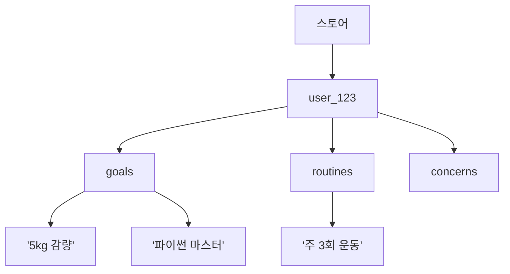
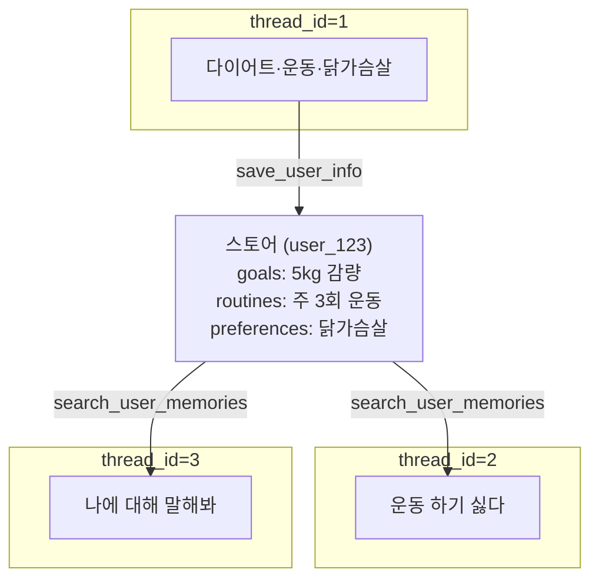

# 8.4 누적된 사용자 메모리를 기반으로 맞춤 조언을 제공하는 에이전트

> **저자 예제** — [`examples/long-term memory.ipynb`](examples/long-term%20memory.ipynb)
> **공식 문서** — [Stores](https://docs.langchain.com/oss/python/langgraph/stores) · [Long-term memory](https://docs.langchain.com/oss/python/langchain/long-term-memory)

[8.2절](08-02_%EB%8C%80%ED%99%94%20%EB%A7%A5%EB%9D%BD%EC%9D%84%20%EC%9D%B4%ED%95%B4%ED%95%98%EB%8A%94%20%EC%97%90%EC%9D%B4%EC%A0%84%ED%8A%B8.md)에서 `thread_id`를 바꾸면 새 대화라고 했습니다. 그러면 **어제 나눈 이야기는 오늘 못 씁니다.**

라이프 코치라면 곤란합니다. "다이어트 중이라고 하셨죠"를 매번 다시 물어볼 수는 없으니까요.

**대화를 넘어 남는 층**이 필요합니다. 스토어입니다.

## 8.4.1 [실습] 랭그래프에서 장기 메모리 사용하기

### 가장 단순한 형태

```python
from langgraph.store.memory import InMemoryStore

store = InMemoryStore()
```

**키-값 저장소**입니다. 다만 키가 두 겹입니다.

```python
store.put(
    ("users",),        # 네임스페이스 (튜플)
    "user_123",        # 키
    {                  # 값 (딕셔너리)
        "user_name": "mina",
        "user_age": 25,
    }
)

user_info = store.get(("users",), "user_123")
```

| 인자 | 역할 |
| :--- | :--- |
| **네임스페이스** | 튜플. 폴더 경로처럼 계층을 만듦 |
| **키** | 그 안에서의 식별자 |
| **값** | 딕셔너리 |

**네임스페이스가 튜플인 것**이 중요합니다. `("users",)` 처럼 한 겹일 수도, `(user_id, "goals")` 처럼 두 겹일 수도 있습니다. 8.4.3절에서 이 성질을 씁니다.

### 검색이 되게 만들기

여기가 스토어의 진짜 기능입니다.

```python
from langchain.embeddings import init_embeddings

embeddings = init_embeddings("openai:text-embedding-3-small")
store = InMemoryStore(
    index={
        "embed": embeddings,
        "dims": 1536,
    }
)
```

`index=`를 주면 **넣는 값이 자동으로 임베딩되어** 나중에 의미 기반으로 검색됩니다. [6.5절](../ch06_single-agent/06-05_RAG%EB%A5%BC%20%EC%9C%84%ED%95%9C%20%EC%97%90%EC%9D%B4%EC%A0%84%ED%8A%B8%20%EB%A7%8C%EB%93%A4%EA%B8%B0.md)에서 문서에 대해 한 일을 **사용자 기억에 대해** 하는 것입니다.

> **`dims=1536`은 임베딩 모델이 만드는 벡터 차원 수**입니다. 모델을 바꾸면 이 숫자도 바뀝니다. 안 맞으면 오류가 납니다.

[2.3절](../ch02_core-elements/02-03_%EC%97%90%EC%9D%B4%EC%A0%84%ED%8A%B8%EC%9D%98%20%EA%B8%B0%EC%96%B5%EB%A0%A5%20-%20%EB%A9%94%EB%AA%A8%EB%A6%AC.md)에서 예고한 **"필요할 때만 꺼내기"** 가 이것입니다. 기억이 수백 개 쌓여도 관련된 것만 프롬프트에 들어갑니다.

## 8.4.2 [실습] 사용자 정보를 조회하는 도구 생성하기

```python
from langgraph.config import get_store
from langchain.tools import tool

@tool
def get_user_info(config: RunnableConfig) -> str:
    """사용자의 기본 정보를 조회합니다."""
    store = get_store()
    user_id = config["configurable"].get("user_id")

    user_info = store.get(("users",), user_id)
    return str(user_info.value) if user_info else "알 수 없는 사용자"
```

두 가지가 새롭습니다.

### `get_store()` — 스토어를 인자로 안 받습니다

도구 함수는 **모델이 인자를 채웁니다**([2.2절](../ch02_core-elements/02-02_%EC%97%90%EC%9D%B4%EC%A0%84%ED%8A%B8%EC%9D%98%20%EC%99%B8%EB%B6%80%20%EC%A7%80%EC%8B%9D%20%ED%99%9C%EC%9A%A9%20-%20%EB%8F%84%EA%B5%AC%20%ED%98%B8%EC%B6%9C.md)). 그러니 스토어 객체를 인자로 둘 수 없습니다 — 모델이 채울 수 없는 값이니까요.

`get_store()`는 **지금 실행 중인 그래프에 붙은 스토어를 꺼내 옵니다.** 도구 명세에는 안 나타납니다.

### `config`도 마찬가지입니다

`user_id`는 **사용자가 말하는 게 아니라 시스템이 아는 값**입니다. 모델에게 물어볼 게 아닙니다.

```python
agent.invoke(
    {"messages": [...]},
    config={"configurable": {"user_id": "user_123", "thread_id": "1"}}
)
```

`config`로 넘긴 값을 도구가 꺼내 씁니다. **`thread_id`(단기)와 `user_id`(장기)가 나란히 있는 것**을 보세요. [8.1절](08-01_AI%20%EC%97%90%EC%9D%B4%EC%A0%84%ED%8A%B8%EC%97%90%EC%84%9C%20%EB%A9%94%EB%AA%A8%EB%A6%AC%EC%9D%98%20%EC%97%AD%ED%95%A0.md)의 두 층이 여기서 만납니다.

> **모델이 `user_id`를 지어내면 안 됩니다.** 다른 사람 정보를 읽게 되니까요. **인증 관련 값은 절대 도구 인자로 두지 말고 `config`로 넘기세요.** 보안 문제입니다.

## 8.4.3 [실습] 사용자 정보를 저장하는 도구 생성하기

### 카테고리를 미리 정해 둡니다

```python
@tool
def save_user_info(
    preferences: list[str] = None,      # 선호
    interests: list[str] = None,        # 관심사
    experiences: list[str] = None,      # 과거 경험
    current_activities: list[str] = None,  # 진행 중인 활동
    goals: list[str] = None,            # 목표
    routines: list[str] = None,         # 루틴
    concerns: list[str] = None,         # 고민
    achievements: list[str] = None,     # 성취
    config: RunnableConfig = None
) -> str:
```

**여덟 칸을 못 박아 둔 것**이 설계입니다. "아무거나 저장해"라고 하면 모델이 제멋대로 분류합니다. [1.2절](../ch01_llm-decision/01-02_LLM%EC%9D%84%20%EA%B8%B0%EB%B0%98%EC%9C%BC%EB%A1%9C%20%EC%9D%98%EC%82%AC%EA%B2%B0%EC%A0%95%ED%95%98%EB%8B%A4.md)의 **"선택지를 좁혀 흔들림을 막는다"** 가 여기서도 적용됩니다.

시스템 프롬프트에 **각 카테고리의 예시**까지 적어 둡니다.

```
- goals: "다음 달까지 5kg 감량이 목표야"
- routines: "주 3회 운동하고 있어", "매일 명상 10분씩 해"
- concerns: "요즘 집중력이 떨어져"
```

### 항목마다 개별 저장합니다

```python
for category, values in categories.items():
    if values:
        for value in values:
            item_id = str(uuid.uuid4())
            store.put(
                (user_id, category),      # ← 네임스페이스 두 겹
                item_id,
                {
                    "text": value,
                    "created_at": current_time,
                    "category": category
                }
            )
```

**목록을 통째로 넣지 않고 하나씩 넣습니다.** 이유는 검색입니다.

| 저장 방식 | 검색하면 |
| :--- | :--- |
| `["운동", "독서", "요리"]` 한 덩어리 | 셋이 함께 딸려 옴 |
| **각각 따로** | **관련된 것만** |

**네임스페이스가 `(user_id, category)` 두 겹**인 것도 여기서 쓰입니다. 사용자별로 나뉘고 그 안에서 카테고리로 또 나뉩니다.



**`created_at`을 함께 저장하는 것**도 중요합니다. "작년에 등산 동아리 했었어"와 "요즘 다이어트 중이야"는 시점이 다르고, 오래된 정보는 지금 안 맞을 수 있습니다.

## 8.4.4 [실습] 사용자의 카테고리별 정보를 검색하는 도구 생성하기

```python
@tool
def search_user_memories(
    query: str,
    category: str = None,
    limit: int = 5,
    config: RunnableConfig = None
) -> str:
```

두 갈래로 동작합니다.

```python
if category:
    namespace = (user_id, category)
    results = store.search(namespace, query=query, limit=limit)
else:
    # 모든 카테고리를 각각 검색해서 합침
    for cat in categories:
        results = store.search((user_id, cat), query=query, limit=limit)
        all_results.extend([(r, cat) for r in results])

    all_results.sort(key=lambda x: x[0].score if hasattr(x[0], 'score') else 0, reverse=True)
    all_results = all_results[:limit]
```

| 상황 | 동작 |
| :--- | :--- |
| 카테고리 지정 | 그 네임스페이스만 검색 |
| 미지정 | **여덟 개를 각각 검색해 점수순으로 상위 N개** |

**점수(`score`)로 정렬**하는 부분을 보세요. 벡터 검색은 "얼마나 가까운지"를 점수로 주므로, 카테고리를 넘나들며 비교할 수 있습니다.

> **`limit`은 여기서도 컨텍스트 예산입니다.** [6.2절](../ch06_single-agent/06-02_%EC%9B%B9%20%EA%B2%80%EC%83%89%20%EC%97%90%EC%9D%B4%EC%A0%84%ED%8A%B8%20%EB%A7%8C%EB%93%A4%EA%B8%B0.md)의 `max_results`, [6.5절](../ch06_single-agent/06-05_RAG%EB%A5%BC%20%EC%9C%84%ED%95%9C%20%EC%97%90%EC%9D%B4%EC%A0%84%ED%8A%B8%20%EB%A7%8C%EB%93%A4%EA%B8%B0.md)의 `k=3`과 같은 판단입니다. 기억을 많이 꺼낸다고 조언이 좋아지지 않습니다.

## 8.4.5 [실습] 맞춤형 조언 에이전트 만들기

### 두 메모리를 함께 붙입니다

```python
agent = create_agent(
    model=model,
    tools=[get_user_info, save_user_info, search_user_memories],
    store=store,                 # 장기
    system_prompt="...",
    checkpointer=checkpointer,   # 단기
)
```

**`store=`와 `checkpointer=`가 나란히** 들어갑니다. [8.1절](08-01_AI%20%EC%97%90%EC%9D%B4%EC%A0%84%ED%8A%B8%EC%97%90%EC%84%9C%20%EB%A9%94%EB%AA%A8%EB%A6%AC%EC%9D%98%20%EC%97%AD%ED%95%A0.md)의 두 층이 코드 두 줄로 나타납니다.

### 언제 저장할지를 프롬프트가 정합니다

**여기가 이 절에서 가장 중요합니다.** 장기 메모리는 [8.1절](08-01_AI%20%EC%97%90%EC%9D%B4%EC%A0%84%ED%8A%B8%EC%97%90%EC%84%9C%20%EB%A9%94%EB%AA%A8%EB%A6%AC%EC%9D%98%20%EC%97%AD%ED%95%A0.md)에서 말한 대로 **자동으로 안 쌓입니다.** 모델이 "이건 기억할 만하다"고 판단해서 도구를 불러야 합니다.

시스템 프롬프트가 그 판단 기준을 줍니다.

```
1. **인사/대화 시작 시:**
   - get_user_info로 기본 정보 확인
   - search_user_memories로 current_activities 검색하여 "~는 잘 되고 있나요?" 안부 묻기

3. **정보 저장 시 (save_user_info):**
   사용자가 취향이나 근황, 목표 등 아래 카테고리에 포함되는 자신의 정보를 밝히면 저장하세요.
```

**"언제 어느 도구를"** 이 구체적으로 적혀 있습니다. [2.2절](../ch02_core-elements/02-02_%EC%97%90%EC%9D%B4%EC%A0%84%ED%8A%B8%EC%9D%98%20%EC%99%B8%EB%B6%80%20%EC%A7%80%EC%8B%9D%20%ED%99%9C%EC%9A%A9%20-%20%EB%8F%84%EA%B5%AC%20%ED%98%B8%EC%B6%9C.md)에서 도구 설명이 프롬프트라고 했는데, 도구가 여러 개 얽히면 **시스템 프롬프트에서 전체 사용 시나리오를 잡아 줘야** 합니다.

### 개인정보 취급 지침도 있습니다

```
- 개인 정보(나이, 사용자 ID) 직접 언급 금지
```

**저장은 하되 입 밖에 내지 말라**는 지시입니다. 나이를 알고 조언에 반영하는 것과, "25세이시니까"라고 말하는 것은 다릅니다.

> **다만 프롬프트로 막는 것은 완전하지 않습니다.** 정말 민감한 정보라면 애초에 저장하지 않거나, 저장하더라도 모델에게 주지 않는 편이 안전합니다.

## 8.4.6 [실습] 사용자의 현재 상황을 바탕으로 조언받기

**이 절의 실습 구성이 훌륭합니다.** 같은 코드를 `thread_id`만 바꿔 세 번 돌립니다.

```python
config={"configurable": {"user_id": "user_123", "thread_id": "1"}}
config={"configurable": {"user_id": "user_123", "thread_id": "2"}}
config={"configurable": {"user_id": "user_123", "thread_id": "3"}}
```

**`user_id`는 그대로, `thread_id`만 바뀝니다.**

노트북 마지막 셀에 시나리오가 주석으로 적혀 있습니다.

| 대화 | 입력 | 확인하는 것 |
| :--- | :--- | :--- |
| **1** | "다이어트 중이라 주 3회 운동… 5kg 감량하고 싶어" / "닭가슴살 좋아하는데 식단 추천해줘" | 저장이 되는가 |
| **2** | "운동 하기 싫다" / "회사일 스트레스로 아무것도 하기 싫네" | **새 대화인데 앞 내용을 아는가** |
| **3** | "나에 대해 아는 것 다 말해봐" | 누적된 것이 다 나오는가 |



**2번 대화가 핵심입니다.** 체크포인터로는 1번 대화 내용을 볼 수 없습니다. 그런데도 "운동 하기 싫다"에 맞춤 답이 나온다면, **스토어에서 꺼내 온 것**입니다.

> 실행 결과는 매번 달라지므로 이 노트에는 싣지 않았습니다. **직접 돌려 보고 `thread_id=2`에서 무엇을 아는지 확인하는 것**이 이 절의 핵심 실습입니다.

## 요약 및 비유

**단골 가게**입니다. 오늘 주문은 오늘 영수증에 남고(단기), **"이분은 고수를 못 드신다"** 는 사장님 수첩에 남습니다(장기). 다음에 와도 수첩은 그대로입니다. 다만 **사장님이 판단해서 적어야** 하고, 손님이 많아지면 **찾아봐야** 합니다.

| 개념 | 단골 가게 비유 | 기술적 의미 |
| :--- | :--- | :--- |
| **스토어** | 사장님 수첩 | 대화를 넘어 남는 저장소 |
| **네임스페이스** | 손님별 · 항목별 칸 | `(user_id, category)` 튜플 |
| **`index=` 임베딩** | 비슷한 내용끼리 찾아지게 | 벡터 검색 활성화 |
| **`get_store()`** | 수첩은 늘 카운터에 있음 | 인자가 아니라 런타임에서 |
| **`config`의 `user_id`** | 회원번호는 손님이 안 정함 | 시스템이 주입, 모델이 못 지어냄 |
| **여덟 카테고리** | 수첩의 정해진 항목 | 선택지를 좁혀 분류 흔들림 방지 |
| **항목별 개별 저장** | 한 줄씩 따로 적기 | 검색 정확도 |
| **`created_at`** | 언제 적은 메모인지 | 시점 정보 |
| **`limit`** | 몇 줄만 훑어보기 | 컨텍스트 예산 |
| **`thread_id` 2번 대화** | 다음 방문 | 장기 메모리 검증 지점 |

## 결론

* 스토어는 **네임스페이스(튜플) + 키 + 값** 구조입니다. 네임스페이스를 `(user_id, category)`로 두 겹 쓰면 계층이 생깁니다.
* **`index=`에 임베딩을 주면 의미 기반 검색**이 됩니다. 6.5절 RAG를 사용자 기억에 적용한 것입니다.
* 도구 안에서 스토어는 **`get_store()`** 로 꺼냅니다. 인자로 두면 모델이 채우려 합니다.
* **`user_id` 같은 인증 값은 반드시 `config`로** 넘기세요. 도구 인자로 두면 모델이 지어내 다른 사람 정보를 읽을 수 있습니다.
* 저장 카테고리를 **여덟 개로 못 박은 것**이 설계입니다. 자유 분류는 흔들립니다.
* 목록을 통째로 넣지 않고 **항목마다 개별 저장**합니다. 그래야 관련된 것만 검색됩니다.
* 장기 메모리는 **자동으로 안 쌓입니다.** 모델이 판단해 저장 도구를 불러야 하고, **그 판단 기준을 시스템 프롬프트가** 줍니다.
* **`store=`와 `checkpointer=`를 함께** 넘기면 두 층이 동시에 동작합니다.
* 검증은 **`user_id`는 그대로 두고 `thread_id`만 바꿔** 보는 것입니다. 새 대화에서 앞 내용을 알면 장기 메모리가 동작한 것입니다.

---

[⬅ 8.3](08-03_%EB%8B%A8%EA%B8%B0%20%EB%A9%94%EB%AA%A8%EB%A6%AC%EB%A5%BC%20%EA%B4%80%EB%A6%AC%ED%95%98%EB%8A%94%20%EB%B0%A9%EB%B2%95.md) · [Chapter 08](README.md) · [전체 목차](../STUDY.md)
