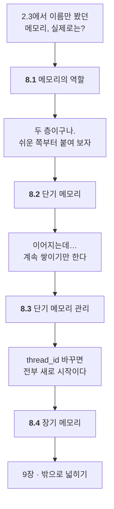

# Chapter 08 · 에이전트 메모리 설계와 개인화 구현

> Part 03 | 멀티 에이전트 설계와 메모리 시스템 구현

## 학습 목표

- 단기 메모리와 장기 메모리의 역할 차이를 설명할 수 있다
- 체크포인터로 대화 맥락을 유지하는 챗봇을 만들 수 있다
- 메시지 트리밍·요약으로 컨텍스트 길이를 관리할 수 있다
- Store 기반 장기 메모리로 사용자 정보를 저장·조회·검색하는 개인화 에이전트를 만들 수 있다

> **올라마로 어디까지 되나** — **이 장은 올라마만으로 전부 됩니다.** 메모리는 모델이 아니라 랭그래프가 하는 일이라서입니다. 8.4절만 임베딩 모델이 필요합니다.
>
> 전체 지도는 [STUDY.md](../STUDY.md#올라마로-어디까지-되나)에 있습니다.

## 이 장의 이해 흐름

[2.3절](../ch02_core-elements/02-03_%EC%97%90%EC%9D%B4%EC%A0%84%ED%8A%B8%EC%9D%98%20%EA%B8%B0%EC%96%B5%EB%A0%A5%20-%20%EB%A9%94%EB%AA%A8%EB%A6%AC.md)에서 **이름만 잡아 둔 두 단어**를 코드로 만드는 장입니다.



| 절 | 이 절의 질문 | 얻는 것 |
| :--- | :--- | :--- |
| **8.1** | 메모리가 실제로 어떻게 생겼지? | **체크포인터 / 스토어** 두 층 |
| **8.2** | 단기 메모리를 어떻게 붙이지? | **리듀서 + 체크포인터 + `thread_id`** |
| **8.3** | 계속 쌓이면? | **트리밍**과 **요약** |
| **8.4** | 대화를 넘어 기억하려면? | **스토어**와 검색 |

> **용어가 헷갈리면 이것만** — 체크포인터는 **하나의 대화**를 잇고, 스토어는 **여러 대화**에 걸쳐 남깁니다.

### 8장 전체를 한 줄로

> **메모리가 두 층이라는 걸 알았고(8.1) → 체크포인터로 대화를 이었고(8.2) → 자르기·요약으로 관리했고(8.3) → 스토어로 대화를 넘어 기억하게 했다(8.4).**

## 절별 노트

| 절 | 노트 파일 | 진도 |
| --- | --- | --- |
| 8.1 | [`08-01_AI 에이전트에서 메모리의 역할.md`](08-01_AI%20%EC%97%90%EC%9D%B4%EC%A0%84%ED%8A%B8%EC%97%90%EC%84%9C%20%EB%A9%94%EB%AA%A8%EB%A6%AC%EC%9D%98%20%EC%97%AD%ED%95%A0.md) | ☐ |
| 8.2 | [`08-02_대화 맥락을 이해하는 에이전트.md`](08-02_%EB%8C%80%ED%99%94%20%EB%A7%A5%EB%9D%BD%EC%9D%84%20%EC%9D%B4%ED%95%B4%ED%95%98%EB%8A%94%20%EC%97%90%EC%9D%B4%EC%A0%84%ED%8A%B8.md) | ☐ |
| 8.3 | [`08-03_단기 메모리를 관리하는 방법.md`](08-03_%EB%8B%A8%EA%B8%B0%20%EB%A9%94%EB%AA%A8%EB%A6%AC%EB%A5%BC%20%EA%B4%80%EB%A6%AC%ED%95%98%EB%8A%94%20%EB%B0%A9%EB%B2%95.md) | ☐ |
| 8.4 | [`08-04_누적된 사용자 메모리를 기반으로 맞춤 조언을 제공하는 에이전트.md`](08-04_%EB%88%84%EC%A0%81%EB%90%9C%20%EC%82%AC%EC%9A%A9%EC%9E%90%20%EB%A9%94%EB%AA%A8%EB%A6%AC%EB%A5%BC%20%EA%B8%B0%EB%B0%98%EC%9C%BC%EB%A1%9C%20%EB%A7%9E%EC%B6%A4%20%EC%A1%B0%EC%96%B8%EC%9D%84%20%EC%A0%9C%EA%B3%B5%ED%95%98%EB%8A%94%20%EC%97%90%EC%9D%B4%EC%A0%84%ED%8A%B8.md) | ☐ |

<details><summary>소절까지 펼쳐보기</summary>

- [ ] **[8.1 AI 에이전트에서 메모리의 역할](08-01_AI%20%EC%97%90%EC%9D%B4%EC%A0%84%ED%8A%B8%EC%97%90%EC%84%9C%20%EB%A9%94%EB%AA%A8%EB%A6%AC%EC%9D%98%20%EC%97%AD%ED%95%A0.md)**
  - [ ] 8.1.1 단기 메모리와 장기 메모리
- [ ] **[8.2 대화 맥락을 이해하는 에이전트](08-02_%EB%8C%80%ED%99%94%20%EB%A7%A5%EB%9D%BD%EC%9D%84%20%EC%9D%B4%ED%95%B4%ED%95%98%EB%8A%94%20%EC%97%90%EC%9D%B4%EC%A0%84%ED%8A%B8.md)**
  - [ ] 8.2.1 [실습] 랭그래프에서 단기 메모리 사용하기
  - [ ] 8.2.2 [실습] 챗봇에 단기 메모리 적용하기
- [ ] **[8.3 단기 메모리를 관리하는 방법](08-03_%EB%8B%A8%EA%B8%B0%20%EB%A9%94%EB%AA%A8%EB%A6%AC%EB%A5%BC%20%EA%B4%80%EB%A6%AC%ED%95%98%EB%8A%94%20%EB%B0%A9%EB%B2%95.md)**
  - [ ] 8.3.1 [실습] 메시지 트리밍 활용하기
  - [ ] 8.3.2 [실습] 메시지 요약 활용하기
- [ ] **[8.4 누적된 사용자 메모리를 기반으로 맞춤 조언을 제공하는 에이전트](08-04_%EB%88%84%EC%A0%81%EB%90%9C%20%EC%82%AC%EC%9A%A9%EC%9E%90%20%EB%A9%94%EB%AA%A8%EB%A6%AC%EB%A5%BC%20%EA%B8%B0%EB%B0%98%EC%9C%BC%EB%A1%9C%20%EB%A7%9E%EC%B6%A4%20%EC%A1%B0%EC%96%B8%EC%9D%84%20%EC%A0%9C%EA%B3%B5%ED%95%98%EB%8A%94%20%EC%97%90%EC%9D%B4%EC%A0%84%ED%8A%B8.md)**
  - [ ] 8.4.1 [실습] 랭그래프에서 장기 메모리 사용하기
  - [ ] 8.4.2 [실습] 사용자 정보를 조회하는 도구 생성하기
  - [ ] 8.4.3 [실습] 사용자 정보를 저장하는 도구 생성하기
  - [ ] 8.4.4 [실습] 사용자의 카테고리별 정보를 검색하는 도구 생성하기
  - [ ] 8.4.5 [실습] 맞춤형 조언 에이전트 만들기
  - [ ] 8.4.6 [실습] 사용자의 현재 상황을 바탕으로 조언받기

</details>

## 관련 예제 코드

| 내용 | 경로 |
| --- | --- |
| 8.2~8.3 단기 메모리 | [`examples/short-term memory.ipynb`](examples/short-term%20memory.ipynb) |
| 8.4 장기 메모리 | [`examples/long-term memory.ipynb`](examples/long-term%20memory.ipynb) |

## `.env` 두는 위치

장 폴더(`ch08_memory/`)에 `.env`를 두면 됩니다.

```powershell
copy .env.example .env
```

## 참고 문서

| 무엇을 볼 때 | 문서 |
| --- | --- |
| 8.1 메모리 전체 그림 | [LangGraph · Memory](https://docs.langchain.com/oss/python/langgraph/add-memory) |
| 8.2~8.3 단기 메모리 (`InMemorySaver`) | [Persistence](https://docs.langchain.com/oss/python/langgraph/persistence) · [Checkpointers](https://docs.langchain.com/oss/python/langgraph/checkpointers) |
| 8.4 장기 메모리 (`InMemoryStore`) | [Stores](https://docs.langchain.com/oss/python/langgraph/stores) |
| 에이전트 관점에서의 메모리 | [Short-term](https://docs.langchain.com/oss/python/langchain/short-term-memory) · [Long-term](https://docs.langchain.com/oss/python/langchain/long-term-memory) |
| 과거 상태로 되감기 | [Use time-travel](https://docs.langchain.com/oss/python/langgraph/use-time-travel) |

> 용어가 헷갈리면 이 대응만 기억하세요 — **체크포인터 = 대화 하나 안의 단기 기억**, **스토어 = 대화를 넘어 남는 장기 기억**.

## 이 폴더 구성

- `08-01_…md` ~ `08-04_…md` — 절별 학습 노트
- `notes.md` — 장 전체 요약 (절 노트를 다 쓴 뒤 마지막에 정리)
- `practice/` — 예제를 보지 않고 직접 쳐보는 공간
- `.env.example` — 이 장에 필요한 API 키. `copy .env.example .env` 후 값을 채우세요

---

[⬅ 전체 목차로](../STUDY.md)
