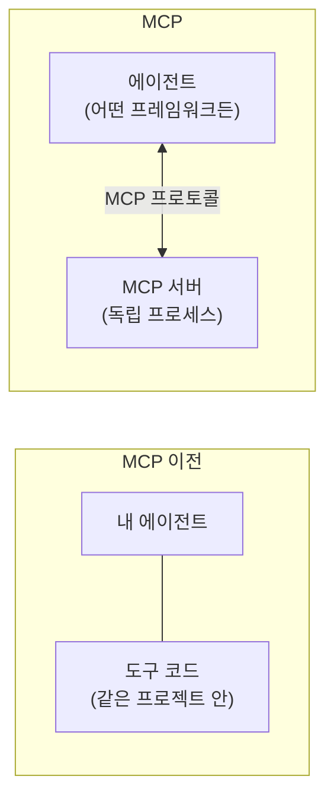
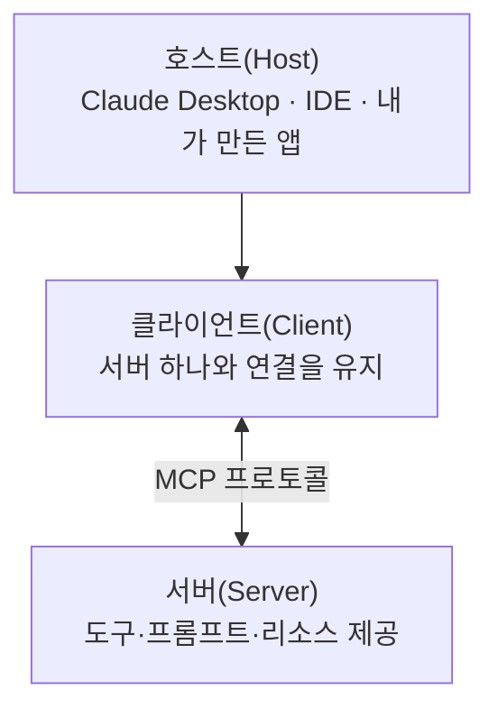

# 9.1 MCP란

> **공식 문서** — [Model Context Protocol](https://modelcontextprotocol.io/) · [MCP Python SDK](https://py.sdk.modelcontextprotocol.io/)

> **여기까지** — 8장까지로 **에이전트를 만드는 데 필요한 건 다 배웠습니다.**
> **이 절의 질문** — 도구를 **매번 직접 만들어야** 하나? 남이 만든 걸 가져다 쓸 순 없나?
> **다 읽으면** — MCP가 **새로운 개념이 아니라 도구를 밖으로 뺀 것**임을 알게 됩니다. [2.2절](../ch02_core-elements/02-02_%EC%97%90%EC%9D%B4%EC%A0%84%ED%8A%B8%EC%9D%98%20%EC%99%B8%EB%B6%80%20%EC%A7%80%EC%8B%9D%20%ED%99%9C%EC%9A%A9%20-%20%EB%8F%84%EA%B5%AC%20%ED%98%B8%EC%B6%9C.md)의 지식이 그대로 쓰입니다.

## 9.1.1 MCP 개념

### 도구를 만들 때마다 반복되던 일

[6.3절](../ch06_single-agent/06-03_%EC%BD%94%EB%94%A9%20%EC%97%90%EC%9D%B4%EC%A0%84%ED%8A%B8%20%EB%A7%8C%EB%93%A4%EA%B8%B0.md)에서 도구를 직접 만들었고, [7장](../ch07_multi-agent/07-01_%EB%A9%80%ED%8B%B0%20%EC%97%90%EC%9D%B4%EC%A0%84%ED%8A%B8%20%EC%9C%A0%ED%98%95%20%EC%86%8C%EA%B0%9C.md)에서도 계속 만들었습니다. 파일 쓰기, 웹 크롤링, DB 조회…

그런데 이 도구들에는 문제가 하나 있습니다. **내 프로젝트 안에서만 씁니다.**

- 다른 프로젝트에서 쓰려면 코드를 복사해야 합니다
- 랭체인으로 짠 도구는 **랭체인에서만** 동작합니다
- 남이 만든 좋은 도구를 가져다 쓸 방법이 없습니다

**MCP(Model Context Protocol)** 는 이 문제를 **프로토콜로** 풉니다. 도구를 **별도 서버로 분리**하고, 그 서버와 대화하는 방식을 표준으로 정한 것입니다.



### 핵심은 "모델 입장에서는 똑같다"입니다

[2.2절](../ch02_core-elements/02-02_%EC%97%90%EC%9D%B4%EC%A0%84%ED%8A%B8%EC%9D%98%20%EC%99%B8%EB%B6%80%20%EC%A7%80%EC%8B%9D%20%ED%99%9C%EC%9A%A9%20-%20%EB%8F%84%EA%B5%AC%20%ED%98%B8%EC%B6%9C.md) 마지막에서 이렇게 말했습니다.

> **모델 입장에서는 구분이 없습니다.** 어디서 왔든 이름·설명·인자 스키마를 받아서 고를 뿐입니다.

MCP 도구도 결국 **이름 · 설명 · 인자 스키마**로 모델에게 전달됩니다. 달라지는 건 **그것을 어디서 가져오는가**뿐입니다.

| | 직접 만든 도구 | MCP 도구 |
| :--- | :--- | :--- |
| 어디 있나 | 내 코드 | **별도 프로세스/서버** |
| 누가 실행 | 내 애플리케이션 | **MCP 서버** |
| 모델에게 가는 것 | 이름·설명·스키마 | **똑같음** |

**"똑같다"를 실제로 확인했습니다.** 작은 MCP 서버를 띄우고 도구 목록을 받아 봤습니다.

```python
@mcp.tool()
def add(a: int, b: int) -> int:
    """두 정수를 더합니다."""
    return a + b
```

> **실측 (2026-08-31 · mcp 1.29.1 · stdio 전송)** — 서버를 별도 프로세스로 띄우고 클라이언트로 붙은 결과입니다.

```
- add: 두 정수를 더합니다.
    inputSchema: {"properties": {"a": {"title": "A", "type": "integer"},
                                 "b": {"title": "B", "type": "integer"}},
                  "required": ["a", "b"], "type": "object"}
```

[6.3절](../ch06_single-agent/06-03_%EC%BD%94%EB%94%A9%20%EC%97%90%EC%9D%B4%EC%A0%84%ED%8A%B8%20%EB%A7%8C%EB%93%A4%EA%B8%B0.md)에서 `@tool`로 뽑아낸 스키마와 **모양이 같습니다.** 이름·설명·`properties`·`required`. 다른 프로세스에서 왔다는 흔적이 스키마에는 없습니다.

실제로 불러 보면:

```
add(6, 7)      -> 13
save_note(...) -> {"status": "saved", "title": "회의록", "chars": 4}
```

**딕셔너리를 반환해도 JSON 문자열로 돌아옵니다.** 프로세스 경계를 넘으므로 파이썬 객체가 그대로 올 수는 없습니다.

없는 도구를 부르면 예외가 아니라 **오류 표시가 붙은 결과**가 옵니다.

```
isError : True
내용    : Unknown tool: nope
```

> **이 점이 중요합니다.** 도구 실패가 클라이언트를 죽이지 않습니다. [6.3절](../ch06_single-agent/06-03_%EC%BD%94%EB%94%A9%20%EC%97%90%EC%9D%B4%EC%A0%84%ED%8A%B8%20%EB%A7%8C%EB%93%A4%EA%B8%B0.md)에서 `try/except`로 직접 해 주던 일을 **프로토콜이 대신** 합니다.
| 다른 프로젝트에서 | 복사 | **주소만 알려 주면 됨** |

**이 점을 잡고 있으면 9장이 쉽습니다.** 새 개념이 아니라 **도구를 밖으로 뺀 것**입니다.

## 9.1.2 MCP의 3계층 아키텍처

MCP는 세 역할로 나뉩니다.



| 계층 | 역할 | 이 장에서 |
| :--- | :--- | :--- |
| **호스트** | 사용자와 마주하는 프로그램. LLM을 부름 | 우리가 만드는 에이전트 |
| **클라이언트** | 서버 **하나**와의 연결을 담당 | `ClientSession` |
| **서버** | 도구를 실제로 갖고 실행 | [9.3절](09-03_MCP%20%EC%84%9C%EB%B2%84%20%EA%B5%AC%EC%B6%95%ED%95%98%EA%B8%B0.md)에서 만듦 |

**클라이언트가 서버 하나당 하나**라는 점이 중요합니다. 서버를 두 개 쓰려면 클라이언트도 둘입니다. [9.5절](09-05_%EB%9E%AD%EA%B7%B8%EB%9E%98%ED%94%84%EC%97%90%EC%84%9C%20MCP%20%EA%B8%B0%EB%B0%98%20%EB%A9%80%ED%8B%B0%20%EC%97%90%EC%9D%B4%EC%A0%84%ED%8A%B8%20%EA%B5%AC%ED%98%84%ED%95%98%EA%B8%B0.md)에서 `MultiServerMCPClient`가 이걸 대신 관리해 줍니다.

### 서버가 제공하는 것은 도구만이 아닙니다

| 종류 | 무엇인가 | 이 장 예제 |
| :--- | :--- | :--- |
| **도구(Tool)** | 모델이 부를 수 있는 함수 | `read_user_info` · `save_diary` |
| **프롬프트(Prompt)** | 미리 정의된 대화 시작 틀 | `default_prompt` ([9.3.4절](09-03_MCP%20%EC%84%9C%EB%B2%84%20%EA%B5%AC%EC%B6%95%ED%95%98%EA%B8%B0.md)) |
| **리소스(Resource)** | 읽을 수 있는 데이터 | 이 책 예제에는 없음 |

**프롬프트까지 서버가 제공한다**는 게 흥미롭습니다. 도구를 만든 사람이 **"이 도구는 이런 프롬프트와 함께 써야 잘 동작한다"** 는 것을 같이 배포할 수 있습니다.

### 전송 방식(Transport)

서버와 어떻게 통신할지도 정해져 있습니다.

| 방식 | 어떻게 | 언제 |
| :--- | :--- | :--- |
| **stdio** | 서버를 **자식 프로세스로 띄우고** 표준입출력으로 대화 | 내 PC에서 도는 서버 |
| **streamable_http** | HTTP로 원격 서버와 | 남이 운영하는 서버 |

이 장 예제는 두 가지를 다 씁니다 — 직접 만든 서버는 `stdio`, Tavily가 제공하는 서버는 `streamable_http`([9.5절](09-05_%EB%9E%AD%EA%B7%B8%EB%9E%98%ED%94%84%EC%97%90%EC%84%9C%20MCP%20%EA%B8%B0%EB%B0%98%20%EB%A9%80%ED%8B%B0%20%EC%97%90%EC%9D%B4%EC%A0%84%ED%8A%B8%20%EA%B5%AC%ED%98%84%ED%95%98%EA%B8%B0.md)).

> **`stdio`는 서버를 따로 실행해 둘 필요가 없습니다.** 클라이언트가 `python ./server.py`를 알아서 띄웁니다. 처음엔 헷갈리는 부분입니다.

## 9.1.3 MCP 파이썬 SDK

공식 SDK가 있고, 서버는 **`FastMCP`** 로 만듭니다.

```python
from mcp.server.fastmcp import FastMCP

mcp = FastMCP("MCPServer")

@mcp.tool()
def my_tool(x: str) -> str:
    """도구 설명"""
    ...

if __name__ == "__main__":
    mcp.run(transport="stdio")
```

**[6.3절](../ch06_single-agent/06-03_%EC%BD%94%EB%94%A9%20%EC%97%90%EC%9D%B4%EC%A0%84%ED%8A%B8%20%EB%A7%8C%EB%93%A4%EA%B8%B0.md)의 `@tool`과 거의 같습니다.** 함수 위에 데코레이터를 붙이고, 독스트링이 설명이 되고, 타입 힌트가 스키마가 됩니다. 배운 것이 그대로 옮겨 갑니다.

### 버전 주의 — 이 저장소는 v1입니다

> **이 저장소는 `mcp` 1.x를 씁니다.** 예제 import가 **`from mcp.server.fastmcp import FastMCP`** 입니다.
>
> **공식 SDK 문서 사이트는 현재 v2 기준**이고, v2에서는 `from mcp.server import MCPServer`로 바뀌었습니다. 문서를 열면 **v1 섹션을 고르세요.** v2 화면을 보고 따라 치면 첫 줄부터 어긋납니다.
>
> [`pyproject.toml`](../pyproject.toml)에 `mcp>=1.26.0,<2` 상한이 걸려 있습니다. **풀지 마세요.** 9장 예제 파일들이 전부 깨집니다. 자세한 내용은 [CLAUDE.md](../CLAUDE.md) §6에 있습니다.

### 랭그래프와 잇는 것은 별도 패키지입니다

```python
from langchain_mcp_adapters.tools import load_mcp_tools
```

**`langchain-mcp-adapters`** 가 MCP 도구를 랭체인 도구 형태로 바꿔 줍니다. 이게 있어서 [6.4절](../ch06_single-agent/06-04_create_agent%20%EC%83%81%EC%84%B8%20%EA%B5%AC%EC%A1%B0%20%EC%9D%B4%ED%95%B4%ED%95%98%EA%B8%B0.md)의 `create_agent`에 그대로 넣을 수 있습니다.


## 요약 및 비유

**전기 콘센트 규격**입니다. 예전에는 기기마다 전용 어댑터를 만들어야 했지만, 규격이 정해지고 나서는 **어느 기기든 어느 콘센트에나** 꽂힙니다. 도구를 만든 사람과 쓰는 사람이 서로를 몰라도 됩니다.

| 개념 | 콘센트 비유 | 기술적 의미 |
| :--- | :--- | :--- |
| **MCP** | 표준 규격 | 도구 연동 프로토콜 |
| **MCP 서버** | 콘센트에 꽂는 기기 | 도구를 갖고 실행하는 쪽 |
| **클라이언트** | 플러그 하나 | 서버 하나와의 연결 |
| **호스트** | 기기를 쓰는 사람 | LLM을 부르는 애플리케이션 |
| **stdio** | 옆방에 직접 배선 | 자식 프로세스로 실행 |
| **streamable_http** | 전력망으로 원격 공급 | HTTP 원격 서버 |
| **도구/프롬프트/리소스** | 기기가 제공하는 기능들 | 서버가 노출하는 것 |
| **`FastMCP`** | 규격 맞춰 만드는 틀 | 서버 작성 도구 |
| **adapters** | 국가별 변환 플러그 | MCP → 랭체인 도구 |

## 결론

* MCP는 **도구를 별도 서버로 분리하고 대화 방식을 표준화한 것**입니다. 도구가 프로젝트·프레임워크에 갇히지 않게 됩니다.
* **모델 입장에서는 직접 만든 도구와 똑같습니다** — 이름·설명·인자 스키마를 받아 고를 뿐입니다.
* 3계층은 **호스트 · 클라이언트 · 서버**이고, **클라이언트는 서버 하나당 하나**입니다.
* 서버는 도구만이 아니라 **프롬프트와 리소스**도 제공합니다. 도구와 함께 쓸 프롬프트를 배포할 수 있습니다.
* 전송 방식은 **`stdio`**(자식 프로세스)와 **`streamable_http`**(원격)입니다. `stdio`는 서버를 미리 띄울 필요가 없습니다.
* `FastMCP`의 `@mcp.tool()`은 **[6.3절](../ch06_single-agent/06-03_%EC%BD%94%EB%94%A9%20%EC%97%90%EC%9D%B4%EC%A0%84%ED%8A%B8%20%EB%A7%8C%EB%93%A4%EA%B8%B0.md)의 `@tool`과 거의 같습니다.** 독스트링이 설명, 타입 힌트가 스키마입니다.
* **이 저장소는 `mcp` 1.x**입니다. 문서 사이트 기본은 v2이므로 **v1 섹션을 골라야** 합니다.

---

## 다음 절로

MCP가 무엇인지는 알았습니다. **그런데 왜 굳이 표준까지 만들었을까요?**

그리고 남이 만든 서버를 가져다 쓴다는 건 **내 PC나 내 데이터를 남에게 여는 것**이기도 합니다. 안전할까요? → **[9.2절](09-02_MCP%20%EA%B8%B0%EB%8A%A5%EC%9D%B4%20%EB%93%A4%EC%96%B4%EA%B0%84%20%EC%97%90%EC%9D%B4%EC%A0%84%ED%8A%B8%20%EC%84%9C%EB%B9%84%EC%8A%A4.md)**

---

[Chapter 09](README.md) · [9.2 ➡](09-02_MCP%20%EA%B8%B0%EB%8A%A5%EC%9D%B4%20%EB%93%A4%EC%96%B4%EA%B0%84%20%EC%97%90%EC%9D%B4%EC%A0%84%ED%8A%B8%20%EC%84%9C%EB%B9%84%EC%8A%A4.md)
